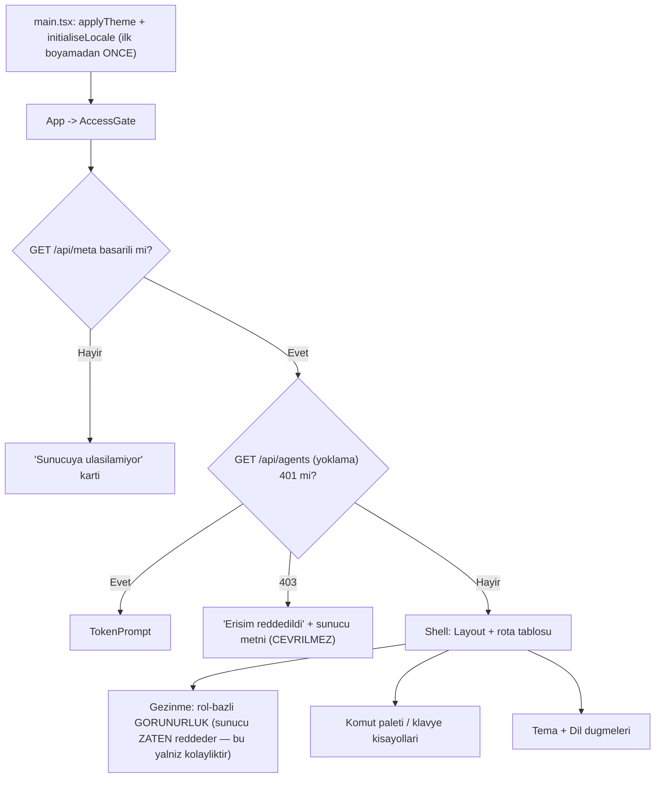

# 09 — Arayüz Genel (`UI`)

> **Alan kodu:** `UI` · **Faz:** 5, 30
> **Kaynak:** `src/AgentPrism.UI/frontend/src/app.tsx` (kabuk, rota tablosu) ·
> `components/access-gate.tsx` (kimlik doğrulama akışı) · `components/layout.tsx`
> (gezinme, tema/dil düğmeleri, klavye bağlamaları) · `components/command-palette.tsx`
> (⌘K paleti, kısayol yardımı) · `lib/router.tsx` (elle yazılmış yönlendirici) ·
> `lib/i18n.tsx` + `locales/en.ts` + `locales/tr.ts` (yerelleştirme) · `lib/theme.ts`
> (tema) · `lib/auth.ts` (bearer token deposu) · `lib/shortcuts.ts` (klavye eşleme
> mantığı) · `components/ui.tsx` (genel bileşenler: `Loading`/`Empty`/`ErrorNote`/
> `Select`/`Table`) · `screens/settings.tsx` (yalnız genel kısım — bkz. Sınır
> tablosu) · `screens/models.tsx` · `screens/tools.tsx`.
>
> Ortam kurulumu, fixture verisi ve reset yordamı [`00-INDEKS.md`](00-INDEKS.md)'dedir.

> **Koşum kaydı ayrıdır:** [`kosumlar/2026-08-13/09-ARAYUZ-GENEL.md`](kosumlar/2026-08-13/09-ARAYUZ-GENEL.md)
> — `Gerçek sonuç` ve `Durum` orada. Bu dosya **spesifikasyondur** ve
> her koşumda yeniden kullanılır.

---

## Bu dosya neyi kanıtlar

Arayüzün **kesişen** (cross-cutting) altyapısı: kabuk açılışı ve kimlik doğrulama
kapısı, gezinme ve rol-bazlı görünürlük (ve bunun bir güvenlik sınırı OLMADIĞI),
komut paleti ve klavye kısayolları, tema, dil (i18n) ve sunucu metninin
**çevrilmediği** tasarım kararı, genel hata/yükleniyor/boş durum bileşenleri,
elle yazılmış yönlendiricinin tuhaflıkları (`/agentprism` ile `/agentprism/`
aynı sayfa, 404 durumu). Ayrıca sahibi olmayan iki basit katalog ekranı
(Modeller, Araçlar) ve Ayarlar ekranının genel (domain'e özgü olmayan) kısmı.



## Sınır: bu dosya nerede biter

| Konu | Nerede |
|---|---|
| Agent/Playground ekranlarının kendi iş akışı | `10-ARAYUZ-AGENT-PLAYGROUND.md` |
| Run/Session detay ekranları, SSE tüketimi | `11-ARAYUZ-RUN-SESSION-SSE.md` |
| Dashboard, maliyet grafikleri | `12-GOZLEMLENEBILIRLIK-MALIYET.md` |
| Ayarlar ekranındaki `QuotaPanel`/`WebhookPanel`/`ApiKeyPanel`/`RetentionPanel`'in kendi CRUD işlevi | `13-KIRACI-VE-GUVENLIK.md` (API anahtarı) · `16-IS-KUYRUGU-VE-ZAMANLAMA.md` (webhook) · `23-SAKLAMA-ARSIV-KOTA.md` (kota, saklama) |
| Skills, Workflows, Jobs, Evals, Experiments, MCP, Approvals, Audit, Diagnostics ekranlarının kendi iş akışı | İlgili alan dosyaları (14, 15, 16, 17, 18, 21, 13, 25) |
| Ses paneli (`voice-panel.tsx`) işlevi | `19-COK-MODLULUK-VE-SES.md` — burada yalnız Ayarlar'daki dil-başına ses tercihi seçicisinin **var olduğu** var |
| Erişilebilirliğin ekran okuyucu derinliği | Kapsam dışı ([`PROMPT.md`](../arsiv/manuel-test-kosum-2026-08/PROMPT.md) §3 kapsam kararı: "ekran okuyucu hariç") |
| Arayüz derlemesinin kendisi (bundle bütçesi, Brotli, `tsc --noEmit`) | [`01-KURULUM-VE-PAKETLEME.md`](01-KURULUM-VE-PAKETLEME.md) (zaten üretildi) |

## Koşmadan önce

1. [`00-INDEKS.md`](00-INDEKS.md) §4 reset yordamı uygulanır.
2. Örnek uygulama çalışır, `AgentPrism:Ui:AuthToken` `manuel-test-token-2026`'dır.
3. Tarayıcı: Chrome (tam), sonra §8'de Safari (kısa) ve dar ekran (kısa).
4. DevTools açık tutulur — birçok case DOM/`localStorage`/`sessionStorage`
   içeriğini incelemeyi gerektirir.

```
http://localhost:5080/agentprism/
```

> Bu dosyada gerçek para harcayan hiçbir case **yoktur** — tamamı arayüz
> davranışı, yerel depolama ve statik metin denetimidir. `03` ve `06.1`'in
> "ADIM" seviyesinde belirttiği agent/model çağrıları YOKTUR.

---

# 1 — Erişim kapısı (`AccessGate`)

`/api/meta` kimlik doğrulaması olmadan erişilir (K-010) — bu ekranın var
olabilmesinin tek sebebi budur: konsolun hangi erişim katmanının açık olduğunu
öğrenebileceği başka bir yol yoktur.

### MT-UI-001 — Bearer token açıkken ilk açılışta token isteme kartı görünür

| | |
|---|---|
| **İzlek** | B |
| **Önem** | Kritik |
| **İlgili faz** | Faz 5 |
| **İlgili karar** | K-010 |

**Ön koşul**
- `AgentPrism:Ui:AuthToken` ayarlı.
- Tarayıcının `sessionStorage`'ında `agentprism.token` anahtarı **yok**
  (yeni bir gizli sekme kullanın veya DevTools → Application → Session Storage
  → temizleyin).

**Adımlar**
1. `http://localhost:5080/agentprism/` adresini aç.

**Beklenen sonuç**
- "AgentPrism" başlığı ve bir token giriş kartı görünür (`access.token.title`).
- Giriş alanı `type="password"`, otomatik odaklanmıştır (`autoFocus`).
- Boş alanla "Devam et" butonu **devre dışıdır**.

---

### MT-UI-002 — Doğru token girilince kabuk açılır ve token sekme boyunca kalıcılaşır

| | |
|---|---|
| **İzlek** | B |
| **Önem** | Yüksek |
| **İlgili faz** | Faz 5 |
| **İlgili karar** | K-047 |

**Ön koşul**
- MT-UI-001'in token kartı görünür durumda.

**Adımlar**
1. `manuel-test-token-2026` yaz, "Devam et"e tıkla.
2. DevTools → Application → Session Storage'ı incele.

**Beklenen sonuç**
- Kabuk (kenar çubuğu + üst çubuk) görünür.
- `sessionStorage['agentprism.token'] = "manuel-test-token-2026"` — `localStorage`
  **DEĞİL** (K-047: token bir sırdır, sekme ömrüyle sınırlıdır).

---

### MT-UI-003 — Yanlış token girilince reddedildi mesajı görünür, yeniden denenebilir

Negatif senaryo.

| | |
|---|---|
| **İzlek** | B |
| **Önem** | Yüksek |
| **İlgili faz** | Faz 5 |
| **İlgili karar** | — |

**Ön koşul**
- `sessionStorage` temiz.

**Adımlar**
1. `FIX-TOKEN-02` (`yanlis-token`) gir, "Devam et"e tıkla.

**Beklenen sonuç**
- Kart kapanmaz; `role="alert"` taşıyan kırmızı bir satır görünür
  (`access.token.rejected` — `AgentPrismEndpointOptions.AuthToken` ayar adını
  metne gömer).
- Giriş alanı hâlâ etkileşimlidir; doğru tokenla yeniden denemek kabuğu açar.

---

### MT-UI-004 — Bearer token kapalıyken kabuk hiç token istemeden açılır

Sınır durumu.

| | |
|---|---|
| **İzlek** | B |
| **Önem** | Orta |
| **İlgili faz** | Faz 5 |
| **İlgili karar** | — |

**Ön koşul**
- `dotnet user-secrets remove "AgentPrism:Ui:AuthToken"`, uygulama yeniden başlatıldı.

**Adımlar**
1. Konsolu aç.

**Beklenen sonuç**
- Token kartı **hiç görünmez** — `meta.data.authentication.requiresBearerToken`
  `false` olduğu için `AccessGate` doğrudan `children(meta.data)`'ya düşer.

---

### MT-UI-005 — Sunucuya hiç ulaşılamıyorsa "ulaşılamıyor" ekranı görünür

Negatif senaryo / sınır durumu.

| | |
|---|---|
| **İzlek** | B |
| **Önem** | Orta |
| **İlgili faz** | Faz 5 |
| **İlgili karar** | — |

**Ön koşul**
- Örnek uygulama **durdurulmuş**.

**Adımlar**
1. Konsol sayfasını (önceden yüklenmiş bir sekmeden) yeniden yükle ya da
   uygulama kapalıyken doğrudan aç.

**Beklenen sonuç**
- "Sunucuya ulaşılamıyor" başlıklı bir kart görünür (`access.unreachable.title`),
  altında `api/meta` yolunu içeren bir açıklama ve ham `fetch` hata metni vardır.
- Sayfa beyaz ekran ya da konsolda yakalanmamış bir istisna **vermez**.

---

### MT-UI-006 — Token sekmeye özeldir: yeni bir sekme yeniden sorar

Sınır durumu — tasarım kararının doğrulaması.

| | |
|---|---|
| **İzlek** | B |
| **Önem** | Orta |
| **İlgili faz** | Faz 5 |
| **İlgili karar** | K-047 |

**Ön koşul**
- MT-UI-002 geçti (mevcut sekmede token girilmiş).

**Adımlar**
1. Aynı adresi **yeni bir sekmede** aç (aynı tarayıcı penceresi, `Cmd/Ctrl+T`).

**Beklenen sonuç**
- Yeni sekme token kartını **yeniden gösterir** — `sessionStorage` sekmeye
  özeldir, ilk sekmedeki token ikinci sekmeye kopyalanmaz. Bu bir kusur
  değildir, `lib/auth.ts`'in belgelenmiş tasarım kararıdır.

---

### MT-UI-007 — Ayarlar'dan "Unut" butonu token'ı siler, kapı yeniden kapanır

| | |
|---|---|
| **İzlek** | B |
| **Önem** | Orta |
| **İlgili faz** | Faz 5 |
| **İlgili karar** | — |

**Ön koşul**
- Kabuk açık (token girilmiş).

**Adımlar**
1. Ayarlar ekranına git, "Erişim" panelinde "Bu sekme" satırındaki "Unut"a tıkla.

**Beklenen sonuç**
- `sessionStorage['agentprism.token']` silinir.
- Sayfa yeniden token kartını gösterir (herhangi bir arka plan sorgusu 401
  aldığı an `AccessGate` yeniden `TokenPrompt`'a düşer).

---

### MT-UI-008 — 403 (uzak erişim kapalı) durumunda sunucu metni olduğu gibi görünür

Negatif senaryo.

| | |
|---|---|
| **İzlek** | B |
| **Önem** | Orta |
| **İlgili faz** | Faz 5, 9 |
| **İlgili karar** | — |

Bu case'in derinlemesine matrisi `13-KIRACI-VE-GUVENLIK.md`'dedir; burada
yalnız arayüzün 403'ü **nasıl gösterdiği** doğrulanır.

**Ön koşul**
- `AllowRemoteAccess = false` (varsayılan) — konsolu loopback DIŞI bir adresten
  açmak gerekir (örnek: makinenin LAN IP'si, `http://<lan-ip>:5080/agentprism/`).

**Adımlar**
1. Loopback dışı bir adresten konsolu aç.

**Beklenen sonuç**
- "Erişim reddedildi" kartı görünür; gövde metni **sunucudan gelen ham metni**
  taşır (yorum: `// Server text, shown as it came`).
- `allowRemoteAccess: false` olduğu için ek bir "uzak erişim kapalı" ipucu
  satırı da görünür (`access.denied.remote`).

### MT-UI-009 — 17 nav öğesi doğru sırada, doğru rotalara gider

| | |
|---|---|
| **İzlek** | B |
| **Önem** | Orta |
| **İlgili faz** | Faz 5 |
| **İlgili karar** | — |

**Ön koşul**
- Kabuk açık, `canAdminister: true` (yönetici rolü ya da rol politikaları hiç
  kayıtlı değil — bu durumda `RequireRole` hiçbir şey eklemez ve varsayılan
  eski davranış geçerlidir).

**Adımlar**
1. Kenar çubuğundaki her öğeye sırayla tıkla.

**Beklenen sonuç**
- Sıra: Agents, Dashboard, Playground, Sessions, Workflows, Jobs, Evals,
  Experiments, Runs, Tools, Skills, Models, MCP, Approvals, Audit, Diagnostics,
  Settings.
- Her tıklama URL'yi değiştirir (`window.history.pushState`, tam sayfa
  yenilemesi **olmaz**) ve ilgili ekranı yükler.

---

### MT-UI-010 — Reader rolüyle Audit/Diagnostics nav öğeleri görünmez

Negatif senaryo.

| | |
|---|---|
| **İzlek** | B |
| **Önem** | Yüksek |
| **İlgili faz** | Faz 5, 9 |
| **İlgili karar** | — |

**Ön koşul**
- Rol politikaları kayıtlı ve `Reader` rolündeki bir API anahtarıyla oturum
  açılmış (derin kurulum `13-KIRACI-VE-GUVENLIK.md`'dedir).

**Adımlar**
1. Kenar çubuğunu incele.

**Beklenen sonuç**
- "Audit" ve "Diagnostics" öğeleri kenar çubuğunda **yoktur**
  (`meta.roles.canAdminister === false` → `NAV.filter` bu iki öğeyi eler).
- Komut paletindeki (⌘K) navigasyon listesinde de Audit **yoktur** (MT-UI-021).

---

### MT-UI-011 — Gizlenen nav öğesine doğrudan URL ile gidilirse sunucu YİNE reddeder

Negatif senaryo — güvenlik sınırının doğrulaması.

| | |
|---|---|
| **İzlek** | B |
| **Önem** | Kritik |
| **İlgili faz** | Faz 5, 9 |
| **İlgili karar** | — |

Kodun kendi yorumu bunu açıkça söyler: *"A hidden nav item is a UX courtesy,
not a security boundary: the server is still the only real enforcement."* Bu
case iddiayı ölçer — istemci gizlemesi **atlanabilir** olmalı ve sunucu yine de
durmalı.

**Ön koşul**
- MT-UI-010'un `Reader` oturumu.

**Adımlar**
1. Adres çubuğuna doğrudan `http://localhost:5080/agentprism/audit` yaz, Enter'a bas.

**Beklenen sonuç**
- Rota istemci tarafında **eşleşir** (`AuditScreen` render edilir — rota
  tablosu rol denetimi yapmaz) ama ekran içindeki veri sorgusu sunucudan
  `403` alır ve `role="alert"` taşıyan bir `ErrorNote` gösterir. Sayfa
  **çökmez**, ham denetim verisi görünmez.

---

### MT-UI-012 — Aktif rota kenar çubuğunda vurgulanır

| | |
|---|---|
| **İzlek** | B |
| **Önem** | Düşük |
| **İlgili faz** | Faz 5 |
| **İlgili karar** | — |

**Ön koşul**
- Kabuk açık.

**Adımlar**
1. "Workflows"a git.

**Beklenen sonuç**
- "Workflows" öğesi koyu arka plan + solda renkli bir şerit ile vurgulanır;
  diğer öğeler vurgusuzdur. `workflows/new` gibi bir alt rotada da (URL'nin
  ilk segmenti `workflows` olduğu için) aynı öğe vurgulu kalır.

---

### MT-UI-013 — Dar ekranda yan menü gizlenir, üstte yatay kaydırılabilir menü belirir

Sınır durumu.

| | |
|---|---|
| **İzlek** | B |
| **Önem** | Orta |
| **İlgili faz** | Faz 5 |
| **İlgili karar** | — |

Kırılma noktası Tailwind'in varsayılan `md` (768px) sınırıdır — projede özel
bir `screens` geçersiz kılması yoktur (`grep -n "@theme" styles.css` tek
eşleşmeyi verdi, `screens` anahtarı yoktu).

**Ön koşul**
- Kabuk açık.

**Adımlar**
1. DevTools → Device toolbar → genişliği 768px'in altına indir (örnek: 600px).

**Beklenen sonuç**
- Sol kenar çubuğu (`hidden md:flex`) kaybolur.
- Üst çubukta yatay kaydırılabilir, kompakt bir nav şeridi belirir
  (`flex items-center gap-1 overflow-x-auto md:hidden`).
- Dil/tema düğmeleri ve `v{sürüm}` etiketi üst çubukta kalmaya devam eder.

---

### MT-UI-014 — Depolama notu bellek içi/kalıcı durumu doğru renkle gösterir

| | |
|---|---|
| **İzlek** | B |
| **Önem** | Orta |
| **İlgili faz** | Faz 5 |
| **İlgili karar** | — |

**Ön koşul**
- Kalıcılık **kapalı** (`UsePostgreSql()` çağrılmamış bir kurulum — bellek içi).

**Adımlar**
1. Kenar çubuğunun en altındaki depolama notunu incele.

**Beklenen sonuç**
- Uyarı rengi (`bg-warn`) nokta + "bellek içi" metni + ek bir "geçici" satırı
  (`shell.storage.volatile`) görünür.
- `UsePostgreSql()` açıkken aynı yer başarı rengi (`bg-success`) nokta + "kalıcı"
  metnini gösterir, ek satır **yoktur**.

---

### MT-UI-015 — Bilinmeyen bir rota "sayfa bulunamadı" boş durumunu gösterir

Negatif senaryo.

| | |
|---|---|
| **İzlek** | B |
| **Önem** | Orta |
| **İlgili faz** | Faz 5 |
| **İlgili karar** | — |

**Ön koşul**
- Kabuk açık.

**Adımlar**
1. Adres çubuğuna `http://localhost:5080/agentprism/hic-boyle-bir-rota` yaz.

**Beklenen sonuç**
- Kabuk (kenar çubuğu, üst çubuk) **normal görünür** — yalnız içerik alanı
  `shell.notFound.title`/`shell.notFound.body` metinli bir `Empty` gösterir.
- Kenar çubuğunda hiçbir öğe aktif görünmez (hiçbir `pattern` eşleşmedi).
- Konsol çökmez, beyaz ekran vermez.

---

### MT-UI-016 — Tarayıcının geri/ileri düğmeleri konsol içi gezinmeyi senkronlar

| | |
|---|---|
| **İzlek** | B |
| **Önem** | Orta |
| **İlgili faz** | Faz 5 |
| **İlgili karar** | — |

**Ön koşul**
- Kabuk açık.

**Adımlar**
1. Dashboard → Agents → Runs sırasıyla gez.
2. Tarayıcının "Geri" düğmesine iki kez bas.
3. "İleri" düğmesine bir kez bas.

**Beklenen sonuç**
- Adım 2 sonunda ekran Dashboard'dadır (URL de eşleşir).
- Adım 3 sonunda ekran Agents'tadır — `popstate` olayı `RouterProvider`'ın
  dinleyicisi tarafından yakalanır ve React durumunu günceller (tam sayfa
  yenilemesi **olmaz**, kenar çubuğu vurgusu da doğru öğeye kayar).

---

### MT-UI-017 — `/agentprism` ile `/agentprism/` aynı sayfayı gösterir

Sınır durumu.

| | |
|---|---|
| **İzlek** | B |
| **Önem** | Düşük |
| **İlgili faz** | Faz 5 |
| **İlgili karar** | — |

`toRelativePath`'in kendi yorumu bu tuzağı açıkça anlatır: sondaki eğik
çizginin olmaması "sayfa bulunamadı" üretebilirdi.

**Ön koşul**
- Kabuk açık.

**Adımlar**
1. Adres çubuğuna sondaki `/` OLMADAN `http://localhost:5080/agentprism` yaz.

**Beklenen sonuç**
- Dashboard (kök rota) görünür — `hic-boyle-bir-rota`'nın aksine (MT-UI-015)
  "sayfa bulunamadı" **görünmez**.

### MT-UI-018 — `⌘K`/`Ctrl+K` paleti açar, giriş alanına odaklanır

| | |
|---|---|
| **İzlek** | B |
| **Önem** | Yüksek |
| **İlgili faz** | Faz 30 |
| **İlgili karar** | — |

**Ön koşul**
- Kabuk açık, odak sayfanın boş bir yerinde (bir metin alanında **değil**).

**Adımlar**
1. `Cmd+K` (macOS) veya `Ctrl+K` bas.

**Beklenen sonuç**
- `role="dialog" aria-modal="true"` taşıyan palet açılır, arama giriş alanı
  otomatik odaklanır.
- `Cmd/Ctrl+K` bir **metin alanı içindeyken de** çalışır (`insideText: true`) —
  örnek: Playground'un istem kutusuna yazarken de palet açılabilir.

---

### MT-UI-019 — Ok tuşlarıyla gezinme + Enter seçili komutu çalıştırır

| | |
|---|---|
| **İzlek** | B |
| **Önem** | Yüksek |
| **İlgili faz** | Faz 30 |
| **İlgili karar** | — |

**Ön koşul**
- Palet açık.

**Adımlar**
1. `agents` yaz.
2. Ok-aşağı ile ikinci sonuca in.
3. Enter'a bas.

**Beklenen sonuç**
- Vurgulu satır `aria-selected="true"` taşır ve görünür alanda kalır
  (`scrollIntoView`).
- Enter, o an vurgulu komutun `perform()`'unu çalıştırır ve palet kapanır
  (navigasyon komutuysa ilgili ekrana gidilir).

---

### MT-UI-020 — `Esc` paleti kapatır, `Tab` yalnız giriş alanında kalır

| | |
|---|---|
| **İzlek** | B |
| **Önem** | Orta |
| **İlgili faz** | Faz 30 |
| **İlgili karar** | — |

**Ön koşul**
- Palet açık.

**Adımlar**
1. `Tab` tuşuna birkaç kez bas.
2. `Esc` tuşuna bas.

**Beklenen sonuç**
- Adım 1: odak giriş alanından **hiç çıkmaz** (`event.key === 'Tab'` içeride
  `preventDefault()` ile yutuluyor — "odak tuzağı" bilinçli olarak yalnızca
  tek bir odaklanabilir öğeyle uygulanmış).
- Adım 2: palet kapanır, odak paleti açan öğeye (⌘K düğmesi) döner.

---

### MT-UI-021 — Reader rolünde "Yeni agent"/"Yeni workflow" eylemleri palette görünmez

Negatif senaryo.

| | |
|---|---|
| **İzlek** | B |
| **Önem** | Yüksek |
| **İlgili faz** | Faz 30, 9 |
| **İlgili karar** | — |

**Ön koşul**
- MT-UI-010'un `Reader` oturumu.

**Adımlar**
1. Paleti aç, boş sorguyla eylem grubunu incele.

**Beklenen sonuç**
- "Yeni agent" ve "Yeni workflow" komutları **yoktur**
  (`meta.roles.canAdminister` kontrolü). Tema değiştirme, dil değiştirme ve
  kısayol yardımı komutları rol bağımsız olduğu için **görünmeye devam eder**.
- Navigasyon listesinde "Audit" **yoktur** (MT-UI-010 ile tutarlı).

---

### MT-UI-022 — `g a` gibi iki tuşlu diziler doğru rotaya gider, 1.2 saniyede zaman aşımına uğrar

Sınır durumu.

| | |
|---|---|
| **İzlek** | B |
| **Önem** | Orta |
| **İlgili faz** | Faz 30 |
| **İlgili karar** | — |

`SEQUENCE_TIMEOUT_MS = 1_200` sabiti kaynaktan doğrulandı.

**Ön koşul**
- Kabuk açık, odak metin alanı dışında.

**Adımlar**
1. `g` bas, hemen ardından `a` bas → Agents'a gitmeli.
2. `g` bas, **2 saniye bekle**, sonra `a` bas.

**Beklenen sonuç**
- Adım 1: Agents ekranına gidilir.
- Adım 2: dizi zaman aşımına uğradığı için **hiçbir şey olmaz** — `a` tek
  başına bir kısayola bağlı olmadığından yok sayılır (sayfa metin alanı dışında
  olduğu için tarayıcının varsayılan davranışı da tetiklenmez).

---

### MT-UI-023 — Metin alanına yazarken `g` yalnızca harf olarak yazılır

Negatif senaryo / sınır durumu.

| | |
|---|---|
| **İzlek** | B |
| **Önem** | Orta |
| **İlgili faz** | Faz 30 |
| **İlgili karar** | — |

**Ön koşul**
- Playground ekranı, istem kutusu (bir `textarea`) odakta.

**Adımlar**
1. İstem kutusuna `merhaba` yaz.

**Beklenen sonuç**
- Kutuda tam olarak `merhaba` görünür — `g` harfinden sonra bir sonraki tuş
  vuruşu bir gezinme dizisi olarak **yutulmaz** (`prefixes.has(chord)` denetimi
  `!context.inTextEntry` şartına bağlıdır; metin alanındayken diziler hiç
  kurulmaz).

---

### MT-UI-024 — `/` tuşu sayfadaki arama kutusuna odaklanır

| | |
|---|---|
| **İzlek** | B |
| **Önem** | Düşük |
| **İlgili faz** | Faz 30 |
| **İlgili karar** | — |

**Ön koşul**
- `data-search` özniteliği taşıyan bir arama kutusu bulunan bir ekran (örnek:
  Agents listesi) açık, odak o kutuda **değil**.

**Adımlar**
1. `/` tuşuna bas.

**Beklenen sonuç**
- Sayfadaki `input[data-search]` odaklanır ve içeriği seçili gelir
  (`.select()`) — üzerine yazmaya hazır.
- Böyle bir kutu taşımayan bir ekranda (örnek: Dashboard) `/` hiçbir şey
  yapmaz, hata vermez.

---

### MT-UI-025 — `?` kısayol yardım kartını açar

| | |
|---|---|
| **İzlek** | B |
| **Önem** | Düşük |
| **İlgili faz** | Faz 30 |
| **İlgili karar** | — |

**Ön koşul**
- Kabuk açık, odak metin alanı dışında.

**Adımlar**
1. `Shift + /` (`?`) bas.

**Beklenen sonuç**
- 11 satırlık bir kısayol tablosu içeren `role="dialog"` kartı açılır; "Kapat"
  butonu otomatik odaklanır.
- `Esc` veya "Kapat" kartı kapatır.

### MT-UI-026 — Sistem tercihi karanlıksa ilk yüklemede yanıp sönme olmadan karanlık tema uygulanır

| | |
|---|---|
| **İzlek** | B |
| **Önem** | Orta |
| **İlgili faz** | Faz 5 |
| **İlgili karar** | — |

**Ön koşul**
- İşletim sisteminin görünüm tercihi **karanlık**.
- `localStorage['agentprism.theme']` **temiz** (hiç ayarlanmamış → `system`).

**Adımlar**
1. Sayfayı sıfırdan yükle, ilk kareyi gözlemle.

**Beklenen sonuç**
- Sayfa **hiçbir zaman** açık temeyle çizilip sonra karanlığa geçmez —
  `applyTheme` React render'ından önce, `main.tsx`'in en üstünde çağrılır.
- `<html data-theme="dark">` ilk DOM anlık görüntüsünde zaten mevcuttur.

---

### MT-UI-027 — Tema düğmesi açık/koyu arasında geçiş yapar, tercih kalıcılaşır

| | |
|---|---|
| **İzlek** | B |
| **Önem** | Orta |
| **İlgili faz** | Faz 5 |
| **İlgili karar** | — |

**Ön koşul**
- Kabuk açık.

**Adımlar**
1. Üst çubuktaki tema düğmesine tıkla.
2. Sayfayı yeniden yükle.

**Beklenen sonuç**
- Adım 1: `<html data-theme>` değeri anında değişir, düğme ikonu (güneş/ay) da
  değişir.
- `localStorage['agentprism.theme']` yeni tercihi taşır (`light` veya `dark` —
  `system` **değil**, bkz. MT-UI-029).
- Adım 2: tema, yeniden yükleme sonrası da **korunur**.

---

### MT-UI-028 — Ayarlar ekranındaki üç seçenekli tema seçici ile üst çubuktaki düğme aynı durumu paylaşır

| | |
|---|---|
| **İzlek** | B |
| **Önem** | Düşük |
| **İlgili faz** | Faz 5 |
| **İlgili karar** | — |

**Ön koşul**
- Kabuk açık.

**Adımlar**
1. Ayarlar ekranına git, "Konsol" panelindeki tema `<select>`'ini "Sistemi izle"
   yap.
2. Üst çubuktaki tema düğmesinin ikonuna bak.

**Beklenen sonuç**
- Düğme ikonu, işletim sisteminin O ANKİ tercihini yansıtan ikonu gösterir
  (`resolveTheme('system')` çözümlemesi).
- Ayarlar sayfasındaki `<select>` üç seçenek sunar (`system`/`light`/`dark`),
  üst çubuktaki düğmenin aksine — bu, MT-UI-029'un sınırını **aşan** tek yoldur.

---

### MT-UI-029 — Üst çubuktaki düğmeden "sistemi izle"ye geri dönülemez

Sınır durumu — kod okumasıyla doğrulandı.

| | |
|---|---|
| **İzlek** | B |
| **Önem** | Düşük |
| **İlgili faz** | Faz 5 |
| **İlgili karar** | — |

`ThemeToggle`'ın `onClick`'i her zaman `resolved === 'dark' ? 'light' : 'dark'`
yazar — `preference` bir kez `light`/`dark`'a düştüğünde üst çubuktan bir daha
`system`'e dönmenin yolu yoktur; yalnız Ayarlar'daki `<select>` (MT-UI-028) ya
da `localStorage` temizliği geri döndürebilir.

**Ön koşul**
- Tema tercihi hâlâ `system` (temiz `localStorage`).

**Adımlar**
1. Üst çubuktaki tema düğmesine bir kez tıkla.
2. Tekrar tıkla, tekrar tıkla — düğmeyi birkaç kez daha kullan.

**Beklenen sonuç**
- İlk tıklamadan sonra `localStorage['agentprism.theme']` artık `system`
  **değildir** — kalıcı olarak `light`/`dark` arasında sabitlenir. Hiçbir
  tıklama sayısı üst çubuktan `system`'e geri dönmez.

### MT-UI-030 — Dil düğmesi TR↔EN arasında anında geçiş yapar, sayfa yenilenmez

| | |
|---|---|
| **İzlek** | B |
| **Önem** | Orta |
| **İlgili faz** | Faz 5 |
| **İlgili karar** | — |

**Ön koşul**
- Kabuk açık, dil `en`.

**Adımlar**
1. Üst çubuktaki dil düğmesine tıkla.

**Beklenen sonuç**
- Tüm görünür metin (nav etiketleri, sayfa başlığı) **anında** Türkçeye döner
  — tam sayfa yenilemesi yoktur.
- `<html lang="tr">` güncellenir.
- `localStorage['agentprism.locale'] = "tr"`.
- İki dil olduğu için düğme bir açılır menü **değil**, doğrudan diğer dile
  geçen bir buton olarak çalışır.

---

### MT-UI-031 — Tarayıcı dili `tr-TR` ise ve tercih kaydedilmemişse ilk açılış Türkçe olur

| | |
|---|---|
| **İzlek** | B |
| **Önem** | Düşük |
| **İlgili faz** | Faz 5 |
| **İlgili karar** | — |

**Ön koşul**
- `localStorage['agentprism.locale']` **temiz**.
- Tarayıcının dil tercihi listesinin başında `tr` veya `tr-TR` var
  (Chrome → Ayarlar → Diller).

**Adımlar**
1. Sayfayı sıfırdan yükle.

**Beklenen sonuç**
- Konsol doğrudan Türkçe açılır (`matchLocale` `tr-TR`'nin birincil alt
  etiketini `tr` ile eşler).

---

### MT-UI-032 — Sunucudan gelen hata metinleri çevrilmez, olduğu gibi (İngilizce) görünür

Sınır durumu — bilinçli tasarım kararı.

| | |
|---|---|
| **İzlek** | B |
| **Önem** | Yüksek |
| **İlgili faz** | Faz 5 |
| **İlgili karar** | — |

`ErrorNote`'un kendi yorumu: *"The text is NOT translated... the API contract
is single-language on purpose."*

**Ön koşul**
- Dil Türkçe.
- Bir `ErrorNote` tetikleyecek bir durum (örnek: MT-UI-011'in 403'ü, ya da
  var olmayan bir agent detayına gitmek).

**Adımlar**
1. Dil Türkçeyken bir sunucu hatası tetikle.

**Beklenen sonuç**
- Konsolun **kendi** metinleri (başlıklar, buton etiketleri) Türkçedir.
- `ErrorNote` içindeki mesaj **İngilizcedir** (sunucunun `ProblemDetails`/
  `{"error":{"message":...}}` gövdesinden gelir, olduğu gibi gösterilir) — bu
  bir kusur değildir.

---

### MT-UI-033 — Derin metin denetimi: beş ekranda TR ve EN metin taşması yok

| | |
|---|---|
| **İzlek** | B |
| **Önem** | Orta |
| **İlgili faz** | Faz 5 |
| **İlgili karar** | — |

[`PROMPT.md`](../arsiv/manuel-test-kosum-2026-08/PROMPT.md) §3'ün istediği "derin metin denetimi 5 ekranda"
maddesi. Ekranlar: **Dashboard, Agents (liste), Settings, Tools, Models** —
metin yoğunluğu en yüksek beş genel ekran.

**Ön koşul**
- Kabuk açık, pencere genişliği 1280px (tipik dizüstü).

**Adımlar**
1. Her beş ekranı sırayla, hem `en` hem `tr` dilinde ziyaret et.
2. Her birinde: buton metinleri taşıyor mu, tablo başlıkları kırpılıyor mu,
   `{placeholder}` sözdizimi ekranda çıplak görünüyor mu (MT-UI-032'nin
   sunucu metni **hariç**), rozet/etiket metinleri satır kırıyor mu incele.

**Beklenen sonuç**
- Hiçbir ekranda çıplak `{ad}` gibi bir yer tutucu görünmez (`interpolate`
  eksik anahtarı olduğu gibi bırakır — bu görünürse eksik bir `params`
  çağrısına işarettir).
- Türkçe metinler (genelde İngilizceden daha uzundur) buton/rozet
  genişliklerini bozmaz, iki satıra taşan bir başlık düzeni kırmaz.

---

### MT-UI-034 — Sayı ve tarih biçimleri yerel ayara göre değişir

| | |
|---|---|
| **İzlek** | B |
| **Önem** | Düşük |
| **İlgili faz** | Faz 5 |
| **İlgili karar** | — |

**Ön koşul**
- Ayarlar ekranında `stats.data.totalTokens` gibi 1000'in üzerinde bir sayı
  görünecek veri olsun (birkaç run çalıştırılmış olmalı).

**Adımlar**
1. `en` dilinde bir sayıyı not al.
2. `tr`'ye geç, aynı sayıyı karşılaştır.

**Beklenen sonuç**
- `en`: binlik ayracı virgül (`1,234`).
- `tr`: binlik ayracı nokta (`1.234`) — `Intl.NumberFormat(active, ...)`
  `active` locale'e göre biçimlenir.

### MT-UI-035 — Örnek/sürüm/önek bilgileri `meta`'yla birebir eşleşir

| | |
|---|---|
| **İzlek** | B |
| **Önem** | Düşük |
| **İlgili faz** | Faz 5 |
| **İlgili karar** | — |

**Ön koşul**
- Kabuk açık.

**Adımlar**
1. Ayarlar → "Örnek" panelini `GET $APU/api/meta` çıktısıyla karşılaştır.

**Girilecek veri**
```bash
curl -s "http://localhost:5080/agentprism/api/meta" | python3 -m json.tool
```

**Beklenen sonuç**
- `version`, `prefix` alanları ekranla birebir eşleşir.
- "UI tabanı"/"API tabanı" satırları çalışma anındaki gerçek tabanları
  gösterir (üretimde ikisi aynıdır — `documentBase()`).

---

### MT-UI-036 — Erişim bölümü gerçek yapılandırmayı yansıtır

| | |
|---|---|
| **İzlek** | B |
| **Önem** | Orta |
| **İlgili faz** | Faz 5, 9 |
| **İlgili karar** | — |

**Ön koşul**
- Kabuk açık, `AuthToken` ayarlı, `AllowRemoteAccess` kapalı.

**Adımlar**
1. Ayarlar → "Erişim" panelini incele.

**Beklenen sonuç**
- "Uzaktan erişim": "Yalnızca loopback" (başarı rengi).
- "Bearer token": "Gerekli" rozeti (vurgu rengi).
- "Yetkilendirme policy": "Yapılandırılmamış" (policy kayıtlı değilse).
- "Bu sekme" satırı yalnız token girilmişse görünür (bkz. MT-UI-007).

---

### MT-UI-037 — Depolama bölümü gerçek store tiplerini gösterir

| | |
|---|---|
| **İzlek** | B |
| **Önem** | Orta |
| **İlgili faz** | Faz 5 |
| **İlgili karar** | — |

**Ön koşul**
- PostgreSQL kalıcılığı açık.

**Adımlar**
1. Ayarlar → "Depolama" panelini incele.

**Beklenen sonuç**
- "Mod": "Kalıcı" (başarı rengi).
- Agent tanımı/run/oturum depolarının sınıf adları görünür
  (`meta.storage.agentDefinitionStore` vb.) — `07-HTTP-YONETIM-API.md`'nin
  `/api/meta` çıktısıyla (`MT-API-080`) tutarlı olmalıdır.
- Bellek içiyken aynı panelde ek bir `UsePostgreSql(connectionString)`
  ipucu satırı görünür (MT-UI-014 ile aynı sinyal, burada metinsel).

### MT-UI-038 — Boş model kataloğu hata değil, yönlendirici boş durum gösterir

Sınır durumu.

| | |
|---|---|
| **İzlek** | B |
| **Önem** | Orta |
| **İlgili faz** | Faz 5 |
| **İlgili karar** | K-032 |

Ekranın kendi yorumu: *"An empty catalogue is not an error... AgentPrism ships
no built-in model list."*

**Ön koşul**
- Hiçbir sağlayıcı için `Models` listesi yapılandırılmamış bir kurulum (ya da
  hiçbir sağlayıcı kayıtlı değil).

**Adımlar**
1. Modeller ekranını aç.

**Beklenen sonuç**
- Kırmızı bir hata **değil**, `UseOpenAI(apiKey)` / `UseOpenAICompatible(...)`
  örnek kodunu içeren nötr bir boş durum kartı görünür.
- Kayıtlı ama modelsiz tek bir sağlayıcı varsa o sağlayıcının panelinde ayrıca
  `AgentPrism:Providers:OpenAI:Models` ayar anahtarını gösteren ikinci bir
  boş durum görünür (`models.noModels`).

---

### MT-UI-039 — "Şimdi kontrol et" yalnız o sağlayıcının satırını günceller

| | |
|---|---|
| **İzlek** | B |
| **Önem** | Orta |
| **İlgili faz** | Faz 5, 33 |
| **İlgili karar** | — |

**Ön koşul**
- En az iki sağlayıcı kayıtlı (örnek: `openai`, `anthropic`).

**Adımlar**
1. Modeller ekranında `openai` panelinin "Şimdi kontrol et" butonuna tıkla.

**Beklenen sonuç**
- Yalnız o buton "meşgul" (`busy`) durumuna geçer, diğer sağlayıcının satırı
  etkilenmez.
- İşlem bitince yalnız `openai`'nin sağlık rozeti güncellenir
  (`client.setQueryData` yalnız eşleşen `providerName`'i değiştirir).

---

### MT-UI-040 — Araçlar ekranı salt-okunurdur; hiçbir düzenleme/silme eylemi yoktur

Negatif senaryo — güvenlik sınırı.

| | |
|---|---|
| **İzlek** | B |
| **Önem** | Orta |
| **İlgili faz** | Faz 5 |
| **İlgili karar** | K-012 |

Ekranın kendi yorumu: *"Tools are defined in code and nowhere else: a console
that could write tool code would let anyone who reaches the console run code
on the server."*

**Ön koşul**
- En az bir tool kayıtlı (`get_order_status`).

**Adımlar**
1. Araçlar ekranını uçtan uca incele: her tool kartında düzenle/sil/ekle
   düğmesi ara.

**Beklenen sonuç**
- Hiçbir tool kartında düzenleme, silme veya "yeni tool ekle" eylemi **yoktur**
  — ekran yalnız ad, açıklama, JSON şeması, kullanım istatistiği ve hangi
  agent'ların kullandığını gösterir.

---

### MT-UI-041 — Onay gerektiren tool rozetle işaretlenir

| | |
|---|---|
| **İzlek** | B |
| **Önem** | Düşük |
| **İlgili faz** | Faz 5, 6 |
| **İlgili karar** | — |

**Ön koşul**
- `cancel_order` tool'u kayıtlı (`support` agent'ı üzerinden).

**Adımlar**
1. Araçlar ekranında `cancel_order` kartını bul.

**Beklenen sonuç**
- Kartta "Onay gerekli" uyarı rengi rozeti görünür (`tools.approvalRequired`).
- Hiç çağrılmamışsa "hiç çağrılmadı" notu, çağrılmışsa çağrı/başarısız
  sayaçları ve son çağrı zamanı görünür.

### MT-UI-042 — Safari'de kabuk açılır, temel gezinme ve tema/dil düğmeleri çalışır

| | |
|---|---|
| **İzlek** | B |
| **Önem** | Orta |
| **İlgili faz** | Faz 5 |
| **İlgili karar** | — |

**Ön koşul**
- Safari (macOS), örnek uygulama çalışıyor.

**Adımlar**
1. Safari'de konsolu aç, token gir.
2. Üç farklı ekrana git.
3. Tema ve dil düğmelerini dene.

**Beklenen sonuç**
- Hiçbir adımda konsol tarayıcıya özgü bir JavaScript hatası vermez
  (Safari'nin geliştirici konsolunu kontrol edin).
- Tema/dil geçişleri Chrome'dakiyle aynı şekilde çalışır.

---

### MT-UI-043 — Dar ekranda (375px) genel ekranlar yatay taşma yapmaz

Sınır durumu.

| | |
|---|---|
| **İzlek** | B |
| **Önem** | Orta |
| **İlgili faz** | Faz 5 |
| **İlgili karar** | — |

375px, yaygın bir küçük telefon genişliğidir (referans ölçü, koddan
doğrulanmadı — yalnız pratik bir taban çizgisidir).

**Ön koşul**
- Kabuk açık.

**Adımlar**
1. DevTools → Device toolbar → genişliği 375px yap.
2. Dashboard, Settings, Models, Tools ekranlarını sırayla gez.

**Beklenen sonuç**
- Sayfanın kendisi yatay kaymaz (`overflow-x` görünmez) — genişlik taşan
  tablolar kendi `overflow-x-auto` sarmalayıcısı içinde kalır (`Table`
  bileşeni bunu her zaman uygular), sayfanın geneli değil.
- Üst çubuktaki dil/tema düğmeleri ve mobil nav şeridi hâlâ dokunulabilir
  boyuttadır, üst üste binmez.
