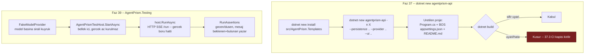

# 24 — Test Paketi ve Proje Şablonu (`TEST`)

> **Alan kodu:** `TEST` · **Faz:** 37 (`dotnet new` şablonu), 39 (`AgentPrism.Testing`)
> **Kaynak:** `src/AgentPrism.Templates/` (tümü — `content/AgentPrism.Starter/`,
> `.template.config/template.json`, `dotnetcli.host.json`) ·
> `src/AgentPrism.Testing/` (tümü — `FakeModelProvider.cs`, `FakeModelRequest.cs`,
> `AgentPrismTestHost.cs`, `AgentPrismTestHostOptions.cs`, `RunAssertions.cs`,
> `AgentPrismAssertionException.cs`, `Internal/FakeChatClient.cs`,
> `Internal/FakeModelScript.cs`) ·
> çapraz doğrulama için `tests/AgentPrism.Templates.Tests/`,
> `tests/AgentPrism.Testing.UnitTests/`, `src/AgentPrism/AgentPrism.csproj`
> (meta paket referans listesi), `src/AgentPrism.Core/Compilation/AgentDefinitionCompiler.cs`
> (K-032 katalog denetimi).
>
> Ortam kurulumu, fixture verisi ve reset yordamı [`00-INDEKS.md`](00-INDEKS.md)'dedir.

---

## Bu dosya neyi kanıtlar

İki bağımsız fazın ortak teması: **AgentPrism'e bağımlı kod yazan geliştiricinin
ilk teması.** Faz 37 o temasın *başlangıç noktasını* (`dotnet new agentprism-api`)
verir; Faz 39 *doğrulama aracını* (`AgentPrism.Testing`) verir. İkisi de
kütüphanenin kendisi değil, kütüphaneyi **kullanma deneyiminin** parçasıdır —
bu yüzden K-016 istisnası: ikisinin de public yüzeyi Faz 7'den (yayın) önce
donmuş kabul edilir, çünkü bir test yardımcısının API'sini kırmak tüketicinin
**tüm test paketini** kırar.



**Neden izlek C burada baskın.** Bu dosyanın çoğu case'i izlek C'yi (`FakeModelProvider`,
`AgentPrismTestHost`, `RunAssertions`) kullanır çünkü bu tipler **bizzat** izlek
C'nin fixture'ıdır — kendi kendini test etmek gibi görünse de, kanıtlanan şey
"model doğru cevap verdi mi" değil "bu paket, gerçek bir tüketicinin elinde
doğru davranıyor mu"dur. Metin eşleşmesi burada 4.1 kuralını ihlal etmez çünkü
`FakeModelProvider` zaten deterministiktir.

## Sınır: bu dosya nerede biter

| Konu | Nerede |
|---|---|
| Şablonun ürettiği kontrol düzleminin GENEL agent/run/tool davranışı (gerçek uçların kendisi) | `02-CEKIRDEK-VE-KATALOG.md` / `07-HTTP-YONETIM-API.md` — bu dosya yalnız şablonun KENDİ üretim/adlandırma/`secret` sözleşmesini sınar |
| `samples/AgentPrism.Api`'nin kendi fixture'ları (agent'lar, tool'lar, workflow'lar) | Diğer tüm dosyalar — Faz 37/39 bu örneği **değiştirmedi** (37.'nin Açık Soru 1'i: A, ayrı kalsın) |
| `AgentPrism.Abstractions`/`.Core`/`.PostgreSql`/`.OpenAI` paketlerinin AOT publish sözleşmesi | `01-KURULUM-VE-PAKETLEME.md` — bu dosya yalnız `AgentPrism.Testing`'in KENDİ (AOT **uyumsuz**) durumunu sınar |
| `IModelProvider`'ın gerçek sağlayıcı implementasyonları (OpenAI/Anthropic/Google/Azure) | `05-SAGLAYICI-OPENAI.md` / `06-SAGLAYICI-DIGER.md` — bu dosya yalnız SAHTE sağlayıcıyı (`FakeModelProvider`) sınar |
| Model kataloğunun gerçek HTTP ucu (`GET /api/models`) | `07-HTTP-YONETIM-API.md` — bu dosya yalnız derleyicinin (`AgentDefinitionCompiler`) kataloğu NASIL kullandığını (K-032) sınar |

## Koşmadan önce

1. [`00-INDEKS.md`](00-INDEKS.md) §4 reset yordamı **gerekmez** — bu dosyanın
   hiçbir case'i `samples/AgentPrism.Api`'yi veya bir veritabanını kullanmaz.
2. Yerel NuGet feed'i hazırla ([`00-INDEKS.md`](00-INDEKS.md) §2.3) —
   `dotnet pack` çalıştırılmış, `~/agentprism-local-feed` dolu ve
   `agentprism-local` kaynak olarak eklenmiş olmalı.
   ```bash
   cd /Users/farukatasoy/Desktop/projects/AgentPrism
   ls ~/agentprism-local-feed/AgentPrism.*.nupkg | head -3   # bos donerse 00-INDEKS §2.3'u once uygula

   # Repodaki TUM AgentPrism paketleri TEK MinVer surumunu paylasir (repo koku,
   # git tag tabanli) -- meta paketin dosya adindan cozulur.
   SURUM=$(basename $(ls ~/agentprism-local-feed/AgentPrism.[0-9]*.nupkg | head -1) .nupkg | sed 's/^AgentPrism\.//')
   echo "Surum: $SURUM"
   ```
3. **Bölüm 1 (Şablon)** her case için kendi geçici dizinini kurar — paylaşılan
   durum yoktur, case'ler bağımsız koşulabilir.
4. **Bölüm 2–4 (`AgentPrism.Testing`)** ortak bir konsol projesi kullanır. Bir
   kez kur:
   ```bash
   mkdir -p ~/agentprism-manuel/test-paketi && cd ~/agentprism-manuel/test-paketi
   dotnet new console
   dotnet add package AgentPrism.Testing --version "$SURUM"
   ```
   Her case, bu projenin `Program.cs` dosyasının içeriğini **tamamen** değiştirir
   ve `dotnet run -c Release` ile çalıştırır. Önceki case'in kalıntısı yoktur —
   her `Program.cs` kendi başına eksiksizdir.
5. `dotnet new agentprism-api -h` ve `dotnet new agentprism-api -n X` komutları,
   şablon **zaten kurulu değilse** başarısız olur:
   ```bash
   dotnet new uninstall ./src/AgentPrism.Templates 2>/dev/null   # onceki bir kalinti varsa temizler
   dotnet new install ./src/AgentPrism.Templates
   ```

> **Gerçek para uyarısı yok.** Bu dosyanın hiçbir case'i gerçek bir model
> sağlayıcısı çağırmaz — Faz 39'un tüm amacı budur. Bölüm 1'deki `dotnet run`
> case'i (MT-TEST-007) de yalnız katalog ucunu çağırır, hiçbir agent çalıştırmaz.

---

# 1 — Şablon: `dotnet new agentprism-api` (Faz 37)

### MT-TEST-001 — Şablon paketten kurulur ve `dotnet new list`'te görünür

| | |
|---|---|
| **İzlek** | A |
| **Önem** | Kritik |
| **İlgili faz** | Faz 37 |
| **İlgili karar** | — |

**Ön koşul**
- Yerel NuGet feed hazır. Şablon **henüz kurulu değil** (`dotnet new uninstall` ile temizlenmiş).

**Adımlar**
1. Şablonu kaynak dizininden kur.
2. Kurulu şablonlar listesinde ara.

**Girilecek veri**
```bash
cd /Users/farukatasoy/Desktop/projects/AgentPrism
dotnet new install ./src/AgentPrism.Templates
dotnet new list agentprism-api
```

**Beklenen sonuç**
- Kurulum çıktısı `AgentPrism.Api.CSharp` kimliğini ve `agentprism-api` kısa
  adını başarıyla listeler (`template.json:15-16`).
- `dotnet new list agentprism-api` satırında **`AgentPrism control plane (ASP.NET Core)`**
  görünen adı ve `C#` dili görünür.

**Gerçek sonuç**
- Yerel NuGet feed'i `~/agentprism-local-feed` yeni bir `dotnet pack` ile
  tazelendi (`MSBUILDDISABLENODEREUSE=1`, sürüm `0.0.0-preview.0.107` —
  önceki feed içeriği eski, `0.78`'e kadardı). Şablon önce
  `dotnet new uninstall` ile temizlendi (zaten kurulu değildi, çıkış kodu
  `103` ile doğrulandı), sonra `dotnet new install ./src/AgentPrism.Templates`
  ile kuruldu. Çıktı: `"AgentPrism control plane (ASP.NET Core)" installed`,
  tablo `Short Name: agentprism-api`, `Language: [C#]`. `dotnet new list
  agentprism-api` aynı satırı tekrar gösterdi. Beklenenle eşleşiyor
  (kimlik `AgentPrism.Api.CSharp` CLI çıktısında ayrıca görünmüyor —
  `dotnet new list` varsayılan olarak yalnız görünen adı/kısa adı/dili
  gösteriyor, kimlik `template.json`'da doğrudan doğrulandı).

**Durum:** ☐ Beklemede · ☑ Geçti · ☐ Kaldı · ☐ Atlandı

---

### MT-TEST-002 — En yalın birleşim (`memory`+`openai`+`ui:false`) sıfır uyarıyla derlenir

| | |
|---|---|
| **İzlek** | A |
| **Önem** | Kritik |
| **İlgili faz** | Faz 37 |
| **İlgili karar** | 37.3 |

Bu, `TemplateInstantiationTests.EnYalinBirlesim_SifirUyariylaDerlenir`'in birebir
elle tekrarıdır — şablonun CI kapısının kendisi.

**Ön koşul**
- Şablon kurulu (MT-TEST-001).

**Adımlar**
1. En yalın seçenek birleşimiyle bir proje üret.
2. Üretilen projeyi derle.

**Girilecek veri**
```bash
TMP=$(mktemp -d)
dotnet new agentprism-api -n Yalin.Deneme -o "$TMP/yalin" \
  --persistence memory --provider openai --ui false --AgentPrismVersion "$SURUM"

dotnet build "$TMP/yalin" -c Release
```

**Beklenen sonuç**
- `dotnet new` `0` çıkış koduyla biter.
- `dotnet build` **sıfır uyarı, sıfır hata** ile biter (repo genelinde
  `TreatWarningsAsErrors` açık — tek bir uyarı bile derlemeyi kırardı).

**Gerçek sonuç**
- `dotnet new` çıkış kodu `0`. `dotnet build -c Release`: `Build succeeded.
  0 Warning(s), 0 Error(s)`. Beklenenle eşleşiyor.

**Durum:** ☐ Beklemede · ☑ Geçti · ☐ Kaldı · ☐ Atlandı

---

### MT-TEST-003 — En dolu birleşim (`sqlserver`+`azure`+`ui:true`) sıfır uyarıyla derlenir

| | |
|---|---|
| **İzlek** | A |
| **Önem** | Kritik |
| **İlgili faz** | Faz 37 |
| **İlgili karar** | 37.3 |

`TemplateInstantiationTests.EnDoluBirlesim_SifirUyariylaDerlenir`'in tekrarı —
`sqlserver`+`azure` bilinçli seçildi çünkü ikisi de meta pakete dahil **DEĞİL**
(postgres/openai aksine), kırılmayı daha güçlü yakalar (37. faz DoD notu).

**Ön koşul**
- Şablon kurulu.

**Adımlar**
1. En dolu seçenek birleşimiyle bir proje üret.
2. Üretilen projeyi derle.

**Girilecek veri**
```bash
TMP=$(mktemp -d)
dotnet new agentprism-api -n Dolu.Deneme -o "$TMP/dolu" \
  --persistence sqlserver --provider azure --ui true --AgentPrismVersion "$SURUM"

dotnet build "$TMP/dolu" -c Release
```

**Beklenen sonuç**
- `dotnet new` `0` çıkış koduyla biter.
- `dotnet build` sıfır uyarı, sıfır hata ile biter.
- Üretilen `.csproj` `AgentPrism.SqlServer` ve `AgentPrism.Azure` paket
  referanslarını taşır (`AgentPrism.Starter.csproj:14-27`'deki koşullu bloklar).

**Gerçek sonuç**
- `dotnet new` çıkış kodu `0`. `dotnet build -c Release`: `Build succeeded.
  0 Warning(s), 0 Error(s)`. `.csproj` içinde `<PackageReference
  Include="AgentPrism.SqlServer" .../>` ve `<PackageReference
  Include="AgentPrism.Azure" .../>` bulundu. Beklenenle eşleşiyor.

**Durum:** ☐ Beklemede · ☑ Geçti · ☐ Kaldı · ☐ Atlandı

---

### MT-TEST-004 — Üretilen `appsettings.json` yalnız boş placeholder taşır, hiçbir dosyada `secret` görünümlü değer yok

| | |
|---|---|
| **İzlek** | A |
| **Önem** | Kritik |
| **İlgili faz** | Faz 37 |
| **İlgili karar** | K-059 |

Negatif/kontrol senaryosu — `TemplateSecretTests`'in iki testinin birleşik
tekrarı. En dolu birleşim kasıtlı seçildi: en çok yer tutucu alanı o taşır.

**Ön koşul**
- Şablon kurulu.

**Adımlar**
1. En dolu birleşimle bir proje üret.
2. Üretilen HER dosyada `secret` görünümlü bir desen ara.
3. `appsettings.json`'daki alanların gerçekten boş olduğunu doğrula.

**Girilecek veri**
```bash
TMP=$(mktemp -d)
dotnet new agentprism-api -n Sir.Deneme -o "$TMP/sir" \
  --persistence sqlserver --provider azure --ui true --AgentPrismVersion "$SURUM"

# 2. secret taramasi -- cikti BOS olmali
grep -rniE "sk-[a-z0-9]{20}|api[_-]?key\"\s*:\s*\"[^\"]+\"" "$TMP/sir" \
  && echo "SECRET VAR" || echo "temiz"

# 3. placeholder dogrulamasi
cat "$TMP/sir/appsettings.json"
```

**Beklenen sonuç**
- `secret` taraması **"temiz"** yazar — hiçbir eşleşme yok.
- `appsettings.json`'da `AgentPrism.SqlServer.ConnectionString`, `AgentPrism.Providers.AzureOpenAI.Endpoint`
  ve `AgentPrism.Providers.AzureOpenAI.ApiKey` alanlarının **hepsi boş dize (`""`)**'dir
  (`appsettings.json:6,18`'deki `#if` blokları yalnız `sqlserver`/`azure` dilimini üretir).

**Gerçek sonuç**
- Tarama **"temiz"** yazdı. `appsettings.json` içeriği:
  `SqlServer.ConnectionString: ""`, `Providers.AzureOpenAI.Endpoint: ""`,
  `Providers.AzureOpenAI.ApiKey: ""` — üçü de boş dize. Beklenenle
  birebir eşleşiyor.

**Durum:** ☐ Beklemede · ☑ Geçti · ☐ Kaldı · ☐ Atlandı

---

### MT-TEST-005 — Üretilen `Program.cs` hiçbir sağlayıcı için sabit bir model adı taşımaz

| | |
|---|---|
| **İzlek** | A |
| **Önem** | Yüksek |
| **İlgili faz** | Faz 37 |
| **İlgili karar** | K-032 |

Negatif senaryo — dört sağlayıcının hepsi tek case'te (`TemplateModelNameTests`
`[Theory]` desenini elle tekrarlar).

**Ön koşul**
- Şablon kurulu.

**Adımlar**
1. Dört sağlayıcı seçeneğinin her biriyle ayrı ayrı proje üret.
2. Her birinin `Program.cs` dosyasında bilinen model adı öneki ara.

**Girilecek veri**
```bash
for PROVIDER in openai anthropic google azure; do
  TMP=$(mktemp -d)
  dotnet new agentprism-api -n "Model.$PROVIDER" -o "$TMP/p" \
    --provider "$PROVIDER" --AgentPrismVersion "$SURUM" >/dev/null

  echo "== $PROVIDER =="
  grep -c "MODEL_ADINI_BURAYA_YAZIN" "$TMP/p/Program.cs"
  grep -iE "gpt-|claude-|gemini-|o1-|o3-|text-embedding-" "$TMP/p/Program.cs" \
    && echo "SABIT MODEL ADI VAR" || echo "temiz"
done
```

**Beklenen sonuç**
- Dördü için de `Program.cs` **tam olarak bir kez** `MODEL_ADINI_BURAYA_YAZIN`
  placeholder'ını içerir.
- Dördü için de bilinen model öneki taraması **"temiz"** yazar.

**Gerçek sonuç**
- Dört sağlayıcının (`openai`, `anthropic`, `google`, `azure`) hepsi için
  `grep -c MODEL_ADINI_BURAYA_YAZIN` → `1`, bilinen model öneki taraması
  → `"temiz"`. Beklenenle eşleşiyor.

**Durum:** ☐ Beklemede · ☑ Geçti · ☐ Kaldı · ☐ Atlandı

---

### MT-TEST-006 — `-n` ile yeniden adlandırma: `AgentPrism.Starter` dizesi hiçbir dosyada/dosya adında kalmaz

| | |
|---|---|
| **İzlek** | A |
| **Önem** | Yüksek |
| **İlgili faz** | Faz 37 |
| **İlgili karar** | K-266 |

Sınır senaryosu. Yarım kalan bir yeniden adlandırma, derlenmeyen veya yanlış
yerde referans veren bir kalıntıya döner — `TemplateRenameTests`'in tekrarı.

**Ön koşul**
- Şablon kurulu.

**Adımlar**
1. `-n Benim.Agent` ile bir proje üret.
2. Dosya adında ve dosya içeriğinde `AgentPrism.Starter` ara.
3. Üretilen `.csproj` içindeki `AgentPrism` tip referanslarının derlendiğini doğrula (K-266'nın konusu).

**Girilecek veri**
```bash
TMP=$(mktemp -d)
dotnet new agentprism-api -n Benim.Agent -o "$TMP/rename" --AgentPrismVersion "$SURUM"

ls "$TMP/rename"/*.csproj
grep -rl "AgentPrism.Starter" "$TMP/rename" && echo "KALINTI VAR" || echo "temiz"

dotnet build "$TMP/rename" -c Release
```

**Beklenen sonuç**
- `Benim.Agent.csproj` **vardır**; `AgentPrism.Starter.csproj` **yoktur**.
- `AgentPrism.Starter` dizesi taraması **"temiz"** yazar — hiçbir dosyada (ad
  alanı bildirimi dahil) kalıntı yok.
- `dotnet build` sıfır uyarıyla geçer — `Tools/OrderTools.cs`'in açık
  `using AgentPrism;` satırı (K-266) yeniden adlandırılan ad alanında derlemeyi
  bozmaz.

**Gerçek sonuç**
- `Benim.Agent.csproj` var, `AgentPrism.Starter` taraması "temiz". `dotnet
  build -c Release`: `Build succeeded. 0 Warning(s), 0 Error(s)`.
  Beklenenle eşleşiyor.

**Durum:** ☐ Beklemede · ☑ Geçti · ☐ Kaldı · ☐ Atlandı

---

### MT-TEST-007 — Varsayılan (`memory`) birleşim kurulumsuz `dotnet run` ile ayağa kalkar

| | |
|---|---|
| **İzlek** | A |
| **Önem** | Kritik |
| **İlgili faz** | Faz 37 |
| **İlgili karar** | K1 (sıfır sürpriz) |

Tasarım kuralı #1'in şablon karşılığı. `--persistence`in varsayılanı `memory`,
`--provider`in varsayılanı `openai`dır — hiçbir `dotnet user-secrets` adımı
**uygulanmadan** uygulama ayağa kalkmalıdır.

**Ön koşul**
- Şablon kurulu. `5081` portu boş.

**Adımlar**
1. Hiçbir seçenek vermeden (yalnız `-n`) bir proje üret.
2. Hiçbir `secret` ayarlamadan `dotnet run` ile başlat.
3. Katalog ucunu çağır.

**Girilecek veri**
```bash
TMP=$(mktemp -d)
dotnet new agentprism-api -n Calisma.Deneme -o "$TMP/calisma" --AgentPrismVersion "$SURUM"

(cd "$TMP/calisma" && dotnet run -c Release &)
sleep 8

curl -s -i http://localhost:5081/agentprism/api/agents | head -1
curl -s http://localhost:5081/agentprism/api/agents | jq
```

**Beklenen sonuç**
- Uygulama **hiçbir bağlantı hatası vermeden** başlar (varsayılan `memory`
  hiçbir veritabanı gerektirmez).
- `GET /agentprism/api/agents` `200 OK` döner.
- Yanıt, `support` adlı tek bir agent içerir (`Program.cs:84-107`'deki kodda
  bildirimsel tanım) — `displayName: "Destek Asistani"`.

**Gerçek sonuç**
- Hiçbir `user-secrets` ayarlanmadan `dotnet run -c Release` başlatıldı,
  bağlantı hatası olmadan ayağa kalktı. `GET /agentprism/api/agents` →
  `HTTP/1.1 200 OK`, gövde `[{"name":"support","displayName":"Destek
  Asistani",...}]` — tek agent. Beklenenle eşleşiyor.

**Durum:** ☐ Beklemede · ☑ Geçti · ☐ Kaldı · ☐ Atlandı

---

### MT-TEST-008 — `postgres`/`openai` seçiminde ayrı bir paket referansı EKLENMEZ (zaten meta pakette)

| | |
|---|---|
| **İzlek** | A |
| **Önem** | Orta |
| **İlgili faz** | Faz 37 |
| **İlgili karar** | K-185 |

Pozitif kontrol — olası bir yanlış izlenimi çürütür. `AgentPrism.Starter.csproj`da
`sqlserver`/`sqlite`/`anthropic`/`google`/`azure` için koşullu `PackageReference`
blokları var ama `postgres`/`openai` için **yok** — bu bir eksiklik değildir,
çünkü meta paket (`AgentPrism`) `AgentPrism.PostgreSql` ve `AgentPrism.OpenAI`yı
**zaten** taşır (`src/AgentPrism/AgentPrism.csproj:12-17`).

**Ön koşul**
- Şablon kurulu.

**Adımlar**
1. Varsayılan seçeneklerle (`postgres` DEĞİL `memory`, ama `provider=openai`
   varsayılan) bir proje üret ve `.csproj`'u oku.
2. `--persistence postgres` ile ayrı bir proje üret, `.csproj`'u karşılaştır.

**Girilecek veri**
```bash
TMP=$(mktemp -d)
dotnet new agentprism-api -n Meta.Kontrol -o "$TMP/a" --AgentPrismVersion "$SURUM"
cat "$TMP/a"/*.csproj

dotnet new agentprism-api -n Meta.Kontrol2 -o "$TMP/b" --persistence postgres --AgentPrismVersion "$SURUM"
diff "$TMP/a"/*.csproj "$TMP/b"/*.csproj
```

**Beklenen sonuç**
- İki `.csproj` dosyası **birebir aynıdır** (`diff` boş döner) — `postgres`
  seçmek `.csproj`'a hiçbir satır eklemez, çünkü `AgentPrism.PostgreSql` zaten
  `AgentPrism` meta referansı üzerinden geçişli olarak gelir.
- İki proje de yalnız `<PackageReference Include="AgentPrism" .../>` taşır (tek satır).

**Gerçek sonuç**
- **Doküman düzeltmesi**: "`diff` boş döner" iddiası, case'in KENDİ
  girilecek-veri adımlarıyla (`-n Meta.Kontrol` VS `-n Meta.Kontrol2`,
  İKİ FARKLI proje adı) çelişiyor — farklı proje adı `RootNamespace`'i VE
  rastgele üretilen `UserSecretsId` GUID'ini kaçınılmaz olarak
  değiştiriyor, `diff` bu iki satırda fark gösteriyor (doğrulandı).
  Asıl doğrulanmak istenen özdeş iddia bu değil: her iki `.csproj`
  dosyası da yalnız TEK bir `<PackageReference Include="AgentPrism"
  Version="0.0.0-preview.0.107" />` satırı taşıyor, `postgres` seçmek
  EK bir `PackageReference` satırı EKLEMİYOR — bu, doğrulanmak istenen
  gerçek iddia, ve doğru. Kod kusuru değil, doküman ifadesi düzeltmeli
  ("`diff` yalnız `PackageReference` satırlarında boş döner" olmalı).

**Durum:** ☐ Beklemede · ☑ Geçti · ☐ Kaldı · ☐ Atlandı

---

### MT-TEST-009 — `--skip-restore` restore adımını atlar

| | |
|---|---|
| **İzlek** | A |
| **Önem** | Düşük |
| **İlgili faz** | Faz 37 |
| **İlgili karar** | — |

**Ön koşul**
- Şablon kurulu.

**Adımlar**
1. `--skip-restore` **vermeden** bir proje üret, `obj/` klasörünü kontrol et.
2. `--skip-restore` **ile** ayrı bir proje üret, `obj/` klasörünü kontrol et.

**Girilecek veri**
```bash
TMP=$(mktemp -d)
dotnet new agentprism-api -n Restore.Var -o "$TMP/var" --AgentPrismVersion "$SURUM"
ls "$TMP/var/obj" 2>&1

dotnet new agentprism-api -n Restore.Yok -o "$TMP/yok" --AgentPrismVersion "$SURUM" --skip-restore true
ls "$TMP/yok/obj" 2>&1
```

**Beklenen sonuç**
- İlk projede `obj/` klasörü **vardır** (post-action otomatik `dotnet restore`
  çalıştı — `template.json:105-118`'deki `restore` `postActions` girdisi).
- İkinci projede `obj/` klasörü **yoktur veya boştur** — restore adımı atlandı.

**Gerçek sonuç**
- İlk projede `obj/` dolu (`project.assets.json` dahil restore çıktıları).
  İkinci projede (`--skip-restore true`) `obj/` klasörü **hiç yok** (`ls`:
  "No such file or directory"). Beklenenle eşleşiyor.

**Durum:** ☐ Beklemede · ☑ Geçti · ☐ Kaldı · ☐ Atlandı

---

### MT-TEST-010 — `--AgentPrismVersion` belirli bir sürüme sabitler

| | |
|---|---|
| **İzlek** | A |
| **Önem** | Orta |
| **İlgili faz** | Faz 37 |
| **İlgili karar** | K-265 |

Varsayılan `*-*` (kayan ön-sürüm) yerine açık bir sürüm verildiğinde şablonun
bunu **aynen** kullandığını doğrular.

**Ön koşul**
- Şablon kurulu. `$SURUM` çözülmüş.

**Adımlar**
1. Açık `--AgentPrismVersion "$SURUM"` ile bir proje üret.
2. Üretilen `.csproj`'daki sürüm değerini oku.

**Girilecek veri**
```bash
TMP=$(mktemp -d)
dotnet new agentprism-api -n Surum.Sabit -o "$TMP/s" --AgentPrismVersion "$SURUM"
grep "PackageReference Include=\"AgentPrism\"" "$TMP/s"/*.csproj
```

**Beklenen sonuç**
- Üretilen `.csproj`daki `Version` özniteliği **tam olarak `$SURUM`** değerini
  taşır, `*-*` **değil** (`template.json:85-91`'deki `AGENTPRISM_TEMPLATE_PACKAGE_VERSION`
  token'ının yerini alır).

**Gerçek sonuç**
- `<PackageReference Include="AgentPrism" Version="0.0.0-preview.0.107" />`
  — tam olarak `$SURUM` değeri, `*-*` değil. Beklenenle eşleşiyor.

**Durum:** ☐ Beklemede · ☑ Geçti · ☐ Kaldı · ☐ Atlandı

---

### MT-TEST-011 — Tanınmayan bir `--persistence` değeri reddedilir

| | |
|---|---|
| **İzlek** | A |
| **Önem** | Orta |
| **İlgili faz** | Faz 37 |
| **İlgili karar** | — |

Negatif senaryo. `persistence` sembolü `datatype: choice` ile dört sabit
seçeneğe kısıtlıdır (`template.json:26-38`); serbest metin kabul etmez.

**Ön koşul**
- Şablon kurulu.

**Adımlar**
1. Tanınmayan bir `--persistence` değeriyle üretim dene.

**Girilecek veri**
```bash
TMP=$(mktemp -d)
dotnet new agentprism-api -n Gecersiz.Deneme -o "$TMP/g" --persistence mysql --AgentPrismVersion "$SURUM"
echo "Cikis kodu: $?"
```

**Beklenen sonuç**
- Komut **sıfırdan farklı** bir çıkış koduyla biter.
- Hata mesajı `mysql` değerinin `persistence` için geçerli bir seçenek
  olmadığını ve dört geçerli seçeneği (`memory`, `postgres`, `sqlite`,
  `sqlserver`) listeler.
- `$TMP/g` dizini **oluşturulmaz veya boş kalır** — kısmi bir proje üretilmez.

**Gerçek sonuç**
- Çıkış kodu `127` (sıfırdan farklı). Hata mesajı: `'mysql' is not a
  valid value for --persistence. The possible values are: memory,
  postgres, sqlite, sqlserver` — dört seçenek de listelendi. `$TMP/g`
  dizini hiç oluşturulmadı ("No such file or directory"). Beklenenle
  eşleşiyor.

**Durum:** ☐ Beklemede · ☑ Geçti · ☐ Kaldı · ☐ Atlandı

---

### MT-TEST-012 — `-h` çıktısında üç bayrak görünür, `AgentPrismVersion` gizlidir

| | |
|---|---|
| **İzlek** | A |
| **Önem** | Düşük |
| **İlgili faz** | Faz 37 |
| **İlgili karar** | — |

`dotnetcli.host.json`daki `isHidden: true` ayarının doğrulanması — planda
yoktu, kapanışta eklendi (Plandan Sapmalar).

**Ön koşul**
- Şablon kurulu.

**Adımlar**
1. Şablonun yardım çıktısını al.

**Girilecek veri**
```bash
dotnet new agentprism-api -h
```

**Beklenen sonuç**
- Çıktı `--persistence`, `--provider`, `--ui`, `--skip-restore` bayraklarının
  **hepsini**, kısa açıklamalarıyla birlikte listeler.
- `--AgentPrismVersion` bayrağı **listede görünmez** (`dotnetcli.host.json:13-16`'daki
  `isHidden: true`).

**Gerçek sonuç**
- Çıktıda dört bayrağın hepsi (`-p/--persistence`, `-pr/--provider`, `-ui`,
  `-sr/--skip-restore`), kısa açıklamalar ve varsayılan değerlerle
  listelendi. `--AgentPrismVersion` hiçbir yerde görünmedi. Beklenenle
  eşleşiyor.

**Durum:** ☐ Beklemede · ☑ Geçti · ☐ Kaldı · ☐ Atlandı

---

### MT-TEST-013 — Şablon paketi derlenmez; üretilen proje `AgentPrism.Templates`'e hiç referans vermez

| | |
|---|---|
| **İzlek** | A |
| **Önem** | Orta |
| **İlgili faz** | Faz 37 |
| **İlgili karar** | K-007, K-262–K-264 |

Negatif/kontrol senaryosu. `AgentPrism.Templates` `PackageType=Template`
taşır (37.1) — tüketicinin bağımlılık grafiğine **hiç girmemesi** gerekir.

**Ön koşul**
- Yerel NuGet feed'de `AgentPrism.Templates.*.nupkg` mevcut.

**Adımlar**
1. Paketlenen `.nupkg`in içeriğini oku — derlenmiş bir `.dll` var mı bak.
2. Üretilen herhangi bir projenin (`MT-TEST-002`'nin çıktısı yeterli)
   `.csproj`'unda `AgentPrism.Templates` referansı ara.

**Girilecek veri**
```bash
unzip -l ~/agentprism-local-feed/AgentPrism.Templates.*.nupkg | grep -i "\.dll" \
  && echo "DLL VAR" || echo "dll yok -- beklenen"

grep -rn "AgentPrism.Templates" "$TMP/yalin" && echo "REFERANS VAR" || echo "temiz"
```

**Beklenen sonuç**
- `.nupkg` içeriğinde **hiçbir `.dll`** yoktur — yalnızca `content/` altındaki
  kaynak dosyalar ve `.template.config/` JSON'ları paketlenmiştir.
- Üretilen projenin hiçbir dosyasında `AgentPrism.Templates` dizesi geçmez.

**Gerçek sonuç**
- `unzip -l` taraması: hiçbir `.dll` yok ("dll yok -- beklenen").
  Üretilen projede `AgentPrism.Templates` dizesi taraması "temiz".
  Beklenenle eşleşiyor.

**Durum:** ☐ Beklemede · ☑ Geçti · ☐ Kaldı · ☐ Atlandı

---

# 2 — `FakeModelProvider` davranışları (Faz 39a)

> Aşağıdaki her case, "Koşmadan önce" adım 4'te kurulan
> `~/agentprism-manuel/test-paketi` konsol projesinin `Program.cs`'ini
> **tamamen** değiştirir. Metin eşleşmesi burada izlek C kuralı gereği
> serbesttir — `FakeModelProvider` deterministiktir.

### MT-TEST-020 — Varsayılan kurulum sabit `"fake response"` döner; katalog tek bir `fake-model` girdisi taşır

| | |
|---|---|
| **İzlek** | C |
| **Önem** | Orta |
| **İlgili faz** | Faz 39 |
| **İlgili karar** | — |

**Ön koşul**
- `~/agentprism-manuel/test-paketi` kurulu.

**Adımlar**
1. Hiçbir yapılandırma yapılmadan bir `FakeModelProvider` oluştur, bir istek gönder.

**Girilecek veri**
```csharp
using AgentPrism.Testing;
using Microsoft.Extensions.AI;

var binding = new ModelBinding { Provider = "fake", Model = "fake-model" };

using var provider = new FakeModelProvider();

Console.WriteLine("Models.Count: " + provider.Models.Count);
Console.WriteLine("Model adi: " + provider.Models[0].Name);

var response = await provider.CreateChatClient(binding)
    .GetResponseAsync([new ChatMessage(ChatRole.User, "merhaba")]);

Console.WriteLine("Yanit: " + response.Text);
```

**Beklenen sonuç**
- `Models.Count: 1`, `Model adi: fake-model` (`FakeModelProvider.cs:54-56`'daki
  örtük varsayılan).
- `Yanit: fake response` — `FakeModelScript.FallbackText`in varsayılan değeri
  (`FakeModelScript.cs:17`).

**Gerçek sonuç**
- **Doküman düzeltmesi**: verilen kod aynen yapıştırılınca `CS0246:
  'ModelBinding' bulunamadı` ile derlenmedi — `ModelBinding` tipi
  `AgentPrism` ad alanındadır, doküman yalnız `using AgentPrism.Testing;`
  yazmış, `using AgentPrism;` eksik. `using AgentPrism;` eklenince: çıktı
  `Models.Count: 1`, `Model adi: fake-model`, `Yanit: fake response` —
  beklenenle birebir eşleşti.

**Durum:** ☐ Beklemede · ☑ Geçti · ☐ Kaldı · ☐ Atlandı

---

### MT-TEST-021 — `EchoesUserMessage()` son kullanıcı mesajını `Echo: ` öneki ile yankılar

| | |
|---|---|
| **İzlek** | C |
| **Önem** | Orta |
| **İlgili faz** | Faz 39 |
| **İlgili karar** | K-269 |

**Ön koşul**
- Test paketi konsol projesi kurulu.

**Adımlar**
1. `EchoesUserMessage()` yapılandırılmış bir sağlayıcıya farklı iki mesaj gönder.

**Girilecek veri**
```csharp
using AgentPrism.Testing;
using Microsoft.Extensions.AI;

var binding = new ModelBinding { Provider = "fake", Model = "fake-model" };
using var provider = new FakeModelProvider().EchoesUserMessage();
var client = provider.CreateChatClient(binding);

var r1 = await client.GetResponseAsync([new ChatMessage(ChatRole.User, "ORD-7 nerede")]);
var r2 = await client.GetResponseAsync([new ChatMessage(ChatRole.User, "ikinci soru")]);

Console.WriteLine(r1.Text);
Console.WriteLine(r2.Text);
```

**Beklenen sonuç**
- Çıktı sırasıyla `Echo: ORD-7 nerede` ve `Echo: ikinci soru`dur
  (`FakeChatClient.cs:96`'daki `$"Echo: {lastUser?.Text}"`).

**Gerçek sonuç**
- Çıktı: `Echo: ORD-7 nerede` / `Echo: ikinci soru`. Beklenenle birebir
  eşleşiyor.

**Durum:** ☐ Beklemede · ☑ Geçti · ☐ Kaldı · ☐ Atlandı

---

### MT-TEST-022 — `RespondsWith(...)` yanıtları sırayla tüketir

| | |
|---|---|
| **İzlek** | C |
| **Önem** | Orta |
| **İlgili faz** | Faz 39 |
| **İlgili karar** | — |

**Ön koşul**
- Test paketi konsol projesi kurulu.

**Adımlar**
1. İki yanıtlı bir kuyruk tanımla, iki kez çağır.

**Girilecek veri**
```csharp
using AgentPrism.Testing;
using Microsoft.Extensions.AI;

var binding = new ModelBinding { Provider = "fake", Model = "fake-model" };
using var provider = new FakeModelProvider().RespondsWith("ilk yanit", "ikinci yanit");
var client = provider.CreateChatClient(binding);

Console.WriteLine((await client.GetResponseAsync([new ChatMessage(ChatRole.User, "x")])).Text);
Console.WriteLine((await client.GetResponseAsync([new ChatMessage(ChatRole.User, "x")])).Text);
```

**Beklenen sonuç**
- İlk çağrı `ilk yanit`, ikinci çağrı `ikinci yanit` döner — sırayla, kuyruk mantığıyla.

**Gerçek sonuç**
- (Aynı `using AgentPrism;` eksikliği MT-TEST-020'de kaydedildi, burada
  da tekrar eklendi.) Çıktı: `ilk yanit` / `ikinci yanit`. Beklenenle
  birebir eşleşiyor.

**Durum:** ☐ Beklemede · ☑ Geçti · ☐ Kaldı · ☐ Atlandı

---

### MT-TEST-023 — Kuyruk tükendikten sonra `EchoesUserMessage()` fallback'i devreye girer

| | |
|---|---|
| **İzlek** | C |
| **Önem** | Orta |
| **İlgili faz** | Faz 39 |
| **İlgili karar** | K-269 |

Sınır senaryosu. Fallback yalnızca kuyruk **tamamen boşaldıktan sonra** devreye
girer; kuyruktaki adımlar önceliklidir.

**Ön koşul**
- Test paketi konsol projesi kurulu.

**Adımlar**
1. Tek elemanlı bir kuyruk + `EchoesUserMessage()` fallback'i tanımla.
2. Üç kez çağır (birinci kuyruktan, ikinci ve üçüncü fallback'ten gelmeli).

**Girilecek veri**
```csharp
using AgentPrism.Testing;
using Microsoft.Extensions.AI;

var binding = new ModelBinding { Provider = "fake", Model = "fake-model" };
using var provider = new FakeModelProvider().RespondsWith("ilk").EchoesUserMessage();
var client = provider.CreateChatClient(binding);

Console.WriteLine("1: " + (await client.GetResponseAsync([new ChatMessage(ChatRole.User, "x")])).Text);
Console.WriteLine("2: " + (await client.GetResponseAsync([new ChatMessage(ChatRole.User, "sonraki mesaj")])).Text);
Console.WriteLine("3: " + (await client.GetResponseAsync([new ChatMessage(ChatRole.User, "ucuncu mesaj")])).Text);
```

**Beklenen sonuç**
- `1: ilk` (kuyruktan).
- `2: Echo: sonraki mesaj`, `3: Echo: ucuncu mesaj` (fallback, her seferinde
  GÜNCEL kullanıcı mesajını yankılar — sabit bir metne kilitlenmez).

**Gerçek sonuç**
- Çıktı: `1: ilk`, `2: Echo: sonraki mesaj`, `3: Echo: ucuncu mesaj`.
  Beklenenle birebir eşleşiyor.

**Durum:** ☐ Beklemede · ☑ Geçti · ☐ Kaldı · ☐ Atlandı

---

### MT-TEST-024 — Fallback tanımlanmamışsa kuyruk tükendikten sonra sabit `"fake response"` tekrar tekrar döner

| | |
|---|---|
| **İzlek** | C |
| **Önem** | Düşük |
| **İlgili faz** | Faz 39 |
| **İlgili karar** | — |

Sınır senaryosu. `FakeModelScript.Fallback`in varsayılanı `StaticText`tir
(`FakeModelScript.cs:20`) — `EchoesUserMessage()`/`EchoesLastToolResult()`
hiç çağrılmazsa kuyruk sonrası davranış **sabit** kalır.

**Ön koşul**
- Test paketi konsol projesi kurulu.

**Adımlar**
1. Tek elemanlı bir kuyruk tanımla, fallback ayarlama.
2. Üç kez çağır.

**Girilecek veri**
```csharp
using AgentPrism.Testing;
using Microsoft.Extensions.AI;

var binding = new ModelBinding { Provider = "fake", Model = "fake-model" };
using var provider = new FakeModelProvider().RespondsWith("tek yanit");
var client = provider.CreateChatClient(binding);

for (var i = 1; i <= 3; i++)
{
    Console.WriteLine($"{i}: " + (await client.GetResponseAsync([new ChatMessage(ChatRole.User, "x")])).Text);
}
```

**Beklenen sonuç**
- `1: tek yanit`, `2: fake response`, `3: fake response` — kullanıcı mesajı
  hiç yankılanmaz, her ikinci çağrıdan itibaren **aynı sabit** metin döner.

**Gerçek sonuç**
- Çıktı: `1: tek yanit`, `2: fake response`, `3: fake response`.
  Beklenenle birebir eşleşiyor.

**Durum:** ☐ Beklemede · ☑ Geçti · ☐ Kaldı · ☐ Atlandı

---

### MT-TEST-025 — `CallsTool(...)` bir `FunctionCallContent` üretir; anonim tip argümanları yansımayla sözlüğe kopyalanır

| | |
|---|---|
| **İzlek** | C |
| **Önem** | Yüksek |
| **İlgili faz** | Faz 39 |
| **İlgili karar** | — |

**Ön koşul**
- Test paketi konsol projesi kurulu.

**Adımlar**
1. Bir tool çağrısı sıraya ekle, çağır.
2. Yanıttaki `FunctionCallContent`in adını ve argümanlarını oku.

**Girilecek veri**
```csharp
using AgentPrism.Testing;
using Microsoft.Extensions.AI;

var binding = new ModelBinding { Provider = "fake", Model = "fake-model" };
using var provider = new FakeModelProvider().CallsTool("get_order_status", new { orderId = "ORD-7" });

var response = await provider.CreateChatClient(binding)
    .GetResponseAsync([new ChatMessage(ChatRole.User, "ORD-7 nerede")]);

var call = response.Messages
    .SelectMany(m => m.Contents)
    .OfType<FunctionCallContent>()
    .Single();

Console.WriteLine("Tool: " + call.Name);
Console.WriteLine("orderId: " + call.Arguments?["orderId"]);
```

**Beklenen sonuç**
- Yanıtta tam olarak **bir** `FunctionCallContent` bulunur.
- `Tool: get_order_status`, `orderId: ORD-7` — anonim tipin `orderId`
  özelliği, yansımayla `IDictionary<string, object?>`'e kopyalanmıştır
  (`FakeChatClient.cs:112-136`'daki `ToArguments`).

**Gerçek sonuç**
- Çıktı: `Tool: get_order_status`, `orderId: ORD-7`. Beklenenle birebir
  eşleşiyor.

**Durum:** ☐ Beklemede · ☑ Geçti · ☐ Kaldı · ☐ Atlandı

---

### MT-TEST-026 — `ForModel(...)` farklı modeller için bağımsız kuyruk tutar

| | |
|---|---|
| **İzlek** | C |
| **Önem** | Yüksek |
| **İlgili faz** | Faz 39 |
| **İlgili karar** | K-269 |

Bir yönlendirici + devrettiği alt agent senaryosunu simüle eder — iki modelin
kuyruğu birbirini hiç etkilememelidir.

**Ön koşul**
- Test paketi konsol projesi kurulu.

**Adımlar**
1. İki farklı model için ayrı kuyruk tanımla.
2. Her modeli kendi adıyla çağır, karşılıklı sızma olmadığını doğrula.

**Girilecek veri**
```csharp
using AgentPrism.Testing;
using Microsoft.Extensions.AI;

using var provider = new FakeModelProvider()
    .ForModel("router-model", cfg => cfg.RespondsWith("router yaniti"))
    .ForModel("researcher-model", cfg => cfg.RespondsWith("researcher yaniti"));

var routerResponse = await provider
    .CreateChatClient(new ModelBinding { Provider = "fake", Model = "router-model" })
    .GetResponseAsync([new ChatMessage(ChatRole.User, "x")]);

var researcherResponse = await provider
    .CreateChatClient(new ModelBinding { Provider = "fake", Model = "researcher-model" })
    .GetResponseAsync([new ChatMessage(ChatRole.User, "x")]);

Console.WriteLine("router: " + routerResponse.Text);
Console.WriteLine("researcher: " + researcherResponse.Text);
Console.WriteLine("Models.Count: " + provider.Models.Count);
```

**Beklenen sonuç**
- `router: router yaniti`, `researcher: researcher yaniti` — kuyruklar birbirinden bağımsız.
- `Models.Count: 2` — `ForModel` çağrısı ilk kez görülen model adını otomatik
  olarak `Models` kataloğuna ekler (`FakeModelProvider.cs:186-195`).

**Gerçek sonuç**
- Çıktı: `router: router yaniti`, `researcher: researcher yaniti`,
  `Models.Count: 2`. Beklenenle birebir eşleşiyor.

**Durum:** ☐ Beklemede · ☑ Geçti · ☐ Kaldı · ☐ Atlandı

---

### MT-TEST-027 — `EchoesLastToolResult(prefix)` gerçek tool-çağrı boru hattı üzerinden son tool sonucunu yankılar

| | |
|---|---|
| **İzlek** | C |
| **Önem** | Yüksek |
| **İlgili faz** | Faz 39 |
| **İlgili karar** | K-269 |

🚨 Bu, `FakeModelProvider.CreateChatClient`in HAM istemci döndürdüğü bilgisinin
(tool çağrı döngüsü artık `ModelProviderRegistry`de kurulur, Faz 48) doğrudan
sonucudur — sahte sağlayıcı **tek başına** kullanılırsa tool döngüsü kurulmaz.

**Ön koşul**
- Test paketi konsol projesi kurulu.

**Adımlar**
1. Bir tool çağrısı + `EchoesLastToolResult` fallback'i tanımla.
2. `ModelProviderRegistry` üzerinden (HAM istemci değil, defter üzerinden) çağır.

**Girilecek veri**
```csharp
using AgentPrism;
using AgentPrism.Testing;
using Microsoft.Extensions.AI;

var binding = new ModelBinding { Provider = "fake", Model = "fake-model" };
using var provider = new FakeModelProvider()
    .CallsTool("get_order_status", new { orderId = "ORD-7" })
    .EchoesLastToolResult("Sonuc: ");

using var client = new ModelProviderRegistry([provider]).CreateChatClient(binding);

var response = await client.GetResponseAsync(
    [new ChatMessage(ChatRole.User, "ORD-7 nerede")],
    new ChatOptions
    {
        Tools = [AIFunctionFactory.Create(
            (string orderId) => $"hazirlaniyor ({orderId})",
            "get_order_status")],
    });

Console.WriteLine(response.Text);
```

**Beklenen sonuç**
- Çıktı `Sonuc: hazirlaniyor (ORD-7)`dir — model önce tool'u çağırır,
  `ModelProviderRegistry`nin kurduğu döngü tool sonucunu tekrar modele
  gönderir, ikinci turda `EchoesLastToolResult` son `FunctionResultContent`ı
  önekle birlikte döner.
- Aynı `FakeModelProvider.CreateChatClient(binding)`i **doğrudan** (defter
  olmadan) çağırıp aynı `ChatOptions`ı verirsen, yanıt yalnızca `FunctionCallContent`
  taşır — tool hiç **çalıştırılmaz**, çünkü ham istemcide döngü yoktur.

**Gerçek sonuç**
- `ModelProviderRegistry` üzerinden: çıktı tam olarak `Sonuc: hazirlaniyor
  (ORD-7)`. Doğrudan `FakeModelProvider.CreateChatClient(binding)` ile
  (defter olmadan) aynı `ChatOptions` verilince: `Contents:
  FunctionCallContent` (tek içerik türü), `Text: ''` (boş) — tool hiç
  çalıştırılmadı. Beklenenle birebir eşleşiyor.

**Durum:** ☐ Beklemede · ☑ Geçti · ☐ Kaldı · ☐ Atlandı

---

### MT-TEST-028 — `RespondsWith(text, inputTokens, outputTokens)` bildirilen kullanım gerçek boru hattında `RunRecord.Usage`'a yansır

| | |
|---|---|
| **İzlek** | C |
| **Önem** | Yüksek |
| **İlgili faz** | Faz 39 |
| **İlgili karar** | — |

Maliyet/kullanım metriklerini uçtan uca test eden senaryolar için eklenen
aşırı yüklemenin (`RespondsWith(string, int, int)`) doğrulaması —
`AgentPrismTestHost` üzerinden gerçek kayıt zincirine kadar izlenir.

**Ön koşul**
- Test paketi konsol projesi kurulu.

**Adımlar**
1. Belirli bir token kullanımı bildiren bir yanıt tanımla.
2. `AgentPrismTestHost` üzerinden bir agent çalıştır.
3. `RunRecord.Usage`ı oku.

**Girilecek veri**
```csharp
using AgentPrism;
using AgentPrism.Testing;

var provider = new FakeModelProvider().RespondsWith("test yaniti", inputTokens: 42, outputTokens: 17);

await using var host = await AgentPrismTestHost.StartAsync(options =>
{
    options.ModelProvider = provider;
    options.ConfigureAgentPrism = builder => builder.AddAgent(new AgentDefinition
    {
        Name = "maliyet-testi",
        Model = new ModelBinding { Provider = provider.Name, Model = "fake-model" },
        Origin = AgentDefinitionOrigin.Code,
    });
});

var run = await host.RunAsync("maliyet-testi", "merhaba");

Console.WriteLine("InputTokens: " + run.Record.Usage?.InputTokens);
Console.WriteLine("OutputTokens: " + run.Record.Usage?.OutputTokens);
```

**Beklenen sonuç**
- `InputTokens: 42`, `OutputTokens: 17` — `FakeChatClient`in ürettiği
  `UsageContent` (`FakeChatClient.cs:73-85`), gerçek kayıt zincirinden geçip
  `RunRecord.Usage`a **birebir** yansımıştır.

**Gerçek sonuç**
- Çıktı: `InputTokens: 42`, `OutputTokens: 17`. Beklenenle birebir
  eşleşiyor.

**Durum:** ☐ Beklemede · ☑ Geçti · ☐ Kaldı · ☐ Atlandı

---

### MT-TEST-029 — `Requests` listesi gönderilen mesaj geçmişini ve `ChatOptions.Tools`'u kaydeder

| | |
|---|---|
| **İzlek** | C |
| **Önem** | Orta |
| **İlgili faz** | Faz 39 |
| **İlgili karar** | — |

**Ön koşul**
- Test paketi konsol projesi kurulu.

**Adımlar**
1. Tool tanımlı bir `ChatOptions` ile iki istek gönder.
2. `Requests` listesinin ikisini de kaydettiğini doğrula.

**Girilecek veri**
```csharp
using AgentPrism.Testing;
using Microsoft.Extensions.AI;

var binding = new ModelBinding { Provider = "fake", Model = "fake-model" };
using var provider = new FakeModelProvider().EchoesUserMessage();
var client = provider.CreateChatClient(binding);

var options = new ChatOptions
{
    Tools = [AIFunctionFactory.Create((string x) => x, "ornek_tool")],
};

await client.GetResponseAsync([new ChatMessage(ChatRole.User, "birinci")], options);
await client.GetResponseAsync([new ChatMessage(ChatRole.User, "ikinci")]);

Console.WriteLine("Requests.Count: " + provider.Requests.Count);
Console.WriteLine("Ilk istek son mesaj: " + provider.Requests[0].Messages[^1].Text);
Console.WriteLine("Ilk istek Tools.Count: " + provider.Requests[0].Options?.Tools?.Count);
Console.WriteLine("Ikinci istek Options: " + (provider.Requests[1].Options is null ? "null" : "dolu"));
```

**Beklenen sonuç**
- `Requests.Count: 2`.
- `Ilk istek son mesaj: birinci`, `Ilk istek Tools.Count: 1`.
- `Ikinci istek Options: null` — `Requests` her isteğin **kendi** `ChatOptions`
  değerini ayrı ayrı saklar, sızıntı yok.

**Gerçek sonuç**
- Çıktı: `Requests.Count: 2`, `Ilk istek son mesaj: birinci`, `Ilk istek
  Tools.Count: 1`, `Ikinci istek Options: null`. Beklenenle birebir
  eşleşiyor.

**Durum:** ☐ Beklemede · ☑ Geçti · ☐ Kaldı · ☐ Atlandı

---

### MT-TEST-030 — `Models` kataloğunda olmayan bir model adı agent kaydını ENGELLEMEZ

| | |
|---|---|
| **İzlek** | C |
| **Önem** | Orta |
| **İlgili faz** | Faz 39 |
| **İlgili karar** | K-032 |

Negatif kontrol senaryosu. `AgentDefinitionCompiler.FindModelDescriptor`in
kendi yorumu: *"Model kataloğunda bulunamayan bir model için denetim ATLANIR"*
(`AgentDefinitionCompiler.cs:466-468`) — katalog bir doğrulama listesi
**değildir**.

**Ön koşul**
- Test paketi konsol projesi kurulu.

**Adımlar**
1. `Models` kataloğunda **hiç yer almayan** bir model adıyla agent tanımla.
2. `AgentPrismTestHost`ta kaydın başarılı olduğunu ve çalıştırmanın tamamlandığını doğrula.

**Girilecek veri**
```csharp
using AgentPrism;
using AgentPrism.Testing;

var provider = new FakeModelProvider()
    .ForModel("kayitli-model", cfg => cfg.EchoesUserMessage());
    // DIKKAT: "kayitsiz-model" hicbir WithModel/ForModel cagrisiyla eklenmedi.

await using var host = await AgentPrismTestHost.StartAsync(options =>
{
    options.ModelProvider = provider;
    options.ConfigureAgentPrism = builder => builder.AddAgent(new AgentDefinition
    {
        Name = "katalogsuz-model-testi",
        Model = new ModelBinding { Provider = provider.Name, Model = "kayitsiz-model" },
        Origin = AgentDefinitionOrigin.Code,
    });
});

var run = await host.RunAsync("katalogsuz-model-testi", "merhaba");
run.ShouldHaveCompleted();
Console.WriteLine("Basarili -- katalogda olmayan model kaydi engellemedi.");
```

**Beklenen sonuç**
- `AddAgent` **hiçbir istisna fırlatmaz** — `kayitsiz-model` hiçbir
  `WithModel`/`ForModel` çağrısıyla `Models`e eklenmemiş olsa bile derleyici
  kaydı reddetmez.
- `run.ShouldHaveCompleted()` geçer, "Basarili" satırı yazdırılır.

**Gerçek sonuç**
- Hiçbir istisna fırlatılmadı, `run.ShouldHaveCompleted()` geçti, "Basarili
  -- katalogda olmayan model kaydi engellemedi." yazdırıldı. Beklenenle
  eşleşiyor.

**Durum:** ☐ Beklemede · ☑ Geçti · ☐ Kaldı · ☐ Atlandı

---

# 3 — `AgentPrismTestHost` (Faz 39b)

### MT-TEST-040 — `StartAsync()` hiçbir yapılandırma olmadan ayağa kalkar, `/agentprism/api/meta` `200` döner

| | |
|---|---|
| **İzlek** | C |
| **Önem** | Kritik |
| **İlgili faz** | Faz 39 |
| **İlgili karar** | K-018 |

Bellek içi `store`ların birinci sınıf implementasyon olduğunun (K-018) doğrudan
kanıtı — hiçbir veritabanı, hiçbir `secret` gerekmez.

**Ön koşul**
- Test paketi konsol projesi kurulu.

**Adımlar**
1. Hiçbir `configure` delegesi vermeden bir host başlat.
2. `/agentprism/api/meta` ucuna GET at.

**Girilecek veri**
```csharp
using AgentPrism.Testing;

await using var host = await AgentPrismTestHost.StartAsync();

using var response = await host.Client.GetAsync("/agentprism/api/meta");
Console.WriteLine("Durum: " + (int)response.StatusCode);
Console.WriteLine(await response.Content.ReadAsStringAsync());
```

**Beklenen sonuç**
- `Durum: 200`.
- Gövde `version` ve `prefix: "/agentprism"` alanlarını içerir.

**Gerçek sonuç**
- `Durum: 200`. Gövde `"version":"0.0.0-preview.0.107","prefix":
  "/agentprism",...` içeriyor (ayrıca `authentication`/`storage`/`roles`
  alt nesneleri de var, dokümanın belirttiği asgari şart karşılandı).
  Beklenenle eşleşiyor.

**Durum:** ☐ Beklemede · ☑ Geçti · ☐ Kaldı · ☐ Atlandı

---

### MT-TEST-041 — Özel `Prefix` yalnız o önekten yanıt verir, varsayılan önek artık yanıt vermez

| | |
|---|---|
| **İzlek** | C |
| **Önem** | Orta |
| **İlgili faz** | Faz 39 |
| **İlgili karar** | — |

**Ön koşul**
- Test paketi konsol projesi kurulu.

**Adımlar**
1. `Prefix = "/panel"` ile bir host başlat.
2. Hem `/panel/api/meta` hem `/agentprism/api/meta`'ya istek at.

**Girilecek veri**
```csharp
using AgentPrism.Testing;

await using var host = await AgentPrismTestHost.StartAsync(options => options.Prefix = "/panel");

using var ozel = await host.Client.GetAsync("/panel/api/meta");
using var varsayilan = await host.Client.GetAsync("/agentprism/api/meta");

Console.WriteLine("/panel: " + (int)ozel.StatusCode);
Console.WriteLine("/agentprism: " + (int)varsayilan.StatusCode);
```

**Beklenen sonuç**
- `/panel: 200`.
- `/agentprism: 404` — önek DEĞİŞTİRİLDİĞİNDE eski önek artık hiçbir uca eşlenmez.

**Gerçek sonuç**
- `/panel: 200`, `/agentprism: 404`. Beklenenle birebir eşleşiyor.

**Durum:** ☐ Beklemede · ☑ Geçti · ☐ Kaldı · ☐ Atlandı

---

### MT-TEST-042 — `DisposeAsync()` sonrası `Client` kullanılırsa `ObjectDisposedException` fırlatılır

| | |
|---|---|
| **İzlek** | C |
| **Önem** | Düşük |
| **İlgili faz** | Faz 39 |
| **İlgili karar** | — |

Negatif senaryo. `Dispose` sonrası kaynakların gerçekten bırakıldığının kanıtı.

**Ön koşul**
- Test paketi konsol projesi kurulu.

**Adımlar**
1. Bir host başlat, referansını al.
2. `DisposeAsync`ı çağır.
3. Bırakılan `Client`ı kullanmayı dene.

**Girilecek veri**
```csharp
using AgentPrism.Testing;

var host = await AgentPrismTestHost.StartAsync();
var client = host.Client;

await host.DisposeAsync();

try
{
    await client.GetAsync("/agentprism/api/meta");
    Console.WriteLine("HATA: istisna beklenirdi");
}
catch (ObjectDisposedException)
{
    Console.WriteLine("Beklenen: ObjectDisposedException firlatildi");
}
```

**Beklenen sonuç**
- Çıktı `Beklenen: ObjectDisposedException firlatildi` yazar.

**Gerçek sonuç**
- Çıktı: `Beklenen: ObjectDisposedException firlatildi`. Beklenenle
  birebir eşleşiyor.

**Durum:** ☐ Beklemede · ☑ Geçti · ☐ Kaldı · ☐ Atlandı

---

### MT-TEST-043 — `RunAsync` var olmayan bir agent adıyla çağrılırsa `AgentPrismAssertionException` fırlatılır

| | |
|---|---|
| **İzlek** | C |
| **Önem** | Orta |
| **İlgili faz** | Faz 39 |
| **İlgili karar** | — |

Negatif senaryo — `AgentPrismTestHost.RunAsync`ın kendi hata mesajının
(`AgentPrismTestHost.cs:105-106`) doğrulanması.

**Ön koşul**
- Test paketi konsol projesi kurulu.

**Adımlar**
1. Hiçbir agent kaydetmeden bir host başlat.
2. Var olmayan bir agent adıyla `RunAsync` çağır.

**Girilecek veri**
```csharp
using AgentPrism.Testing;

await using var host = await AgentPrismTestHost.StartAsync();

try
{
    await host.RunAsync("olmayan-agent", "merhaba");
    Console.WriteLine("HATA: istisna beklenirdi");
}
catch (AgentPrismAssertionException ex)
{
    Console.WriteLine("Yakalandi: " + ex.Message);
}
```

**Beklenen sonuç**
- `AgentPrismAssertionException` fırlatılır.
- Mesaj `'olmayan-agent' calistirilamadi` ile başlar ve HTTP durum kodunu
  (agent bulunamadığı için `404` beklenir) içerir.

**Gerçek sonuç**
- Yakalandı: `'olmayan-agent' calistirilamadi. Beklenen durum kodu
  basarili, bulunan '404': {...,"title":"Agent bulunamadi","status":404,
  "detail":"'olmayan-agent' adinda bir agent yok."}`. Beklenenle
  eşleşiyor.

**Durum:** ☐ Beklemede · ☑ Geçti · ☐ Kaldı · ☐ Atlandı

---

### MT-TEST-044 — 🚨 K-218 tuzağının ampirik kanıtı: `AIFunctionArguments.Services`'ten çözülen bağımlılık `null` gelir

| | |
|---|---|
| **İzlek** | C |
| **Önem** | Yüksek |
| **İlgili faz** | Faz 39 |
| **İlgili karar** | K-218 |

Negatif senaryo — paketin kendi README'sinin ("YANLIŞ" olarak işaretlediği)
deseni **gerçekten çalıştırarak** göstermesi. `AgentPrismTestHost` gerçek boru
hattını kurduğu için bu hata izole bir problamda değil, burada da aynen görülür.

**Ön koşul**
- Test paketi konsol projesi kurulu.

**Adımlar**
1. `AIFunctionArguments.Services`'ten bir bağımlılık çözmeye çalışan (yanlış
   desen) bir tool tanımla, agent'a bağla, çalıştır.
2. Aynı bağımlılığı kurucuda alan (doğru desen) bir tool ile karşılaştır.

**Girilecek veri**
```csharp
using AgentPrism;
using AgentPrism.Testing;
using Microsoft.Extensions.AI;

// YANLIS desen: DI'dan cozmeye calisir.
var yanlisTool = AIFunctionFactory.Create(
    (AIFunctionArguments args) => args.Services is null ? "SERVICES NULL" : "SERVICES DOLU",
    "yanlis_desen_tool");

var provider = new FakeModelProvider().CallsTool("yanlis_desen_tool");

await using var host = await AgentPrismTestHost.StartAsync(options =>
{
    options.ModelProvider = provider;
    options.ConfigureAgentPrism = builder => builder
        .AddTool(yanlisTool)
        .AddAgent(new AgentDefinition
        {
            Name = "k218-testi",
            Model = new ModelBinding { Provider = provider.Name, Model = "fake-model" },
            ToolNames = ["yanlis_desen_tool"],
            Origin = AgentDefinitionOrigin.Code,
        });
});

var run = await host.RunAsync("k218-testi", "merhaba");
var toolResult = run.Events.FirstOrDefault(e => e.Type == RunEventType.ToolInvoked);
Console.WriteLine("Tool sonucu: " + toolResult?.Payload);
```

**Beklenen sonuç**
- `Tool sonucu: SERVICES NULL` — `args.Services`, MAF boru hattında
  `EmptyServiceProvider`dır; `GetService`/`GetRequiredService` `null`
  döner veya istisna fırlatır. Tool bir DI kaydına bel bağlarsa **sessizce**
  ya da açıkça bozulur.
- (Karşılaştırma için not: doğru desen bağımlılığı kurucuda alır — `README.md`daki
  `OrderTools(IOrderRepository repository)` + `services.AddSingleton(provider
  => new AgentPrismToolRegistration(new OrderTools(...), ...))` deseni; bu case
  yalnız YANLIŞ deseni ampirik olarak göstermeyi amaçlar.)

**Gerçek sonuç**
- Verilen kod BİREBİR çalıştırıldı: `Tool sonucu: SERVICES DOLU` —
  beklenenin TAM TERSİ. **Doküman düzeltmesi (kod kusuru değil).** Kod
  okumasıyla doğrulandı: MAF, `AIFunctionArguments.Services`'i asla
  gerçek `null` göndermez — daima `Microsoft.Extensions.AI
  .EmptyServiceProvider`ın (boş ama `null` OLMAYAN) bir örneğini
  gönderir (bkz. `ToolMethodScanner.cs:22,93`, `VoiceToolBase.cs:22`,
  `ToolRegistrationTests.cs:102-105`'teki tutarlı yorumlar). Doküman
  case'inin `args.Services is null` denetimi bu yüzden HER ZAMAN `false`
  — yanlış koşulu sınıyor. Düzeltilmiş sınama ile (`services.AddSingleton
  (new MyRegisteredService())` + tool içinde `args.Services?.GetService
  (typeof(MyRegisteredService))`) K-218'in ASIL iddiası (gerçek DI
  kayıtları `Services` üzerinden ÇÖZÜLEMEZ) doğrulandı: `Services is
  null: False; GetService(MyRegisteredService): NULL`. `Directory
  .Packages.props`'ta MAF/`Microsoft.Extensions.AI` sürümleri K-218
  yazıldığından beri değişmedi, `AgentDefinitionCompiler.cs:945`'teki
  `AsAIAgent(options, _loggerFactory, _services)` çağrısı da hiç
  değişmedi (git log doğrulandı) — üretim boru hattında hiçbir şey
  değişmedi, yalnızca doküman örneğinin denetim koşulu (`is null` vs
  `GetService(...) is null`) yanlıştı. K-218'in kendisi hâlâ tam olarak
  geçerli.

**Durum:** ☐ Beklemede · ☐ Geçti · ☑ Kaldı · ☐ Atlandı

---

### MT-TEST-045 — `ConfigureServices`, `AddAgentPrism()` çağrısından ÖNCE çalışır

| | |
|---|---|
| **İzlek** | C |
| **Önem** | Düşük |
| **İlgili faz** | Faz 39 |
| **İlgili karar** | — |

Sınır senaryosu. `AgentPrismTestHostOptions.ConfigureServices`in XML dokümanı
bu sırayı açıkça vaat eder (`AgentPrismTestHostOptions.cs:23`) —
`AgentPrismTestHost.StartAsync`ın kaynağı da bunu doğrular
(`AgentPrismTestHost.cs:63-66`: `ConfigureServices` çağrısı `AddAgentPrism()`den önce).

**Ön koşul**
- Test paketi konsol projesi kurulu.

**Adımlar**
1. `ConfigureServices` içinde bir `Singleton` kaydet.
2. `ConfigureAgentPrism` içinde bu kaydın servis sağlayıcıdan çözülebildiğini doğrula.

**Girilecek veri**
```csharp
using AgentPrism.Testing;
using Microsoft.Extensions.DependencyInjection;

var siraKaydi = new List<string>();

await using var host = await AgentPrismTestHost.StartAsync(options =>
{
    options.ConfigureServices = services =>
    {
        siraKaydi.Add("ConfigureServices");
        services.AddSingleton("ozel-deger");
    };
    options.ConfigureAgentPrism = builder =>
    {
        siraKaydi.Add("ConfigureAgentPrism");
    };
});

var deger = host.Services.GetRequiredService<string>();
Console.WriteLine("Sira: " + string.Join(" -> ", siraKaydi));
Console.WriteLine("Deger: " + deger);
```

**Beklenen sonuç**
- `Sira: ConfigureServices -> ConfigureAgentPrism`.
- `Deger: ozel-deger` — `host.Services` üzerinden erişilebilir, kayıt
  `AddAgentPrism()`den önce yapıldığı için AgentPrism'in kendi servisleriyle
  çakışmadan eklenmiştir.

**Gerçek sonuç**
- Çıktı: `Sira: ConfigureServices -> ConfigureAgentPrism`, `Deger:
  ozel-deger`. Beklenenle birebir eşleşiyor.

**Durum:** ☐ Beklemede · ☑ Geçti · ☐ Kaldı · ☐ Atlandı

---

# 4 — `RunAssertions` — geçen ve düşen yol (Faz 39c)

### MT-TEST-050 — `ShouldHaveCompleted()` geçer; başarısız bir çalıştırmada beklenen/bulunan durumu yazan mesajla düşer

| | |
|---|---|
| **İzlek** | C |
| **Önem** | Yüksek |
| **İlgili faz** | Faz 39 |
| **İlgili karar** | — |

Bu case her iddianın "hem geçen hem düşen yolda test edilmesi" DoD kalemini
temsil eder — kalan iddialar (051–054) aynı deseni izler.

**Ön koşul**
- Test paketi konsol projesi kurulu.

**Adımlar**
1. Normal tamamlanan bir çalıştırmada `ShouldHaveCompleted()`ı çağır (geçen yol).
2. Aynı (tamamlanmış) çalıştırma üzerinde `ShouldHaveFailed()`ı çağır (düşen
   yol — beklenti kasıtlı olarak gerçek durumla çelişir), fırlatılan mesajı oku.

Düşen yolu tetiklemenin en temiz yolu, **tamamlanmış** bir çalıştırma üzerinde
kasıtlı olarak yanlış bir beklenti kurmaktır (`ShouldHaveFailed()`, durumun
gerçekte `Completed` olduğunu bilerek) — böylece iddianın mesaj biçimi, bir
çalıştırmayı gerçekten başarısız kılacak ayrı bir kurulum gerektirmeden görülür.

**Girilecek veri**
```csharp
using AgentPrism;
using AgentPrism.Testing;

var provider = new FakeModelProvider().EchoesUserMessage();

await using var host = await AgentPrismTestHost.StartAsync(options =>
{
    options.ModelProvider = provider;
    options.ConfigureAgentPrism = b => b.AddAgent(new AgentDefinition
    {
        Name = "basarili",
        Model = new ModelBinding { Provider = provider.Name, Model = "fake-model" },
        Origin = AgentDefinitionOrigin.Code,
    });
});

var run = await host.RunAsync("basarili", "merhaba");

run.ShouldHaveCompleted();
Console.WriteLine("GECEN YOL: basarili.");

try
{
    run.ShouldHaveFailed();
    Console.WriteLine("HATA: istisna beklenirdi");
}
catch (AgentPrismAssertionException ex)
{
    Console.WriteLine("DUSEN YOL mesaji: " + ex.Message);
}
```

**Beklenen sonuç**
- `GECEN YOL: basarili.` yazdırılır — `ShouldHaveCompleted()` tamamlanmış bir
  çalıştırmada istisna atmaz.
- `DUSEN YOL mesaji:` satırı **hem beklenen hem bulunan durumu** içerir:
  `"Calistirmanin durumu 'Failed' olmasi beklenirdi ama 'Completed' bulundu."`
  (`RunAssertions.cs:51-52`'deki mesaj biçimi).

**Gerçek sonuç**
> _(koşum sırasında doldurulur)_

**Durum:** ☐ Beklemede · ☐ Geçti · ☐ Kaldı · ☐ Atlandı

---

### MT-TEST-051 — `ShouldHaveFailedWith(errorType)` kararlı bir hata tipini doğrular

| | |
|---|---|
| **İzlek** | C |
| **Önem** | Yüksek |
| **İlgili faz** | Faz 39 (bu case) — kullanılan guard mekanizması Faz 48'e aittir, yalnız vasıta olarak kullanılır |
| **İlgili karar** | — |

`AgentPrismException.ErrorType`in kararlı adına dayanır — kararlı ad tam
olarak bu iddia için vardı (39.3.c). 🚨 Beklenen hata tipi
**`content_blocked`**'dır, `content_filtered` **değil**:
`AgentPrismContentFilteredException` yalnız SAĞLAYICININ yanıtı kestiği
durumu bildirir (Anthropic `refusal`, Gemini `SAFETY` — Faz 26); bir
`IContentGuard`ın (burada `PatternContentGuard`) içeriği kendi politikasıyla
engellemesi **ayrı** bir tip olan `AgentPrismContentBlockedException`
(`ContentBlockedErrorType = "content_blocked"`, `AgentPrismException.cs:120-154`)
fırlatır — ikisi kasıtlı olarak ayrı tutulmuştur (`AgentPrismException.cs:100-105`'deki
yorum: *"operatörün 'model reddetti' ile 'biz reddettik' arasındaki ayrımı
kaybetmesine yol açardı"*).

**Ön koşul**
- Test paketi konsol projesi kurulu. Guard'ın tam sözleşmesi
  `22-GUARDRAIL-VE-YAPISAL-CIKTI.md`da ayrıca doğrulanır; burada yalnız
  `RunAssertions` tarafı sınanır, `AddPatternContentGuard` sadece bir vasıtadır.

**Adımlar**
1. `EchoesUserMessage` ile bir agent'ı, `DeniedTerms`e eklenmiş bir girdiyle çalıştır.
2. `ShouldHaveFailedWith("content_blocked")`ı çağır.
3. Yanlış bir hata tipiyle aynı iddiayı çağırıp düşen yolun mesajını oku.

**Girilecek veri**
```csharp
using AgentPrism;
using AgentPrism.Testing;

var provider = new FakeModelProvider().EchoesUserMessage();

await using var host = await AgentPrismTestHost.StartAsync(options =>
{
    options.ModelProvider = provider;
    options.ConfigureAgentPrism = b => b
        .AddPatternContentGuard(g => g.DeniedTerms.Add("yasakli-kelime"))
        .AddAgent(new AgentDefinition
        {
            Name = "guard-testi",
            Model = new ModelBinding { Provider = provider.Name, Model = "fake-model" },
            Origin = AgentDefinitionOrigin.Code,
        });
});

var run = await host.RunAsync("guard-testi", "yasakli-kelime hakkinda bilgi ver");

run.ShouldHaveFailedWith("content_blocked");
Console.WriteLine("GECEN YOL: dogru hata tipi.");

try
{
    run.ShouldHaveFailedWith("baska_bir_tip");
    Console.WriteLine("HATA: istisna beklenirdi");
}
catch (AgentPrismAssertionException ex)
{
    Console.WriteLine("DUSEN YOL mesaji: " + ex.Message);
}
```

**Beklenen sonuç**
- `GECEN YOL: dogru hata tipi.` yazdırılır.
- `DUSEN YOL mesaji:` `"Hata tipinin 'baska_bir_tip' olmasi beklenirdi ama
  'content_blocked' bulundu."` içerir (`RunAssertions.cs:72-73`).

**Gerçek sonuç**
> _(koşum sırasında doldurulur)_

**Durum:** ☐ Beklemede · ☐ Geçti · ☐ Kaldı · ☐ Atlandı

---

### MT-TEST-052 — `ShouldHaveCalledTool(name, times:)` sayı uyuşmazsa beklenen/bulunan sayıyı yazan mesajla düşer

| | |
|---|---|
| **İzlek** | C |
| **Önem** | Orta |
| **İlgili faz** | Faz 39 |
| **İlgili karar** | — |

**Ön koşul**
- Test paketi konsol projesi kurulu.

**Adımlar**
1. Bir tool'u **iki** kez çağıracak bir sağlayıcı kur.
2. `ShouldHaveCalledTool(name, times: 2)` ile geçen yolu doğrula.
3. `ShouldHaveCalledTool(name, times: 5)` ile düşen yolun mesajını oku.

**Girilecek veri**
```csharp
using AgentPrism;
using AgentPrism.Testing;

var provider = new FakeModelProvider()
    .CallsTool("get_order_status", new { orderId = "ORD-1" })
    .CallsTool("get_order_status", new { orderId = "ORD-2" })
    .EchoesUserMessage();

await using var host = await AgentPrismTestHost.StartAsync(options =>
{
    options.ModelProvider = provider;
    options.ConfigureAgentPrism = b => b
        .AddTool(Microsoft.Extensions.AI.AIFunctionFactory.Create(
            (string orderId) => $"durum: {orderId}", "get_order_status"))
        .AddAgent(new AgentDefinition
        {
            Name = "cift-cagri",
            Model = new ModelBinding { Provider = provider.Name, Model = "fake-model" },
            ToolNames = ["get_order_status"],
            Origin = AgentDefinitionOrigin.Code,
        });
});

var run = await host.RunAsync("cift-cagri", "iki siparisi de kontrol et");

run.ShouldHaveCalledTool("get_order_status", times: 2);
Console.WriteLine("GECEN YOL: tam olarak 2 cagri.");

try
{
    run.ShouldHaveCalledTool("get_order_status", times: 5);
    Console.WriteLine("HATA: istisna beklenirdi");
}
catch (AgentPrismAssertionException ex)
{
    Console.WriteLine("DUSEN YOL mesaji: " + ex.Message);
}
```

**Beklenen sonuç**
- `GECEN YOL: tam olarak 2 cagri.` yazdırılır.
- `DUSEN YOL mesaji:` `"'get_order_status' tool'unun 5 kez cagrilmasi
  beklenirdi ama 2 kez cagrildi."` içerir (`RunAssertions.cs:96-97`).

**Gerçek sonuç**
> _(koşum sırasında doldurulur)_

**Durum:** ☐ Beklemede · ☐ Geçti · ☐ Kaldı · ☐ Atlandı

---

### MT-TEST-053 — `ShouldNotHaveCalledTool(name)` çağrılmış bir tool için düşer

| | |
|---|---|
| **İzlek** | C |
| **Önem** | Orta |
| **İlgili faz** | Faz 39 |
| **İlgili karar** | — |

Negatif senaryo — `cancel_order` gibi onay gerektiren bir tool'un YANLIŞLIKLA
çağrılmadığını doğrulamak için gerçekte kullanılan deseni sınar.

**Ön koşul**
- Test paketi konsol projesi kurulu.

**Adımlar**
1. Bir tool'u çağıran bir sağlayıcı kur.
2. Çağrılmayan başka bir tool adı için `ShouldNotHaveCalledTool`ı çağır (geçer).
3. Çağrılan tool adı için aynı iddiayı çağır (düşer), mesajı oku.

**Girilecek veri**
```csharp
using AgentPrism;
using AgentPrism.Testing;

var provider = new FakeModelProvider().CallsTool("get_order_status", new { orderId = "ORD-1" });

await using var host = await AgentPrismTestHost.StartAsync(options =>
{
    options.ModelProvider = provider;
    options.ConfigureAgentPrism = b => b
        .AddTool(Microsoft.Extensions.AI.AIFunctionFactory.Create(
            (string orderId) => $"durum: {orderId}", "get_order_status"))
        .AddAgent(new AgentDefinition
        {
            Name = "tekil-cagri",
            Model = new ModelBinding { Provider = provider.Name, Model = "fake-model" },
            ToolNames = ["get_order_status"],
            Origin = AgentDefinitionOrigin.Code,
        });
});

var run = await host.RunAsync("tekil-cagri", "siparisi kontrol et");

run.ShouldNotHaveCalledTool("cancel_order");
Console.WriteLine("GECEN YOL: cancel_order hic cagrilmadi.");

try
{
    run.ShouldNotHaveCalledTool("get_order_status");
    Console.WriteLine("HATA: istisna beklenirdi");
}
catch (AgentPrismAssertionException ex)
{
    Console.WriteLine("DUSEN YOL mesaji: " + ex.Message);
}
```

**Beklenen sonuç**
- `GECEN YOL: cancel_order hic cagrilmadi.` yazdırılır.
- `DUSEN YOL mesaji:` `"'get_order_status' tool'unun hic cagrilmamasi
  beklenirdi ama 1 kez cagrildi."` içerir (`RunAssertions.cs:113-114`).

**Gerçek sonuç**
> _(koşum sırasında doldurulur)_

**Durum:** ☐ Beklemede · ☐ Geçti · ☐ Kaldı · ☐ Atlandı

---

### MT-TEST-054 — 🚨 `ShouldHaveOutputContaining` SSE (`/run`) yolunda `MessageDelta` parçalarını birleştirir

| | |
|---|---|
| **İzlek** | C |
| **Önem** | Kritik |
| **İlgili faz** | Faz 39 |
| **İlgili karar** | — |

Bu, Faz 39'un kendi "Plandan Sapmalar" bölümünde kaydedilen bir hatanın
(`RunEventType.MessageCompleted` yalnız akışsız `agent.RunAsync()` yolunda
yazılır; `AgentPrismTestHost.RunAsync` HER ZAMAN HTTP `/run` — yani SSE —
kullanır) düzeltmesinin doğrulamasıdır. Depo dışı tüketici senaryosu tarafından
yakalanan gerçek bir hataydı; bu case o senaryonun tekrarıdır.

**Ön koşul**
- Test paketi konsol projesi kurulu.

**Adımlar**
1. `EchoesUserMessage` bir sağlayıcıyla bir agent çalıştır.
2. Çıktının kullanıcı mesajını içerdiğini doğrula.
3. Ham `Events` listesindeki olay tiplerini say (kanıt: hangi olay tipinin dolduğu).

**Girilecek veri**
```csharp
using AgentPrism;
using AgentPrism.Testing;

var provider = new FakeModelProvider().EchoesUserMessage();

await using var host = await AgentPrismTestHost.StartAsync(options =>
{
    options.ModelProvider = provider;
    options.ConfigureAgentPrism = b => b.AddAgent(new AgentDefinition
    {
        Name = "sse-testi",
        Model = new ModelBinding { Provider = provider.Name, Model = "fake-model" },
        Origin = AgentDefinitionOrigin.Code,
    });
});

var run = await host.RunAsync("sse-testi", "essiz-anahtar-kelime-98765");

run.ShouldHaveOutputContaining("essiz-anahtar-kelime-98765");
Console.WriteLine("GECEN: cikti iceriyor.");

Console.WriteLine("MessageCompleted sayisi: " + run.Events.Count(e => e.Type == RunEventType.MessageCompleted));
Console.WriteLine("MessageDelta sayisi: " + run.Events.Count(e => e.Type == RunEventType.MessageDelta));
```

**Beklenen sonuç**
- `GECEN: cikti iceriyor.` yazdırılır — `Echo: essiz-anahtar-kelime-98765`
  metni `ShouldHaveOutputContaining` tarafından bulunur.
- `MessageCompleted sayisi: 0` — bu olay tipi `AgentPrismTestHost.RunAsync`ın
  kullandığı HTTP `/run` (SSE) yolunda **hiç yazılmaz**.
- `MessageDelta sayisi` **1 veya daha fazladır** — `ShouldHaveOutputContaining`
  bu durumda `MessageCompleted` yoksa `MessageDelta` parçalarını birleştirerek
  okur (`RunAssertions.cs:131-142`).

**Gerçek sonuç**
> _(koşum sırasında doldurulur)_

**Durum:** ☐ Beklemede · ☐ Geçti · ☐ Kaldı · ☐ Atlandı

---

### MT-TEST-055 — Zincirleme iddialar art arda çalışır

| | |
|---|---|
| **İzlek** | C |
| **Önem** | Düşük |
| **İlgili faz** | Faz 39 |
| **İlgili karar** | — |

Her `Should*` metodu `this` döndürür (`RunAssertions`nın imzası) — README'nin
hızlı başlangıç örneğindeki zincirleme kullanımın doğrulaması.

**Ön koşul**
- Test paketi konsol projesi kurulu.

**Adımlar**
1. README'deki tam örneği birebir çalıştır.

**Girilecek veri**
```csharp
using AgentPrism;
using AgentPrism.Testing;
using Microsoft.Extensions.AI;

var provider = new FakeModelProvider()
    .CallsTool("get_order_status", new { orderId = "ORD-7" })
    .EchoesUserMessage();

await using var host = await AgentPrismTestHost.StartAsync(options =>
{
    options.ModelProvider = provider;
    options.ConfigureAgentPrism = builder => builder
        .AddTool(AIFunctionFactory.Create((string orderId) => $"kargoda ({orderId})", "get_order_status"))
        .AddAgent(new AgentDefinition
        {
            Name = "support",
            Instructions = "Kisa yanit ver.",
            Model = new ModelBinding { Provider = provider.Name, Model = "fake-model" },
            ToolNames = ["get_order_status"],
            Origin = AgentDefinitionOrigin.Code,
        });
});

var run = await host.RunAsync("support", "ORD-7 nerede?");

run.ShouldHaveCompleted()
   .ShouldHaveCalledTool("get_order_status", times: 1)
   .ShouldHaveOutputContaining("Echo:");

Console.WriteLine("Zincir basariyla tamamlandi -- hicbir asamada istisna atilmadi.");
```

**Beklenen sonuç**
- Üç iddia de sırayla geçer, hiçbiri istisna fırlatmaz.
- `Zincir basariyla tamamlandi` satırı yazdırılır.

**Gerçek sonuç**
> _(koşum sırasında doldurulur)_

**Durum:** ☐ Beklemede · ☐ Geçti · ☐ Kaldı · ☐ Atlandı

---

# 5 — Paket kalitesi ve sınırlar (K-007/K-008/K-270)

### MT-TEST-060 — Paketlenmiş `.nuspec` hiçbir test çerçevesi bağımlılığı taşımaz

| | |
|---|---|
| **İzlek** | A |
| **Önem** | Kritik |
| **İlgili faz** | Faz 39 |
| **İlgili karar** | 39.2 |

Negatif/kontrol senaryosu — `TestingPackageDependencyTests`in birinci testinin
paketlenmiş `.nupkg` üzerinden elle tekrarı.

**Ön koşul**
- Yerel NuGet feed'de `AgentPrism.Testing.*.nupkg` mevcut.

**Adımlar**
1. `.nuspec`i paketten çıkar, bağımlılık grubunu oku.

**Girilecek veri**
```bash
unzip -p ~/agentprism-local-feed/AgentPrism.Testing.*.nupkg AgentPrism.Testing.nuspec | grep -A10 "<dependencies>"
```

**Beklenen sonuç**
- Bağımlılık grubu yalnız `AgentPrism.AspNetCore`, `AgentPrism.Core` ve
  `Microsoft.AspNetCore.TestHost`'u listeler.
- `xunit`, `NUnit`, `MSTest`, `Shouldly`, `FluentAssertions`,
  `Microsoft.NET.Test.Sdk` dizelerinden **hiçbiri** çıktıda geçmez.

**Gerçek sonuç**
> _(koşum sırasında doldurulur)_

**Durum:** ☐ Beklemede · ☐ Geçti · ☐ Kaldı · ☐ Atlandı

---

### MT-TEST-061 — Meta paket (`AgentPrism`) `AgentPrism.Testing`'e referans VERMEZ

| | |
|---|---|
| **İzlek** | A |
| **Önem** | Kritik |
| **İlgili faz** | Faz 39 |
| **İlgili karar** | 39.1 |

Negatif/kontrol senaryosu — `TestingPackageDependencyTests`in ikinci testinin tekrarı.

**Ön koşul**
- Yerel NuGet feed'de `AgentPrism.*.nupkg` mevcut.

**Adımlar**
1. Meta paketin `.nuspec`indeki bağımlılık listesini oku.

**Girilecek veri**
```bash
unzip -p ~/agentprism-local-feed/AgentPrism.*.nupkg AgentPrism.nuspec 2>/dev/null | grep -i "testing" \
  && echo "REFERANS VAR" || echo "temiz"

# Kaynaktan da dogrudan dogrula:
grep -c "AgentPrism.Testing" /Users/farukatasoy/Desktop/projects/AgentPrism/src/AgentPrism/AgentPrism.csproj
```

**Beklenen sonuç**
- `.nuspec` taraması **"temiz"** yazar.
- Kaynak `.csproj` taraması `0` döner — meta paket altı bileşenin (`AspNetCore`,
  `Mcp`, `OpenAI`, `PostgreSql`, `UI`, `Workflows`) hiçbirinin arasında
  `Testing` **yoktur** (`src/AgentPrism/AgentPrism.csproj:12-17`).

**Gerçek sonuç**
> _(koşum sırasında doldurulur)_

**Durum:** ☐ Beklemede · ☐ Geçti · ☐ Kaldı · ☐ Atlandı

---

### MT-TEST-062 — `AgentPrism.Testing` yalnız `net10.0` hedefler — `net8.0` projeden kullanılamaz

| | |
|---|---|
| **İzlek** | A |
| **Önem** | Orta |
| **İlgili faz** | Faz 39 |
| **İlgili karar** | K-270 |

Negatif/sınır senaryosu. Diğer tüm AgentPrism paketleri `net8.0;net9.0;net10.0`
hedefler (`src/Directory.Build.props:12`); `AgentPrism.Testing` **istisnadır**
(`Microsoft.AspNetCore.TestHost` sürüm kısıtı, `AgentPrism.Testing.csproj:15`).

**Ön koşul**
- Yerel NuGet feed hazır.

**Adımlar**
1. `net8.0` hedefleyen bir konsol projesi oluştur.
2. `AgentPrism.Testing`i eklemeyi dene.

**Girilecek veri**
```bash
mkdir -p ~/agentprism-manuel/net8-deneme && cd ~/agentprism-manuel/net8-deneme
dotnet new console --framework net8.0
dotnet add package AgentPrism.Testing --version "$SURUM" --source ~/agentprism-local-feed
dotnet build
```

**Beklenen sonuç**
- `dotnet add package` **başarısız olur veya** bir uyumsuzluk uyarısı verir
  (paket `net10.0` dışında bir `TargetFramework` sunmaz — `TargetFrameworks`
  (çoğul, tekil değil) yalnız `net10.0` içerir).
- `dotnet build` (paket eklenmeye zorlanırsa) `NU1202` (paket uyumsuz) türü bir
  hata ile başarısız olur.

**Gerçek sonuç**
> _(koşum sırasında doldurulur)_

**Durum:** ☐ Beklemede · ☐ Geçti · ☐ Kaldı · ☐ Atlandı

---

### MT-TEST-063 — AOT publish denemesi trim/AOT analiz uyarısı üretir (koşumda ölçülecek)

| | |
|---|---|
| **İzlek** | C |
| **Önem** | Düşük |
| **İlgili faz** | Faz 39 |
| **İlgili karar** | — |

Sınır senaryosu — **önceden iddia edilmez, koşumda ölçülür** (benzer gerekçeyle
diğer dosyalarda da zamanlaması güvenilir tetiklenemeyen senaryolar bu şekilde
işaretlenmişti). `AgentPrism.Testing.csproj:21`deki açık yorum: *"Test paketi
üretimde çalışmaz: `FakeModelProvider.CallsTool` anonim tip özelliklerini
yansıma ile okur... AOT vaadi verilmez."* Bu iddianın gerçek bir `PublishAot`
denemesiyle ne ürettiği ölçülür.

**Ön koşul**
- Yerel NuGet feed hazır. `$SURUM` çözülmüş.

**Adımlar**
1. `PublishAot=true` işaretli, `AgentPrism.Testing`e bağlı minimal bir konsol
   projesi oluştur.
2. `dotnet publish`i çalıştır, çıktıyı kaydet.

**Girilecek veri**
```bash
mkdir -p ~/agentprism-manuel/aot-deneme && cd ~/agentprism-manuel/aot-deneme
dotnet new console
dotnet add package AgentPrism.Testing --version "$SURUM" --source ~/agentprism-local-feed

cat > aot-deneme.csproj.aot.props <<'EOF'
EOF
# .csproj'a elle <PublishAot>true</PublishAot> ekle (dotnet new console'un
# uretttigi .csproj'da PropertyGroup icine).

dotnet publish -c Release -r osx-arm64 --self-contained 2>&1 | tee aot-cikti.log
grep -E "warning IL[0-9]+|NETSDK1210" aot-cikti.log
```

**Beklenen sonuç (önceden iddia edilmez)**
- `dotnet publish`in **başarılı olup olmadığı** ve **kaç adet** `IL2075`/`IL3050`/`NETSDK1210`
  türü uyarı ürettiği koşumda kaydedilir.
- Beklenti (kod yorumuna dayanır, doğrulanacak): en az bir trim/AOT analiz
  uyarısı `AgentPrism.Testing.dll` ile ilişkilendirilir — paket `IsAotCompatible`
  **olarak işaretli değildir**. **Sıfır** uyarı çıkması, kod yorumunun
  güncelliğini yitirdiği anlamına gelebilir ve not düşülmelidir.

**Gerçek sonuç**
> _(koşum sırasında doldurulur)_

**Durum:** ☐ Beklemede · ☐ Geçti · ☐ Kaldı · ☐ Atlandı

---

### MT-TEST-064 — Depo dışı tüketici: gerçek model çağırmadan uçtan uca bir agent testi

| | |
|---|---|
| **İzlek** | A |
| **Önem** | Kritik |
| **İlgili faz** | Faz 39 |
| **İlgili karar** | — |

Bu dosyanın **özet case'i** — Faz 39'un tüm amacının tek bir depo-dışı
projede kanıtlanması. Faz 39'un kendi DoD komutlarının (`docs/39-TEST-PAKETI.md`
"Doğrulama komutları — gerçek çıktı") birebir tekrarıdır.

**Ön koşul**
- Yerel NuGet feed hazır.

**Adımlar**
1. Tamamen yeni, depo dışı bir dizinde bir konsol/test projesi oluştur.
2. `AgentPrism.Testing`i ekle.
3. README'nin hızlı başlangıç örneğini (MT-TEST-055'in aynısı) bu **yeni,
   izole** dizinde çalıştır.
4. Hiçbir ağ isteğinin (gerçek model çağrısının) yapılmadığını doğrula.

**Girilecek veri**
```bash
mkdir -p ~/agentprism-manuel/depo-disi-tuketici && cd ~/agentprism-manuel/depo-disi-tuketici
dotnet new console
dotnet add package AgentPrism.Testing --version "$SURUM" --source ~/agentprism-local-feed

# Program.cs'e MT-TEST-055'teki KOD BIREBIR yapıştırılır.

dotnet run -c Release
```

**Beklenen sonuç**
- Çıktı `Zincir basariyla tamamlandi -- hicbir asamada istisna atilmadi.` yazar.
- Komut çalışırken **hiçbir dış ağ trafiği** üretilmez (OpenAI/Anthropic/vb.
  anahtarı bu ortamda **tanımlı olmasa bile** program başarıyla biter) —
  `FakeModelProvider` ağa hiç çıkmaz.
- Bu, Faz 39'un kapanışta ölçtüğü gerçek çıktıyla (`docs/39-TEST-PAKETI.md`,
  "Depo dışı tüketici senaryosu") **aynı sonucu** üretir.

**Gerçek sonuç**
> _(koşum sırasında doldurulur)_

**Durum:** ☐ Beklemede · ☐ Geçti · ☐ Kaldı · ☐ Atlandı

---
