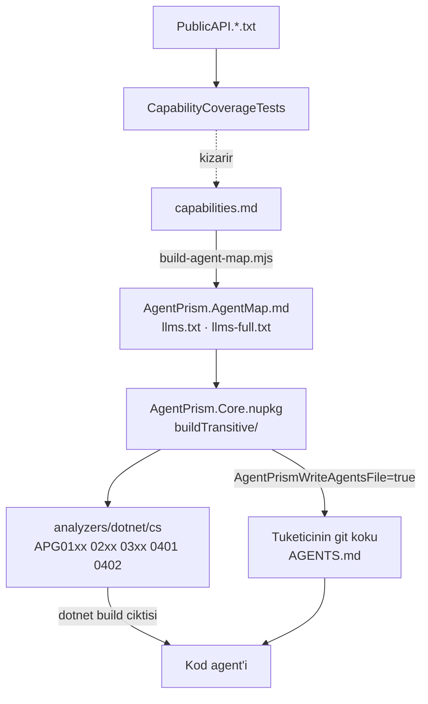

# 29 — Tüketici Agent Desteği (`AGD`)

> **Alan kodu:** `AGD` · **Faz:** 73
> **Kaynak:** `src/AgentPrism.Generators/{AgentPrismUsageAnalyzer,UsageDiagnostics}.cs` ·
> `src/AgentPrism.Core/buildTransitive/{AgentPrism.Core.targets,AgentPrism.AgentMap.md}` ·
> `src/AgentPrism.Templates/content/AgentPrism.Starter/AgentPrism.Starter.csproj` ·
> `docs-site/scripts/build-agent-map.mjs` · `docs-site/src/content/docs/capabilities.md` ·
> `tests/AgentPrism.Core.UnitTests/Architecture/CapabilityCoverageTests.cs`
>
> Ortam kurulumu ve reset yordamı [`00-INDEKS.md`](00-INDEKS.md)'dedir.

---

## Bu dosya neyi kanıtlar

AgentPrism'i tüketen bir uygulamanın **kod agent'ı** pakete hâkim değildir.
Bu alan iki kanalın gerçekten çalıştığını kanıtlar: derleme anında **tanılar**
(Katman 0) ve tüketicinin git köküne yazılan **yetenek haritası** (Katman 1).
Üçüncü iddia, ikisinin kod ile hizada kalmasıdır — kapılar.



## Koşmadan önce

1. Depo paketlenir ve yerel besleme hazırlanır:
   ```bash
   cd /Users/farukatasoy/Desktop/projects/AgentPrism
   dotnet pack AgentPrism.src.slnf -c Release
   export APVER=$(ls -t artifacts/package/release/AgentPrism.0.0.0*.nupkg | head -1 | sed -E 's/.*AgentPrism\.(0\.0\.0[^ ]*)\.nupkg/\1/')
   echo $APVER
   ```
2. Boş bir tüketici dizini açılır (her case kendi dizininde koşar):
   ```bash
   export APC=$(mktemp -d)/tuketici && mkdir -p $APC/src/Consumer && cd $APC && git init -q .
   cat > NuGet.config <<'EOF'
   <?xml version="1.0" encoding="utf-8"?>
   <configuration>
     <packageSources>
       <clear />
       <add key="nuget.org" value="https://api.nuget.org/v3/index.json" />
       <add key="agentprism-local" value="/Users/farukatasoy/Desktop/projects/AgentPrism/artifacts/package/release" />
     </packageSources>
   </configuration>
   EOF
   ```
3. `Consumer.csproj` `Microsoft.NET.Sdk.Web` kullanır, `net10.0` hedefler ve
   `AgentPrism` meta paketini `$APVER` sürümüyle referanslar. Meta paket
   **bilerek** seçilir: `buildTransitive/` geçişli referansta akmak zorundadır.
4. `AGENTS.md` bu dosyada tüketicinin **git kökünde** aranır; `$APC/AGENTS.md`.

---

## Case'ler

### MT-AGD-001 — Özellik kapalıyken hiçbir dosya yazılmaz

**Ön koşul:** §2'nin tüketici projesi, `AgentPrismWriteAgentsFile` **yazılmamış**.

**Adımlar:**
1. `dotnet build src/Consumer/Consumer.csproj -c Release`
2. `test -f $APC/AGENTS.md; echo $?`

**Beklenen sonuç:** Derleme başarılı. Adım 2 `1` döner — dosya **oluşmaz**.
K1 (sıfır sürpriz) korunur: paket referanslamak tek başına tüketicinin
deposuna dosya yazmaz.

---

### MT-AGD-002 — Özellik açıkken harita git köküne yazılır

**Ön koşul:** `Consumer.csproj`'a
`<AgentPrismWriteAgentsFile>true</AgentPrismWriteAgentsFile>` eklenmiş.

**Adımlar:**
1. `dotnet build src/Consumer/Consumer.csproj -c Release`
2. `head -1 $APC/AGENTS.md`
3. `wc -c $APC/AGENTS.md`

**Beklenen sonuç:** Dosya **proje dizinine değil git köküne** yazılır. İlk satır
`<!-- AgentPrism agent map · revision: <8 onaltılık> · generated by ... -->`
biçimindedir. Boyut **≤ 10240 bayt**. İçerik paket listesi, zorunlu bağlama,
yetenek listesi ve "şuna bak" adreslerini taşır.

---

### MT-AGD-003 — Var olan `AGENTS.md` asla ezilmez

**Ön koşul:** MT-AGD-002 koşuldu, dosya var.

**Adımlar:**
1. `printf '\n## Ev kurallari\n\nCommit oncesi testleri kostur.\n' >> $APC/AGENTS.md`
2. `md5 $APC/AGENTS.md` (Linux: `md5sum`)
3. `dotnet build src/Consumer/Consumer.csproj -c Release -t:Rebuild`
4. `md5 $APC/AGENTS.md`

**Beklenen sonuç:** Adım 2 ve 4 **aynı** özeti verir. Elle eklenen bölüm korunur;
build dosyaya dokunmaz.

---

### MT-AGD-004 — Git kökü yoksa target çökmez

**Ön koşul:** `.git` **içermeyen** bir dizinde aynı tüketici projesi
(`export APN=$(mktemp -d)` ile yeni dizin, `git init` **yapılmaz**).

**Adımlar:**
1. `dotnet build src/Consumer/Consumer.csproj -c Release`

**Beklenen sonuç:** Derleme başarılı. Çıktıda
`AgentPrism: no repository root was found above ...` mesajı görünür ve
`AGENTS.md` **proje dizininde** oluşur. Hata yoktur.

---

### MT-AGD-005 — Çok projeli tek build tek dosya bırakır

**Ön koşul:** Aynı git kökünde iki tüketici projesi (`src/First`, `src/Second`),
ikisi de özelliği açar; `dotnet new sln -n Both` ile bir çözüme eklenmiş.

**Adımlar:**
1. `dotnet build Both.sln -c Release`
2. `find $APC -name AGENTS.md`

**Beklenen sonuç:** Derleme başarılı, **tek** `AGENTS.md` (git kökünde). Yarış
zararsızdır: dosya varsa target yazmaz.

---

### MT-AGD-006 — `dotnet new agentprism-api` haritayı kendiliğinden getirir

**Ön koşul:** Şablon kurulu (`dotnet new install src/AgentPrism.Templates`),
boş bir git deposu.

**Adımlar:**
1. `dotnet new agentprism-api -n Ornek -o src/Ornek --AgentPrismVersion $APVER`
2. `dotnet build src/Ornek -c Release`
3. `test -f AGENTS.md; echo $?`

**Beklenen sonuç:** Adım 3 `0` döner. Şablon özelliği kendisi açar; geliştirici
hiçbir şey yapmaz. Derleme **sıfır uyarı** verir — şablonun kendi kodu hiçbir
`APG` tanısı tetiklemez.

---

### MT-AGD-007 — `APG0101`: mapping var, kayıt yok

**Ön koşul:** `Program.cs` yalnız `app.MapAgentPrism();` çağırır,
`AddAgentPrism()` **hiç** çağrılmaz.

**Adımlar:**
1. `dotnet build src/Consumer/Consumer.csproj -c Release -t:Rebuild`

**Beklenen sonuç:** `warning APG0101` çıkar ve mesaj eksik çağrıyı adıyla
(`AddAgentPrism()`) yazar. Yardım bağlantısı
`.../capabilities/#integration-surfaces` adresine gider.

---

### MT-AGD-008 — `APG0102`: bağlanan sağlayıcı kayıtlı değil

**Ön koşul:** Bir `AgentDefinition` içinde
`Model = new ModelBinding { Provider = "anthropic", ... }`, ve derlemede
`UseAnthropic()` **yok**.

**Adımlar:**
1. `dotnet build src/Consumer/Consumer.csproj -c Release -t:Rebuild`
2. Aynı derlemeye `agentPrism.AddModelProvider(...)` eklenir, tekrar derlenir.

**Beklenen sonuç:** Adım 1 `warning APG0102` verir ve hem sağlayıcı adını
(`anthropic`) hem çağrıyı (`UseAnthropic()`) yazar. Adım 2 **sessizdir** —
tüketici sağlayıcısı her adı karşılayabilir.

---

### MT-AGD-009 — `APG0201`: tanıma düz `secret` yazıldı

**Ön koşul:** `McpServerDefinition` içinde
`AuthorizationConfigurationKey = "ghp_<36 karakter>"`.

**Adımlar:**
1. `dotnet build src/Consumer/Consumer.csproj -c Release -t:Rebuild`
2. Değer `"AgentPrism:McpSecrets:GithubToken"` ile değiştirilir, tekrar derlenir.

**Beklenen sonuç:** Adım 1 `warning APG0201` verir ve hedefi
`McpServerDefinition.AuthorizationConfigurationKey` olarak adıyla söyler.
Adım 2 sessizdir. K-059'un derleme anındaki karşılığıdır.

---

### MT-AGD-010 — `APG0301` ve `APG0302`: elle yazılmış yerine koyma

**Ön koşul:** Derlemede (a) `DelegatingChatClient` türeten ve içinde
`Task.Delay` ile döngü kuran bir sınıf, (b) `DelegatingAIAgent` türeten bir
sarmalayıcı — ve **hiçbir** `IAgentDecorator` uygulaması.

**Adımlar:**
1. `dotnet build src/Consumer/Consumer.csproj -c Release -t:Rebuild`
2. Derlemeye bir `IAgentDecorator` uygulaması eklenir, tekrar derlenir.

**Beklenen sonuç:** Adım 1 `warning APG0301` ve `warning APG0302` verir.
Adım 2'de **APG0302 susar** — sarmalayıcı bir kusur değildir, dekoratörsüz
sarmalayıcı kusurdur. APG0301 sürmeye devam eder.

---

### MT-AGD-011 — `APG0401`: harita bayat

**Ön koşul:** Git kökünde sürüm işareti kurulu paketten farklı bir `AGENTS.md`:
```bash
printf '<!-- AgentPrism agent map · revision: 00000000 · generated by docs-site/scripts/build-agent-map.mjs -->\n# AgentPrism\n' > $APC/AGENTS.md
```

**Adımlar:**
1. `dotnet build src/Consumer/Consumer.csproj -c Release -t:Rebuild`
2. `rm $APC/AGENTS.md && dotnet build src/Consumer/Consumer.csproj -c Release -t:Rebuild`

**Beklenen sonuç:** Adım 1 `warning APG0401` verir; mesaj iki sürüm işaretini de
yazar ve yenileme yolunu (sil, yeniden derle) söyler. Adım 2 dosyayı yeniden
yazar ve tanı **susar**.

Elle yazılmış, işaret taşımayan bir `AGENTS.md` **bayat** sayılmaz — bayatlık
yalnız bu paketin ürettiği bir dosyanın sorunudur. Doğrulamak için dosyayı
`# Ev kurallari` ile değiştirip tekrar derleyin: `APG0401` çıkmaz. Böyle bir
dosya için sorulan soru başkadır (`APG0402`, yerel referansı adıyla anıyor mu) ve
[`30-YEREL-REFERANS.md`](30-YEREL-REFERANS.md) `MT-YRF-021`'dedir.

---

### MT-AGD-012 — Tek özellik tüm aileyi susturur

**Ön koşul:** MT-AGD-010'un tüketicisi (tanılar çıkıyor).

**Adımlar:**
1. `dotnet build src/Consumer/Consumer.csproj -c Release -t:Rebuild -p:AgentPrismUsageDiagnostics=false`

**Beklenen sonuç:** Çıktıda **hiçbir** `APG01xx`/`APG02xx`/`APG03xx`/`APG0401`/
`APG0402` yoktur. `AgentPrism.Tools` ailesi (APG0001–0007) etkilenmez — o tanılar
gerçek derleme hatalarıdır ve bu anahtar onları kapsamaz.

> `APG0401` ile `APG0402` birbirini dışlar, bu yüzden ikisini tek koşumda birden
> görmek mümkün değildir; ailenin **tamamının** sustuğunu iki `AGENTS.md` biçimiyle
> ölçen case [`30-YEREL-REFERANS.md`](30-YEREL-REFERANS.md) `MT-YRF-023`'tür.

---

### MT-AGD-013 — Kapı: harita kod ile hizasını kaybederse test kızarır

**Ön koşul:** Depo kökü.

**Adımlar:**
1. `docs-site/src/content/docs/capabilities.md` içinden bir `Use*` çağrısının
   adı silinir (ör. `UseVoice()` → `speech contracts`).
2. `dotnet test tests/AgentPrism.Core.UnitTests -c Release`
3. Değişiklik geri alınır.

**Beklenen sonuç:** Adım 2 `CapabilityCoverageTests` ile kızarır ve üyeyi
**adıyla** söyler (`+ UseVoice: a registration entry point that the capability
map never names`). Aynı test, `PublicAPI.*.txt`'ye yeni bir `Use*` eklenip
harita güncellenmediğinde de kızarır.

---

### MT-AGD-014 — Kapı: üretilen harita commit'ten saparsa denetim kızarır

**Ön koşul:** Depo kökü, `docs-site` bağımlılıkları kurulu (`npm ci`).

**Adımlar:**
1. `printf '\n- bayat satir\n' >> src/AgentPrism.Core/buildTransitive/AgentPrism.AgentMap.md`
2. `cd docs-site && node scripts/check-content.mjs; echo $?`
3. `node scripts/build-agent-map.mjs && node scripts/check-content.mjs`

**Beklenen sonuç:** Adım 2 `1` döner ve dosyayı adıyla söyleyip üreteci koşmayı
yazar. Adım 3 temizdir. Aynı denetim `llms.txt`, `llms-full.txt` ve 10 KB
bütçesi için de koşar.

---

### MT-AGD-015 — `llms.txt` siteden erişilebilir

**Ön koşul:** `cd docs-site && npm run build`.

**Adımlar:**
1. `head -1 dist/llms.txt`
2. `wc -c dist/llms.txt dist/llms-full.txt`

**Beklenen sonuç:** İki dosya da yayınlanan sitede kök altındadır. `llms.txt`
sürüm işaretiyle başlar ve ≤ 10240 bayttır; `llms-full.txt` elle yazılmış
sayfaların tamamını taşır (~350 KB) ve üretilen API/HTTP referansını
**taşımaz**.
