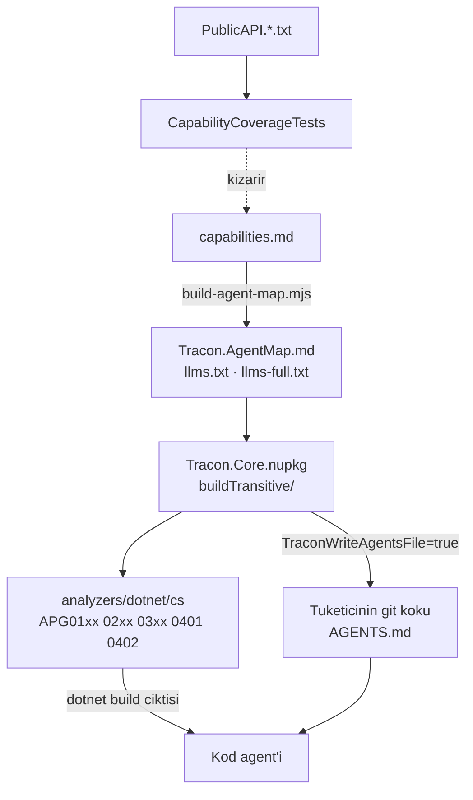

# 29 — Tüketici Agent Desteği (`AGD`)

> **Alan kodu:** `AGD` · **Faz:** 73, 85 (gömme ekseni: `guides/embedding.md`, `samples/Tracon.Embedded`)
> **Kaynak:** `src/Tracon.Generators/{TraconUsageAnalyzer,UsageDiagnostics}.cs` ·
> `src/Tracon.Core/buildTransitive/{Tracon.Core.targets,Tracon.AgentMap.md}` ·
> `src/Tracon.Templates/content/Tracon.Starter/Tracon.Starter.csproj` ·
> `docs-site/scripts/build-agent-map.mjs` · `docs-site/src/content/docs/capabilities.md` ·
> `docs-site/src/content/docs/guides/embedding.md` · `samples/Tracon.Embedded/` ·
> `tests/Tracon.Core.UnitTests/Architecture/CapabilityCoverageTests.cs`
>
> Ortam kurulumu ve reset yordamı [`00-INDEKS.md`](00-INDEKS.md)'dedir.

---

## Bu dosya neyi kanıtlar

Tracon'i tüketen bir uygulamanın **kod agent'ı** pakete hâkim değildir.
Bu alan iki kanalın gerçekten çalıştığını kanıtlar: derleme anında **tanılar**
(Katman 0) ve tüketicinin git köküne yazılan **yetenek haritası** (Katman 1).
Üçüncü iddia, ikisinin kod ile hizada kalmasıdır — kapılar.



## Koşmadan önce

1. Depo paketlenir ve yerel besleme hazırlanır:
   ```bash
   cd /Users/farukatasoy/Desktop/projects/Tracon
   dotnet pack Tracon.src.slnf -c Release
   export APVER=$(ls -t artifacts/package/release/Tracon.0.0.0*.nupkg | head -1 | sed -E 's/.*Tracon\.(0\.0\.0[^ ]*)\.nupkg/\1/')
   echo $APVER
   ```
2. Boş bir tüketici dizini açılır (her case kendi dizininde koşar):
   ```bash
   export APC=$(mktemp -d)/tuketici && mkdir -p $APC/src/Consumer && cd $APC && git init -q .
   cat > NuGet.config <<'EOF'
   <?xml version="1.0" encoding="utf-8"?>
   <configuration>
     <packageSources>
       <clear />
       <add key="nuget.org" value="https://api.nuget.org/v3/index.json" />
       <add key="tracon-local" value="/Users/farukatasoy/Desktop/projects/Tracon/artifacts/package/release" />
     </packageSources>
   </configuration>
   EOF
   ```
3. `Consumer.csproj` `Microsoft.NET.Sdk.Web` kullanır, `net10.0` hedefler ve
   `Tracon` meta paketini `$APVER` sürümüyle referanslar. Meta paket
   **bilerek** seçilir: `buildTransitive/` geçişli referansta akmak zorundadır.
4. `AGENTS.md` bu dosyada tüketicinin **git kökünde** aranır; `$APC/AGENTS.md`.

---

## Case'ler

### MT-AGD-001 — Özellik kapalıyken hiçbir dosya yazılmaz

**Ön koşul:** §2'nin tüketici projesi, `TraconWriteAgentsFile` **yazılmamış**.

**Adımlar:**
1. `dotnet build src/Consumer/Consumer.csproj -c Release`
2. `test -f $APC/AGENTS.md; echo $?`

**Beklenen sonuç:** Derleme başarılı. Adım 2 `1` döner — dosya **oluşmaz**.
K1 (sıfır sürpriz) korunur: paket referanslamak tek başına tüketicinin
deposuna dosya yazmaz.

---

### MT-AGD-002 — Özellik açıkken harita git köküne yazılır

**Ön koşul:** `Consumer.csproj`'a
`<TraconWriteAgentsFile>true</TraconWriteAgentsFile>` eklenmiş.

**Adımlar:**
1. `dotnet build src/Consumer/Consumer.csproj -c Release`
2. `head -1 $APC/AGENTS.md`
3. `wc -c $APC/AGENTS.md`

**Beklenen sonuç:** Dosya **proje dizinine değil git köküne** yazılır. İlk satır
`<!-- Tracon agent map · revision: <8 onaltılık> · generated by ... -->`
biçimindedir. Boyut, `build-agent-map.mjs`'in `agentMapBudgetBytes` sabitini aşmaz (**Faz 153'ten beri 11264 bayt**; sayı tek kaynaktan okunur, buraya kopyalanmaz). İçerik paket listesi, zorunlu bağlama,
yetenek listesi ve "şuna bak" adreslerini taşır.

---

### MT-AGD-003 — Var olan `AGENTS.md` asla ezilmez

**Ön koşul:** MT-AGD-002 koşuldu, dosya var.

**Adımlar:**
1. `printf '\n## Ev kurallari\n\nCommit oncesi testleri kostur.\n' >> $APC/AGENTS.md`
2. `md5 $APC/AGENTS.md` (Linux: `md5sum`)
3. `dotnet build src/Consumer/Consumer.csproj -c Release -t:Rebuild`
4. `md5 $APC/AGENTS.md`

**Beklenen sonuç:** Adım 2 ve 4 **aynı** özeti verir. Elle eklenen bölüm korunur;
build dosyaya dokunmaz.

---

### MT-AGD-004 — Git kökü yoksa target çökmez

**Ön koşul:** `.git` **içermeyen** bir dizinde aynı tüketici projesi
(`export APN=$(mktemp -d)` ile yeni dizin, `git init` **yapılmaz**).

**Adımlar:**
1. `dotnet build src/Consumer/Consumer.csproj -c Release`

**Beklenen sonuç:** Derleme başarılı. Çıktıda
`Tracon: no repository root was found above ...` mesajı görünür ve
`AGENTS.md` **proje dizininde** oluşur. Hata yoktur.

---

### MT-AGD-005 — Çok projeli tek build tek dosya bırakır

**Ön koşul:** Aynı git kökünde iki tüketici projesi (`src/First`, `src/Second`),
ikisi de özelliği açar; `dotnet new sln -n Both` ile bir çözüme eklenmiş.

**Adımlar:**
1. `dotnet build Both.sln -c Release`
2. `find $APC -name AGENTS.md`

**Beklenen sonuç:** Derleme başarılı, **tek** `AGENTS.md` (git kökünde). Yarış
zararsızdır: dosya varsa target yazmaz.

---

### MT-AGD-006 — `dotnet new tracon-api` haritayı kendiliğinden getirir

**Ön koşul:** Şablon kurulu (`dotnet new install src/Tracon.Templates`),
boş bir git deposu.

**Adımlar:**
1. `dotnet new tracon-api -n Ornek -o src/Ornek --TraconVersion $APVER`
2. `dotnet build src/Ornek -c Release`
3. `test -f AGENTS.md; echo $?`

**Beklenen sonuç:** Adım 3 `0` döner. Şablon özelliği kendisi açar; geliştirici
hiçbir şey yapmaz. Derleme **sıfır uyarı** verir — şablonun kendi kodu hiçbir
`APG` tanısı tetiklemez.

---

### MT-AGD-007 — `TRC0101`: mapping var, kayıt yok

**Ön koşul:** `Program.cs` yalnız `app.MapTracon();` çağırır,
`AddTracon()` **hiç** çağrılmaz.

**Adımlar:**
1. `dotnet build src/Consumer/Consumer.csproj -c Release -t:Rebuild`

**Beklenen sonuç:** `warning TRC0101` çıkar ve mesaj eksik çağrıyı adıyla
(`AddTracon()`) yazar. Yardım bağlantısı
`.../capabilities/#integration-surfaces` adresine gider.

---

### MT-AGD-008 — `TRC0102`: bağlanan sağlayıcı kayıtlı değil

**Ön koşul:** Bir `AgentDefinition` içinde
`Model = new ModelBinding { Provider = "anthropic", ... }`, ve derlemede
`UseAnthropic()` **yok**.

**Adımlar:**
1. `dotnet build src/Consumer/Consumer.csproj -c Release -t:Rebuild`
2. Aynı derlemeye `tracon.AddModelProvider(...)` eklenir, tekrar derlenir.

**Beklenen sonuç:** Adım 1 `warning TRC0102` verir ve hem sağlayıcı adını
(`anthropic`) hem çağrıyı (`UseAnthropic()`) yazar. Adım 2 **sessizdir** —
tüketici sağlayıcısı her adı karşılayabilir.

---

### MT-AGD-009 — `TRC0201`: tanıma düz `secret` yazıldı

**Ön koşul:** `McpServerDefinition` içinde
`AuthorizationConfigurationKey = "ghp_<36 karakter>"`.

**Adımlar:**
1. `dotnet build src/Consumer/Consumer.csproj -c Release -t:Rebuild`
2. Değer `"Tracon:McpSecrets:GithubToken"` ile değiştirilir, tekrar derlenir.

**Beklenen sonuç:** Adım 1 `warning TRC0201` verir ve hedefi
`McpServerDefinition.AuthorizationConfigurationKey` olarak adıyla söyler.
Adım 2 sessizdir. K-059'un derleme anındaki karşılığıdır.

---

### MT-AGD-010 — `TRC0301` ve `TRC0302`: elle yazılmış yerine koyma

**Ön koşul:** Derlemede (a) `DelegatingChatClient` türeten ve içinde
`Task.Delay` ile döngü kuran bir sınıf, (b) `DelegatingAIAgent` türeten bir
sarmalayıcı — ve **hiçbir** `IAgentDecorator` uygulaması.

**Adımlar:**
1. `dotnet build src/Consumer/Consumer.csproj -c Release -t:Rebuild`
2. Derlemeye bir `IAgentDecorator` uygulaması eklenir, tekrar derlenir.

**Beklenen sonuç:** Adım 1 `warning TRC0301` ve `warning TRC0302` verir.
Adım 2'de **TRC0302 susar** — sarmalayıcı bir kusur değildir, dekoratörsüz
sarmalayıcı kusurdur. TRC0301 sürmeye devam eder.

---

### MT-AGD-011 — `TRC0401`: harita bayat

**Ön koşul:** Git kökünde sürüm işareti kurulu paketten farklı bir `AGENTS.md`:
```bash
printf '<!-- Tracon agent map · revision: 00000000 · generated by docs-site/scripts/build-agent-map.mjs -->\n# Tracon\n' > $APC/AGENTS.md
```

**Adımlar:**
1. `dotnet build src/Consumer/Consumer.csproj -c Release -t:Rebuild`
2. `rm $APC/AGENTS.md && dotnet build src/Consumer/Consumer.csproj -c Release -t:Rebuild`

**Beklenen sonuç:** Adım 1 `warning TRC0401` verir; mesaj iki sürüm işaretini de
yazar ve yenileme yolunu (sil, yeniden derle) söyler. Adım 2 dosyayı yeniden
yazar ve tanı **susar**.

Elle yazılmış, işaret taşımayan bir `AGENTS.md` **bayat** sayılmaz — bayatlık
yalnız bu paketin ürettiği bir dosyanın sorunudur. Doğrulamak için dosyayı
`# Ev kurallari` ile değiştirip tekrar derleyin: `TRC0401` çıkmaz. Böyle bir
dosya için sorulan soru başkadır (`TRC0402`, yerel referansı adıyla anıyor mu) ve
[`30-YEREL-REFERANS.md`](30-YEREL-REFERANS.md) `MT-YRF-021`'dedir.

---

### MT-AGD-012 — Tek özellik tüm aileyi susturur

**Ön koşul:** MT-AGD-010'un tüketicisi (tanılar çıkıyor).

**Adımlar:**
1. `dotnet build src/Consumer/Consumer.csproj -c Release -t:Rebuild -p:TraconUsageDiagnostics=false`

**Beklenen sonuç:** Çıktıda **hiçbir** `APG01xx`/`APG02xx`/`APG03xx`/`TRC0401`/
`TRC0402` yoktur. `Tracon.Tools` ailesi (TRC0001–0007) etkilenmez — o tanılar
gerçek derleme hatalarıdır ve bu anahtar onları kapsamaz.

> `TRC0401` ile `TRC0402` birbirini dışlar, bu yüzden ikisini tek koşumda birden
> görmek mümkün değildir; ailenin **tamamının** sustuğunu iki `AGENTS.md` biçimiyle
> ölçen case [`30-YEREL-REFERANS.md`](30-YEREL-REFERANS.md) `MT-YRF-023`'tür.

---

### MT-AGD-013 — Kapı: harita kod ile hizasını kaybederse test kızarır

**Ön koşul:** Depo kökü.

**Adımlar:**
1. `docs-site/src/content/docs/capabilities.md` içinden bir `Use*` çağrısının
   adı silinir (ör. `UseVoice()` → `speech contracts`).
2. `dotnet test tests/Tracon.Core.UnitTests -c Release`
3. Değişiklik geri alınır.

**Beklenen sonuç:** Adım 2 `CapabilityCoverageTests` ile kızarır ve üyeyi
**adıyla** söyler (`+ UseVoice: a registration entry point that the capability
map never names`). Aynı test, `PublicAPI.*.txt`'ye yeni bir `Use*` eklenip
harita güncellenmediğinde de kızarır.

---

### MT-AGD-014 — Kapı: üretilen harita commit'ten saparsa denetim kızarır

**Ön koşul:** Depo kökü, `docs-site` bağımlılıkları kurulu (`npm ci`).

**Adımlar:**
1. `printf '\n- bayat satir\n' >> src/Tracon.Core/buildTransitive/Tracon.AgentMap.md`
2. `cd docs-site && node scripts/check-content.mjs; echo $?`
3. `node scripts/build-agent-map.mjs && node scripts/check-content.mjs`

**Beklenen sonuç:** Adım 2 `1` döner ve dosyayı adıyla söyleyip üreteci koşmayı
yazar. Adım 3 temizdir. Aynı denetim `llms.txt`, `llms-full.txt` ve 10 KB
bütçesi için de koşar.

---

### MT-AGD-015 — `llms.txt` siteden erişilebilir

**Ön koşul:** `cd docs-site && npm run build`.

**Adımlar:**
1. `head -1 dist/llms.txt`
2. `wc -c dist/llms.txt dist/llms-full.txt`

**Beklenen sonuç:** İki dosya da yayınlanan sitede kök altındadır. `llms.txt`
sürüm işaretiyle başlar ve `agentMapBudgetBytes`'ı aşmaz; `llms-full.txt` elle yazılmış
sayfaların tamamını taşır (~350 KB) ve üretilen API/HTTP referansını
**taşımaz**.

---

### MT-AGD-016 — Gömme ekseni haritada — Faz 85

**Ön koşul:** `node docs-site/scripts/build-agent-map.mjs`.

**Adımlar:**
1. `grep -n "Embedding points" -A 7 src/Tracon.Core/buildTransitive/Tracon.AgentMap.md`
2. `wc -c src/Tracon.Core/buildTransitive/Tracon.AgentMap.md`

**Beklenen sonuç:** `### Embedding points` bölümü beş satır (`ITenantContext`,
`IRunAttributionContext`, `IToolAuthorizationHandler`, `IRunEventSink`,
`IAttachmentStorage`) ve bir `- Rule:` satırı taşır. Dosya toplamı **10 240
bayt**'ı aşmaz.

---

### MT-AGD-017 — Gömme sayfası `llms.txt` sayfa indeksinde — Faz 85

**Ön koşul:** `cd docs-site && npm run build`.

**Adımlar:**
1. `grep -n "Embedding into a host application" dist/llms.txt`

**Beklenen sonuç:** Bir satır döner — köşeli parantez içinde `Embedding into a
host application` başlığı, ardından siteye giden bağlantı ve
`description` metni. Satır kesilmez — sayfanın `title`/`description`
alanları eksiksizdir.

---

### MT-AGD-018 — 👤 Gömme sayfası bir kod agent'ına sorulmadan yeterli — Faz 85

**Ön koşul:** Yayımlanmış `guides/embedding.md` sayfasının URL'i veya ham
metni bir kod agent'ına verilir; agent'a "Tracon'i mevcut bir ASP.NET
Core uygulamasına göm; kendi tenant, kullanıcı, tool yetkilendirme, run
event ve attachment depolama sistemlerimi bağla" denir. `samples/Tracon.Embedded`
agent'a **gösterilmez**.

**Adımlar:**
1. Agent'ın ürettiği kodu oku.

**Beklenen sonuç:** Agent beş noktayı da (`ITenantContext`/`ITenantStore`,
`IRunAttributionContext`, `IToolAuthorizationHandler`, `IRunEventSink`,
`IAttachmentStorage`) soru sormadan bulur ve `AddTracon()`'den **önce**
kaydeder. Bu kalemin ölçülen boşluğu tam olarak budur — 2026-08-21 ölçümünde
hiçbir sayfa bu beşini birlikte anlatmıyordu.

---

### MT-AGD-019 — Arka plan işi kendi kiracısıyla kapanır — Faz 85

> Otomatik eşdeğeri koşuldu ve yeşildir:
> `tests/Tracon.Embedded.Tests/EmbeddedSampleTests.cs`,
> `Background_job_with_no_HTTP_request_carries_tenant_and_user_through_the_run`.
> Bu case, gerçek `dotnet run` altında elle tekrarıdır.

**Ön koşul:** `samples/Tracon.Embedded` ayakta.

**Adımlar:**
1. HTTP isteği OLMADAN çalışacak bir işi kuyruğa al.
2. Koşu kaydını oku.

**Girilecek veri**
```bash
curl -s -X POST http://localhost:5082/jobs \
  -H 'Content-Type: application/json' \
  -d '{"tenantId":"acme","userId":"user-42","message":"What is my account balance?"}'

sleep 1
curl -s -H 'X-Host-Tenant: acme' http://localhost:5082/tracon/api/runs | jq '.[0] | {tenantId, userId, status}'
```

**Beklenen sonuç:** `{"tenantId": "acme", "userId": "user-42", "status": "Completed"}`.
İsteğin kendisinde `X-Host-Tenant`/`X-Host-User` başlığı YOKTUR — kimlik
`AmbientTenantScope`/`AmbientRunAttributionScope` üzerinden, `Jobs/EmbeddedJobWorker.cs`'in
kendi gövdesinde açılan `using` blokları ile akıyor.

**Ek doğrulama — `TraconRunContext.Current`:** aynı koşunun olay akışını oku:
```bash
RUN_ID=$(curl -s -H 'X-Host-Tenant: acme' http://localhost:5082/tracon/api/runs | jq -r '.[0].id')
curl -s -H 'X-Host-Tenant: acme' "http://localhost:5082/tracon/api/runs/$RUN_ID/events" \
  | grep -A1 "tool.invoked"
```
`payload` alanı `tenant=acme run=<RUN_ID> session=(none)` yazar —
`Tools.cs`'teki `current_account` tool'u kimliği yalnızca
`TraconRunContext.Current`'tan okur, bir parametre olarak almaz; yanlış
kiracı/run adı burada çıkardı.

---

### MT-AGD-020 — Event bridge doldurulunca DÜŞÜRÜR, koşuyu yavaşlatmaz — Faz 85

> Otomatik eşdeğeri koşuldu ve yeşildir:
> `tests/Tracon.Embedded.Tests/EmbeddedSampleTests.cs`,
> `Event_bridge_drops_under_backpressure_without_slowing_the_run`.

**Ön koşul:** `samples/Tracon.Embedded` ayakta.

**Adımlar:**
1. Kısa sürede birden çok iş kuyruğa alınır (8 öğelik kanalı taşırmak için).
2. Köprü sayaçları okunur.

**Girilecek veri**
```bash
for i in $(seq 1 10); do
  curl -s -X POST http://localhost:5082/jobs \
    -H 'Content-Type: application/json' \
    -d "{\"tenantId\":\"acme\",\"message\":\"request $i\"}" > /dev/null
done
sleep 1
curl -s http://localhost:5082/jobs/bridge-state
```

**Beklenen sonuç:** `dropped` sıfırdan büyüktür. Bütün koşular yine de
**tamamlandı** durumundadır (`GET /tracon/api/runs`) ve `startedAt`/`completedAt`
farkı ~1 sn'nin altındadır — köprünün dolması modelin/koşunun hızını
**etkilememiştir**. Uygulama loglarında `BoundedChannelRunEventSink`'in
"dropped" uyarı satırları görünür.

---

### MT-AGD-021 — `TRC0501`/`TRC0502` gerçek tüketici derlemesinde öter — Faz 93

> Otomatik eşdeğeri koşuldu ve yeşildir:
> `tests/Tracon.Generators.UnitTests/UsageAnalyzerTests.cs` (`TRC0501_*`, `TRC0502_*`).
> Bu case, sentetik derleme yerine **gerçek paket dağıtım yolunu**
> (`analyzers/dotnet/cs/`) kanıtlar.

**Ön koşul:** §2'nin tüketici projesi.

**Adımlar:**
1. `src/Consumer/Program.cs`'e aşağıdaki metodu ekle (döngü dışında yazan,
   döngü içinde tekrarlamayan `async IAsyncEnumerable`):
   ```csharp
   using Tracon;
   using System.Collections.Generic;
   using System.Runtime.CompilerServices;

   static class Streaming
   {
       public static async IAsyncEnumerable<int> BadAsync(
           IAsyncEnumerator<int> source,
           AgentRunScope scope,
           [EnumeratorCancellation] CancellationToken cancellationToken = default)
       {
           TraconRunContext.SetCurrent(scope);

           while (true)
           {
               if (!await source.MoveNextAsync())
               {
                   break;
               }

               yield return source.Current;
           }
       }
   }
   ```
2. `dotnet build src/Consumer/Consumer.csproj -c Release`
3. Yazımı döngü içine taşı (`TraconRunContext.SetCurrent(scope);` satırını
   `while` gövdesinin başına taşı, döngü dışındakini sil); tekrar build et.
4. `AmbientTenantScope.Begin("t1");` satırını `using` OLMADAN, ayrı bir statik
   metoda ekle; build et.
5. `Consumer.csproj`'a `<TraconUsageDiagnostics>false</TraconUsageDiagnostics>`
   ekle; build et.

**Beklenen sonuç:**
- Adım 2: `warning TRC0501` çıkar; mesaj `MoveNextAsync` öncesi tekrarı adlandırır.
- Adım 3: Uyarı **kaybolur**.
- Adım 4: `warning TRC0502` çıkar.
- Adım 5: İki uyarı da **çıkmaz**.

Gerçek koşum (2026-08-24, `Tracon 0.0.0-preview.0.340` yerel besleme,
`analyzers/dotnet/cs/` üzerinden): beş adım da beklenen sonucu verdi —
adım 2 `TRC0501`, adım 3 sessiz, adım 4 `TRC0502`, adım 5 sessiz.
