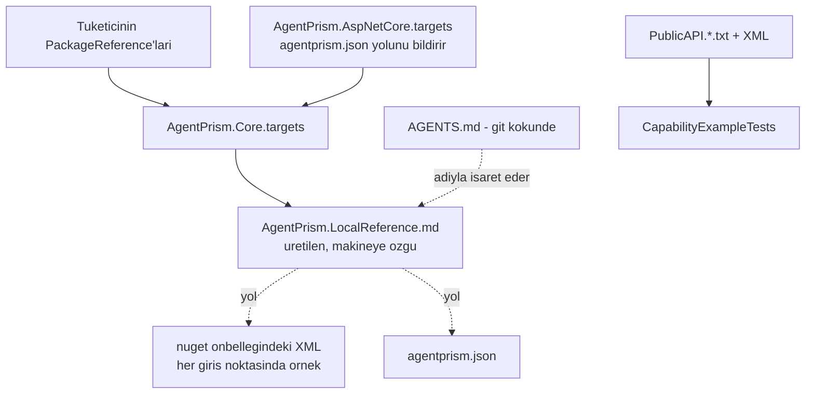

# 30 — Yerel Referans Yüzeyi (`YRF`)

> **Alan kodu:** `YRF` · **Faz:** 74
> **Kaynak:** `src/AgentPrism.Core/buildTransitive/AgentPrism.Core.targets` ·
> `src/AgentPrism.AspNetCore/buildTransitive/AgentPrism.AspNetCore.targets` ·
> `src/AgentPrism.AspNetCore/AgentPrism.AspNetCore.csproj` (`docs/openapi/agentprism.json` paketlemesi) ·
> `src/AgentPrism.Templates/content/AgentPrism.Starter/.gitignore` ·
> `docs-site/scripts/build-agent-map.mjs` · `docs-site/src/content/docs/capabilities.md` ·
> `tests/AgentPrism.Core.UnitTests/Architecture/{CapabilityEntryPoints,CapabilityExampleTests}.cs`
>
> Ortam kurulumu ve reset yordamı [`00-INDEKS.md`](00-INDEKS.md)'dedir.
> Bu alan [`29-AGENT-DESTEGI.md`](29-AGENT-DESTEGI.md)'nin üstüne kurulur; oradaki
> `AGENTS.md` davranışı burada tekrar edilmez.

---

## Bu dosya neyi kanıtlar

Faz 73 haritayı verdi: hangi yetenek var, hangi çağrı onu açar. Harita 39 giriş
noktasını **adlandırır**, hiçbirini **anlatmaz**. Bu alan ikinci sorunun
cevabının tüketicinin **kendi diskinde** olduğunu ve paketin oraya işaret
ettiğini kanıtlar.



## Koşmadan önce

1. Depo paketlenir ve yerel besleme hazırlanır:
   ```bash
   cd /Users/farukatasoy/Desktop/projects/AgentPrism
   dotnet pack AgentPrism.src.slnf -c Release
   export APVER=$(ls -t artifacts/package/release/AgentPrism.0.0.0*.nupkg | head -1 | sed -E 's/.*AgentPrism\.(0\.0\.0[^ ]*)\.nupkg/\1/')
   echo $APVER
   ```
2. 🚨 **Global NuGet önbelleği temizlenir.** MinVer sürümü commit'ler arasında
   sabittir; aynı sürümle yeniden paketlenen `.nupkg` **hiç açılmaz** ve
   `.targets` değişikliğin görünmez:
   ```bash
   rm -rf ~/.nuget/packages/agentprism*/$APVER
   ```
3. Boş bir tüketici dizini açılır (her case kendi dizininde koşabilir):
   ```bash
   export APC=$(mktemp -d)/tuketici && mkdir -p $APC/src/Consumer && cd $APC && git init -q .
   cat > NuGet.config <<'EOF'
   <?xml version="1.0" encoding="utf-8"?>
   <configuration>
     <packageSources>
       <clear />
       <add key="nuget.org" value="https://api.nuget.org/v3/index.json" />
       <add key="agentprism-local" value="/Users/farukatasoy/Desktop/projects/AgentPrism/artifacts/package/release" />
     </packageSources>
   </configuration>
   EOF
   ```
4. `Consumer.csproj` `Microsoft.NET.Sdk.Web` kullanır, `net10.0` hedefler ve
   `AgentPrism` meta paketini `$APVER` sürümüyle referanslar. Meta paket
   **bilerek** seçilir: `buildTransitive/` geçişli referansta akmak zorundadır.
5. 🚨 Referans dosyası **projenin yanında** aranır — `AGENTS.md`'nin aksine git
   kökünde **değil**: `$APC/src/Consumer/AgentPrism.LocalReference.md`. Sebep:
   bir çözümdeki iki proje farklı AgentPrism paketleri referanslar ve tek bir
   dosya bu iki cevabı birden taşıyamaz (Faz 74 denetim bulgusu 3).
   Kolaylık için: `export APLR=$APC/src/Consumer/AgentPrism.LocalReference.md`.

---

## Case'ler

### MT-YRF-001 — Özellik kapalıyken referans dosyası yazılmaz

**Ön koşul:** §3'ün tüketici projesi, hiçbir AgentPrism MSBuild özelliği yazılmamış.

**Adımlar:**
1. `dotnet build src/Consumer/Consumer.csproj -c Release`
2. `test -f $APLR; echo $?`

**Beklenen sonuç:** Derleme başarılı. Adım 2 `1` döner — dosya **oluşmaz**.
K1 (sıfır sürpriz): paket referanslamak tek başına tüketicinin deposuna dosya
yazmaz.

---

### MT-YRF-002 — Tek anahtar ikisini de açar ve her yol diskte vardır

**Ön koşul:** `Consumer.csproj`'a
`<AgentPrismWriteAgentsFile>true</AgentPrismWriteAgentsFile>` eklenmiş.
`AgentPrismWriteLocalReference` **yazılmamış**.

**Adımlar:**
1. `dotnet build src/Consumer/Consumer.csproj -c Release`
2. `head -8 $APLR`
3. `grep -o '/.*\.xml' $APLR | while read p; do test -f "$p" || echo "YOK: $p"; done`

**Beklenen sonuç:** Dosya **projenin yanında** oluşur (`AGENTS.md` git köküne,
bu dosya `src/Consumer/`'a). İlk satır `<!-- AgentPrism local reference -
regenerated on every build - machine-specific - do not commit -->`. Ayrı bir
`Installed version:` başlığı **yoktur**; sürüm her yolun içindedir — iki paket
farklı sürümde çözülürse tek bir başlık dürüst olamazdı. Adım 3 **hiçbir şey
yazmaz** — dosyadaki her XML yolu diskte vardır. İkinci özelliği yazmadan tek
anahtarın ikisini de açması benimseme engelini artırmaz.

---

### MT-YRF-003 — İşaret ettiği korpus gerçekten cevap verir

**Ön koşul:** MT-YRF-002 koşuldu.

**Adımlar:**
1. ```bash
   export APXML=$(grep -m1 -o '/.*AgentPrism\.Core\.xml' $APLR)
   grep -A 12 'AddToolApprovalPolicy' $APXML
   ```
2. `grep -A 14 'AddAgentPrism(Microsoft.Extensions.Hosting.IHostApplicationBuilder)' $APXML`

**Beklenen sonuç:** Her iki `grep` de `<summary>` **ve** `<example><code>` blokları
döndürür. Örnek, çalışan en kısa çağrıdır. Agent'ın "bu nasıl çağrılır?" sorusu
ağ erişimi olmadan cevaplanır.

---

### MT-YRF-004 — Önce adı bulan `grep` öğretilir

**Ön koşul:** MT-YRF-002 koşuldu.

**Adımlar:**
1. `sed -n '/## How to read them/,$p' $APLR`
2. Dosyadaki ilk reçeteyi olduğu gibi koştur:
   ```bash
   grep -o 'name="M:AgentPrism[^"]*Tenant[^"]*"' $APXML | head -5
   ```

**Beklenen sonuç:** Bölüm iki adımlı reçeteyi ve generic üyelerin arite eki
taşıdığı uyarısını yazar. Adım 2 gerçek üye kimlikleri döndürür. Ölçüm bu
sırayı gerektirdi: on detay sorgusunun ikisi ancak **ikinci** denemede
cevaplanmıştı, sebebi yanlış ad tahminiydi.

---

### MT-YRF-005 — Yalnız `AgentPrism.Core` referanslı projede HTTP bölümü yok

**Ön koşul:** Ayrı bir tüketici dizini; `Microsoft.NET.Sdk` (Web değil),
`PackageReference` **`AgentPrism.Core`**, `AgentPrismWriteAgentsFile=true`.

**Adımlar:**
1. `dotnet build -c Release`
2. `grep -c '## HTTP API document' AgentPrism.LocalReference.md`

**Beklenen sonuç:** Adım 2 tek bir `0` yazar (eşleşme yok). HTTP belgesi,
uçlarını sunan paketle gelir; onu referanslamayan tüketiciye ait olmayan bir
satır yazılmaz.

---

### MT-YRF-006 — `AgentPrism.AspNetCore` ile HTTP belgesi gelir ve okunur

**Ön koşul:** MT-YRF-002 koşuldu (meta paket AspNetCore'u getirir).

**Adımlar:**
1. ```bash
   export APOAS=$(sed -n '/## HTTP API document/,$p' $APLR | grep -m1 -o '/.*agentprism\.json')
   test -f $APOAS && echo VAR
   ```
2. ```bash
   python3 -c "import json,sys; d=json.load(open(sys.argv[1])); print(len(d['paths']), len(d['components']['schemas']))" $APOAS
   ```

**Beklenen sonuç:** Adım 1 `VAR` yazar. Adım 2 **123 path** ve **250 şema**
yazar. Bu case aynı anda üç şeyi kanıtlar: belge pakete girdi (`Remove`+`Include`
tuzağı aşıldı), `buildTransitive/AgentPrism.AspNetCore.targets` adı NuGet'in
kendiliğinden import ettiği sözleşmeye uyuyor, ve yazılan yol gerçek.

---

### MT-YRF-007 — `agentprism.json` gerçekten pakette

**Ön koşul:** §1 koşuldu.

**Adımlar:**
1. `unzip -l artifacts/package/release/AgentPrism.AspNetCore.$APVER.nupkg | grep buildTransitive`

**Beklenen sonuç:** İki satır: `buildTransitive/AgentPrism.AspNetCore.targets`
ve `buildTransitive/agentprism.json` (~515 KB). `<None Update=...>` sessizce
hiçbir şey yapardı; kanıt tek komuttur.

---

### MT-YRF-008 — İkinci build dosyaya dokunmaz

**Ön koşul:** MT-YRF-002 koşuldu.

**Adımlar:**
1. `stat -f %m $APLR` (Linux: `stat -c %Y`)
2. `dotnet build src/Consumer/Consumer.csproj -c Release -t:Rebuild`
3. `stat -f %m $APLR`

**Beklenen sonuç:** Adım 1 ve 3 **aynı** değeri verir. `WriteOnlyWhenDifferent`
değişmeyen dosyaya dokunmaz; `git status` ve dosya izleyicileri boşuna
kışkırtılmaz.

---

### MT-YRF-009 — İkinci özellik dosyayı tek başına kapatır

**Ön koşul:** `Consumer.csproj`'a `AgentPrismWriteAgentsFile=true` **ve**
`<AgentPrismWriteLocalReference>false</AgentPrismWriteLocalReference>` eklenmiş.
Önceki case'lerin çıktısı silinmiş: `rm -f $APC/AGENTS.md $APLR`.

**Adımlar:**
1. `dotnet build src/Consumer/Consumer.csproj -c Release -t:Rebuild`
2. `test -f $APC/AGENTS.md; echo $?`
3. `test -f $APLR; echo $?`

**Beklenen sonuç:** Adım 2 `0` (harita var), adım 3 `1` (referans dosyası yok).
İkinci özellik yalnız ayırmak isteyene lazımdır ve gerçekten ayırır.

---

### MT-YRF-010 — Yazılamayan dosya build'i kırmaz

**Ön koşul:** MT-YRF-002'nin projesi. Kaynak ağacı salt-okunur olacağı için
çıktı başka bir yere yönlendirilir; `dotnet restore` **önce**, ağaç hâlâ
yazılabilirken koşar.

**Adımlar:**
1. ```bash
   export APOUT=$(mktemp -d)
   dotnet restore $APC/src/Consumer/Consumer.csproj -p:UseArtifactsOutput=true -p:ArtifactsPath=$APOUT
   chmod -R a-w $APC/src/Consumer
   ```
2. `dotnet build $APC/src/Consumer/Consumer.csproj -c Release -p:UseArtifactsOutput=true -p:ArtifactsPath=$APOUT; echo "exit=$?"`
3. `chmod -R u+w $APC/src/Consumer`

**Beklenen sonuç:** Adım 2 `warning MSB3491: Could not write lines to file ...`
yazar ve **`exit=0`** ile biter; referans dosyası oluşmaz. Salt-okunur bir kaynak
ağacı yaygın bir CI mount'udur ve bir kolaylık dosyası tüketicinin derlemesini
kıramaz. `ContinueOnError="WarnAndContinue"` bunu sağlar.

> Otomatik karşılığı `LocalReferenceTests.A_write_that_cannot_succeed_only_warns`
> aynı garantiyi taşınabilir biçimde ölçer: dosyanın yerine bir **dizin** koyar.
> İzin semantiği platforma göre değişir, bu davranış değişmez.

---

### MT-YRF-011 — Eski `AGENTS.md` taşıyan tüketicide `APG0401` çıkar

**Ön koşul:** Faz 73'ten kalmış (eski revizyonlu) bir `AGENTS.md`. Taklit etmek
için:
```bash
printf '<!-- AgentPrism agent map · revision: 00000000 · generated by docs-site/scripts/build-agent-map.mjs -->\n# AgentPrism\n' > $APC/AGENTS.md
```

**Adımlar:**
1. `dotnet build src/Consumer/Consumer.csproj -c Release -t:Rebuild 2>&1 | grep APG0401`
2. `rm $APC/AGENTS.md && dotnet build src/Consumer/Consumer.csproj -c Release -t:Rebuild 2>&1 | grep -c APG0401`

**Beklenen sonuç:** Adım 1 uyarıyı ve yenileme yolunu yazar. Adım 2 `0` döner.
🚨 Bu faz haritanın **gövdesini** değiştirdi, bu yüzden revizyon da değişti
(K-507) ve kurulu her tüketicide bu uyarı **beklenen** çıktıdır — kusur değil.

---

### MT-YRF-012 — Şablonun `.gitignore`'u referans dosyasını kapsar

**Ön koşul:** Şablon kurulu (`dotnet new install src/AgentPrism.Templates`).

**Adımlar:**
1. ```bash
   export APT=$(mktemp -d)/Sablon && mkdir -p $APT && cd $APT && git init -q .
   dotnet new agentprism-api -n Sablon -o . --AgentPrismVersion $APVER --persistence memory --provider openai --ui false
   ```
2. `dotnet build -c Release`
3. `git status --porcelain | grep LocalReference; echo "eslesme=$?"`

**Beklenen sonuç:** Adım 3 `eslesme=1` yazar — dosya oluşmuş olsa bile
**izlenmiyor**. Şablonun `.gitignore`'undaki desen eğik çizgi taşımadığı için
**her derinlikte** eşleşir; dosya proje dizininde olsa da kapsanır. AgentPrism **tüketicinin
kendi** `.gitignore`'unu değiştirmez (K1); var olan bir projede bunu tüketici
yapar ve dosyanın ilk satırı bunu söyler.

---

### MT-YRF-013 — Örnek silinince kapı adıyla kızarır

**Ön koşul:** Temiz çalışma ağacı.

**Adımlar:**
1. `src/AgentPrism.Core/IAgentPrismBuilder.cs` içinde `AddSkill`'in
   `<example>...</example>` bloğunu sil.
2. `dotnet build AgentPrism.slnx -c Release -p:AgentPrismFrontendEnabled=false`
3. `dotnet test tests/AgentPrism.Core.UnitTests -c Release --no-build`
4. `git checkout src/AgentPrism.Core/IAgentPrismBuilder.cs`

**Beklenen sonuç:** Adım 3 kızarır ve üyeyi **adıyla** söyler:
`+ AddSkill: a registration entry point whose documentation carries no <example>`.
Taban çizgisi boş doğdu ve yalnız küçülebilir.

---

### MT-YRF-014 — Var olmayan bir API öğreten örnek kızarır

**Ön koşul:** Temiz çalışma ağacı.

**Adımlar:**
1. Herhangi bir `<example>` içindeki bir çağrıyı var olmayan bir adla değiştir
   (ör. `.UseSqlite(` → `.UseSqLite(`).
2. `dotnet build AgentPrism.slnx -c Release -p:AgentPrismFrontendEnabled=false`
3. `dotnet test tests/AgentPrism.Core.UnitTests -c Release --no-build`
4. `git checkout src/`

**Beklenen sonuç:** Adım 3 `No_example_teaches_a_registration_that_does_not_exist`
ile kızarır ve hangi üyenin örneğinde hangi adın uydurma olduğunu yazar. Yanlış
öğreten örnek, örnek olmamasından kötüdür.

---

### MT-YRF-015 — Yeni giriş noktası örneksiz eklenince kapı kızarır

**Ön koşul:** Temiz çalışma ağacı.

**Adımlar:**
1. `IAgentPrismBuilder`'a örneksiz yeni bir üye ekle
   (ör. `IAgentPrismBuilder UseSomething();`) ve `AgentPrismBuilder`'da uygula.
2. `dotnet format analyzers --diagnostics RS0016` ile `PublicAPI.Unshipped.txt`'i doldur.
3. `dotnet build AgentPrism.slnx -c Release -p:AgentPrismFrontendEnabled=false`
4. `dotnet test tests/AgentPrism.Core.UnitTests -c Release --no-build`
5. `git checkout src/`

**Beklenen sonuç:** Adım 4 **iki** kapıyla birden kızarır:
`CapabilityCoverageTests` (harita üyeyi adlandırmıyor) ve
`CapabilityExampleTests` (üyenin örneği yok). Cırcır iki yönde de çalışır.

---

### MT-YRF-016 — Çözüm derlenmemişken kapı sessizce geçmez

**Ön koşul:** Temiz çalışma ağacı.

**Adımlar:**
1. `rm -rf artifacts/bin/AgentPrism.Voice/release_net10.0`
2. `dotnet test tests/AgentPrism.Core.UnitTests -c Release --no-build`
3. `dotnet build AgentPrism.slnx -c Release -p:AgentPrismFrontendEnabled=false`

**Beklenen sonuç:** Adım 2 **düşer** ve "Build the solution first" mesajını yazar.
XML yoksa "hiç kapsanmayan yok" sonucu çıkardı; kapı bunu **yüksek sesle**
reddeder.

---

### MT-YRF-017 — Generic üyeler arite eki yüzünden atlanmaz

**Ön koşul:** Çözüm derlenmiş.

**Adımlar:**
1. `dotnet test tests/AgentPrism.Core.UnitTests -c Release --no-build`
2. ```bash
   grep -o 'name="M:[^"]*AddContentGuard[^"]*"' artifacts/bin/AgentPrism.Core/release_net10.0/AgentPrism.Core.xml
   ```

**Beklenen sonuç:** `The_reader_sees_every_entry_point_including_the_generic_ones`
geçer. Adım 2, XML kimliğinin ``AddContentGuard``1`` biçiminde arite eki
taşıdığını gösterir — naif ad eşleştirmesi 39 üyenin **dördünü** (`AddContentGuard`,
`AddJobHandler`, `AddToolsFrom`, `AddWorkflowFunction`) sessizce atlardı.

---

### MT-YRF-018 — Harita yerel referans dosyasını adıyla işaret eder

**Ön koşul:** MT-YRF-002 koşuldu.

**Adımlar:**
1. `grep -A 6 'Where to look' $APC/AGENTS.md`
2. `node docs-site/scripts/build-agent-map.mjs --check`

**Beklenen sonuç:** Adım 1 ilk satır olarak
`- Exact local paths for the version you have: AgentPrism.LocalReference.md, beside each project that references AgentPrism`
yazar. Adım 2 "up to date and within budget" der — üretilen harita commit'ten
sapmamıştır ve 10 240 baytın altındadır.

---

### MT-YRF-019 — Farklı paket kümesi taşıyan iki proje kendi cevabını alır

**Ön koşul:** Bir git kökünde iki proje: `src/Web` (`Microsoft.NET.Sdk.Web`,
`AgentPrism` meta paketi) ve `src/Worker` (`Microsoft.NET.Sdk`, yalnız
`AgentPrism.Core`). İkisinde de `AgentPrismWriteAgentsFile=true`. Tek bir
`.sln` ikisini de içerir.

**Adımlar:**
1. `dotnet build Multi.sln -c Release -t:Rebuild`
2. `find . -name AgentPrism.LocalReference.md`
3. `grep -c '## HTTP API document' src/Web/AgentPrism.LocalReference.md`
4. `grep -c '## HTTP API document' src/Worker/AgentPrism.LocalReference.md`
5. `stat -f %m src/*/AgentPrism.LocalReference.md`, sonra tekrar derle ve yine bak

**Beklenen sonuç:** Adım 2 **iki** dosya bulur, ikisi de kendi projesinin
yanındadır; git kökünde **hiçbir dosya yoktur**. Adım 3 `1`, adım 4 `0` yazar —
Web kendi HTTP belgesini görür, Worker görmez. Adım 5'te iki `mtime` de
**değişmez**.

🚨 Bu case Faz 74 denetiminin 3. bulgusudur. Tek bir paylaşılan dosyayla
ölçüldüğünde son derlenen proje kazanıyordu: Web HTTP belgesini kaybediyor ve
içerik her derlemede değişiyordu.
