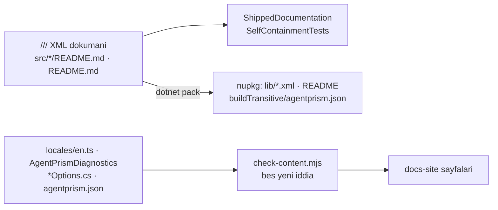

# 31 — Tüketici Dokümanının Doğruluğu (`DDG`)

> **Alan kodu:** `DDG` · **Faz:** 75
> **Kaynak:** `tests/AgentPrism.Core.UnitTests/Architecture/ShippedDocumentationSelfContainmentTests.cs` ·
> `docs-site/scripts/check-content.mjs` · `docs-site/scripts/build-agent-map.mjs` ·
> `docs-site/scripts/{build-api-reference,build-http-api}.mjs` ·
> `tests/AgentPrism.Ui.E2ETests/DocumentationScreenshotTests.cs` ·
> `docs-site/src/content/docs/guides/coding-agents.md` · `README.md` · `src/*/README.md`
>
> Ortam kurulumu ve reset yordamı [`00-INDEKS.md`](00-INDEKS.md)'dedir.
> Bu alan [`29-AGENT-DESTEGI.md`](29-AGENT-DESTEGI.md) ve
> [`30-YEREL-REFERANS.md`](30-YEREL-REFERANS.md)'nin **üstüne** kurulur: oradaki
> mekanizmaların çalıştığı değil, **taşıdıkları metnin okunabilir** olduğu kanıtlanır.

---

## Bu dosya neyi kanıtlar

Faz 73 tüketicinin kod agent'ına haritayı verdi, Faz 74 onu paketin kendi
diskindeki XML korpusuna yönlendirdi. Bu alan o korpusun **okurunun gözünden**
doğru olduğunu kanıtlar: sevk edilen hiçbir cümle tüketicide var olmayan bir
adrese gönderme yapmaz, ve dokümante edilmemiş bir yüzey bir kapıyı kızartır.



## Koşmadan önce

```bash
cd /Users/farukatasoy/Desktop/projects/AgentPrism
dotnet build AgentPrism.slnx -c Release
```

Site kapıları için Node 22.12+ gerekir; `cd docs-site && npm ci` bir kez koşar.

---

## Case'ler

| # | Kod | Ön koşul | Adımlar | Beklenen sonuç |
|---|---|---|---|---|
| 1 | `MT-DDG-001` | Temiz ağaç, `dotnet pack` koşuldu | Paketlenen her `lib/net10.0/*.xml` içinde iç referans deseni aranır | **Sıfır eşleşme** (faz öncesi taban: 1 033 satır) |
| 2 | `MT-DDG-002` | Aynı | `unzip -p …AspNetCore….nupkg buildTransitive/agentprism.json` içinde aynı desen aranır | **Sıfır eşleşme** (taban: 39) |
| 3 | `MT-DDG-003` | Aynı | 18 `src/*/README.md` taranır | **Sıfır eşleşme** (taban: 9 dosyada 14 satır) |
| 4 | `MT-DDG-004` | Aynı | 18 README'de `farukatasoy.github.io` aranır | **18/18** (taban: 5) |
| 5 | `MT-DDG-005` | — | Bir `///` satırına `(phase 88)` yazılır, `dotnet test --filter ShippedDocumentation` | Kızarır ve **dosya adını** söyler |
| 6 | `MT-DDG-006` | — | Bir `///` bloğunda `(phase` ve `88)` **iki ayrı satıra** bölünür | Kızarır — kapı bloğu birleştirerek okur |
| 7 | `MT-DDG-007` | Taban çizgisi **boş** — bu yüzden case üç adımlıdır | (a) bir `///` satırına `(phase 88)` yaz, (b) `AGENTPRISM_SHIPPED_DOCS_REFRESH=1` ile taban çizgisini yenile, (c) satırı geri al ve **yenilemeden** koş | (c) kızarır: `- <dosya>: 0 offending lines, baseline still allows 1 — refresh it`. Boş taban çizgisiyle bu yön tetiklenemez; adım (b) şarttır |
| 8 | `MT-DDG-008` | — | `capabilities.md`'den bir bölümün kural paragrafı silinir, `node docs-site/scripts/build-agent-map.mjs` | **Hata verir**, kuralsız harita üretmez |
| 9 | `MT-DDG-009` | — | `grep -c "…" docs-site/public/llms.txt` ve `grep -c "^- Rule:"` | Kesmelerin hepsi kelime sınırında; **11 bölüm, 11 kural** |
| 10 | `MT-DDG-010` | — | `ui.md`'de `## Jobs` başlığı `## Queue` yapılır, `npm run check:content` | Kızarır — "ui.md has no section describing the 'Jobs' console screen" |
| 11 | `MT-DDG-011` | — | `agentprism.tenant.id` bir sayfada `agentprism.tenant.identifier` yapılır | Kızarır — kapı tam ad arar, ön ek değil |
| 12 | `MT-DDG-012` | — | Bir `*Options` tipine belgesiz public property eklenir | Kızarır ve **property adını** söyler |
| 13 | `MT-DDG-013` | — | `http-api.md`'deki sayı elle değiştirilir | Kızarır ve gerçek sayıyı yazar |
| 14 | `MT-DDG-014` | — | `docs/openapi/agentprism.json` içine elle `(phase 12)` yazılır | Kızarır — paketlenen belge kapının içindedir |
| 15 | `MT-DDG-015` | — | Bir XML dokümanına `(K-123)` yazılır ve `node docs-site/scripts/build-api-reference.mjs` koşulur | Üreteç **hata verir**; artık sessizce onarmaz |
| 16 | `MT-DDG-016` | — | `AGENTPRISM_UI_SCREENSHOTS=1` ile E2E koşulur | **19 görüntü** üretilir; Jobs bir schedule ve bir job satırı, Sessions bir oturum gösterir |
| 17 | `MT-DDG-017` | Yayınlanan site | `guides/coding-agents/` kenar çubuğundan açılır | Altı `APG` tanısı, iki MSBuild özelliği ve üç üretilen dosya eksiksiz anlatılır | 👤 |
| 18 | `MT-DDG-018` | Yayınlanan site | Konsol gezinmesindeki 18 girişin her biri `ui.md`'de aranır | On sekizinin de kendi başlığı ve ekran görüntüsü var | 👤 |
| 19 | `MT-DDG-019` | — | Kök `README.md` okunur | Tamamı İngilizce; faz numarası kayması yok; bütçe içinde |
| 20 | `MT-DDG-020` | — | `npm run check:content && npm run build && npm run check:links` | Üçü de temiz |

---

## Doğrulama komutları

```bash
# 1 - sevk edilen XML
dotnet pack AgentPrism.slnx -c Release
for p in artifacts/package/release/AgentPrism*.nupkg; do
  unzip -p "$p" 'lib/net10.0/*.xml' 2>/dev/null
done | grep -ciE "phase [0-9]+|K-[0-9]{3}|F-[0-9]{2,3}|docs/"     # beklenen: 0

# 2 - paketlenen OpenAPI
unzip -p artifacts/package/release/AgentPrism.AspNetCore.*.nupkg \
  buildTransitive/agentprism.json | grep -ciE "phase [0-9]+|K-[0-9]{3}"  # beklenen: 0

# 3, 4 - paket README'leri
grep -rlniE "phase [0-9]+|K-[0-9]{3}|docs/" src/*/README.md | wc -l      # beklenen: 0
grep -rl "farukatasoy.github.io" src/*/README.md | wc -l                 # beklenen: 18

# 9 - harita
grep -c "^- Rule:" docs-site/public/llms.txt                             # beklenen: 11

# 5-7, 10-15, 20 - kapilar
dotnet test tests/AgentPrism.Core.UnitTests -c Release --no-build
cd docs-site && npm run check:content && npm run build && npm run check:links
```

## Bilinen sınırlar

- **Case 17 ve 18 göz gerektirir.** Kapılar bir başlığın ve bir görüntünün
  **varlığını** ölçer; anlattığının doğru olduğunu ölçmez.
- **Ekran görüntüsü tohumu tek temadır.** `AGENTPRISM_UI_SCREENSHOTS=1` yalnız
  açık temada üretir; koyu tema kapsam dışıdır.
- **`//` uygulama yorumları kapsam dışıdır ve bilerek öyledir.** Bakımcının
  okuduğu bir yorumun `K-320` demesi doğrudur; aynı cümle `///` içine girerse
  tüketiciye gider ve kapı onu yakalar.
