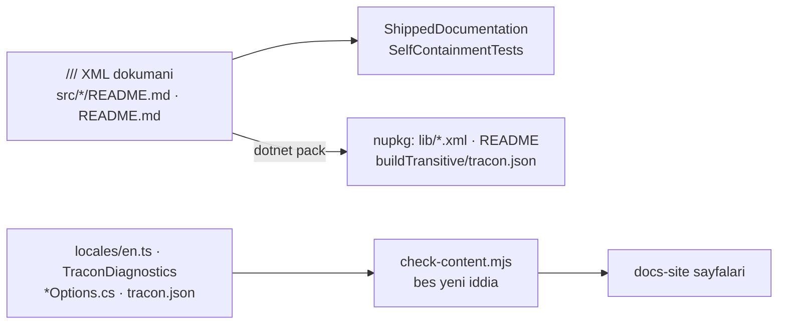

# 31 — Tüketici Dokümanının Doğruluğu (`DDG`)

> **Alan kodu:** `DDG` · **Faz:** 75, 79, 104, 172
> **Kaynak:** `tests/Tracon.Core.UnitTests/Architecture/ShippedDocumentationSelfContainmentTests.cs` ·
> `docs-site/scripts/check-content.mjs` · `docs-site/scripts/build-agent-map.mjs` ·
> `docs-site/scripts/{build-api-reference,build-http-api}.mjs` ·
> `tests/Tracon.Ui.E2ETests/DocumentationScreenshotTests.cs` ·
> `docs-site/src/content/docs/guides/coding-agents.md` · `README.md` · `src/*/README.md` ·
> `docs-site/site.config.mjs` · `src/Tracon.Generators/DocumentationLinks.cs`
>
> Ortam kurulumu ve reset yordamı [`00-INDEKS.md`](00-INDEKS.md)'dedir.
> Bu alan [`29-AGENT-DESTEGI.md`](29-AGENT-DESTEGI.md) ve
> [`30-YEREL-REFERANS.md`](30-YEREL-REFERANS.md)'nin **üstüne** kurulur: oradaki
> mekanizmaların çalıştığı değil, **taşıdıkları metnin okunabilir** olduğu kanıtlanır.

---

## Bu dosya neyi kanıtlar

Faz 73 tüketicinin kod agent'ına haritayı verdi, Faz 74 onu paketin kendi
diskindeki XML korpusuna yönlendirdi. Bu alan o korpusun **okurunun gözünden**
doğru olduğunu kanıtlar: sevk edilen hiçbir cümle tüketicide var olmayan bir
adrese gönderme yapmaz, ve dokümante edilmemiş bir yüzey bir kapıyı kızartır.



## Koşmadan önce

```bash
cd /Users/farukatasoy/Desktop/projects/Tracon
dotnet build Tracon.slnx -c Release
```

Site kapıları için Node 22.12+ gerekir; `cd docs-site && npm ci` bir kez koşar.

---

## Case'ler

| # | Kod | Ön koşul | Adımlar | Beklenen sonuç |
|---|---|---|---|---|
| 1 | `MT-DDG-001` | Temiz ağaç, `dotnet pack` koşuldu | Paketlenen her `lib/net10.0/*.xml` içinde iç referans deseni aranır | **Sıfır eşleşme** (faz öncesi taban: 1 033 satır) |
| 2 | `MT-DDG-002` | Aynı | `unzip -p …AspNetCore….nupkg buildTransitive/tracon.json` içinde aynı desen aranır | **Sıfır eşleşme** (taban: 39) |
| 3 | `MT-DDG-003` | Aynı | 18 `src/*/README.md` taranır | **Sıfır eşleşme** (taban: 9 dosyada 14 satır) |
| 4 | `MT-DDG-004` | Aynı | 18 README'de yayınlanan adres aranır | **18/18** (taban: 5) |
| 5 | `MT-DDG-005` | — | Bir `///` satırına `(phase 88)` yazılır, `dotnet test --filter ShippedDocumentation` | Kızarır ve **dosya adını** söyler |
| 6 | `MT-DDG-006` | — | Bir `///` bloğunda `(phase` ve `88)` **iki ayrı satıra** bölünür | Kızarır — kapı bloğu birleştirerek okur |
| 7 | `MT-DDG-007` | Taban çizgisi **boş** — bu yüzden case üç adımlıdır | (a) bir `///` satırına `(phase 88)` yaz, (b) `TRACON_SHIPPED_DOCS_REFRESH=1` ile taban çizgisini yenile, (c) satırı geri al ve **yenilemeden** koş | (c) kızarır: `- <dosya>: 0 offending lines, baseline still allows 1 — refresh it`. Boş taban çizgisiyle bu yön tetiklenemez; adım (b) şarttır |
| 8 | `MT-DDG-008` | — | `capabilities.md`'den bir bölümün kural paragrafı silinir, `node docs-site/scripts/build-agent-map.mjs` | **Hata verir**, kuralsız harita üretmez |
| 9 | `MT-DDG-009` | — | `grep -c "…" docs-site/public/llms.txt` ve `grep -c "^- Rule:"` | Kesmelerin hepsi kelime sınırında; **11 bölüm, 11 kural** |
| 10 | `MT-DDG-010` | — | `ui.md`'de `## Jobs` başlığı `## Queue` yapılır, `npm run check:content` | Kızarır — "ui.md has no section describing the 'Jobs' console screen" |
| 11 | `MT-DDG-011` | — | `tracon.tenant.id` bir sayfada `tracon.tenant.identifier` yapılır | Kızarır — kapı tam ad arar, ön ek değil |
| 12 | `MT-DDG-012` | — | Bir `*Options` tipine belgesiz public property eklenir | Kızarır ve **property adını** söyler |
| 13 | `MT-DDG-013` | — | `http-api.md`'deki sayı elle değiştirilir | Kızarır ve gerçek sayıyı yazar |
| 14 | `MT-DDG-014` | — | `docs/openapi/tracon.json` içine elle `(phase 12)` yazılır | Kızarır — paketlenen belge kapının içindedir |
| 15 | `MT-DDG-015` | — | Bir XML dokümanına `(K-123)` yazılır ve `node docs-site/scripts/build-api-reference.mjs` koşulur | Üreteç **hata verir**; artık sessizce onarmaz |
| 16 | `MT-DDG-016` | — | `TRACON_UI_SCREENSHOTS=1` ile E2E koşulur | **19 görüntü** üretilir; Jobs bir schedule ve bir job satırı, Sessions bir oturum gösterir |
| 17 | `MT-DDG-017` | Yayınlanan site | `guides/coding-agents/` kenar çubuğundan açılır | Altı `APG` tanısı, iki MSBuild özelliği ve üç üretilen dosya eksiksiz anlatılır | 👤 |
| 18 | `MT-DDG-018` | Yayınlanan site | Konsol gezinmesindeki 18 girişin her biri `ui.md`'de aranır | On sekizinin de kendi başlığı ve ekran görüntüsü var | 👤 |
| 19 | `MT-DDG-019` | — | Kök `README.md` okunur | Tamamı İngilizce; faz numarası kayması yok; bütçe içinde |
| 20 | `MT-DDG-020` | — | `npm run check:content && npm run build && npm run check:links` | Üçü de temiz |
| 21 | `MT-DDG-021` | — | Türetebilen bir dosyaya (`docs-site/src/sidebar.mjs`) adres **harfiyen** yazılır, `npm run check:content` | Kızarır ve **dosya adını** söyler: "spells out … Import it from docs-site/site.config.mjs" |
| 22 | `MT-DDG-022` | — | Bir paket README'sine `site.config.mjs`'in `formerHosts` listesindeki bir barındırıcı yazılır, `npm run check:content` | Kızarır — eski barındırıcı artık siteyi sunmuyor |
| 23 | `MT-DDG-023` | — | `DocumentationLinks.Site` değiştirilir (ör. `https://example.invalid/`), `dotnet test --filter DiagnosticIntegrityTests` | Her `APG` tanısı için kızarır; C# sabiti ile `site.config.mjs` ayrılamaz |
| 24 | `MT-DDG-024` | Site derlendi | `dist/index.html`'de `rel="canonical"`, `dist/robots.txt` ve `dist/sitemap-index.xml` okunur | Üçü de `site.config.mjs`'teki adresi taşır; `robots.txt` sitemap'i işaret eder |
| 25 | `MT-DDG-025` | Temiz çalışma kopyası (Faz 79, `ExampleCompilationTests`) | Bir `<example>` bloğuna var olmayan bir üye eklenir (`options.NoSuchThing = 1;`), `dotnet test tests/Tracon.Generators.UnitTests -c Release` | Test **düşer** ve mesaj dosya adını + satırı (`Origin`) ve `CS1061`'i adlandırır |
| 26 | `MT-DDG-026` | Aynı | `ToolDiagnostics.cs`'e `TRC0008` adında yeni bir descriptor eklenir (**ve** `AnalyzerReleases.Unshipped.md`'ye satırı — yoksa `RS2000` build'i önceden kırar), testler koşulur | `Every_diagnostic_is_explained_on_the_troubleshooting_page` düşer: `TRC0008` sayfada yok |
| 27 | `MT-DDG-027` | Aynı | `troubleshooting.md`'den `### A tool name is invalid (TRC0002)` bölümü silinir, testler koşulur | Aynı test düşer; `The_troubleshooting_page_names_no_diagnostic_that_no_longer_exists` etkilenmez (silinen kod hâlâ descriptor'da var) |
| 28 | `MT-DDG-028` | Aynı | `troubleshooting.md`'ye var olmayan bir `TRC0008` metni eklenir (descriptor eklenmeden), testler koşulur | `The_troubleshooting_page_names_no_diagnostic_that_no_longer_exists` düşer — ölü referans |
| 29 | `MT-DDG-029` | Aynı | `src/*/**.cs` altındaki tüm `<example>` blokları geçici olarak silinir, `dotnet test tests/Tracon.Generators.UnitTests -c Release --filter-class "*ExampleCompilationTests*"` | `Every_example_tag_is_extracted_as_a_block` düşer: "No <example> block was found" |
| 30 | `MT-DDG-030` | Temiz ağaç (Faz 104) | `CONTRIBUTING.md`'ye Türkçe bir cümle eklenir, `dotnet test tests/Tracon.Core.UnitTests -c Release --filter-method "*Source_tree_carries_no_Turkish*"` | `SourceLanguageTests` **düşer** ve satırı `+ CONTRIBUTING.md: 1 offending lines` diye adlandırır. Aynısı `ARCHITECTURE.md` ve kök `README.md` için de geçerlidir — kapı Faz 104'te bu üç kök dosyayı kapsayacak şekilde genişledi |
| 31 | `MT-DDG-031` | Aynı (Faz 104) | Hız sınırının kapsam beyanı üç yüzeyde birden aranır: `TraconRateLimitOptions` XML'i, `guides/production.md` ve `concepts/governance.md` | Üçü de sınırın **örnek başına** olduğunu söyler ve toplam tüketim sınırı olarak kotayı gösterir. Kardeş tip `InboundTriggerRateLimiter` ile çelişki yoktur |
| 32 | `MT-DDG-032` | Aynı (Faz 104) | Kiracı yalıtımının hangi katmanda durduğu `concepts/governance.md` ve `MIMARI-GUVENLIK.md` §Çok kiracılılık'ta okunur; `KARARLAR.md`'de K-623 aranır | Üçü de aynı şeyi söyler: yalıtım uygulama katmanındadır, veritabanı RLS'i **bilinçli olarak** yoktur, ve karar yeniden açılma koşuluyla birlikte kayıtlıdır |
| 33 | `MT-DDG-033` | Yayınlanan site (Faz 172) | `reference/threat-model.md` kenar çubuğundan açılır; `getting-started/security.md` § *The boundaries Tracon enforces* ve modelin § *Boundary mapping* tabloları yan yana okunur | İki tablonun ilk sütunu **aynı** sınır kümesini yazar. Tehdit modeli `SECURITY.md`'ye ve zafiyet bildirim yoluna bağlantı verir |
| 34 | `MT-DDG-034` | Aynı | `getting-started/security.md`'nin sınır tablosuna yeni bir satır eklenir (modele **eklenmeden**), `cd docs-site && npm run check:content` | Kızarır ve sınırı **adıyla** yazar: `reference/threat-model.md is missing the "<ad>" boundary that getting-started/security.md lists`. Değişiklik geri alınır |
| 35 | `MT-DDG-035` | Aynı | Ters yön: `getting-started/security.md`'den bir sınır satırı **silinir**, model dokunulmadan bırakılır, `npm run check:content` | Kızarır: `reference/threat-model.md lists a "<ad>" boundary that getting-started/security.md no longer does`. 🚨 **Asıl önemli yön budur** — artık var olmayan bir korumayı vaat eden bayat bir söz, eksik bir satırdan daha tehlikelidir. Tek yönü sınayan bir kapı bunu kaçırır |

---

## Doğrulama komutları

```bash
# 1 - sevk edilen XML
dotnet pack Tracon.slnx -c Release
for p in artifacts/package/release/Tracon*.nupkg; do
  unzip -p "$p" 'lib/net10.0/*.xml' 2>/dev/null
done | grep -ciE "phase [0-9]+|K-[0-9]{3}|F-[0-9]{2,3}|docs/"     # beklenen: 0

# 2 - paketlenen OpenAPI
unzip -p artifacts/package/release/Tracon.AspNetCore.*.nupkg \
  buildTransitive/tracon.json | grep -ciE "phase [0-9]+|K-[0-9]{3}"  # beklenen: 0

# 3, 4 - paket README'leri
grep -rlniE "phase [0-9]+|K-[0-9]{3}|docs/" src/*/README.md | wc -l      # beklenen: 0
grep -rl "tracon.dev" src/*/README.md | wc -l              # beklenen: 18

# 9 - harita
grep -c "^- Rule:" docs-site/public/llms.txt                             # beklenen: 11

# 30 - dil kapisi kok dosyalari da tarar (Faz 104)
grep -n "ScannedRootFiles" tests/Tracon.Core.UnitTests/Architecture/SourceLanguageTests.cs

# 31, 32 - beyan uc yuzeyde birden
grep -c "per instance" src/Tracon.Core/Quotas/TraconRateLimitOptions.cs   # beklenen: >=1
grep -c "per process" docs-site/src/content/docs/guides/production.md            # beklenen: >=1
grep -c "row level security" docs-site/src/content/docs/concepts/governance.md   # beklenen: >=1
grep -c "K-623" docs/MIMARI-GUVENLIK.md docs/KARARLAR.md                         # beklenen: >=1 her ikisinde

# 5-7, 10-15, 20 - kapilar
dotnet test tests/Tracon.Core.UnitTests -c Release --no-build
cd docs-site && npm run check:content && npm run build && npm run check:links
```

## Bilinen sınırlar

- **Case 17 ve 18 göz gerektirir.** Kapılar bir başlığın ve bir görüntünün
  **varlığını** ölçer; anlattığının doğru olduğunu ölçmez.
- **Ekran görüntüsü tohumu tek temadır.** `TRACON_UI_SCREENSHOTS=1` yalnız
  açık temada üretir; koyu tema kapsam dışıdır.
- **`//` uygulama yorumları kapsam dışıdır ve bilerek öyledir.** Bakımcının
  okuduğu bir yorumun `K-320` demesi doğrudur; aynı cümle `///` içine girerse
  tüketiciye gider ve kapı onu yakalar.
