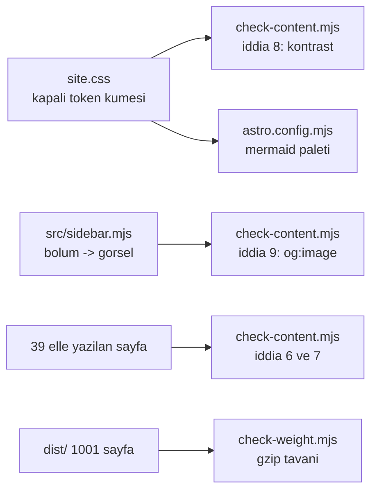

# 32 — Doküman Kalitesi ve Görsel Kimlik (`DKL`)

> **Alan kodu:** `DKL` · **Faz:** 76, 158
> **Kaynak:** `docs-site/src/styles/site.css` · `docs-site/astro.config.mjs` ·
> `docs-site/src/sidebar.mjs` · `docs-site/src/starlightRouteData.mjs` ·
> `docs-site/scripts/check-content.mjs` · `docs-site/scripts/check-weight.mjs` ·
> `docs-site/scripts/build-social-images.mjs` · `docs-site/public/social/*.png` ·
> `tests/AgentPrism.AspNetCore.FunctionalTests/DocumentedPolicyTests.cs`
>
> Ortam kurulumu ve reset yordamı [`00-INDEKS.md`](00-INDEKS.md)'dedir.
> Bu alan [`31-DOKUMAN-DOGRULUGU.md`](31-DOKUMAN-DOGRULUGU.md)'nün **üstüne**
> kurulur: oradaki metnin doğru olduğu değil, **sunumunun okunabilir** olduğu
> kanıtlanır. Faz 75'in beş içerik iddiası bu alanın her case'inde yeşil kalır.

---

## Bu dosya neyi kanıtlar

Doküman sitesinin tek bir tasarım sistemine oturduğunu ve niteliklerinin
ölçülebilir kapılara bağlandığını kanıtlar. Renk, kapanış bölümü, diyagram borcu,
paylaşım görseli ve sayfa ağırlığı artık **tarayıcı gerektirmeden** ölçülür;
geriye yalnız gerçekten göz isteyen case'ler kalır ve onlar 👤 ile işaretlidir.



## Koşmadan önce

```bash
cd /Users/farukatasoy/Desktop/projects/AgentPrism/docs-site
npm ci            # bir kez; Node 22.12+ gerekir
npm run check     # content -> build -> links -> weight
npx astro preview --port 4321
```

Görsel case'ler `http://localhost:4321/AgentPrism/` üzerinde koşulur. Tema
düğmesi sağ üsttedir; koyu ve açık temanın **ikisi de** denenir.

---

## Case'ler

| # | Kod | Ön koşul | Adımlar | Beklenen sonuç |
|---|---|---|---|---|
| 1 | `MT-DKL-001` | Yayınlanan site | Açılış sayfasını aç | Prizma işareti başlıkta; dört ölçülmüş sayı yerinde; sorun cümlesi ilk ekranda | 👤 |
| 2 | `MT-DKL-002` | Aynı | Temayı koyuya çevir, on sayfa gez | Hiçbir yüzey okunmaz hâle gelmiyor; spektrum yalnız başlık altında, bölüm ayracında ve aktif gezinme öğesinde | 👤 |
| 3 | `MT-DKL-003` | Aynı | Tarayıcıyı 360 px genişliğe daralt, dokuz sayfayı gez | Tablo, kod bloğu ve diyagram kendi içinde kayıyor; sayfa gövdesi yatay **kaymıyor** (`scrollWidth - clientWidth == 0`) | 👤 |
| 4 | `MT-DKL-004` | Aynı | Dokuz kılavuzu tek tek aç | Dokuzunda da diyagram var, sözdizimi hatası yok ve iki temada da okunuyor | 👤 |
| 5 | `MT-DKL-005` | — | `grep -L '^## Read next' <39 sayfa>` | Yalnız `index.mdx` çıkar; o sayfa kapıda **gerekçeli** muaftır |
| 6 | `MT-DKL-006` | Yayınlanan site | `troubleshooting` sayfasını aç | Başta 14 girişli belirti dizini var; bir belirtiye tıklamak doğru bölüme gidiyor; `Ctrl+F` hâlâ 62 alt başlığın tamamını buluyor | 👤 |
| 7 | `MT-DKL-007` | — | Dört bölümden birer sayfanın `og:image` etiketi okunur | Dört farklı dosya adı çıkar (`overview` · `console` · `operate` · `reference`) ve dördü de `200` döner |
| 8 | `MT-DKL-008` | — | Bir sayfadan `## Read next` bölümü silinir, `npm run check:content` | Kızarır ve sayfayı **adıyla** söyler |
| 9 | `MT-DKL-009` | — | `site.css`'te `--ap-text-muted` açık temada `#a8b0bb` yapılır | Kızarır ve **oranı** yazar: `2.19:1 in the light theme; 4.5:1 required` |
| 10 | `MT-DKL-010` | — | `src/sidebar.mjs`'e görselsiz bir bölüm eklenir | Kızarır: `Sidebar section '…' has no link-preview image` |
| 11 | `MT-DKL-011` | — | `guides/reliability.md`'den diyagram silinir | Kızarır ve muafiyet listesini gösterir |
| 12 | `MT-DKL-012` | Yayınlanan site | `Tab` ile başlıktan içeriğe gezilir | İlk durak "Skip to content"; hedefi (`#_top`) var; odak halkası her yerde görünür | 👤 |
| 13 | `MT-DKL-013` | — | `site.css`'e çifti olmayan bir renk token'ı eklenir | Kızarır: `is a colour with no contrast pair` |
| 14 | `MT-DKL-014` | — | `site.css`'te bir token'ın açık tema tanımı silinir | Kızarır: `has no value in the light theme` — hesap **atlanmaz** |
| 15 | `MT-DKL-015` | — | `site.css`'te bir token'ın son kullanımı kaldırılır | Kızarır: `is declared but nothing reads it` |
| 16 | `MT-DKL-016` | `npm run build` koşuldu | `npm run check:weight` | 1001 sayfa tavanın altında; en ağır sayfa adıyla ve bayt olarak yazılır |
| 17 | `MT-DKL-017` | — | `check-weight.mjs` tavanı 40 000'e indirilir | Kızarır ve **kaç sayfanın** aştığını söyler |
| 18 | `MT-DKL-018` | — | Bir sayfaya `K-382` yazılır, `npm run check:content` | Kızarır: `internal development history leaked into a public page` |
| 19 | `MT-DKL-019` | — | Muafiyet listesindeki bir sayfaya diyagram eklenir | Kızarır: `listed as a table page but now shows a figure; drop the exemption` |
| 20 | `MT-DKL-020` | — | `npm run check` (dört adım) | Dördü de temiz; kontrast tabanı ve en ağır sayfa çıktıya yazılır |
| 21 | `MT-DKL-021` | — | Bir sayfadaki `<!-- claim:option ... -->` işaretinin tipini var olmayan bir tipe değiştir, `npm run check:content` | Kızarır: `claim names '…', which is not a public sealed Options type` |
| 22 | `MT-DKL-022` | — | `reference/configuration.md`'de `Scheduling:RunWorker` satırındaki **görünür** `true` değerini `false` yap, işareti (`<!-- claim:… -->`) değiştirme | `npm run check:content` kızarır: `does not state that value as a backtick-quoted literal` — görünür metin ile işaret birbirinden sürüklendi |
| 23 | `MT-DKL-023` | — | `AgentPrismSchedulingOptions.RunWorker`'ın `= true` başlatıcısını sil | `dotnet test … Every_marked_option_default_matches_the_real_type` kızarır: `claims AgentPrismSchedulingOptions.RunWorker=true, but the real default is false` |
| 24 | `MT-DKL-024` | — | `OpenAIChatCompletionsEndpoints`'te `RequireApiKeyScope(ApiKeyScope.RunsWrite)`'ı `RunsRead` yap | `dotnet test … Every_marked_endpoint_policy_claim_is_actually_enforced` kızarır: yalnız `RunsRead` taşıyan anahtar reddedilmiyor |

---

## Doğrulama komutları

```bash
cd /Users/farukatasoy/Desktop/projects/AgentPrism/docs-site

# 5 - kapanis sozlesmesi
# 🚨 Filtre `^` ile baglanir: `grep -v '/http-api/'` uretilen sayfalari
# KACIRIR, cunku `grep -rL` yollari `./` onekiyle basmaz.
cd src/content/docs
grep -rL '^## Read next' . --include='*.md' --include='*.mdx' \
  | sed 's|^\./||' | grep -vE '^(api|http-api)/'      # beklenen: yalniz index.mdx
grep -rl '^## Related$\|^## Next$\|^## Related reference$' . --include='*.md' \
  | sed 's|^\./||' | grep -vE '^(api|http-api)/'      # beklenen: bos
cd ../../..

# 7 - bolum basina paylasim gorseli
for p in "" ui guides/production reference/glossary; do
  curl -s "http://localhost:4321/AgentPrism/${p}${p:+/}" \
    | grep -o 'og:image" content="[^"]*"' | head -1
done                                                 # beklenen: dort farkli dosya

# 16, 20 - kapilar
npm run check:content && npm run build && npm run check:links && npm run check:weight

# 22-24 - isaretli davranis iddialari (F-171, Faz 158)
cd ..
dotnet build tests/AgentPrism.AspNetCore.FunctionalTests -c Release
./artifacts/bin/AgentPrism.AspNetCore.FunctionalTests/release/AgentPrism.AspNetCore.FunctionalTests \
  --filter-method "*DocumentedPolicyTests*"
```

## Bilinen sınırlar

- **Case 1–4, 6 ve 12 göz gerektirir.** Kontrast hesaplanabilir; "okunaklı"
  hesaplanamaz. Kapı bir token çiftinin oranını ölçer, bir sayfanın gerçekten
  rahat okunduğunu ölçmez.
- **`og:image` gerçek bir sosyal ağda doğrulanmadı.** Case 7 etiketin doğru
  dosyaya işaret ettiğini ve dosyanın sunulduğunu kanıtlar; bir paylaşım
  önizlemesinin nasıl göründüğü platformun kendi önbelleğine bağlıdır.
- **Diyagram paleti temadan bağımsızdır ve bu bir karardır.** Figürler iki
  temada da açık plaka üzerinde durur; mermaid paletini çalışma anında CSS
  değişkeninden okuyamaz. Gerekçe `site.css`'te yazılıdır.
- **Ekran görüntüleri tek temadır** (Faz 75'in sınırı burada da geçerlidir).
