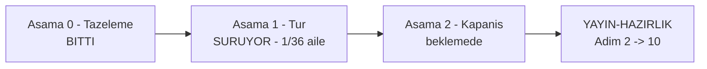

# Devir — 2026-09-16 manuel kabul turu

> **Bu turu devralan oturum ÖNCE burayı okur.** Turun durumu, değişmez
> kuralları, ortamı ve sıradaki işi taşır.
>
> **Durum:** Aşama 1 sürüyor · **dosya 01 KAPANDI** (81/81) · kod `7e3a4de7`'de donuk
> **Son güncelleme:** 2026-09-16 (oturum 3)

---

## 1. Okuma sırası — bundan fazlasını okuma

| Sıra | Dosya | Niçin |
|---|---|---|
| 1 | bu dosya | durum, kural, sıradaki iş |
| 2 | [`.agents/skills/manuel-test-kosumu/SKILL.md`](../../../../.agents/skills/manuel-test-kosumu/SKILL.md) | koşum ve kapanış protokolü — **tek kaynak** |
| 3 | [`00-KOSUM-PLANI.md`](00-KOSUM-PLANI.md) | risk sırası, şerit dağılımı — **üretilir, elle yazılmaz** |
| 4 | [`../../00-INDEKS.md`](../../00-INDEKS.md) §2 · §3 · §4 | ortam, fixture, reset yordamı |
| 5 | koşacağın aile dosyası | case metinleri |

`docs/` ağacının gerisini **açma**. Aradığın bir şey varsa `grep`'le.

---

## 2. Nerede duruyoruz

Aşama 0 (tazeleme) bitti. Tur açıldı ve zincirin **1. ailesi kapandı**:
`01-KURULUM-VE-PAKETLEME.md` üç oturumda koşuldu (81/81 case).



**Dosya 01 sonucu:** 72 ☑ Geçti · 4 ☑ Kaldı · 5 ☐ Beklemede (bloklu).
Kayıt: [`01-KURULUM-VE-PAKETLEME.md`](01-KURULUM-VE-PAKETLEME.md) — devir notu
dosyanın başındadır ve **oturum oturum** birikir.

🚨 **Açık bulgular:** `HATA-S1-001..005` · `HATA-S1-007` (yayın hattını
bloklar — aşağıda). `HATA-S1-006` yanlış pozitif çıktı ve kapandı.

🚨 **`HATA-S1-007` — yayın provası hiçbir sürümle yeşil olamaz.**
`scripts/kapi.py` hedef sürüm için `CHANGELOG.md`'de `## [<sürüm>]` bölümü
arıyor; changelog ise bilinçli olarak yalnız `## [Unreleased]` taşıyor. İki
kural birbirini kilitliyor. **Kullanıcı kararı (2026-09-16):** `CHANGELOG.md`
tur boyunca **donuk kalır**; düğüm Aşama 2'de karar (`K-*`) olarak çözülür.
Bloklananlar `Beklemede` bırakıldı: `MT-PKG-104 · 105 · 115 · 116 · 117`.

| Alan | Değer |
|---|---|
| **Kod donması** | `src/` · `samples/` · `tests/` — son dokunan `7e3a4de7`; tur boyunca **değişmez** |
| Doküman hattı | Her oturum kendi sonucunu commit eder, yani `HEAD` **ilerler**. Bu normaldir; kodu çözmez |
| Set | 1866 case · 36 aile |
| Tahmin | 85 oturum (zincir 13 + dört şerit 19/17/18/18) |
| Şeritler | `../../../../../ap-s1..4` · dallar `test/kosum-s1..4` · dördü de derli (0 uyarı) |
| Container | `ap-pg` (55432) · `ap-mssql` (51433) — ayakta, `00-INDEKS.md` §2.2'ye hizalı |
| `secret` | 17 anahtar · `UserSecretsId` = `tracon-sample-api` |

---

## 3. Değişmez kurallar

Bunlar pazarlığa açık değildir. Ayrıntı ve gerekçe skill §1'dedir.

1. **🚨 Kod DONUK.** `src/` · `samples/` · `tests/` altında hiçbir dosya
   değişmez. Kusur bulunca: kaynağı **oku**, kök nedeni bul, bulguyu case'in
   `Gerçek sonuç` alanına yaz (log alıntısı + `dosya.cs:satır`), `Durum`'u
   `☑ Kaldı` işaretle, şeridin sonuç dosyasına `HATA-S<N>-NNN` kaydı ekle ve
   **koşmaya devam et**. Düzeltmeler Aşama 2'de aile aile yapılır.
   - **Tek istisna:** case'in `Beklenen sonuç`'u koda göre yanlışsa düzeltilir
     ve gerekçesi `Gerçek sonuç`'a yazılır. Doküman ile kod çelişirse doküman
     yanlıştır.
2. **`user-secrets` YAZILMAZ.** Depo makine genelinde tektir, şeritler onu
   paylaşır. Her şerit kendi **ortam değişkenini** export eder (skill §1.2).
   Okumak (`dotnet user-secrets list`) serbesttir.
3. **Yalnız kendi şeridinin kaynağına dokun.** Kendi şeman (`mt_s<N>`), kendi
   portun, kendi worktree'n. Container'ları **durdurma, silme, yeniden
   başlatma** — paylaşılırlar.
4. **Case biter bitmez sonucu YAZ.** Oturum sonunda toplu yazma yok; bütçe
   biterse yazılmamış her şey kaybolur.
5. **Bir şey belirsizse sor.** Kimlik çalışmıyorsa, case fiziksel eylem
   istiyorsa, beklenen sonuç iki türlü okunuyorsa, ya da kritik bir kusur
   sonraki 5+ case'i bloklayacaksa **dur ve kullanıcıya sor**.
6. **Her oturum kendi sonucunu commit eder — bu tur için izin VERİLMİŞTİR.**
   `AGENTS.md` "commit'i kullanıcı istemedikçe atma" der; kullanıcı
   2026-09-16'da bu turun **tamamı** için açık izin verdi. Sormadan commit et.
   Kapsam dardır: yalnız `docs/manuel-test/` altı. `src/` · `samples/` ·
   `tests/` yine **donuktur** ve commit'lenmez (kural 1).

---

## 4. Ortamı 60 saniyede doğrula

Her oturum bununla açılır. Biri kırmızıysa **koşma**, önce onu düzelt.

```bash
cd /Users/farukatasoy/Desktop/projects/Tracon

git status --short                          # temiz olmali
git diff --stat 7e3a4de7..HEAD -- src samples tests   # BOS olmali: kod donuk
docker ps --format '{{.Names}}\t{{.Status}}'          # ap-pg + ap-mssql Up
(cd samples/Tracon.Api && dotnet user-secrets list | wc -l)   # 17
```

> 🚨 İkinci satır **boş dönmezse tur kirlenmiştir.** Birisi koşum sırasında
> kodu değiştirmiş demektir ve o noktadan sonraki sonuçlar bir öncekilerle
> karşılaştırılamaz. Dur ve kullanıcıya sor.

Şerit ortam bloğu ve reset yordamı
[`resources/serit-kurulumu.md`](../../../../.agents/skills/manuel-test-kosumu/resources/serit-kurulumu.md)
§2'dedir — **elle yazma, oradan al**.

> 🚨 **Azure kimliği YOKTUR.** `azure-support` katalogda görünmez (15 tanımdan
> 14'ü çözülür). Azure isteyen case'ler `⏭ Atlandı` kalır, bu bir kusur
> değildir.

---

## 5. Sıradaki iş

### Faz A — zincir, TEK şerit, sırayla

`01 → 02 → 03 → 05 → 07` bir **kapıdır**, iş yükü değil. Kırılırsa sonraki
hiçbir ailenin sonucu okunmaz. Paralel şeritler ancak beşi yeşil bitince açılır.

| Sıra | Aile | case | oturum |
|---|---|---|---|
| 1 | `01-KURULUM-VE-PAKETLEME.md` | 81 | 3 |
| 2 | `02-CEKIRDEK-VE-KATALOG.md` | 97 | 4 |
| 3 | `03-KALICILIK-POSTGRESQL.md` | 50 | 2 |
| 4 | `05-SAGLAYICI-OPENAI.md` | 40 | 2 |
| 5 | `07-HTTP-YONETIM-API.md` | 43 | 2 |

**Sıradaki oturumun işi:** `ap-s1`'de `02-CEKIRDEK-VE-KATALOG.md`,
`MT-CORE-001`'den başla. Dosya 01 kapandı — ona dönme.

| Aile | Durum |
|---|---|
| `01-KURULUM-VE-PAKETLEME.md` | ✅ 81/81 (3 oturum) |
| `02-CEKIRDEK-VE-KATALOG.md` | ⬜ sıradaki · 97 case · 4 oturum |

🚨 **Bölme noktası onluk case bloğudur, `#` bölüm başlığı DEĞİL.** Ölçüldü
(2026-09-16): spec dosyalarında bölüm başlığı yok — `946a37fb` ("faz 58",
spec/kayıt ayrımı) onları spec'ten düşürdü, yalnız koşum kaydında kaldılar.
Case numaraları zaten blok hâlindedir (`001-003` · `010-016` · `020-027` …) ve
Faz 58 öncesi bölümlerle birebir örtüşür. **Bir bloğun ortasında oturum
bitmez.** Kullanıcı kararı: spec'e dokunulmaz.

Dosya 01'in oturum sınırları: `001..049` (33) · `050..099` (25) · `100..122` (23).

### Faz B — dört şerit paralel

Zincir bitince açılır. Dağılım `00-KOSUM-PLANI.md` §3.1'dedir:

| Şerit | Port | Şema | Oturum | Aileler |
|---|---|---|---|---|
| `ap-s1` | 5081 | `mt_s1` | 19 | 13 · 19 · 04 · 18 · 10 · 08 |
| `ap-s2` | 5082 | `mt_s2` | 17 | 36 · 33 · 12 · 24 · 35 · 23 · 15 · 14 |
| `ap-s3` | 5083 | `mt_s3` | 18 | 32 · 29 · 34 · 21 · 11 · 25 · 17 · 20 |
| `ap-s4` | 5084 | `mt_s4` | 18 | 31 · 16 · 30 · 22 · 09 · 27 · 26 · 28 · 06 |

---

## 6. Oturum protokolü

Skill §3'ün yedi adımı. Adım atlanmaz.

1. Skill'i oku · 2. Oturum satırını bul (dosya + bölüm aralığı) · 3. Şerit
ortamını kur, uygulamayı başlat, sağlığı doğrula · 4. Reset yordamını uygula ·
5. Case'leri **sırayla** koş, her birini bitirince **yaz** · 6. Kalan case'ler
için `HATA` kaydı + fiziksel eylem listesi · 7. Commit + **devir notu**, dur.

**Oturum bütçesi:** saf CLI ~40 case · karışık ~28 · arayüz (Playwright) ~18.
Bütçe aşılırsa oturum **durur** ve kaldığı yeri devir notuna yazar.

**Nereye yazılır**

| Bilgi | Yer |
|---|---|
| Case metni (ön koşul, adım, beklenen sonuç) | `docs/manuel-test/<NN>-<ALAN>.md` — **turdan bağımsız**, dokunma |
| `Gerçek sonuç` + `Durum` | `kosumlar/2026-09-16/<NN>-<ALAN>.md` — bu turun kaydı |
| `HATA-S<N>-NNN` + devir notu | aynı dosyanın başı |
| Koşamadığın case (fiziksel eylem) | sonuç dosyasının sonundaki tablo; `☐ Beklemede` kalır, `Atlandı` **değil** |

**Devir notu** sonuç dosyasının başına yazılır ve üç şey söyler: nerede kalındı,
sonraki oturum neyle başlamalı, hangi ön koşul bozuk kaldı.

**Arayüz oturumları:** önce `browser_snapshot`, sonra tıkla. Her case'te
`browser_console_messages` — sessiz bir JS hatası "Geçti" gibi görünür. Ekran
görüntüsü yalnız kanıt gerektiğinde, yolu `docs/manuel-test/kanit/S<N>/<case>.png`.

**Nerede kaldık?** Skill §7'nin sayım betiğini koş — her case'in **son**
işaretini alır. Satır sayan bir `grep` yeniden koşulan case'i iki kez sayar.

---

## 7. Aşama 0 ne buldu — yeniden keşfetme

Tazeleme turu üç Faz 162 kalıntısı kapattı. Bunları tekrar aramana gerek yok.

1. **Fixture adları bayattı (294 geçiş, 17 aile).** Örnek uygulamanın agent ve
   workflow adları İngilizce'ye çevrilmiş, set eski adları yazıyordu. Düzeltildi
   ve çalışan bir host'a karşı doğrulandı: 14 agent'ın 14'ü çözülüyor. Bir case
   metninde `ozetleyici`/`cevirmen` gibi bir ad görürsen o bir **kusurdur**,
   kaydet.
2. **Kapsama boşluğu kapandı.** 54 kayıt giriş noktasının 7'si sette hiç
   anılmıyordu. Üçü case aldı: `AddAgentDecorator` (MT-CORE-129), görsel
   sağlayıcıları (MT-MM-120..122). Ölçüm şimdi 54/54.
3. **Faz 172 hiç case almamıştı.** İki yönlü tazelik kapısı için MT-DDG-033..035
   yazıldı.

Ölçümün kendisi: `python3 scripts/manuel-test-tazelik.py --taban 12fb6477`.

---

## 8. Açık kalemler

| Kalem | Durum |
|---|---|
| Ağustos turundan devreden altı case | `00-INDEKS.md` §7.1 — bu turda yeniden koşulur. 🚨 **Düzeltmeden önce kusuru ampirik olarak yeniden üret**; 2026-08 turunda üç kusur zaten kapanmış çıktı |
| Azure case'leri | Kimlik yok; `⏭ Atlandı` |
| `Faz` listesi çelişkisi (36 ailenin 21'i) | Ölçüldü, **düzeltilmedi**; gerekçe ve kalıcı çözüm `00-INDEKS.md` §8'de. Turu engellemez |
| Sağlayıcı anahtarları | 🚨 2026-09-16'da düz metne çıktı — **tur bitince beşi de döndürülmeli** |
| `31`–`36` kayıt biçimi | 🚨 **Faz B açılmadan çözülmeli.** Bu altı aile (205 case) tablo biçimindedir: satır başına bir case, `### MT-` başlığı ve `Durum:` satırı **yok**. Skill §4.1 case kaydı ve §7 sayım betiği (`^## (MT-...)` arar) bunlara uymaz. Kullanıcı kararı (2026-09-16): Faz B'ye ertelendi, zinciri bekletmez |

---

## 9. Tur bitince

1. **Aşama 2 — kapanış.** Skill §6: kusurlar **aile aile** (aile = aynı kök
   neden) kapanır, bir oturum bir aile, her aile ayrı commit. Kök neden
   düzeltilir ve **sınıf taranır** (`kusur-giderme` skill'i). Eski
   `Gerçek sonuç` silinmez; altına `---` ve yeni koşum notu eklenir.
2. **Bitti tanımı** — skill §7'nin on maddesi. İçinde dört doğrulama kapısı,
   `docs/hafiza/` tuzak notları, `ADAYLAR.md`'ye yetenek adayları ve
   `git worktree remove` var.
3. **Damıtma ve arşiv** — `dokuman-bakim.py kosum-damit` (önce `--kuru`), sonra
   kayıt `docs/arsiv/manuel-test-kosum-2026-09/` altına.
4. **Yayın hattı** — [`docs/YAYIN-HAZIRLIK.md`](../../../YAYIN-HAZIRLIK.md) §4
   sıra tablosunda Adım 1 ✅ işaretlenir; Adım 2'den 10'a devam edilir.
