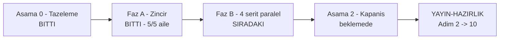

# Devir — 2026-09-16 manuel kabul turu

> **Bu turu devralan oturum ÖNCE burayı okur.** Turun durumu, değişmez
> kuralları, ortamı ve sıradaki işi taşır.
>
> **Durum:** 🎉 **Aşama 1 (Faz A zinciri) BİTTİ** — dosya 01, 02, 03, 05 ve 07
> KAPANDI (311 case) · kod `7e3a4de7`'de donuk · sıradaki iş **Faz B**
> **Son güncelleme:** 2026-09-16 (oturum 12)

---

## 1. Okuma sırası — bundan fazlasını okuma

| Sıra | Dosya | Niçin |
|---|---|---|
| 1 | bu dosya | durum, kural, sıradaki iş |
| 2 | [`.agents/skills/manuel-test-kosumu/SKILL.md`](../../../../.agents/skills/manuel-test-kosumu/SKILL.md) | koşum ve kapanış protokolü — **tek kaynak** |
| 3 | [`00-KOSUM-PLANI.md`](00-KOSUM-PLANI.md) | risk sırası, şerit dağılımı — **üretilir, elle yazılmaz** |
| 4 | [`../../00-INDEKS.md`](../../00-INDEKS.md) §2 · §3 · §4 | ortam, fixture, reset yordamı |
| 5 | koşacağın aile dosyası | case metinleri |

`docs/` ağacının gerisini **açma**. Aradığın bir şey varsa `grep`'le.

---

## 2. Nerede duruyoruz

Aşama 0 (tazeleme) bitti. **Faz A zinciri tamamlandı** — `01 → 02 → 03 → 05 →
07` beşi de yeşil (`01-KURULUM-VE-PAKETLEME.md` 81 case ·
`02-CEKIRDEK-VE-KATALOG.md` 97 case · `03-KALICILIK-POSTGRESQL.md` 50 case ·
`05-SAGLAYICI-OPENAI.md` 40 case · `07-HTTP-YONETIM-API.md` 43 case) —
toplam **311 case**. Sıradaki iş **Faz B**: kalan 31 aile, 4 şerit paralel.



| Dosya | Geçti | Kaldı | Beklemede | Atlandı |
|---|---|---|---|---|
| `01-KURULUM-VE-PAKETLEME.md` | 72 | 4 | 5 | — |
| `02-CEKIRDEK-VE-KATALOG.md` | 92 | 4 | 1 | — |
| `03-KALICILIK-POSTGRESQL.md` | 47 | 2 | 1 | — |
| `05-SAGLAYICI-OPENAI.md` | 38 | 1 | — | 1 |
| `07-HTTP-YONETIM-API.md` | 43 | — | — | — |
| **toplam** | **292** | **11** | **7** | **1** |

> ⚠️ **Dosya 03'ün satırı düzeltildi (oturum 10).** Tablo "48 · 1" diyordu ve
> `MT-PG-025`'i atlıyordu — o case oturum 8'de `Kaldı` işaretlenmiş,
> `HATA-S1-015` onun üzerine açılmıştı. Kayıtlar doğruydu, özet yanlıştı.
> 🚨 **Bu tabloyu elle yazma**, §6'daki sayım betiğinden al.

Kayıt dosyaları `kosumlar/2026-09-16/` altındadır; her birinin **devir notu
başındadır** ve oturum oturum birikir.

🚨 **Açık bulgular:** `HATA-S1-001..005` · `HATA-S1-007` (yayın hattını
bloklar — aşağıda) · `HATA-S1-008..014` (dosya 02) · `HATA-S1-015..019`
(dosya 03) · `HATA-S1-020` (dosya 05, dosya 07'de MT-API-040/041/042
tarafından aynı kök nedenle bir kez daha doğrulandı — yeni kayıt açılmadı).
Hepsi ilgili kayıt dosyasındadır. `HATA-S1-006` yanlış pozitif çıktı ve kapandı.
Dosya 07 **hiç yeni kusur bulmadı** — 43/43 case geçti, yalnız stale spec
metni düzeltmeleri yapıldı.

🚨 **`HATA-S1-019` bu turun en ağır bulgusudur (Yüksek).** `UsePostgreSql`
tüketicinin store kaydını `Replace` ile **sessizce** eziyor —
`AGENTS.md`'nin "`TryAdd*` ile kaydet; tüketicinin kaydı her zaman kazanmalı"
kuralının ihlali. Üç sağlayıcıda 117 çağrı, 34 store arayüzü.
`samples/Tracon.Embedded`'in README'sinde belgelenmiş akışı kırıyor. Bir
paket ailesi için bu bir sözleşme kusurudur; kapanışta önceliklendirilmeli.

⚠️ **`00-INDEKS.md` §3.2 bayat:** tool tablosu 4 tool listeler → bugün **10**
(oturum 9'da `/api/tools` ile yeniden ölçüldü: `cancel_order` ·
`estimate_shipping_cost` · `get_order_status` · `get_slow_report` ·
`list_recent_orders` · `list_voices` · `mark_preview_ready` ·
`read_shopping_cart` · `speak` · `transcribe`).
(§4'ün "33 migration" bayatlığı **oturum 8'de kapandı** — 50 çekirdek + 1
knowledge = 51 olarak düzeltildi ve sabit sayıya güvenmeme uyarısı eklendi.)

🚨 **`HATA-S1-007` — yayın provası hiçbir sürümle yeşil olamaz.**
`scripts/kapi.py` hedef sürüm için `CHANGELOG.md`'de `## [<sürüm>]` bölümü
arıyor; changelog ise bilinçli olarak yalnız `## [Unreleased]` taşıyor. İki
kural birbirini kilitliyor. **Kullanıcı kararı (2026-09-16):** `CHANGELOG.md`
tur boyunca **donuk kalır**; düğüm Aşama 2'de karar (`K-*`) olarak çözülür.
Bloklananlar `Beklemede` bırakıldı: `MT-PKG-104 · 105 · 115 · 116 · 117`.

| Alan | Değer |
|---|---|
| **Kod donması** | `src/` · `samples/` · `tests/` — son dokunan `7e3a4de7`; tur boyunca **değişmez** |
| Doküman hattı | Her oturum kendi sonucunu commit eder, yani `HEAD` **ilerler**. Bu normaldir; kodu çözmez |
| Set | 1866 case · 36 aile |
| Tahmin | 85 oturum (zincir 13 + dört şerit 19/17/18/18) |
| Şeritler | `../../../../../ap-s1..4` · dallar `test/kosum-s1..4` · dördü de derli (0 uyarı) |
| Container | `ap-pg` (55432) · `ap-mssql` (51433) — ayakta, `00-INDEKS.md` §2.2'ye hizalı |
| `secret` | 17 anahtar · `UserSecretsId` = `tracon-sample-api` |

---

## 3. Değişmez kurallar

Bunlar pazarlığa açık değildir. Ayrıntı ve gerekçe skill §1'dedir.

1. **🚨 Kod DONUK.** `src/` · `samples/` · `tests/` altında hiçbir dosya
   değişmez. Kusur bulunca: kaynağı **oku**, kök nedeni bul, bulguyu case'in
   `Gerçek sonuç` alanına yaz (log alıntısı + `dosya.cs:satır`), `Durum`'u
   `☑ Kaldı` işaretle, şeridin sonuç dosyasına `HATA-S<N>-NNN` kaydı ekle ve
   **koşmaya devam et**. Düzeltmeler Aşama 2'de aile aile yapılır.
   - **Tek istisna:** case'in `Beklenen sonuç`'u koda göre yanlışsa düzeltilir
     ve gerekçesi `Gerçek sonuç`'a yazılır. Doküman ile kod çelişirse doküman
     yanlıştır.
2. **`user-secrets` YAZILMAZ.** Depo makine genelinde tektir, şeritler onu
   paylaşır. Her şerit kendi **ortam değişkenini** export eder (skill §1.2).
   Okumak (`dotnet user-secrets list`) serbesttir.
3. **Yalnız kendi şeridinin kaynağına dokun.** Kendi şeman (`mt_s<N>`), kendi
   portun, kendi worktree'n. Container'ları **durdurma, silme, yeniden
   başlatma** — paylaşılırlar.
4. **Case biter bitmez sonucu YAZ.** Oturum sonunda toplu yazma yok; bütçe
   biterse yazılmamış her şey kaybolur.
5. **Bir şey belirsizse sor.** Kimlik çalışmıyorsa, case fiziksel eylem
   istiyorsa, beklenen sonuç iki türlü okunuyorsa, ya da kritik bir kusur
   sonraki 5+ case'i bloklayacaksa **dur ve kullanıcıya sor**.
6. **Her oturum kendi sonucunu commit eder — bu tur için izin VERİLMİŞTİR.**
   `AGENTS.md` "commit'i kullanıcı istemedikçe atma" der; kullanıcı
   2026-09-16'da bu turun **tamamı** için açık izin verdi. Sormadan commit et.
   Kapsam dardır: yalnız `docs/manuel-test/` altı. `src/` · `samples/` ·
   `tests/` yine **donuktur** ve commit'lenmez (kural 1).

---

## 4. Ortamı 60 saniyede doğrula

Her oturum bununla açılır. Biri kırmızıysa **koşma**, önce onu düzelt.

```bash
cd /Users/farukatasoy/Desktop/projects/Tracon

git status --short                          # temiz olmali
git diff --stat 7e3a4de7..HEAD -- src samples tests   # BOS olmali: kod donuk
docker ps --format '{{.Names}}\t{{.Status}}'          # ap-pg + ap-mssql Up
(cd samples/Tracon.Api && dotnet user-secrets list | wc -l)   # 17
```

> 🚨 İkinci satır **boş dönmezse tur kirlenmiştir.** Birisi koşum sırasında
> kodu değiştirmiş demektir ve o noktadan sonraki sonuçlar bir öncekilerle
> karşılaştırılamaz. Dur ve kullanıcıya sor.

Şerit ortam bloğu ve reset yordamı
[`resources/serit-kurulumu.md`](../../../../.agents/skills/manuel-test-kosumu/resources/serit-kurulumu.md)
§2'dedir — **elle yazma, oradan al**.

> 🚨 **Azure kimliği YOKTUR.** `azure-support` katalogda görünmez (15 tanımdan
> 14'ü çözülür). Azure isteyen case'ler `⏭ Atlandı` kalır, bu bir kusur
> değildir.

---

## 5. Sıradaki iş

### Faz A — zincir, TEK şerit, sırayla — 🎉 BİTTİ

`01 → 02 → 03 → 05 → 07` bir **kapıydı**, iş yükü değil. Beşi de yeşil
bitti; Faz B artık açık.

| Sıra | Aile | case | oturum | Durum |
|---|---|---|---|---|
| 1 | `01-KURULUM-VE-PAKETLEME.md` | 81 | 3 | ✅ 81/81 |
| 2 | `02-CEKIRDEK-VE-KATALOG.md` | 97 | 4 | ✅ 97/97 |
| 3 | `03-KALICILIK-POSTGRESQL.md` | 50 | 2 | ✅ 50/50 |
| 4 | `05-SAGLAYICI-OPENAI.md` | 40 | 2 | ✅ 40/40 |
| 5 | `07-HTTP-YONETIM-API.md` | 43 | 2 (koşuldu: 1) | ✅ 43/43 |

**Sıradaki oturumun işi:** **Faz B'yi aç.** Dört worktree zaten hazır
(`ap-s1..4`, dallar `test/kosum-s1..4`, Release derlemesi tamam). Şerit
dağılımı aşağıdaki §Faz B tablosundadır. Her şerit kendi ilk ailesiyle
(`ap-s1`→13, `ap-s2`→36, `ap-s3`→32, `ap-s4`→31) bağımsız başlayabilir —
artık aralarında sıra bağımlılığı yok.

🚨 **Container durdurmak isteyen her case için tarif hazır (oturum 9'da
kanıtlandı).** Paylaşılan container'a dokunma; erişilemezliği **şerit-yerel bir
TCP yönlendiriciyle** taklit et: uygulamayı `Port=554<80+şerit>` ile aç,
yönlendirici o portu `55432`'ye aktarsın, sonra yönlendiriciyi öldür. Uygulamanın
gözünde tam olarak `docker stop` kadar erişilemez olur; `ap-pg` hiç etkilenmez
ve Faz B'de dört şerit paralel koşarken de güvenlidir. MT-PG-050 ve MT-PG-061
bu yöntemle koşuldu; 061 kurtarmayı **PID ile** kanıtladı. Tarif dosya 03'ün
devir notundadır.

🚨 **Dosya 05'ten taşınan kurallar (oturum 10 · 11).**

- **Donuk `samples/` isteyen case'ler repo'ya dokunmadan koşulur.** İki tarif
  kanıtlandı, altı case'de kullanıldı: **yapılandırma katmanı** (dizi ögesi bile
  eklenebilir — `Tracon__Providers__OpenAI__Models__3__Name=...`) ve
  **paketlenmiş tüketici host'u** (`~/tracon-manuel/*`, yerel feed
  `0.0.0-preview.0.789`). İkincisi kurulum-zamanı davranışı için daha güçlü
  kanıttır: çağrı gerçek bir tüketiciden ve paketlenmiş ikiliden gelir.
- **Yanıt alanları kökte değil.** `usage.totalTokens` ·
  `response.messages[0].contents[0].text` · sağlıkta `providerName`. Kökten
  okuyan bir sonda `None` görür ve geçen case'i `Kaldı` sanar.
- **`GET /api/runs/{id}/events` SSE döner, JSON değil.** Ayrıştırıcı:
  `<scratch>/sse.py`. Ham `grep` çok satırlı `data:` gövdesinde kelimeleri böler.
- **Sağlayıcı hatasının ayrıntısı yanıtta değil GÜNLÜKTE.** `error` çerçevesi ve
  `run` kaydı sabit `upstream_error` / `The model provider request failed.`
  taşır (kasıtlı — `SafeErrorText`). `404`, `402`, `model_not_found` aramak
  için günlüğe bak.
- **Devre kesici durumu süreç-içidir.** Onu sınayan case'leri ayrı bir örnekte
  (5092) koş, yoksa şeridin uygulamasında devre açık kalır.
- **Süre ölçümü kanıttır.** Kapalı devre ~57 ms, gerçek ağ çağrısı 300–1400 ms.
- **Spec'in `Beklenen sonuç` metinleri bu turda sistematik olarak bayat.**
  Dosya 05'te 14 case düzeltildi. Türkçe hata mesajı bekleyen her satır
  şüphelidir (K-228); bayat fixture terimleri de çıkabiliyor
  (MT-OAI-084: `gizli-proje` → `confidential-project`).

🚨 **Dosya 03'ten taşınan kurallar:** neredeyse her case
`dotnet user-secrets set` yazar — hepsi ortam değişkenine çevrilir (skill §1.2).
Model adı **`gpt-5.4-mini`**'dir; rastgele bir OpenAI modeli `403 model_not_found`
verir (hesabın erişebildiği yedi model MT-OAI-058'de listelendi). Ek olarak
(oturum 9):

- **Nokta/tire taşıyan yapılandırma anahtarı ortam değişkeni olamaz** — zsh
  adı reddeder. Komut satırını kullan:
  `dotnet run ... -- "--Tracon:Pricing:openai:gpt-5.4-mini:Input=0.25"`.
- **`timeout` macOS'ta yoktur** (çıkış 127). Fail-fast bekleyen case'lerde
  süreci arka planda koş ve çıkış kodunu dosyaya yaz.
- **Sağlık yoklama döngüsüne gecikme koy** — gecikmesiz `for` döngüsü 60
  denemeyi bir saniyede tüketir ve açılmamış uygulamaya "kapalı" der.
- **Kiracı başlığı iki bayrak ister:** `Tracon:Tenancy:Enabled=true` **ve**
  `AllowHeaderResolution=true`; ikisi de varsayılan kapalı ve kapalıyken başlık
  **sessizce** yok sayılır.

🚨 **Dosya 02'den taşınan üç ortam kuralı** (ayrıntı o dosyanın devir notunda):
`echo` sağlayıcısı yalnız OpenAI anahtarı **yokken** kayıtlanır · `/run` yanıtı
SSE'dir ve ham `grep` kelimeleri böler (`<scratch>/sse.py`) · donmuş `samples/`
gerektiren case'ler repo **dışında** tüketici host'uyla koşulur
(`~/tracon-manuel/ohost`, tur sonunda silinecek).

🚨 **Bölme noktası onluk case bloğudur, `#` bölüm başlığı DEĞİL.** Ölçüldü
(2026-09-16): spec dosyalarında bölüm başlığı yok — `946a37fb` ("faz 58",
spec/kayıt ayrımı) onları spec'ten düşürdü, yalnız koşum kaydında kaldılar.
Case numaraları zaten blok hâlindedir (`001-003` · `010-016` · `020-027` …) ve
Faz 58 öncesi bölümlerle birebir örtüşür. **Bir bloğun ortasında oturum
bitmez.** Kullanıcı kararı: spec'e dokunulmaz.

Dosya 01'in oturum sınırları: `001..049` (33) · `050..099` (25) · `100..122` (23).

### Faz B — dört şerit paralel — 🟡 AÇILDI (oturum 13)

Dağılım `00-KOSUM-PLANI.md` §3.1'dedir:

| Şerit | Port | Şema | Oturum | Aileler | Durum (oturum 13) |
|---|---|---|---|---|---|
| `ap-s1` | 5081 | `mt_s1` | 19 | 13 · 19 · 04 · 18 · 10 · 08 | 🟡 sürüyor — aile 13: 74/144 case (MT-SEC-001..119), uygulama durdurulmuş halde devredildi. **Tamamlanmadı** — bu oturum tarafından dokunulmadı, ilerleyen bir oturum devam eder |
| `ap-s2` | 5082 | `mt_s2` | 17 | 36 · 33 · 12 · 24 · 35 · 23 · 15 · 14 | 🚀 oturum 13'te arka plan agent'ı olarak başlatıldı (aile 36'dan) |
| `ap-s3` | 5083 | `mt_s3` | 18 | 32 · 29 · 34 · 21 · 11 · 25 · 17 · 20 | 🚀 oturum 13'te arka plan agent'ı olarak başlatıldı (aile 32'den) |
| `ap-s4` | 5084 | `mt_s4` | 18 | 31 · 16 · 30 · 22 · 09 · 27 · 26 · 28 · 06 | 🚀 oturum 13'te arka plan agent'ı olarak başlatıldı (aile 31'den) |

`ap-s2`/`ap-s3`/`ap-s4` oturum 13'te `main`'e fast-forward edildi (Faz A
kapanış commit'lerini almaları için) — kendi commit'leri yoktu, çakışma
olmadı. `ap-s1` dokunulmadı (kendi commit'leri var, ayrı ilerliyor).

---

## 6. Oturum protokolü

Skill §3'ün yedi adımı. Adım atlanmaz.

1. Skill'i oku · 2. Oturum satırını bul (dosya + bölüm aralığı) · 3. Şerit
ortamını kur, uygulamayı başlat, sağlığı doğrula · 4. Reset yordamını uygula ·
5. Case'leri **sırayla** koş, her birini bitirince **yaz** · 6. Kalan case'ler
için `HATA` kaydı + fiziksel eylem listesi · 7. Commit + **devir notu**, dur.

**Oturum bütçesi:** saf CLI ~40 case · karışık ~28 · arayüz (Playwright) ~18.
Bütçe aşılırsa oturum **durur** ve kaldığı yeri devir notuna yazar.

**Nereye yazılır**

| Bilgi | Yer |
|---|---|
| Case metni (ön koşul, adım, beklenen sonuç) | `docs/manuel-test/<NN>-<ALAN>.md` — **turdan bağımsız**, dokunma |
| `Gerçek sonuç` + `Durum` | `kosumlar/2026-09-16/<NN>-<ALAN>.md` — bu turun kaydı |
| `HATA-S<N>-NNN` + devir notu | aynı dosyanın başı |
| Koşamadığın case (fiziksel eylem) | sonuç dosyasının sonundaki tablo; `☐ Beklemede` kalır, `Atlandı` **değil** |

**Devir notu** sonuç dosyasının başına yazılır ve üç şey söyler: nerede kalındı,
sonraki oturum neyle başlamalı, hangi ön koşul bozuk kaldı.

**Arayüz oturumları:** önce `browser_snapshot`, sonra tıkla. Her case'te
`browser_console_messages` — sessiz bir JS hatası "Geçti" gibi görünür. Ekran
görüntüsü yalnız kanıt gerektiğinde, yolu `docs/manuel-test/kanit/S<N>/<case>.png`.

**Nerede kaldık?** Skill §7'nin sayım betiğini koş — her case'in **son**
işaretini alır. Satır sayan bir `grep` yeniden koşulan case'i iki kez sayar.

---

## 7. Aşama 0 ne buldu — yeniden keşfetme

Tazeleme turu üç Faz 162 kalıntısı kapattı. Bunları tekrar aramana gerek yok.

1. **Fixture adları bayattı (294 geçiş, 17 aile).** Örnek uygulamanın agent ve
   workflow adları İngilizce'ye çevrilmiş, set eski adları yazıyordu. Düzeltildi
   ve çalışan bir host'a karşı doğrulandı: 14 agent'ın 14'ü çözülüyor. Bir case
   metninde `ozetleyici`/`cevirmen` gibi bir ad görürsen o bir **kusurdur**,
   kaydet.
2. **Kapsama boşluğu kapandı.** 54 kayıt giriş noktasının 7'si sette hiç
   anılmıyordu. Üçü case aldı: `AddAgentDecorator` (MT-CORE-129), görsel
   sağlayıcıları (MT-MM-120..122). Ölçüm şimdi 54/54.
3. **Faz 172 hiç case almamıştı.** İki yönlü tazelik kapısı için MT-DDG-033..035
   yazıldı.

Ölçümün kendisi: `python3 scripts/manuel-test-tazelik.py --taban 12fb6477`.

---

## 8. Açık kalemler

| Kalem | Durum |
|---|---|
| Ağustos turundan devreden altı case | `00-INDEKS.md` §7.1 — bu turda yeniden koşulur. 🚨 **Düzeltmeden önce kusuru ampirik olarak yeniden üret**; 2026-08 turunda üç kusur zaten kapanmış çıktı |
| Azure case'leri | Kimlik yok; `⏭ Atlandı` |
| `Faz` listesi çelişkisi (36 ailenin 21'i) | Ölçüldü, **düzeltilmedi**; gerekçe ve kalıcı çözüm `00-INDEKS.md` §8'de. Turu engellemez |
| Sağlayıcı anahtarları | 🚨 2026-09-16'da düz metne çıktı — **tur bitince beşi de döndürülmeli**. Dosya 05 ayrıca kanıtladı ki **ürün** onları sızdırmıyor: altı HTTP ucu ve 13.310 satır günlük tarandı, tam ve kısmi eşleşme sıfır (MT-OAI-090 · 091 · 093) |
| Tur aparatı (`~/tracon-manuel/`) | 22 dizin birikti; dosya 05 üçünü ekledi (`oai-ikili` · `oai-ad-dogrulama` · `oai-apikey`). **Tur bitince topluca silinecek** |
| `dokuman-bakim.py` **kırmızı** | ⚠️ **Beklenen, panik yok.** `docs/manuel-test/kosumlar/**.md` bütçesi aşıldı — bu tur ilerledikçe kayıt büyüyor. Ölçüm: tur başında **806 KB**, oturum 9 sonunda **860 KB**, oturum 11 sonunda **932 KB**, bütçe **620 KB**. Yani aşım tek bir oturumun eseri değil, turun doğasıdır — her aile kayda ~70 KB ekliyor. 🚨 **İÇERİK SİLME.** Çözüm Aşama 2'nin damıtma adımıdır (`dokuman-bakim.py kosum-damit`, §9 adım 3); o koşana kadar denetim kırmızı kalır ve bu **kabul edilmiştir**. Betiğin diğer tüm kontrolleri (kırık bağlantı, karar defteri, manuel kabul sayımı, üretilen dosya tazeliği) **yeşildir** — oturum sonunda yalnız onlara bak. Oturum 11'de yeniden koşuldu: **tek kırmızı** bu bütçe, diğer 12 kontrolün hepsi yeşil |
| `MT-PG-067` adım 2 | ✅ **Karar verildi (2026-09-16): Aşama 2'ye ertelendi.** Case `src/` altında kod değişikliği ister; kural 1 yasaklar. Adım 1 ve 3 yeşil koşuldu. Kapanış modunda koşulacak — yordam dosya 03'ün sonundaki tabloda. Case o zamana dek `☐ Beklemede` kalır |
| `HATA-S1-020` kapanış yönü | `upstream_error` sınıflandırıcıda tanınmıyor → her sağlayıcı hatası `Unknown` **ve tek fingerprint**. En küçük düzeltme `StableIdentities`'e giriş eklemek; ama fingerprint sabit mesajdan üretildiği için **ayrı bir girdiye** dayanması gerekebilir. Kapanış oturumu karar verir; sınıf taraması dosya 05'in kaydındadır |
| `HATA-S1-019` ilk kapanış sorusu | `RequireCustomBinding<ITenantStore>()` çağrılsaydı başlangıçta patlar mıydı, yoksa sessiz mi kalırdı? Cevap kusurun örnekte mi koruma mekanizmasında mı olduğunu belirler |
| `31`–`36` kayıt biçimi | ✅ **Çözüldü (oturum 13, Faz B açılışı).** Spesifikasyon tablo biçiminde **kalır** — dokunulmadı. Bu altı ailenin **kayıt** dosyaları (`kosumlar/2026-09-16/{31,32,33,34,35,36}-*.md`) diğer tüm ailelerle aynı kalıbı kullanır: her case için `## MT-<KOD>-<NNN> — <kısa başlık>` başlığı (başlık spec'in `Adımlar`/`Beklenen sonuç` sütunundan kısaltılır), ardından `**Gerçek sonuç**` ve `**Durum:**` satırı. Böylece skill §4.1 ve §7 sayım betiği (`^## (MT-...)` arar) değişmeden çalışır. Alan kodları: `31→DDG` · `32→DKL` · `33→DKP` · `34→CLI` · `35→TSC` · `36→GDK`. |

---

## 9. Tur bitince

1. **Aşama 2 — kapanış.** Skill §6: kusurlar **aile aile** (aile = aynı kök
   neden) kapanır, bir oturum bir aile, her aile ayrı commit. Kök neden
   düzeltilir ve **sınıf taranır** (`kusur-giderme` skill'i). Eski
   `Gerçek sonuç` silinmez; altına `---` ve yeni koşum notu eklenir.
2. **Bitti tanımı** — skill §7'nin on maddesi. İçinde dört doğrulama kapısı,
   `docs/hafiza/` tuzak notları, `ADAYLAR.md`'ye yetenek adayları ve
   `git worktree remove` var.
3. **Damıtma ve arşiv** — `dokuman-bakim.py kosum-damit` (önce `--kuru`), sonra
   kayıt `docs/arsiv/manuel-test-kosum-2026-09/` altına.
4. **Yayın hattı** — [`docs/YAYIN-HAZIRLIK.md`](../../../YAYIN-HAZIRLIK.md) §4
   sıra tablosunda Adım 1 ✅ işaretlenir; Adım 2'den 10'a devam edilir.
