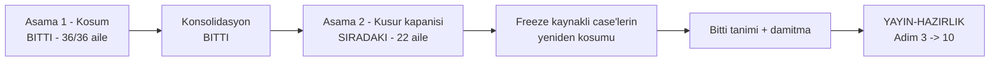

# Manuel Kabul Testi — Kapanış Planı (2026-09-16 turu)

> **Bu turu kapatan her oturum ÖNCE burayı okur.** Koşum bitti; bu dosya
> kapanışın tek kontrol düzlemidir.
>
> **Durum:** 🟡 Aşama 2 sürüyor · **Aile A ve B KAPANDI** · 39 açık kusur, 20 aile kaldı
> **Son güncelleme:** 2026-09-18 (Aile B kapandı — `S4-003` · `S3-004` · `S1-011`)

Turdan bağımsız kapanış protokolü — aile aile oturum yordamı, "önce ampirik
yeniden üret" kuralı, bitti tanımı ve sayım betiği —
[`manuel-test-kosumu/SKILL.md`](../../../../.agents/skills/manuel-test-kosumu/SKILL.md)
§6–§8'dedir. **Burada tekrarlanmaz.**

---

## 1. Okuma sırası — bundan fazlasını okuma

| Sıra | Dosya | Niçin |
|---|---|---|
| 1 | bu dosya | durum, aile listesi, sıradaki iş |
| 2 | `manuel-test-kosumu/SKILL.md` §6–§8 | kapanış protokolü — **tek kaynak** |
| 3 | [`kusur-giderme/SKILL.md`](../../../../.agents/skills/kusur-giderme/SKILL.md) | sınıf taraması — aile ortasında okunur |
| 4 | koşacağın ailenin kayıt dosyası | kusurun tam metni, log alıntısı, `dosya.cs:satır` |

[`DEVIR.md`](DEVIR.md) **koşumun** devir notudur. Kapanış için yalnız §8'inin
açık kalem tablosu ve ortam kuralları ilgilidir; baştan sona okuma.

---

## 2. Nerede duruyoruz

Koşum 36 ailenin 36'sında bitti. Dört şerit dalı `main`'e alındı, worktree'ler
silindi. Kod tur boyunca `7e3a4de7`'de donuk kaldı ve merge'lerden sonra da
donuk (`git diff --stat 7e3a4de7..HEAD -- src samples tests` boş).



**Sayım** (skill §7, düzeltilmiş betik — bkz. §3.1):

| Durum | Sayı |
|---|---|
| ☑ Geçti | 1693 |
| ☒ Kaldı | 35 |
| ☐ Beklemede | 107 |
| ⏭ Atlandı | 18 |
| işaretsiz (gerekçe düz metin) | 3 |
| **toplam benzersiz case** | **1856** |

**Kusur:** 44 `HATA-*` kaydı. `HATA-S1-006` yanlış pozitif çıktı ve kapandı →
**43 açık**. Dağılım: `S1-001..028` (27) · `S2-001..003` (3) · `S3-001..008` (8)
· `S4-001..005` (5).

### Kullanıcı kararları (2026-09-18, bağlayıcı)

1. Kapanış **tek şeritte**, `main` üzerinde, aile aile koşar. Paralel şerit yok.
2. **43 kusurun hepsi kodlanır.** Yalnız yeni yetenek isteyen bulgular
   `docs/ADAYLAR.md`'ye `F-NN` olur (skill §6).
3. Kod donması yüzünden `Beklemede` kalan case'ler kapanışta **yeniden
   koşulur** (§5). Gerçekten fiziksel/insan gerektirenler açık kalem kalır.

---

## 3. Düzeltilmiş öncüller — ÖNCE BUNU OKU

Bu turun ölçtüğü ve bir daha keşfedilmemesi gereken şeyler.

### 3.1 Sayım betiğinin üç kör noktası kapandı

`SKILL.md` §7'nin betiği bu turun **her** ölçümünü bozuyordu. Üçü de düzeltildi
(commit `83cc7a5d`): glob 30–36 ailelerini görmüyordu · başlık yalnız `^## `
arıyordu (dosyaların yarısı `### MT-…` kullanır) · blok sayıyordu, case
kimliği değil. **Eski sayılara güvenme**, betiği yeniden koş.

### 3.2 `kapi.py kapanis` bu turda ikinci adımda duruyor

Kapı fail-fast'tir ve `dokuman-bakim.py --denetle` ikinci adımdır. Koşum kaydı
bütçeyi 3,6 kat aşıyor (2.214.672 B / 620.000 B), yani **damıtma (§6) koşana
kadar `kapanis` .NET kapılarına hiç ulaşmaz**. Kapanış oturumları kalan sekiz
kapıyı doğrudan koşar:

```bash
python3 -m unittest discover -s scripts -p '*_test.py'
node docs-site/scripts/build-agent-map.mjs --check
python3 scripts/denetim-paketi.py --taban 7e3a4de7
dotnet build Tracon.slnx -c Release
dotnet test  Tracon.slnx -c Release --no-build -maxcpucount:1 -- --report-trx
dotnet pack  Tracon.slnx -c Release --no-build -p:TraconSkipCleanWorkingTreeCheck=true
dotnet format Tracon.slnx --verify-no-changes
(cd docs-site && npm run check)
```

> ⚠️ `dotnet test --no-build` kırık build'de ESKİ ikiliyi koşar ve yanlış yeşil
> verir. `--no-build` öncesi build'in başarılı olduğunu doğrula.

Bütçe kırmızısı **kabul edilmiştir**; `dokuman-bakim.py --denetle`'nin diğer
**tüm** kontrolleri yeşildir (konsolidasyonda iki yanlış pozitif kaynağı da
düzeltildi — bkz. §3.3). Oturum sonunda yalnız onlara bak.

### 3.3 `dokuman-bakim.py`'nin iki yanlış pozitifi

Kayıt dosyası bir bağlantıyı ya da `git show <sha>:<yol>` komutunu **karşı
örnek olarak** alıntıladığında kapı onu gerçek sanıyor:

- Satır içi kod **satır sonunu aşamaz** (`_SATIR_ICI_KOD`), bu yüzden iki satıra
  bölünen `` `[kapilar.md](kapilar.md)` `` alıntısı gerçek bağlantı sayıldı.
- `tam_metin_denetle` kod bloklarını **soymuyor**, bu yüzden "bu yol çözülmez"
  diyen bir karşı örnek kapıyı kırmızı yaptı.

İkisi de kayıt metni tek satıra toplanarak/yeniden yazılarak çözüldü. Kapının
kendisi **düzeltilmedi** — Aile T'ye yazıldı.

### 3.5 Taban çizgisi ölçümü — 2026-09-18

Konsolidasyon sonrası sekiz kapı doğrudan koşuldu:

| Kapı | Sonuç |
|---|---|
| `unittest discover -s scripts` | ✅ |
| `build-agent-map.mjs --check` | ✅ |
| `denetim-paketi.py --taban 7e3a4de7` | ✅ |
| `dotnet build -c Release` | ✅ sıfır uyarı |
| `dotnet test -c Release` | ⚠️ **1 düşen** — `PackCleanlinessGateTests.DirtyWorkingTreeStopsPackWithTracon0004`; diğer her test projesi yeşil |
| `dotnet pack` · `dotnet format` · `npm run check` | ✅ |

**Düşen test yeniden üretilmedi.** İzole koşumda `PackCleanlinessGateTests`'in
altısı da geçti (`dotnet test tests/Tracon.Package.Tests -c Release --no-build
-- --filter-method "*PackCleanlinessGateTests*"`). Yük altında kırılgan;
`HATA-S1-001`/`002` ile aynı sınıf ve **Aile T**'ye üçüncü örnek olarak
yazıldı. Taban çizgisi bu yüzden **yeşil sayılır**.

---

### 3.4 Turun bıraktığı ortam kuralları

Bunlar kapanış oturumlarında da geçerlidir ve bitti tanımında
`docs/hafiza/`'ya taşınacaktır.

| Kural | Ayrıntı |
|---|---|
| `QuotaEnforcer` önbelleği | `_firedThresholds` süreç-içidir; SQL ile temizlenmez, uygulama **yeniden başlatılmalı** |
| Uygulamayı başlatma | `dotnet run` iki şeritte sebepsiz "Application is shutting down" verdi. Derlenmiş DLL'i doğrudan çalıştır: `dotnet artifacts/bin/Tracon.Api/release/Tracon.Api.dll --urls …` |
| `user-secrets` okuma | `dotnet user-secrets list` **asla filtresiz** koşulmaz; her zaman `grep`'le |
| Yanıt alanları | Kökte değil: `usage.totalTokens` · `response.messages[0].contents[0].text` · sağlıkta `providerName` |
| `GET /api/runs/{id}/events` | SSE döner, JSON değil. Ham `grep` çok satırlı `data:` gövdesini böler |
| Sağlayıcı hatası ayrıntısı | Yanıtta değil **günlükte** (`SafeErrorText` kasıtlı sabitler `upstream_error`) |
| Devre kesici | Süreç-içidir; onu sınayan case ayrı bir örnekte koşulur |
| Kiracı başlığı | İki bayrak ister: `Tracon:Tenancy:Enabled=true` **ve** `AllowHeaderResolution=true`; ikisi de varsayılan kapalı ve kapalıyken başlık **sessizce** yok sayılır |
| Nokta/tire taşıyan ayar | Ortam değişkeni olamaz (zsh reddeder). Komut satırını kullan: `-- "--Tracon:Pricing:openai:gpt-5.4-mini:Input=0.25"` |
| `timeout` | macOS'ta yoktur (çıkış 127). Süreci arka planda koş, çıkış kodunu dosyaya yaz |
| Model adı | `gpt-5.4-mini`. Rastgele bir OpenAI modeli `403 model_not_found` verir |
| Azure | Kimlik **yoktur**; Azure isteyen case `⏭ Atlandı` kalır, kusur değildir |

---

## 4. Aileler

Aile = aynı kök nedeni paylaşan kusur kümesi. **Bir oturum bir aile bitirir.**
Sıra yukarıdan aşağıdır; yüksek öncelik önce kapanır.

> 🚨 **Düzeltmeden önce kusuru ampirik olarak yeniden üret.** Kusurların bir
> kısmı önceki dalgalarda **zaten kapanmış** olabilir; 2026-08 turunda üç kusur
> böyle çıktı. Varsayma, ölç.

### Yüksek öncelik

| Aile | Kusur | Kök neden ve sınıf taraması sorusu | Durum |
|---|---|---|---|
| **A** · Store kaydı sözleşmesi | `S1-019` **Yüksek** | `UsePostgreSql` tüketicinin store kaydını `Replace` ile **sessizce** eziyor. `AGENTS.md`'nin "`TryAdd*` ile kaydet; tüketicinin kaydı her zaman kazanmalı" kuralının ihlali — bir **paket sözleşmesi** kusuru. 117 çağrı, 34 store arayüzü, üç sağlayıcı. `samples/Tracon.Embedded`'in README'sinde belgelenmiş akışı kırıyor (`MT-PG-068` bu yüzden Kaldı). ✅ **Açık soru yanıtlandı (2026-09-18):** `RequireCustomBinding<ITenantStore>()` **patlardı ama yanlış nedenle** — `TraconExtensionPoints.All` yalnız **yedi** sözleşme taşıyor (`ITenantContext`, `IRunAttributionContext`, `IToolAuthorizationHandler`, `IRunAuthorizationHandler`, `IRunEventSink`, `IAttachmentStorage`, `IToolApprovalPresenter`) ve `ITenantStore` bunlardan biri değil; mesaj "kaydın ezildi" değil "bu bir genişleme noktası değil" olurdu. Koruma mekanizmasının 34 store sözleşmesinde **hiç kapsamı yok** ∴ kusur yalnız örnekte değil, mekanizmanın kendisinde. `samples/Tracon.Embedded/Program.cs:17` kendi yorumunda `ITenantStore`'u 1. gömülme noktasının parçası sayıyor — mekanizma onu tanımıyordu | ✅ **KAPANDI 2026-09-18** |
| **B** · Run kaydının doğruluğu | `S4-003` **Yüksek** · `S3-004` **Yüksek** · `S1-011` Orta | Üçü de "run kaydı gerçeği yansıtmıyor": guard'ın GİRİŞ-öncesi istisnası run kaydını hiç oluşturmuyor (istemci SSE'de `error` görür, `GET /api/runs/{id}` `404` verir — denetim/yeniden-deneme/idempotency o run'ı bulamaz); lease devralan ikinci deneme sessizce başarısız kalıyor ve run sonsuza dek `Running`; çakışmayla düşen run kayıtta `Completed` görünüyor. **Tarama:** her terminalleşme yolu kaydı gerçekten yazıyor mu? | ✅ **KAPANDI 2026-09-18** |
#### Aile B — ✅ kapandı (2026-09-18)

Üç kusur, tek tema ("run kaydı gerçeği yansıtmıyor"), **üç ayrı kök neden** —
ve üçü birlikte run'ın ömrünün üç ayrı penceresini kapatıyor.

| Pencere | Kusur | Kök neden | Düzeltme |
|---|---|---|---|
| Run satırı yazılmadan **önce** | `S4-003` | Guard'ın girdi önizlemesi `start.Writer.StartAsync`'ten önce koşuyor; `throw` ederse hiç satır yok | Önizleme kendi `try`/`catch`'inde; istisnada kayıt **sorgu metni olmadan** açılır, sonra orijinal istisna `ExceptionDispatchInfo` ile yeniden fırlatılır. Akışlı yola kendi `catch`'i eklendi (önceden `finally`'ye düşüp `Canceled` yazıyordu) |
| Run **sürerken** (döngü) | — | Zaten doğruydu | Ölçüldü ve testle kilitlendi |
| Run bittikten **sonra** | `S1-011` | `SaveSessionAsync` `RunAsync`'ten sonra çağrılıyor; `Completed` çoktan yazılmış | Yeni `RunEventType.SessionWriteConflicted = 32`; durum `Completed` kalır 👤 |
| Yeniden deneme (lease devralma) | `S3-004` | `RunEventWriter._sequence` her denemede sıfırdan; `(run_id, seq)` çakışıyor, writer kalıcı devre dışı, `CompleteRunAsync` sessizce atlanıyor | `IRunStore.GetLastEventSequenceAsync` eklendi 👤; writer diziyi sürdürüyor |

**Alınan iki karar 👤 (2026-09-18):**

1. **`S1-011` — durum `Completed` kalır, çakışma yeni bir olay olur.** Run
   gerçekten tamamlandı; `Failed` demek maliyetini ve ürettiği yanıtı da
   başarısız gösterirdi, ve uyarı hatları bunu gerçek bir kesinti sanabilirdi.
2. **`S3-004` — son `seq` sözleşmeden okunur.** `IRunStore`'a
   `GetLastEventSequenceAsync` eklendi. Bedeli ölçüldü: **on** uygulayıcı
   güncellendi (üç ürün store'u, `FileRunStore` örneği, bench, altı test stub'ı)
   ve `RunStoreContract` iki yeni testle bunu üç sağlayıcıda birden zorluyor.

🚨 **Sınıf taraması bir varsayımı ölçüme çevirdi.** `S4-003`'ün kaydı "çıktı
denetiminde atılan istisna etkilenmeyebilir, doğrulanmadı" diyordu. Ölçüldü:
beklenen doğruydu — o kontrol run satırı yazıldıktan sonra korunan bölgede
çalışıyor — ve artık testle kilitli.

🚨 **Kapılar, tek bir enum üyesinin ve tek bir store metodunun kaç yeri
birden güncellettiğini gösterdi** — `AGENTS.md`'nin "imza değiştirmek ile
gövdeyi kullanmak iki ayrı adımdır" kuralının somut kanıtı. Aile B'nin
kapanışında **sekiz** takip düzeltmesi çıktı:

| Kapı | Ne istedi |
|---|---|
| `RunEventTypeFrontendParityTests` | `run-event.ts`'in `RunEventType` union'ı |
| — aynı kapı | `run-detail.tsx`'in `EVENT_STYLE` haritası |
| `RunEventFrameNameContractTests` | `RunEndpoints.EventName` — yoksa telde `unknown`'a düşerdi |
| `RunEventTypeTests` | kalıcı sayısal sözleşme listesi |
| `ShippedDocumentationSelfContainmentTests` | sevk edilen XML dokümanında `HATA-*` referansı olamaz — tüketicinin elinde olmayan bir kayda işaret eder. **Taban tazelenmedi**, dört satırın metni düzeltildi. (Düz `//` yorumda serbest; kapı yalnız `///` satırlarına bakıyor.) |
| `TenantCoverageTests` | yeni store metodu ya kiracı izolasyon sözleşmesinde olmalı ya `[TenantAgnostic("gerekçe")]` taşımalı |
| `SqlTextSnapshotTests` ×3 | üç sağlayıcının SQL metin tabanı — tazelendi, fark **yalnız** yeni sorgu |

🚨 **SQL sorgusunda tenant join'i bilinçli olarak YOK.** Çağıran run'ın kendi
writer'ıdır. Tenant filtresi, ortam kiracısı run'ınkinden farklı olan meşru bir
devralmada (job kuyruğu, workflow — K-355) "hiç olay yok" derdi ve writer
sıfırdan başlardı: tam da bu sorgunun engellemek için var olduğu çakışma.

---

| **C** · Tracon'un kendi istisnası maskeleniyor | `S1-024` **Yüksek** · `S4-005` Orta | Tool içi `TraconException` mesajı modele hiç ulaşmıyor — `FunctionInvokingChatClient` onu `"Error: Function failed."`e çeviriyor. Aynı desen sağlayıcı fabrikasında: `ProviderFailureNormalizer` Anthropic/Google fabrikalarının kendi el ile attığı doğrulama hatalarını (düşünme bütçesi, güvenlik eşiği) yabancı SDK hatasıyla aynı maskeye sokuyor, özgül mesaj `/api/agents/validate`'te kayboluyor. **Tarama:** `throw new TraconException` kullanan HER tool ve fabrika | ☐ |
| **D** · MCP çıktısı kırpılmıyor | `S1-026` **Yüksek** | `TruncatingAIFunction` MCP tool sonuçlarını (`AIContent`) atlıyor. Ölçüm: `Tracon:Tools:DefaultMaxOutputBytes=200` iken modele **8095 bayt** gitti — sınırın 40 katı, hiçbir kırpma işareti yok. Sessizce fark edilmez | ☐ |
| **E** · Eval case kimliği sıfırlanıyor | `S3-003` **Yüksek** | `PUT /api/evals/{name}/cases` suite'teki **her** case'in id'sini sıfırlıyor: `EvalCaseInput` DTO'sunda `Id` yok → `SaveCasesAsync` hep `Guid.Empty` alıyor. Sonuç: aynı pencerede gerçek bir regresyon "Removed" sayılıp `--max-regressions 0` kapısını **sessizce** atlatabiliyor. Kök neden `EvaluationContracts.cs`/`EvalEndpoints` satır düzeyinde tespit edildi | ☐ |
| **F** · SSE ve düşünme kaydı | `S3-005` **Yüksek** · `S3-006` **Yüksek** | Bağlantı sessizce koparsa çalıştırma ekranı sonsuza dek "Waiting for events…" yazısında donuyor; kullanıcıya hiçbir hata gösterilmiyor. Ayrıca `RecordReasoningDeltas=true` iken model gerçekten düşünme içeriği üretse bile `ReasoningDelta` olayı HİÇ kaydedilmiyor (gerçek Anthropic extended-thinking çağrısıyla ölçüldü). İki ayrı katman — aynı oturumda kapanır, iki commit olabilir | ☐ |
| **G** · Maliyet muhasebesi | `S1-025` **Yüksek** · `S1-010` Orta | Zaman aşımından SONRA başarıyla biten tool çağrısının kullanım/maliyeti kalıcı olarak kayboluyor. Ayrıca katalogdaki **13 modelin hiçbirinde fiyat yok** → her `run` maliyetsiz kaydediliyor; mekanizma dürüst (`pricing_source=NotDefined`), eksik olan **veri** | ☐ |
| **H** · Derlenmiş agent önbelleği | `S4-004` **Kritik** | `CompiledAgentCache.Evict` HİÇBİR YERDEN çağrılmıyor. Silinip aynı adla yeniden oluşturulan agent, sürüm sayacı 1'e sıfırlandığı için ESKİ (silinmiş) tanımla çalışmaya devam ediyor. `GET /api/agents/{name}` doğru görünür ama **çalıştırma yanlış** — sessiz ve operatörü yanlış yöne yönlendirir | ☐ |

#### Aile A — alınan iki karar 👤 (2026-09-18)

1. **`Replace` tüketicinin kaydını bulunca onu KORUR ve başlangıçta `Warning`
   loglar.** Tracon'in kendi `TryAdd` varsayılanı işaretlenir; `Replace` yalnız
   **işaretli** kaydı ezer. İşaretsiz (yani tüketicinin) bir kayda dokunulmaz ve
   host başlarken "`ITenantStore` için kendi kaydınız kullanılıyor;
   `UsePostgreSql` onu ezmedi" uyarısı düşer. Kırıcı değildir ve sessiz kaybı
   kapatır.
   - İşaretin doğru sinyali **hangi `ServiceDescriptor`'ı Tracon'in eklediğidir**.
     `TryAdd` tüketici önce kaydettiyse zaten no-op olur; o durumda contract için
     Tracon'in bir varsayılanı **hiç yoktur**. Yani `ImplementationType` kontrolü
     yetmez — varsayılanlar `TryAddSingleton<T>(factory)` ile kaydediliyor ve
     `ImplementationType` `null`.
2. **`RequireCustomBinding<T>()` store sözleşmelerini de kabul eder.** Tüketici
   `RequireCustomBinding<ITenantStore>()` yazabilir; kayıt ezilir ya da düşerse
   host **başlamaz**. Aynı işaret mekanizmasını paylaşır. `samples/Tracon.Embedded`
   bu çağrıyı ekler ve README'sindeki akış böylece kapıyla kilitlenir.

Kapsam: `Tracon.Core` (işaret + varsayılan kayıtlar) · `Tracon.PostgreSql` ·
`Tracon.SqlServer` · `Tracon.Sqlite` (117 `Replace` çağrısı) ·
`TraconExtensionPoints` · `samples/Tracon.Embedded`.

#### Aile A — ✅ kapandı (2026-09-18)

| Adım | Sonuç |
|---|---|
| Ampirik yeniden üretim | ☑ eski kodda `ConsumerStoreRegistrationTests` düştü — tüketicinin store'u yerine `AuditingTenantStore` çözüldü |
| Kök neden düzeltmesi | `TraconDefaultRegistrations` işaret mekanizması; 117 `Replace` + 35 varsayılan dönüştürüldü |
| Sınıf taraması | ☑ üç sağlayıcının üçü de aynı 39 `Replace` çağrısını paylaşıyordu; üçünde de aynı test koşuyor |
| Uyarı | `PreservedStoreRegistrationWarningService` korunan sözleşmeyi adıyla loglar |
| Koruma kapsamı | `RequireCustomBinding` store sözleşmelerini kabul ediyor; kabul kümesi **kendi kendini besler** (ayrı liste yok) |
| Canlı koşum | ☑ `MT-PG-068` yeniden koşuldu — üç beklentinin üçü de karşılandı, `GET /api/runs/{id}` `404` → **`200`**, liste `403` → **`200`** |
| Testler | Core 7 mekanizma testi · üç sağlayıcıda 3'er sınıf testi · `RequiredBindingTests` + `RequiredBindingStartupTests` yeni sözleşmeye taşındı |

🚨 **Bir test gerçek bir tasarım boşluğu buldu.** Tüketici sözleşmeyi
`AddTracon()`'dan ÖNCE kaydettiğinde `TryAdd` no-op olur ve hiçbir işaret
yazılmıyordu; `RequireCustomBinding<ITenantStore>()` tam da o tüketici için
"genişleme noktası değil" diye reddediliyordu. **Bilmek** ile **sahip olmak**
iki ayrı küme yapıldı.

🚨 **Üç test değişikliğin beklenen sonucu olarak düştü ve düzeltildi** —
`SourceLanguageTests` (yeni test dosyasında iki Türkçe satır; **taban
tazelenmedi**, metin İngilizce'ye çevrildi) · `ServiceRegistrationSnapshotTests`
(iki yeni kayıt, sıralama değişmedi) · `RequiredBindingStartupTests`
(`IRunStore` artık **kabul ediliyor**; test `IDisposable`'a taşındı ve store
kolu için ikinci bir test eklendi).

---

### Orta ve düşük öncelik

| Aile | Kusur | Kök neden | Durum |
|---|---|---|---|
| **I** · Opak `500` ve ham istisna | `S1-015` Orta · `S1-021` Orta · `S1-023` Düşük-Orta | Bekleyen migration varken yazma ucu opak `500` dönüyor — uygulama 51 bekleyen migration'ı biliyor (`/health` 503, `diagnostics`) ama yanıta taşımıyor; erişilemez veritabanı da aynı opak `500`'e düşüyor. `ExternalSurfaceGuard` kendi XML doc'unun aksine veritabanına dokunuyor ve taze SQL şemasında çöküş mesajı yanlış sınıfa düşüyor. Yanlış (ama var olan) bir `ContentProtection` anahtarı ham `AuthenticationTagMismatchException` sızdırıyor — sınıfın diğer dört hata dalı düzgün `TraconException` üretiyor | ☐ |
| **J** · Sağlayıcı hatası sınıflandırma | `S1-020` Orta | Normalleştirilen **her** sağlayıcı hatası `RunError.Class = Unknown`'a **ve tek bir fingerprint'e** düşüyor; K-296'nın eklediği desenler bu yolda ölü kod. İki bağımsız ölçüm (OpenAI 404 · OpenRouter 402) aynı parmak izini verdi; 17 kararlı kimliğin 10'u sınıflandırıcıda tanınmıyor. **Karar gerekir:** en küçük düzeltme `StableIdentities`'e giriş eklemek, ama fingerprint sabit `SafeErrorText` mesajından üretildiği için **ayrı bir girdiye** dayanması gerekebilir | ☐ |
| **K** · Sevk edilen metinde dil karışıklığı | `S1-012` Orta · `S1-018` Orta | Üç sevk edilen hata mesajında yarım kalmış Türkçe (`ne 'Input' ne 'Output' contains neither value`). `SourceLanguageTests` iki harfli kelimeleri bilinçli dışladığı için bunu **yapısal olarak** göremiyor. Düzeltme kapıyı da kapsar (K-228; taban **yalnız küçülür**) | ☐ |
| **L** · Katalog ve agent kaynağı mesajları | `S1-009` Orta · `S1-013` Düşük · `S1-008` Düşük · `S1-014` Düşük | Kod kaynaklı agent'ın `versions` ucu "böyle bir agent yok" diyor — agent var; `IAgentDefinitionStore`'da yokluk her yerde yokluk sanılıyor. `Custom` kaynaklı agent'a "bu agent kodda tanımlı" deniyor, yönlendirme de yanlış. Bilinmeyen `compaction.strategy` reddediliyor ama mesaj ne reddedilen değeri ne geçerli listeyi söylüyor. Analyzer'ın `TRC0007` metni `AddScopedTool`'u anmıyor; runtime metni anıyor — pratikte görülen analyzer'ınki | ☐ |
| **M** · Sağlık ve açılış gürültüsü | `S1-016` Düşük-Orta · `S1-017` Düşük | `/health` kendi başına hiçbir zaman `Healthy`'ye ulaşmıyor — `/api/models/health` çağrılmadıkça sonsuza dek `Degraded`. Taze şemaya karşı her açılış `Error` seviyesinde yığın izi basıyor; yutma bir katman geç yapılıyor | ☐ |
| **N** · CSP ve inline script | `S1-004` · `S2-002` Düşük-Orta | Aynı sınıf, iki yüzey. Hem gömülü arayüzün hem gömülü konsolun `index.html`'i nonce/hash'siz bir inline `<script>` taşıyor (erken tema boyama), ama aynı yanıtın kendi CSP başlığı `script-src 'self'` gönderiyor — script **her sayfa yüklemesinde** engelleniyor. `theme.ts` sonradan doğru temayı yazdığı için işlevsel kırılma yok, erken-boyama optimizasyonu hiç çalışmıyor (olası FOUC) | ☐ |
| **O** · HTTP sözleşme kusurları | `S4-002` Orta | `PUT /api/schedules/{name}` gövdede `payload` alanı olmadan `500` veriyor. **Tarama:** aynı desendeki diğer `PUT`/`POST` uçları | ☐ |
| **P** · Denetim secret filtresi | `S1-022` Düşük-Orta | `AuditSecretFilter` bazı BENİGN alan adlarını da (`ConfigurationKey` son eki, `AuthorizationMode`) gereksizce `"***"` yapıyor | ☐ |
| **Q** · Eval ve geri bildirim arayüzü | `S3-007` Orta · `S3-008` Düşük | `FeedbackControl`, bir run'da bir `Stars` puanı da varsa "tekrar tıkla = sil" yerine yinelenen satır oluşturuyor. "Şimdi puanla" düğmesi yargıç yokken HİÇBİR mesaj göstermiyor (tip uyuşmazlığı) | ☐ |
| **R** · Playground arayüzü | `S1-027` Düşük · `S1-028` Düşük | Agent kataloğunda tool sayısı hücresinin tam tool adı listesi hiçbir yerde (ne tooltip ne görünür metin) sunulmuyor. Akış imleci (`ap-stream-caret`) CSS sınıf adı uyuşmazlığı yüzünden hiçbir zaman görsel olarak render edilmiyor | ☐ |
| **S** · Gözlemlenebilirlik span'i | `S2-003` Düşük | Başarılı script çalıştırmalarında bile `execute_skill_script` span'i `exit_code`/`duration_ms` taşımıyor ve ebeveyn span yanlışlıkla "Error" gösteriyor (`SandboxedSkillScriptRunner.cs:355-359`). Yalnız gözlemlenebilirlik, işlevsel etki yok | ☐ |
| **T** · Kapılar ve geliştirme aparatı | `S4-001` Orta · `S3-001` Düşük · `S2-001` Düşük · `S1-005` · `S1-001` · `S1-002` · `S1-003` + §3.3'ün iki yanlış pozitifi | Ölü-tanı-referansı kapısının regex'i eski ürün adının önekini arıyor, artık hiçbir şeyi yakalamıyor. `npm run check` fresh checkout'ta yanlış sırayla kırılıyor. `AGENTS.md` ham `kapanis` komutunu tekrarlıyor (Faz 92 ihlali). Şablonun kendi yer tutucusu teşhis edilemeyen bir ilk koşum hatası üretiyor. SQLite entegrasyon testleri tam çözüm yükü altında `database is locked` veriyor; `LiveVoiceLifecycleTests` yük altında kırılgan; `dotnet test` 2,5 dakika eşiği bugünkü set için ulaşılabilir değil. **Üçüncü kırılganlık örneği ölçüldü (2026-09-18 taban çizgisi):** `PackCleanlinessGateTests.DirtyWorkingTreeStopsPackWithTracon0004` tam çözüm koşumunda düştü — `ExitCode` `0` geldi, yani kirli ağaçta `dotnet pack` BAŞARILI oldu ve `TRACON0004` hiç çıkmadı — ama **izole koşumda altısı da geçti**. Üç kırılganlığın kök nedeni birlikte aranmalı. **Ürün değil apparat** — ayrı commit'ler, hızlı kapanır | ☐ |
| **U** · docs-site | `S3-002` Düşük | Açılış sayfası 1024 px'te 32 px yatay taşıyor (`.scope-rings`) — dekoratif arka plan grafiği, içerik okunabilirliğini bozmuyor | ☐ |
| **V** · `CHANGELOG` düğümü | `S1-007` | **Kod kusuru değil, karar.** `scripts/kapi.py` hedef sürüm için `CHANGELOG.md`'de `## [<sürüm>]` bölümü arıyor; changelog ise bilinçli olarak yalnız `## [Unreleased]` taşıyor (`6cfbc2d3` sürüm bölümünü **bilerek** geri aldı). İki kural birbirini kilitliyor. `K-*` olarak çözülür ve `YAYIN-HAZIRLIK.md` Adım 5'e bağlanır. Bloklanan case'ler: `MT-PKG-104 · 105 · 115 · 116 · 117` | ☐ |

`HATA-S1-006` (docs-site içerik kapısı temiz ağaçta kırmızı) **yanlış pozitif**
çıktı ve kapandı — yeniden açılmaz.

---

## 5. Freeze kaynaklı `Beklemede` case'lerin yeniden koşumu

110 açık case üç sınıfa ayrılır. Kullanıcı kararı: **(a) koşulur.**

### (a) Yalnız kod donması engelledi — kapanışta KOŞULUR

Donma kalktığı için bu case'ler artık koşulabilir. İlgili ailenin düzeltmesi
bittikten **sonra** aynı oturumda koşulur.

| Aile | Case'ler | Ne ister |
|---|---|---|
| 13 (SEC) | `MT-SEC-024` · `084` · `105` · `121` · `122` | `samples/Tracon.Api`'ye geçici `AddToolApprovalPolicy` / özel handler kaydı |
| 13 (SEC) | `MT-SEC-141..150` · `152..163` (22 case) | `Program.cs`'e geçici özel `IRunAuthorizationHandler` (`services.Replace(...)`). `samples/Tracon.Embedded` ikamesi araştırıldı ve **yetersiz**: reddi KİRACI temelli üretiyor, case'ler KULLANICI temelli reddi ölçüyor; `AuthorizeSessionAsync` her zaman `Allow()` döner |
| 13 (SEC) | `MT-SEC-183..189` (7 case) | `Program.cs`'e geçici `RequireProductionProfile(...)` çağrısı. `MT-SEC-189` "HTTP yüzeyi olmayan host" ister — `Tracon.Embedded` de `MapTracon` çağırdığı için uymuyor; repo dışı minimal bir host gerekir |
| 18 (MCP) | `MT-MCP-034` · `035` · `045` · `047..049` · `053` | `TraconEndpointOptions.AllowRemoteAccess` vb. geçici `Program.cs` değişikliği |
| 19 (MM) | `MT-MM-097` · `103` · `108` · ve aynı sınıftan diğerleri | Özel `UriContent` dönen test adaptörü — donuk `samples/` taşımıyor |
| 12 (OBS) | `MT-OBS-046` · `047` · `055` · `059` | gerçek `samples/Tracon.Api` + sağlayıcı anahtarı yapılandırması |
| 03 (PG) | `MT-PG-067` adım 2 | `src/` altında kod değişikliği ister; adım 1 ve 3 yeşil koşuldu. Yordam dosya 03'ün sonundaki tabloda |
| 21 (RES) | `MT-RES-090` | aynı sınıf |
| 01 (PKG) | `MT-PKG-104` · `105` · `115` · `116` · `117` | **Aile V** (CHANGELOG kararı) kapanınca çözülür |

### (b) Ortam sınırı — kapanışta ÇÖZÜLEBİLİR

| Case | Engel | Kapanış yordamı |
|---|---|---|
| `MT-SEC-190..193` | Tur `postgres` süperkullanıcısını kullandı; süperkullanıcılar `REVOKE`'tan **etkilenmez** (PostgreSQL'in kendi davranışı) | İzole bir doğrulama sunucusunda kısıtlı bir `tracon_app` rolü oluştur, uygulamanın bağlantı dizesini o role çevir, tek seferlik koş. `MT-SEC-193` ayrıca `IDataSubjectResolver`'ın hiç kayıtlı olmamasıyla ikinci bir engele takılıyor |
| `MT-SEC-126` | Paylaşılan tarayıcı kilidi | Şerit yok artık; doğrudan koşulur |
| `MT-UIRUN-001` | `mt_s3` şemasını `DROP SCHEMA … CASCADE` ile sıfırlamak gerekiyordu | Şeritler kapandı; şema artık serbestçe sıfırlanabilir |
| `MT-UIRUN-063` · `MT-SEC-108` · `118` | Ortamda "reader" rolünü temsil eden ayrı kimlik yok; tek statik bearer token her zaman tam rol taşıyor | Kapanışta ikinci bir token/rol yapılandırılabilir |
| `MT-MM-088` | LAN arayüzünde dinlenmiyordu | Yeniden yapılandırılabilir |

### (c) Gerçekten insan/fiziksel eylem gerekir — 👤 KULLANICIYA SORULUR

Bunlar kodla çözülemez. Kapanış bittiğinde **tek listede** kullanıcıya sunulur;
koşulmayanlar `00-INDEKS.md` §7.1'e gerekçesiyle yazılır.

| Case | Ne gerekiyor |
|---|---|
| `MT-UI-042` | Gerçek WebKit/Safari motoru (bu kurulum yalnız Chromium sağlıyor) |
| `MT-SEC-174` | En az birkaç milyon satırlık dolu tablo + gerçek kilit-süresi ölçümü |
| `MT-MCP-058` | Erişilebilir gerçek bir İÇ AĞ MCP sunucusu (ev/ofis ağı) |
| `MT-MCP-067` | Gerçek zaman aralığı — `TaskTimeToLive` dolana kadar bekleme |
| `MT-MM-086` · `087` · `110` · `111` | Gerçek mikrofon ve konuşma |
| `MT-GUARD-095` · `106` | Geçersiz yapısal yanıt — OpenAI'nin `response_format` sözdizimsel garantisi yüzünden gerçek sağlayıcıyla **üretilemez** |
| `MT-AGD-018` | İzole, taze bağlamlı bir kod agent'ına yalnız yayımlanmış `guides/embedding.md` verilerek ölçüm |
| `MT-AGD-024` | Gerçek `claude` CLI (`--output-format stream-json`) izole bir proje kökünde |
| `MT-YRF-026` · `027` | Dış ölçüm deposu (`prodigy-enabler-backend`) bu ortamda yok |
| `MT-DDG-017` · `018` | İnsan gözü — üretilen görüntünün anlattığının **doğruluğu** |
| `MT-DKL-001` · `002` · `003` · `004` · `006` | İnsan gözü — tipografi/hizalama yargısı |
| `MT-GDK-024` | İkinci bir işletim sistemi (Linux CI'da `kapi.py performans --guncelle`) |
| `MT-CORE-095` | Bu depoda kiracıya duyarlı örnek bir `IAgentSource` **yok** — `ADAYLAR.md` adayı olabilir |

---

## 6. Kapanış bitince

1. **Bitti tanımı** — skill §7'nin on maddesi. İçinde dört kapı,
   `docs/hafiza/` tuzak notları (§3.4'ün tablosu), `ADAYLAR.md`'ye yetenek
   adayları ve `00-INDEKS.md` §7 `Koşum` sütununun bu turun sayımıyla
   değiştirilmesi var. `00-INDEKS.md` §3.2'nin tool tablosu da bayat — bugün
   **10** tool var, tablo 4 diyor.
2. **Damıtma** — önce `--kuru`:
   ```bash
   python3 scripts/dokuman-bakim.py kosum-damit docs/manuel-test/kosumlar/2026-09-16 --kuru
   python3 scripts/dokuman-bakim.py kosum-damit docs/manuel-test/kosumlar/2026-09-16
   ```
   **Asimetriktir:** yalnız temiz `☑ Geçti` case tek tablo satırına iner;
   geçmeyen ve ⚠️/🚨/`düzeltme`/`kusur` işareti taşıyan her case **bire bir**
   korunur. **İçerik silinmez.** Spesifikasyon dosyalarına dokunulmaz.
3. **Arşiv** — kayıt `docs/arsiv/manuel-test-kosum-2026-09/` altına taşınır.
4. **Tur aparatı ve anahtarlar — kullanıcı eylemi:**
   - 🚨 Beş sağlayıcı anahtarı tur boyunca düz metne çıktı (üç ayrı olay:
     `ps eww`, filtresiz `user-secrets list`, ortam hata ayıklaması).
     **Beşi de döndürülmeli.** Kapanışın **sonunda** yapılır — kapanış
     oturumları hâlâ gerçek sağlayıcı çağrısı koşuyor.
   - `~/tracon-manuel/` altında 25+ dizin birikti — topluca silinir.
   - `ap-pg` (55432) ve `ap-mssql` (51433) container'ları durdurulur.
5. **Yayın hattı** — [`YAYIN-HAZIRLIK.md`](../../../YAYIN-HAZIRLIK.md) §4 sıra
   tablosunda Adım 1 ve 2 ✅ işaretlenir. Sıradaki iş **Adım 3**: repo public
   yapılmadan önce tam `git` geçmişinde secret taraması (RK-014 — `kapi.py`'nin
   `find_secrets`'ı yalnız çalışma ağacını yürüyor, 806 commit'lik geçmiş hiç
   denetlenmedi).
