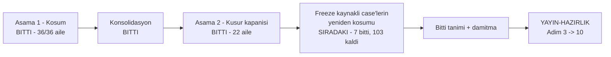

# Manuel Kabul Testi — Kapanış Planı (2026-09-16 turu)

> **Bu turu kapatan her oturum ÖNCE burayı okur.** Koşum bitti; bu dosya
> kapanışın tek kontrol düzlemidir.
>
> **Durum:** 🟢 Aşama 2 bitti · **YİRMİ İKİ AİLENİN YİRMİ İKİSİ DE KAPANDI (A…V)** · 0 açık kusur ailesi · **0 `Kaldı` case**
> **§4.1 BİTTİ:** 14 `Kaldı` case'in 14'ü de kapandı — 3'ü zaten canlı koşulmuştu (yalnız `Durum` satırı eksikti), 11'i bu oturumda canlı sunucuda koşuldu.
> **§5 BAŞLADI:** kapanan 7 case → `Geçti` **1728 → 1735**. `Beklemede` **107 → 102** (5 PKG case'i, §5(a)) · `İŞARETSİZ` **3 → 1** (`MT-UIRUN-001` · `MT-UIRUN-063`, §5(b); kalan `MT-GDK-024` §5(c) — ikinci işletim sistemi ister).
> **Kalan iş:** §5'in geri kalanı (**102 `Beklemede` + 1 `İŞARETSİZ` = 103 açık**) → bitti tanımı (skill §7) → damıtma (§6) → arşiv.
> **Son güncelleme:** 2026-09-19 (§5 turu 1: yedi case kapandı; `MT-UIRUN-063` yeni bir kusur açığa çıkardı ve **aynı oturumda kodlandı** → K-833 — beş panel reader'a `HTTP 403` + `Try again` çiziyordu)

Turdan bağımsız kapanış protokolü — aile aile oturum yordamı, "önce ampirik
yeniden üret" kuralı, bitti tanımı ve sayım betiği —
[`manuel-test-kosumu/SKILL.md`](../../../../.agents/skills/manuel-test-kosumu/SKILL.md)
§6–§8'dedir. **Burada tekrarlanmaz.**

---

## 1. Okuma sırası — bundan fazlasını okuma

| Sıra | Dosya | Niçin |
|---|---|---|
| 1 | bu dosya | durum, aile listesi, sıradaki iş |
| 2 | `manuel-test-kosumu/SKILL.md` §6–§8 | kapanış protokolü — **tek kaynak** |
| 3 | [`kusur-giderme/SKILL.md`](../../../../.agents/skills/kusur-giderme/SKILL.md) | sınıf taraması — aile ortasında okunur |
| 4 | koşacağın ailenin kayıt dosyası | kusurun tam metni, log alıntısı, `dosya.cs:satır` |

[`DEVIR.md`](DEVIR.md) **koşumun** devir notudur. Kapanış için yalnız §8'inin
açık kalem tablosu ve ortam kuralları ilgilidir; baştan sona okuma.

---

## 2. Nerede duruyoruz

Koşum 36 ailenin 36'sında bitti. Dört şerit dalı `main`'e alındı, worktree'ler
silindi. Kod tur boyunca `7e3a4de7`'de donuk kaldı ve merge'lerden sonra da
donuk (`git diff --stat 7e3a4de7..HEAD -- src samples tests` boş).



**Sayım** (skill §7, düzeltilmiş betik — bkz. §3.1):

| Durum | Koşum sonu | Aile V sonrası | §4.1 sonrası | **§5 turu 1 sonrası** |
|---|---|---|---|---|
| ☑ Geçti | 1693 | 1714 | 1728 | **1735** |
| ☒ Kaldı | 35 | 14 | 0 | **0** |
| ☐ Beklemede | 107 | 107 | 107 | **102** |
| ⏭ Atlandı | 18 | 18 | 18 | 18 |
| işaretsiz (gerekçe düz metin) | 3 | 3 | 3 | **1** |
| **toplam benzersiz case** | **1856** | **1856** | **1856** | **1856** |

Kapanan her aile, kusuru yüzünden `Kaldı` kalmış case'ini **canlı sunucuda**
yeniden koşar ve ikinci bir `Gerçek sonuç` bloğu ekler; sayım her case'in
**son** işaretini alır.

**Kusur:** 44 `HATA-*` kaydı + kapanışta eklenen 4 kalem = 48. **Hepsi
kapandı** (`S2-003` kısmen — §4'ün S satırı). Dağılım: `S1-001..030` ·
`S2-001..003` · `S3-001..010` · `S4-001..005`.

**ÜÇ kusur yeniden ÜRETİLEMEDİ** ve kod kusuru olmadıkları kanıtlandı:
`HATA-S1-006` (koşumda zaten öyle işaretlendi), `HATA-S3-006` (Aile F; ayar o
oturumda kapalıydı) ve `HATA-S2-001` (Aile T; case'in beklenen sonucu kapının
gerektirdiğinin **tersini** istiyordu — satır kaldırılınca kapı kırmızı oldu,
ölçüldü). Üçünde de beklenen sonuç koda göre düzeltildi.

🚨 **Kapanış üç kaydın KÖK-NEDEN TEŞHİSİNİ çürüttü:** `S1-025` (G), `S1-002`
ve `S2-003` (T · S). Kayıttaki teşhis **kanıt değil hipotezdir** — bu turda
üç kez yanlış çıktı.

**Kapanış sırasında dört kusur EKLENDİ** (hepsi aynı aileden bir kök nedenin
ikinci/üçüncü vakası; aile içinde ölçüldü ve aynı oturumda kapandı):
`HATA-S1-029` · `HATA-S1-030` (Aile D) · `HATA-S3-009` · `HATA-S3-010` (Aile E).

### Kullanıcı kararları (2026-09-18, bağlayıcı)

1. Kapanış **tek şeritte**, `main` üzerinde, aile aile koşar. Paralel şerit yok.
2. **43 kusurun hepsi kodlanır.** Yalnız yeni yetenek isteyen bulgular
   `docs/ADAYLAR.md`'ye `F-NN` olur (skill §6).
3. Kod donması yüzünden `Beklemede` kalan case'ler kapanışta **yeniden
   koşulur** (§5). Gerçekten fiziksel/insan gerektirenler açık kalem kalır.

---

## 3. Düzeltilmiş öncüller — ÖNCE BUNU OKU

Bu turun ölçtüğü ve bir daha keşfedilmemesi gereken şeyler.

### 3.1 Sayım betiğinin üç kör noktası kapandı

`SKILL.md` §7'nin betiği bu turun **her** ölçümünü bozuyordu. Üçü de düzeltildi
(commit `83cc7a5d`): glob 30–36 ailelerini görmüyordu · başlık yalnız `^## `
arıyordu (dosyaların yarısı `### MT-…` kullanır) · blok sayıyordu, case
kimliği değil. **Eski sayılara güvenme**, betiği yeniden koş.

### 3.2 `kapi.py kapanis` bu turda ikinci adımda duruyor

Kapı fail-fast'tir ve `dokuman-bakim.py --denetle` ikinci adımdır. Koşum kaydı
bütçeyi 3,6 kat aşıyor (2.214.672 B / 620.000 B), yani **damıtma (§6) koşana
kadar `kapanis` .NET kapılarına hiç ulaşmaz**. Kapanış oturumları kalan sekiz
kapıyı doğrudan koşar:

```bash
python3 -m unittest discover -s scripts -p '*_test.py'
node docs-site/scripts/build-agent-map.mjs --check
python3 scripts/denetim-paketi.py --taban 7e3a4de7
dotnet build Tracon.slnx -c Release
dotnet test  Tracon.slnx -c Release --no-build -maxcpucount:1 -- --report-trx
dotnet pack  Tracon.slnx -c Release --no-build -p:TraconSkipCleanWorkingTreeCheck=true
dotnet format Tracon.slnx --verify-no-changes
(cd docs-site && npm run check)
```

> ⚠️ `dotnet test --no-build` kırık build'de ESKİ ikiliyi koşar ve yanlış yeşil
> verir. `--no-build` öncesi build'in başarılı olduğunu doğrula.

Bütçe kırmızısı **kabul edilmiştir**; `dokuman-bakim.py --denetle`'nin diğer
**tüm** kontrolleri yeşildir (konsolidasyonda iki yanlış pozitif kaynağı da
düzeltildi — bkz. §3.3). Oturum sonunda yalnız onlara bak.

### 3.3 `dokuman-bakim.py`'nin iki yanlış pozitifi

Kayıt dosyası bir bağlantıyı ya da `git show <sha>:<yol>` komutunu **karşı
örnek olarak** alıntıladığında kapı onu gerçek sanıyor:

- Satır içi kod **satır sonunu aşamaz** (`_SATIR_ICI_KOD`), bu yüzden iki satıra
  bölünen `` `[kapilar.md](kapilar.md)` `` alıntısı gerçek bağlantı sayıldı.
- `tam_metin_denetle` kod bloklarını **soymuyor**, bu yüzden "bu yol çözülmez"
  diyen bir karşı örnek kapıyı kırmızı yaptı.

İkisi de kayıt metni tek satıra toplanarak/yeniden yazılarak çözüldü. Kapının
kendisi **düzeltilmedi** — Aile T'ye yazıldı.

### 3.5 Taban çizgisi ölçümü — 2026-09-18

Konsolidasyon sonrası sekiz kapı doğrudan koşuldu:

| Kapı | Sonuç |
|---|---|
| `unittest discover -s scripts` | ✅ |
| `build-agent-map.mjs --check` | ✅ |
| `denetim-paketi.py --taban 7e3a4de7` | ✅ |
| `dotnet build -c Release` | ✅ sıfır uyarı |
| `dotnet test -c Release` | ⚠️ **1 düşen** — `PackCleanlinessGateTests.DirtyWorkingTreeStopsPackWithTracon0004`; diğer her test projesi yeşil |
| `dotnet pack` · `dotnet format` · `npm run check` | ✅ |

**Düşen test yeniden üretilmedi.** İzole koşumda `PackCleanlinessGateTests`'in
altısı da geçti (`dotnet test tests/Tracon.Package.Tests -c Release --no-build
-- --filter-method "*PackCleanlinessGateTests*"`). Yük altında kırılgan;
`HATA-S1-001`/`002` ile aynı sınıf ve **Aile T**'ye üçüncü örnek olarak
yazıldı. Taban çizgisi bu yüzden **yeşil sayılır**.

### 3.7 Sekiz kapının tam ölçümü — 2026-09-19 (Aile K · L · M · N sonrası)

Dördü de kapandıktan sonra sekiz kapı **temiz ağaçta** baştan koşuldu:

| Kapı | Sonuç |
|---|---|
| `unittest discover -s scripts` | ✅ 339 test |
| `build-agent-map.mjs --check` | ✅ (`llms-full.txt` tazelendi) |
| `denetim-paketi.py --taban 7e3a4de7` | ✅ çıkış 0 |
| `dotnet build -c Release` | ✅ sıfır uyarı |
| `dotnet test -c Release -maxcpucount:1` | ✅ **çıkış 0 · 22 proje · 7813 test · 0 düşen** (TRX ile ikinci kez doğrulandı) |
| `dotnet pack --no-build` | ✅ çıkış 0 |
| `dotnet format --verify-no-changes` | ✅ |
| `docs-site && npm run check` | ✅ 1152 sayfa · 0 kırık bağlantı · 0 SEO hatası |

🚨 **2026-09-18 taban çizgisinin kırılgan testi bu koşumda DÜŞMEDİ.**
`PackCleanlinessGateTests.DirtyWorkingTreeStopsPackWithTracon0004` tam çözüm
koşumunda geçti. Kırılganlık kapanmış sayılmaz — Aile T'nin kaydı duruyor —
ama bu koşum onu üretmedi.

🚨 **İlk tam koşum GEÇERSİZDİ ve sebebi kaydedilmeye değer.** Koşum arka
plandayken kaynak dosyalar düzenlendi ve ağaç kirliydi; `ReleaseArtifactTests`'in
kendi içinde koştuğu `dotnet pack` altı testi birden düşürdü. **Tam koşum
başladıktan sonra çalışma ağacına dokunulmaz** — `dotnet pack` kirli ağacı
`TRACON0004` ile reddeder ve bu, test kodunun içinden gelen bir hata gibi görünür.

---

### 3.8 Sekiz kapının tam ölçümü — 2026-09-19 (Aile O…V sonrası)

Sekizi de **boş bir makinede**, temiz ağaçta, tek tek koşuldu:

| Kapı | Sonuç |
|---|---|
| `unittest discover -s scripts` | ✅ 351 test |
| `build-agent-map.mjs --check` | ✅ bütçede |
| `denetim-paketi.py --taban 7e3a4de7` | ✅ çıkış 0 |
| `dotnet build -c Release` | ✅ sıfır uyarı |
| `dotnet test -c Release -maxcpucount:1` | ✅ **çıkış 0 · 22 proje · 7848 test · 0 düşen · 599 sn** (TRX ile ayrıca doğrulandı) |
| `dotnet pack --no-build` | ✅ çıkış 0 |
| `dotnet format --verify-no-changes` | ✅ çıkış 0 |
| `docs-site && npm run check` | ✅ çıkış 0 · 1152 sayfa |

`dokuman-bakim.py --denetle`: **tek kırmızı** koşum kaydı bütçesi (§3.2,
kabul edilmiş). Diğer her kontrol yeşil, kırık bağlantı **0**.

⚠️ `kapi.py tarama` **kırmızı, ama bu turun işinden değil** — ikisi de bu
oturumdan öncedir ve dokunulmadı (`git diff 6303e2a9..HEAD` o yollarda boş):
`ConsumerStoreRegistrationTests.cs:61`'deki sentetik `Password=unused`, ve
tarama tabanı `630f3212`'den **sonra** eklenmiş üç migration dosyası. Yayın
öncesi bunlar ayrıca ele alınmalıdır (`YAYIN-HAZIRLIK` Adım 3).

🚨 **Altı kırılganlık örneğinin hiçbiri bu koşumda düşmedi** — ikinci kez.
Koşum profili değişikliği (§4'ün Aile T satırı) yürürlükte.

---

### 3.9 Sekiz kapının tam ölçümü — 2026-09-19 (§4.1 sonrası, KAPANIŞ ÖLÇÜMÜ)

`MT-RES-089`'un kod düzeltmesi (K-831) dahil, sekizi de sırayla koşuldu:

| Kapı | Sonuç |
|---|---|
| `unittest discover -s scripts` | ✅ 351 test · `OK` |
| `build-agent-map.mjs --check` | ✅ bütçede |
| `denetim-paketi.py --taban 7e3a4de7` | ✅ çıkış 0 |
| `dotnet build -c Release` | ✅ sıfır uyarı |
| `dotnet test -c Release -maxcpucount:1` | ✅ **çıkış 0 · 22 proje · 7853 test · 0 düşen** |
| `dotnet pack --no-build` | ✅ çıkış 0 |
| `dotnet format --verify-no-changes` | ✅ çıkış 0 |
| `docs-site && npm run check` | ✅ çıkış 0 · 1152 sayfa · 189.756 bağlantı · 0 kırık · 0 SEO hatası |

TRX ile ikinci kez doğrulandı: **22 proje · 7853 test · 0 düşen.**

`dokuman-bakim.py --denetle`: **tek kırmızı** koşum kaydı bütçesi (§3.2,
kabul edilmiş; damıtma §6 ile düşecek). Diğer her kontrol yeşil, kırık
bağlantı **0**.

🚨 **İlk tam koşum bir kapıyı kırdı ve kapı haklıydı.**
`ShippedDocumentationSelfContainmentTests`, K-831'in düzeltmesine yazdığım
`///` dokümanını reddetti: `🚨` emojisi ve bir `MT-*` referansı taşıyordu —
tüketicinin elinde olmayan bir kayda işaret eder. **Taban tazelenmedi**
(`TRACON_SHIPPED_DOCS_REFRESH=1` koşulmadı); Aile B'nin emsaline uyularak
metin yeniden yazıldı. Gerekçenin tamamı düz `//` yorumda duruyor — kapı
yalnız `///` satırlarına bakar.

🚨 **Yedinci kırılganlık fırsatı da düşmedi.** Altı örneğin hiçbiri bu tam
koşumda düşmedi (üçüncü kez). Koşum profili değişikliği (§4'ün Aile T satırı)
yürürlükte.

---

### 3.10 Sekiz kapının tam ölçümü — 2026-09-19 (§5 turu 1 sonrası)

K-833'ün kod düzeltmesi (beş arayüz paneli + yeni test) dahil:

| Kapı | Sonuç |
|---|---|
| `unittest discover -s scripts` | ✅ 351 test · `OK` |
| `build-agent-map.mjs --check` | ✅ bütçede |
| `denetim-paketi.py --taban 7e3a4de7` | ✅ çıkış 0 |
| `dotnet build -c Release` | ✅ sıfır uyarı |
| `dotnet test -c Release -maxcpucount:1` | ✅ **çıkış 0 · 22 proje · 7853 test · 0 düşen** (TRX ile ikinci kez doğrulandı) |
| `dotnet pack --no-build` | ✅ çıkış 0 |
| `dotnet format --verify-no-changes` | ✅ çıkış 0 |
| `docs-site && npm run check` | ✅ çıkış 0 · 1152 sayfa · 0 SEO hatası |

Arayüz tarafı ayrıca: `npm run typecheck` temiz, **258** vitest (254 + K-833'ün
dört yeni olgusu) geçti.

`dokuman-bakim.py --denetle`: **tek kırmızı** yine koşum kaydı bütçesi
(2.415.685 B / 620.000 B — §3.2, kabul edilmiş; damıtma §6 ile düşecek).

🚨 **`secret` taraması KıRMıZı başladı ve bitti tanımının 4. maddesiydi.**
Bu tarama **§3.2'nin sekiz kapısında YOKTUR** — `kapi.py kapanis`'in içindedir
ve o ikinci adımda duruyor, ∴ tur boyunca hiç koşmamış. Tek bulgu
`ConsumerStoreRegistrationTests.cs:61`'di ve yanlış pozitifti: her alan
**harfi harfine `unused`**, port **1**, ve test yalnız bir `ServiceProvider`
kuruyor — hiç bağlantı açmıyor. Tarayıcının kendi belgelenmiş yordamıyla
kapatıldı: satıra `// SYNTHETIC-CREDENTIAL` işaretlendi (*gizlemek değil
işaretlemek* — `kapi.py:186-194`). Tarama artık **0 bulgu · 7 atlanan
sentetik**. **Ders: bitti tanımının `secret` maddesi §3.2'nin sekiz kapısıyla
karşılanmaz; ayrıca koşulur.**

🚨 **`dotnet pack` kapısı release feed'i YENİDEN KİRLETİR.** Kapı 20 adet
`0.0.0-preview.0.876` paketi `artifacts/package/release/` altına yazıyor ve bu,
`MT-PKG-115`/`116`'nın ön koşulunu **aynı kapanış içinde** bozar. O paketler
`artifacts/package/kosum-2026-09-16/kapi-pack-876/` altına alındı.
**Sıra önemlidir: yayın provası isteyen case'ler `dotnet pack` kapısından
ÖNCE koşulur, ya da feed aradan temizlenir.**

---

### 3.4 Turun bıraktığı ortam kuralları

Bunlar kapanış oturumlarında da geçerlidir ve bitti tanımında
`docs/hafiza/`'ya taşınacaktır.

| Kural | Ayrıntı |
|---|---|
| `QuotaEnforcer` önbelleği | `_firedThresholds` süreç-içidir; SQL ile temizlenmez, uygulama **yeniden başlatılmalı** |
| Uygulamayı başlatma | `dotnet run` iki şeritte sebepsiz "Application is shutting down" verdi. Derlenmiş DLL'i doğrudan çalıştır: `dotnet artifacts/bin/Tracon.Api/release/Tracon.Api.dll --urls …` |
| `user-secrets` okuma | `dotnet user-secrets list` **asla filtresiz** koşulmaz; her zaman `grep`'le |
| Yanıt alanları | Kökte değil: `usage.totalTokens` · `response.messages[0].contents[0].text` · sağlıkta `providerName` |
| `GET /api/runs/{id}/events` | SSE döner, JSON değil. Ham `grep` çok satırlı `data:` gövdesini böler |
| Sağlayıcı hatası ayrıntısı | Yanıtta değil **günlükte** (`SafeErrorText` kasıtlı sabitler `upstream_error`) |
| Devre kesici | Süreç-içidir; onu sınayan case ayrı bir örnekte koşulur |
| Kiracı başlığı | İki bayrak ister: `Tracon:Tenancy:Enabled=true` **ve** `AllowHeaderResolution=true`; ikisi de varsayılan kapalı ve kapalıyken başlık **sessizce** yok sayılır |
| Nokta/tire taşıyan ayar | Ortam değişkeni olamaz (zsh reddeder). Komut satırını kullan: `-- "--Tracon:Pricing:openai:gpt-5.4-mini:Input=0.25"` |
| `timeout` | macOS'ta yoktur (çıkış 127). Süreci arka planda koş, çıkış kodunu dosyaya yaz |
| Model adı | `gpt-5.4-mini`. Rastgele bir OpenAI modeli `403 model_not_found` verir |
| Azure | Kimlik **yoktur**; Azure isteyen case `⏭ Atlandı` kalır, kusur değildir |
| Paketlenmiş DLL'i çalıştırma | `--contentRoot <.../artifacts/bin/Tracon.Api/release>` **verilmezse** `appsettings.json` hiç okunmaz; kabuğun CWD'si content root sanılır. Belirti yanıltıcıdır: `GET /api/models` **boş liste** döner ve Development'ta `UseOpenAICompatible` "Endpoint is required" ile **açılışta patlar** |
| `user-secrets` okunması | Yalnız **Development**'ta yüklenir. `ASPNETCORE_ENVIRONMENT=Development` verilmezse sağlayıcı anahtarları görünmez ve agent sessizce `echo` sağlayıcısına düşer — yanıt modelden değil echo'dan gelir |
| Yerel MCP sunucusu | `env -i` ile **boş ortamla** başlat. Referans sunucunun `get-env` demo tool'u kendi sürecinin ortamını döndürür ve kabuktan miras alınan her `secret` modele + `run` kaydına gider. Port sabit **3001**; `--port` bayrağı yok, `PORT` ortam değişkeni çalışır. Ortam okumayan büyük çıktı gerekiyorsa `get-tiny-image` kullan |
| Eski MCP süreci | Yeni sunucu 3001'i alamazsa **sessizce** eskisine bağlanırsın — `lsof -nP -iTCP:3001 -sTCP:LISTEN` ile PID'i doğrula, log'da "Port 3001 is already in use" ara |
| MCP sunucusu yeniden başlarsa | Tracon eski session kimliğini tutar; `/refresh` `{"toolCount":0}` ve log'da `Bad Request: No valid session ID provided` verir. **Uygulamayı yeniden başlat** |

---

## 3.6 Sıradaki iş — 2026-09-19 itibarıyla

✅ **§4.1 BİTTİ. §5 BAŞLADI ve ilk turu bitti (7 case).** `Kaldı` case yok.

| Durum | §4.1 sonrası | **§5 turu 1 sonrası** |
|---|---|---|
| ☑ Geçti | 1728 | **1735** |
| ☐ Beklemede | 107 | **102** |
| ⏭ Atlandı | 18 | 18 |
| işaretsiz | 3 | **1** |
| **toplam** | **1856** | **1856** |

⚠️ Kapanan yedinin **beşi** `Beklemede`ydi (PKG), **ikisi** işaretsizdi
(`MT-UIRUN-001` · `MT-UIRUN-063`) — iki sayaç ayrı düştü.

**Sıradaki iş: §5'in geri kalanı** — **102 `Beklemede` + 1 `İŞARETSİZ`**. Aile
aile, §5(a) ve §5(b) tablolarının sırasıyla. Bitince: bitti tanımı (skill §7)
→ damıtma (§6) → arşiv.

🚨 **§5'in birinci dersi — "ortamda bunun yolu yok" DENETLENMEDEN kabul
edilmez.** `MT-UIRUN-063` tur boyunca "ayrı bir reader kimliği üretilemez" diye
bekliyordu ve §5(b) bunu "ikinci bir token/rol yapılandırılabilir" diye
tekrarlıyordu. Gerçek: örnek uygulama **hazır bir bayrak taşıyor** —
`Tracon:Demo:Roles:Enabled=true` üç politika adını kaydeder ve rolü
`X-Tracon-Demo-Role: reader|operator|admin` başlığından okur
(`samples/Tracon.Api/Program.cs:104-125`). Hiçbir kod değişikliği gerekmedi.
**§5(a)'nın "geçici `Program.cs` değişikliği ister" diyen satırlarının her biri
koşulmadan önce aynı şekilde denetlenmelidir** — özellikle `MT-SEC` ve
`MT-MCP` aileleri. Tarayıcıda başlık
`page.context().setExtraHTTPHeaders({...})` ile enjekte edilir; konsolun kendi
`fetch` sarmalayıcısı onu göndermez.

🚨 **İkinci ders — bir ön koşul `git` ağacıyla sınırlı değildir.**
`MT-PKG-115`'in ilk denemesi terfiden **sonra** sıfır olmayan çıkışla durdu;
sebep çalışma ağacı değil, `artifacts/package/release/` içinde §4.1'in bıraktığı
182 adet `0.0.0-preview.0.8xx` paketti ("release feed contains stale Tracon
packages"). O paketler artık `artifacts/package/kosum-2026-09-16/bayat-feed/`
altındadır (silinmedi — §4.1'in kanıtı), release feed'de yalnız
`1.0.0-preview.1` durur. **Yayın provası koşacak her oturum önce `ls
artifacts/package/release/` yapar.**

🚨 **Üçüncü ders — canlı rol ölçümü yine testin göremediğini gösterdi.**
`MT-UIRUN-063`'ün dört adımı da geçti, ama ölçüm case'in **dışında** bir kusur
buldu: `settings`'in dört paneli ve `mcp`'nin "Remembered approvals" paneli
reader'a `HTTP 403` metnini bir `Try again` düğmesiyle çiziyordu — çalışması
imkânsız olan tek eylem. `diagnostics.tsx` ve MCP prompt sekmesi bu boşluğu
kendileri için çoktan kapatmış ve gerekçeyi 🚨 yorumu olarak yazmıştı; beş
panel aynı işlemden hiç geçmemişti. Kodlandı ve aynı oturumda kapatıldı
(K-833); düşen test `admin-panel-roles.test.tsx`.

🚨 **§4.1'in ilk dersi — "koşulmamış" sanılan üç case ZATEN KOŞULMUŞTU.**
`MT-CORE-044`, `MT-CORE-045` ve `MT-CLI-029` canlı yeniden koşum bloklarını
2026-09-18'de almışlar ve bloklar "☑ GEÇTİ" yazıyordu — ama **makine
okunabilir `**Durum:**` satırı yoktu**, ve sayım betiği her case'in *son*
`Durum` satırını aldığı için üçü de hâlâ `Kaldı` sayılıyordu. On dört case'in
üçü hiç iş gerektirmedi. **Ders: yeniden koşum bloğu düzyazıda "geçti" demekle
bitmez; `Durum` satırı eklenmezse sayım onu görmez.**

🚨 **İkinci ders — bu tur SPEC BAYATLIĞININ asıl hacmini burada gördü.** On bir
case'in **yedisi** ürün kusuru değil doküman kusuru taşıyordu ve hepsi skill
§1.1 istisnasıyla düzeltildi: beş beklenen sonuç Türkçe yazılmıştı ama sevk
edilen metin İngilizce (K-228 — `MT-MM-049`, `MT-PROV-032/033/034`), bir
beklenti artık var olmayan bir CSS değişkenine (`--ap-violet`) dayanıyordu,
`MT-GUARD-073`'ün **kendi kod parçası derlenmiyordu** (`CS8803`), ve
`14-SKILL-VE-SCRIPT.md` §6'nın kurulum parçası `AllowStoredScripts` bayrağını
hiç yazmıyordu — o olmadan script'ler modele **hiç sunulmuyor** ve belirti
("Script 'merhaba' not found") kurulumun eksik olduğunu değil script'in yok
olduğunu düşündürüyor.

🚨 **Üçüncü ders — canlı koşum otomatik testin sahtesinin yalan söylediği yeri
gösterdi.** `MT-RES-089` sağlayıcı zaman aşımının `Timeout` değil
`ProviderError` sınıflandığını ölçtü. `FailureManifests.ProviderTimeoutTests`
bunu göremiyordu çünkü (a) adı `..._is_classified_as_a_timeout_...` olduğu
hâlde gövdesi yalnız `Failed`'ı iddia ediyordu ve (b) sahtesi
`TaskCanceledException`'ı **doğrudan** atıyor, yani normalleştirilmeyen yolu
koşuyor. Gerçek SDK zaman aşımını `AggregateException` içinde sarmalar ve **o**
yol normalleştirilir. Düzeltme, yeni sahte ve sınıf taraması: K-831 · K-832.

Ortam yordamı §4.1'de korundu.

🚨 **Aile K · L · M · N'nin ortak dersi — MEVCUT BİR TEST KUSURU KİLİTLİYOR
OLABİLİR.** Dört ailede **beş** test düzeltmeden sonra kırmızıya döndü ve
beşi de haklı olarak: `No_provider_checked_yet_returns_Degraded` yanlış
davranışı **adıyla** zorluyordu, iki `JsonBindingProblemMiddlewareTests` testi
`detail`'in CLR tip adını taşımasını bekliyordu, Aile K'nin kapısı kendi
regresyon testinin doküman yorumunu yakaladı. Hiçbiri zayıflatılmadı; aynı şeyi
daha güçlü kanıtlayan iddialara çevrildiler. **Bir aileye başlarken o alanın
mevcut testlerini de oku** — yeşil bir test doğru davranışın kanıtı değildir.

🚨 **Aile L'nin dersi — sevk edilen bir SÖZLEŞMEYİ ÜRETEN mekanizmaya
dokunuyorsan, üretimi tazeleyip FARKI OKU.** `S1-008`'in ilk tasarımı derlemeyi
ve testleri yeşil bıraktı ve yayınlanan OpenAPI belgesinden **42 enum'un `enum`
listesini** sildi (287 satır). Bunu yalnız `TRACON_OPENAPI_REFRESH=1` + `git diff`
gösterdi. Zincirin tamamı: OpenAPI anlık görüntüsü → `npm run generate`
(`schema.ts`) → nswag (`TraconApiClient.g.cs`) → `npm run build` (`dist/`).

🚨 **Aile F ve G'nin ortak dersi:** kayıttaki kök-neden teşhisi F'de iki kez
yanlıştı, G'de **doğru ama yarımdı** — `S1-025`'in asıl nedeni yutulan istisna
değil, zaman aşımının hiçbir şeyi iptal etmemesiydi. Kayıt bir teşhis
içeriyorsa onu **kanıt** değil **hipotez** say; önce semptomu kendi yordamıyla
yeniden üret ve teşhisin ötesini de ölç.

🚨 **Aile G'nin kendi dersi:** canlı koşum, hiçbir testin göremediği bir kusur
buldu (`Tracon:Images:Timeout` bağlanmıyordu). Bir aile yeni bir **ayar**
ekliyorsa, kapanışın canlı koşumu o ayarı gerçekten değiştirerek yapılır.

🚨 **Aile H'nin dersi — uzun koşumu arka plana alırken çıkış kodunu ELLE
yakala.** `dotnet test` tam koşumu arka plana alındığında geri bildirilen kod
sarmalayıcının kodudur, test koşucusunun değil: koşum dört düşen testle
bitmişken "exit code 0" göründü. `dotnet test ... > kayit.log 2>&1; echo
"EXIT=$?"` yazıldığında gerçek kod (`1`) göründü. İkinci kanıt olarak kapanış
oturumu TRX raporlarını da okur:

```bash
python3 - <<'SAYIM'
import pathlib, xml.etree.ElementTree as ET
ns = {"t": "http://microsoft.com/schemas/VisualStudio/TeamTest/2010"}
for d in sorted(pathlib.Path("artifacts/bin").glob("*/release/TestResults")):
    ps = list(d.glob("*.trx"))
    if not ps:
        continue
    c = ET.parse(max(ps, key=lambda p: p.stat().st_mtime)).getroot() \
          .find("t:ResultSummary/t:Counters", ns)
    if c is not None and int(c.get("failed", 0)):
        print("DUSEN:", d.parts[2], c.get("failed"))
SAYIM
```

🚨 **TRX klasörü ESKİ koşumları da biriktirir.** `artifacts/bin/*/release/TestResults/`
temizlenmezse bir önceki koşumun raporu yenisiyle karışır ve kapanmış bir kusur
hâlâ açık sanılır. Tam koşumdan önce `rm -rf artifacts/bin/*/release/TestResults`.

**Taban çizgisi 2026-09-19 itibarıyla §3.9'dadır** — sekiz kapının sekizi de
yeşil ölçüldü (K-831'in kod düzeltmesi dahil).

**Oturum açılışında koş** (taban çizgisinin hâlâ yeşil olduğunu doğrula):

```bash
git status --short                 # temiz olmali
python3 scripts/dokuman-bakim.py --denetle   # TEK kirmizi: kosumlar butcesi (§3.2)
```

Dört .NET kapısı §3.2'dedir. `kapi.py kapanis` **kullanma** — ikinci adımda
durur, gerekçe §3.2'de.

---

## 4.1 ✅ BİTTİ — kapanmış ailelerin `Kaldı` case'leri (2026-09-19)

On dört case. **Üçü zaten koşulmuştu** ve yalnız `Durum` satırı eksikti;
**on biri** bu oturumda canlı sunucuda koşuldu. Hepsi `Geçti`.

| Case | Sonuç | Notu |
|---|---|---|
| `MT-CORE-044` · `045` · `MT-CLI-029` | ☑ | 2026-09-18'de zaten koşulmuş; eksik olan `**Durum:**` satırıydı |
| `MT-PG-025` | ☑ | Opak `500` → `503` + `Database schema is not current`; sızıntı sınırı ölçüldü (yanıtta 0, günlükte 46) |
| `MT-OAI-043` | ☑ | `error.class` `Unknown` → `ProviderError`; spec'in "sabit mesaj" satırı bayattı |
| `MT-MM-049` | ☑ | `Error: Function failed.` → özgül mesaj modele ulaşıyor |
| `MT-PROV-032` · `033` · `034` | ☑ | Jenerik mesaj → ayarın adı, kuralı ve gelen değer |
| `MT-RES-086` | ☑ | Devralınan run artık `Completed`; `seq` sürüyor (5 satır, `0..4` boşluksuz) |
| `MT-RES-089` | ☑ | Üç beklenti geçti; dördüncüsü **yeni kusur** açığa çıkardı → kodlandı (K-831) |
| `MT-UIRUN-049` | ☑ | Gerçek `ReasoningDelta` verisiyle tarayıcıda doğrulandı; renk beklentisi bayattı |
| `MT-GUARD-073` | ☑ | Run satırı artık **yazılıyor** (turda `404`'tü); `ref:` günlüğe çözülüyor |
| `MT-SKILL-070` | ☑ | Başarılı koşumun span'i dört etiketi ve `Ok`'ı taşıyor; `HATA-S2-003` **tamamen** kapandı |

**§4.1'in bıraktığı kaynaklar** (tur sonunda, §6 adım 5 ile birlikte silinir):

| Kaynak | Ne |
|---|---|
| `mt_z` · `mt_z25` · `mt_z70` · `mt_z86` · `mt_z89` · `mt_z89b` şemaları | `ap-pg` içinde; §4.1'in altı ayrı kurulumunun kanıtı. Turun kapanışına kadar **durur** — ölçümlerin arkasındaki veri bunlar |
| `guard073` konsol projesi | scratchpad'de; `Tracon.Testing 0.0.0-preview.0.875`'e karşı kuruldu |
| Paketlenen `…875` nupkg'leri | `artifacts/package/release/` — yerel feed'in `…789`'u bayattı, `MT-GUARD-073` taze paket istedi |

⚠️ **Bir playwright-mcp Chrome süreci kilidi tutuyordu ve durduruldu.**
`MT-UIRUN-049` tarayıcı istiyordu; `ms-playwright-mcp/mcp-chrome-3eca5a9`
profilini önceki bir oturumdan kalmış altı süreç tutuyordu ve MCP sunucusu
"Browser is already in use" diyordu. Yalnız o profile bağlı süreçler
durduruldu (kullanıcının kendi Chrome'u ayrı profildedir).

Aşağıdaki tablo koşum öncesi listedir, kayıt olarak korunur.

| Case | Kusur | Aile | Ne ister |
|---|---|---|---|
| `MT-CORE-044` · `MT-CORE-045` | `S1-010` | G | Fiyatı olan bir model kataloğu; `run` kaydında `cost` dolu mu |
| `MT-PG-025` | `S1-015` | I | PostgreSQL destekli örnek; opak `500` yerine sınıflandırılmış hata |
| `MT-OAI-043` | `S1-020` | J | Gerçek OpenAI hatası; `RunErrorClass` ve parmak izi ayrışıyor mu |
| `MT-MM-049` | `S1-024` | C | Tool içi `TraconException` mesajı modele ulaşıyor mu |
| `MT-CLI-029` | `S3-003` | E | `PUT /api/evals/{ad}/cases` turu; `Id` korunuyor mu |
| `MT-RES-086` · `MT-RES-089` | `S3-004` | B | Lease devralan ikinci deneme; `seq` sürüyor mu |
| `MT-UIRUN-049` | `S3-006` | F | Ayar AÇIKken düşünme kaydı — koşumda ayar kapalıydı |
| `MT-GUARD-073` | `S4-003` | B | Guard'ın giriş-öncesi istisnası `run` satırını yazıyor mu |
| `MT-PROV-032` · `033` · `034` | `S4-004` · `S4-005` | H · C | Silinip yeniden yaratılan agent önbelleği; sağlayıcı doğrulama mesajı |
| `MT-SKILL-070` | `S2-003` | S | Skill + script + grant fixture'ı; **başarılı** bir koşumun izi |

**Ortam bu oturumda kuruldu ve çalıştı** — yordam:

```bash
dotnet build samples/Tracon.Api -c Release
ASPNETCORE_ENVIRONMENT=Development \
  dotnet artifacts/bin/Tracon.Api/release/Tracon.Api.dll \
  --contentRoot "$PWD/artifacts/bin/Tracon.Api/release" \
  --urls http://127.0.0.1:5199
# token: dotnet user-secrets list --project samples/Tracon.Api | grep AuthToken
```

🚨 `--contentRoot` ve `ASPNETCORE_ENVIRONMENT=Development` ikisi de zorunludur
(§3.4). Tarayıcı işleri için konsol `http://127.0.0.1:5199/tracon` adresinde;
token giriş kartına yapıştırılır. Sağlayıcısız bir örnek gerekiyorsa
`Tracon__Providers__*__ApiKey=""` ile başlat — `MT-EVAL-090` böyle koşuldu.

**Bittiğinde:** skill §7'nin bitti tanımı → damıtma (§6) → arşiv.

---

## 4. Aileler

Aile = aynı kök nedeni paylaşan kusur kümesi. **Bir oturum bir aile bitirir.**
Sıra yukarıdan aşağıdır; yüksek öncelik önce kapanır.

> 🚨 **Düzeltmeden önce kusuru ampirik olarak yeniden üret.** Kusurların bir
> kısmı önceki dalgalarda **zaten kapanmış** olabilir; 2026-08 turunda üç kusur
> böyle çıktı. Varsayma, ölç.

### Yüksek öncelik

| Aile | Kusur | Kök neden ve sınıf taraması sorusu | Durum |
|---|---|---|---|
| **A** · Store kaydı sözleşmesi | `S1-019` **Yüksek** | `UsePostgreSql` tüketicinin store kaydını `Replace` ile **sessizce** eziyor. `AGENTS.md`'nin "`TryAdd*` ile kaydet; tüketicinin kaydı her zaman kazanmalı" kuralının ihlali — bir **paket sözleşmesi** kusuru. 117 çağrı, 34 store arayüzü, üç sağlayıcı. `samples/Tracon.Embedded`'in README'sinde belgelenmiş akışı kırıyor (`MT-PG-068` bu yüzden Kaldı). ✅ **Açık soru yanıtlandı (2026-09-18):** `RequireCustomBinding<ITenantStore>()` **patlardı ama yanlış nedenle** — `TraconExtensionPoints.All` yalnız **yedi** sözleşme taşıyor (`ITenantContext`, `IRunAttributionContext`, `IToolAuthorizationHandler`, `IRunAuthorizationHandler`, `IRunEventSink`, `IAttachmentStorage`, `IToolApprovalPresenter`) ve `ITenantStore` bunlardan biri değil; mesaj "kaydın ezildi" değil "bu bir genişleme noktası değil" olurdu. Koruma mekanizmasının 34 store sözleşmesinde **hiç kapsamı yok** ∴ kusur yalnız örnekte değil, mekanizmanın kendisinde. `samples/Tracon.Embedded/Program.cs:17` kendi yorumunda `ITenantStore`'u 1. gömülme noktasının parçası sayıyor — mekanizma onu tanımıyordu | ✅ **KAPANDI 2026-09-18** |
| **B** · Run kaydının doğruluğu | `S4-003` **Yüksek** · `S3-004` **Yüksek** · `S1-011` Orta | Üçü de "run kaydı gerçeği yansıtmıyor": guard'ın GİRİŞ-öncesi istisnası run kaydını hiç oluşturmuyor (istemci SSE'de `error` görür, `GET /api/runs/{id}` `404` verir — denetim/yeniden-deneme/idempotency o run'ı bulamaz); lease devralan ikinci deneme sessizce başarısız kalıyor ve run sonsuza dek `Running`; çakışmayla düşen run kayıtta `Completed` görünüyor. **Tarama:** her terminalleşme yolu kaydı gerçekten yazıyor mu? | ✅ **KAPANDI 2026-09-18** |
#### Aile B — ✅ kapandı (2026-09-18)

Üç kusur, tek tema ("run kaydı gerçeği yansıtmıyor"), **üç ayrı kök neden** —
ve üçü birlikte run'ın ömrünün üç ayrı penceresini kapatıyor.

| Pencere | Kusur | Kök neden | Düzeltme |
|---|---|---|---|
| Run satırı yazılmadan **önce** | `S4-003` | Guard'ın girdi önizlemesi `start.Writer.StartAsync`'ten önce koşuyor; `throw` ederse hiç satır yok | Önizleme kendi `try`/`catch`'inde; istisnada kayıt **sorgu metni olmadan** açılır, sonra orijinal istisna `ExceptionDispatchInfo` ile yeniden fırlatılır. Akışlı yola kendi `catch`'i eklendi (önceden `finally`'ye düşüp `Canceled` yazıyordu) |
| Run **sürerken** (döngü) | — | Zaten doğruydu | Ölçüldü ve testle kilitlendi |
| Run bittikten **sonra** | `S1-011` | `SaveSessionAsync` `RunAsync`'ten sonra çağrılıyor; `Completed` çoktan yazılmış | Yeni `RunEventType.SessionWriteConflicted = 32`; durum `Completed` kalır 👤 |
| Yeniden deneme (lease devralma) | `S3-004` | `RunEventWriter._sequence` her denemede sıfırdan; `(run_id, seq)` çakışıyor, writer kalıcı devre dışı, `CompleteRunAsync` sessizce atlanıyor | `IRunStore.GetLastEventSequenceAsync` eklendi 👤; writer diziyi sürdürüyor |

**Alınan iki karar 👤 (2026-09-18):**

1. **`S1-011` — durum `Completed` kalır, çakışma yeni bir olay olur.** Run
   gerçekten tamamlandı; `Failed` demek maliyetini ve ürettiği yanıtı da
   başarısız gösterirdi, ve uyarı hatları bunu gerçek bir kesinti sanabilirdi.
2. **`S3-004` — son `seq` sözleşmeden okunur.** `IRunStore`'a
   `GetLastEventSequenceAsync` eklendi. Bedeli ölçüldü: **on** uygulayıcı
   güncellendi (üç ürün store'u, `FileRunStore` örneği, bench, altı test stub'ı)
   ve `RunStoreContract` iki yeni testle bunu üç sağlayıcıda birden zorluyor.

🚨 **Sınıf taraması bir varsayımı ölçüme çevirdi.** `S4-003`'ün kaydı "çıktı
denetiminde atılan istisna etkilenmeyebilir, doğrulanmadı" diyordu. Ölçüldü:
beklenen doğruydu — o kontrol run satırı yazıldıktan sonra korunan bölgede
çalışıyor — ve artık testle kilitli.

🚨 **Kapılar, tek bir enum üyesinin ve tek bir store metodunun kaç yeri
birden güncellettiğini gösterdi** — `AGENTS.md`'nin "imza değiştirmek ile
gövdeyi kullanmak iki ayrı adımdır" kuralının somut kanıtı. Aile B'nin
kapanışında **sekiz** takip düzeltmesi çıktı:

| Kapı | Ne istedi |
|---|---|
| `RunEventTypeFrontendParityTests` | `run-event.ts`'in `RunEventType` union'ı |
| — aynı kapı | `run-detail.tsx`'in `EVENT_STYLE` haritası |
| `RunEventFrameNameContractTests` | `RunEndpoints.EventName` — yoksa telde `unknown`'a düşerdi |
| `RunEventTypeTests` | kalıcı sayısal sözleşme listesi |
| `ShippedDocumentationSelfContainmentTests` | sevk edilen XML dokümanında `HATA-*` referansı olamaz — tüketicinin elinde olmayan bir kayda işaret eder. **Taban tazelenmedi**, dört satırın metni düzeltildi. (Düz `//` yorumda serbest; kapı yalnız `///` satırlarına bakıyor.) |
| `TenantCoverageTests` | yeni store metodu ya kiracı izolasyon sözleşmesinde olmalı ya `[TenantAgnostic("gerekçe")]` taşımalı |
| `SqlTextSnapshotTests` ×3 | üç sağlayıcının SQL metin tabanı — tazelendi, fark **yalnız** yeni sorgu |

🚨 **SQL sorgusunda tenant join'i bilinçli olarak YOK.** Çağıran run'ın kendi
writer'ıdır. Tenant filtresi, ortam kiracısı run'ınkinden farklı olan meşru bir
devralmada (job kuyruğu, workflow — K-355) "hiç olay yok" derdi ve writer
sıfırdan başlardı: tam da bu sorgunun engellemek için var olduğu çakışma.

---

| **C** · Tracon'un kendi istisnası maskeleniyor | `S1-024` **Yüksek** · `S4-005` Orta | Tool içi `TraconException` mesajı modele hiç ulaşmıyor — `FunctionInvokingChatClient` onu `"Error: Function failed."`e çeviriyor. Aynı desen sağlayıcı fabrikasında: `ProviderFailureNormalizer` Anthropic/Google fabrikalarının kendi el ile attığı doğrulama hatalarını (düşünme bütçesi, güvenlik eşiği) yabancı SDK hatasıyla aynı maskeye sokuyor, özgül mesaj `/api/agents/validate`'te kayboluyor. **Tarama:** `throw new TraconException` kullanan HER tool ve fabrika | ✅ **KAPANDI 2026-09-18** |
#### Aile C — ✅ kapandı (2026-09-18)

İki kusur, tek sınıf: **Tracon'un kendi yazdığı cümle, yabancı bir SDK
hatasıyla aynı maskeye düşüyor.** İkisinin de yüzeyi ayrı.

**`S1-024` — tool sonucu.** Ölçülen kapsam: **17 çalışma-anı `throw`, beş
tipte** (`TranscribeTool` 4 · `SpeakTool` 2 · `VoiceToolBase` 1 ·
`GenerateImageTool` 9 · `ValidatingAIFunction` 1). En ağırı sonuncusu: argüman
reddinin gerekçesi modele ulaşmadığı için model kendini düzeltemiyor ve aynı
hatalı çağrıyı tekrarlıyor.

👤 **Karar:** `ToolWrapperChain`'e en dışta tek katman
(`ExplainedFailureAIFunction`). Yalnız `TraconException` yakalanır; başka
hiçbir istisna türü dokunulmadan geçer. `IncludeDetailedErrors=true`
**reddedildi** — o, sağlayıcı SDK mesajları ve yığın izleri dahil **her**
istisnanın detayını modele sızdırırdı (K-059'un ruhu).

**`S4-005` — sağlayıcı doğrulaması.** Sınıf taraması kusur kaydından **geniş**
çıktı: kayıt iki paket diyordu, ölçüm **dört** pakette **yedi** maskelenen
`throw` buldu (Anthropic 2 · Google 3 · OpenAI 1 · Azure 1). Yedisi de artık
`ProviderFailureNormalizer`'ın zaten muaf tuttuğu
`ProviderSettingsValidationException` fırlatıyor.

İşaret tipi **`internal` kaldı** — değerinin tamamı taklit edilememesinden
geliyor. `InternalsVisibleTo` yalnız dört sevk edilen adaptöre genişletildi;
bu Aile A'daki store sağlayıcılarıyla **aynı emsal**.

🚨 **Aile C'nin ilk düzeltmesi bir gerileme üretti; kapılar yakaladı, testler
zayıflatılmadı.** Katmanın doküman yorumu "kayıt çağrıyı yine başarısız
gösterir" diyordu — yanlıştı. Kayıt ve olay tipi
`FunctionResultContent.Exception`'ı okuyor, istisna yutulunca zaman aşımına
uğrayan çağrı **başarılı** göründü (`TimedOut` false, `Error` null,
`ToolInvoked`). Üç işlevsel test bunu yakaladı.

Çözüm **kod tabanının kendi emsalini** izliyor: `AuthorizingAIFunction` da bir
reddi normal sonuç olarak döndürüyor ve bunu `ToolAuthorizationAccumulator` ile
çözmüş. `ToolExplainedFailureAccumulator` aynı deseni uyguluyor ama bayrak
değil **istisnanın kendisini** taşıyor — kayıt metnini istiyor ve bir zaman
aşımının zaman aşımı olarak tanınabilir kalması gerekiyor. Olay tipi de artık
tek kaynaktan (`record.Succeeded`) okunuyor.

**Ders:** bir istisnayı sonuca çevirmek yalnız modelin okuduğunu değil,
**kaydın okuduğunu** da değiştirir. Kapanışta `docs/hafiza/`'ya taşınacak.

---

| **D** · MCP tool sonucu okunamıyor | `S1-026` **Yüksek** · `S1-029` **Yüksek** (kapanışta ölçüldü) · `S1-030` **Yüksek** (kapanışta ölçüldü) | Tek kök neden: `ToolResultText.TryGetText` bir `AIContent` sonucu için `false` dönüyor ve BEŞ çağıran bunun üstüne dallanıyor. Bir MCP tool'unun sonucu `string` değil `AIContent`'tir (`McpClientTool.InvokeCoreAsync`: tek blok → `AIContent`, çok blok → `AIContent[]`, hata/yapısal → `JsonElement`) | ✅ **KAPANDI 2026-09-18** |

#### Aile D — ✅ kapandı (2026-09-18)

Kayıt tek bir kusur biliyordu; ölçüm **üç** buldu ve üçü de tek bir `switch`
dalından geliyordu.

| Yüzey | Kusur | Bugünkü davranış (ölçüldü) |
|---|---|---|
| `TruncatingAIFunction` — tek blok | `S1-026` | Sınır hiç uygulanmıyor: 200 bayta karşı **8035 bayt** |
| `TruncatingAIFunction` — çok blok | `S1-029` 👤 | `AIContent[]` bir `AIContent` DEĞİLDİR; okunamayan sonuç dalına düşüp `{"error":"tool_result_unsupported"}` ile **değiştiriliyor** — sınır yapılandırılmamış olsa bile, çünkü katman her zaman kurulu |
| `ContentGuardMessageMasker` | `S1-030` 👤 | Guard kayıtlıyken HER MCP sonucu modele ulaşmadan `[Tool result could not be inspected]` oluyor — guard'ın kendi doküman yorumunun "kötücül MCP metni tam olarak buradan girer" dediği girdi sınıfı |
| `ToolInvocationTracker` · `RunRecordingAgent` | — | `Result`/`Payload` `null`: kayıt tool'un çağrıldığını söylüyor, ne döndürdüğünü söylemiyor |
| `RecordedToolPlayback` | — | Canlı kaydedilen girdi `Result = null`; sonraki fallback halkası "hiçbir şeyi" replay ediyor |

**Alınan üç karar 👤 (2026-09-18):**

1. **Ölçü birimi, adaptörün tele yazdığı metindir** (K-798). `ToolResultText`
   protokol sonucunu `JsonSerializer.Serialize(sonuç, AIJsonUtilities
   .DefaultOptions.GetTypeInfo(typeof(object)))` ile okur — bu, hem
   `Microsoft.Extensions.AI.OpenAI`'nin hem `Anthropic` SDK'sının
   `FunctionResultContent.Result` için yaptığı **aynı** çağrıdır. `Tracon.Core`'da
   AOT temiz olduğu ölçüldü (sıfır `IL2026`/`IL3050`).
2. **Sınırın ALTINDA kalan protokol sonucu dokunulmadan geçer.** `Tracon.Anthropic`
   onu gerçek içerik bloklarına çevirir; aşmadığı bir bütçe için bir görseli
   metne düzleştirmek onu bedelsiz kaybederdi. Aşan sonuç her tool'un aldığı
   aynı zarfa iner.
3. **Sınıf taraması beş çağıranın hepsini kapsar** (K-799). Fail-closed kuralı
   **okunamayan** sonuç için aynen sürer — ham CLR nesnesi hâlâ değiştirilir.
   Guard artık okuyabildiğini inceler, okuyamadığını değiştirir.

| Adım | Sonuç |
|---|---|
| Ampirik yeniden üretim | ☑ eski kodda ölçüldü: `TextContent` 8035 B / 200 B · `DataContent` 5392 B / 200 B · `AIContent[]` → sentinel · guard → placeholder |
| Kök neden düzeltmesi | `ToolResultText` protokol sonucunu okur; `TruncatingAIFunction` sığanı şekliyle, aşanı zarfla döndürür |
| Sınıf taraması | ☑ `grep -rn "ToolResultText" src/` → beş çağıran; beşi de tek düzeltmeyle kapandı |
| Testler | 14 yeni/taşınan test, altı sınıfta; **hepsinin düzeltme öncesi kırmızı olduğu ayrı bir koşumda doğrulandı** |
| Canlı koşum | ☑ `MT-MCP-059` yeniden koşuldu — gerçek MCP sunucusu, gerçek model. 200 B sınır → tam **200 bayt** zarf + `ToolOutputTruncated` (seq 2); sınırsız → **5557 baytlık iki bloklu liste** modele olduğu gibi ulaştı |
| Tüketici yüzeyi | `concepts/tools.md` ve `guides/write-your-own-tool.md`'nin "`AIContent` bu sınıra tabi değildir" cümleleri **yanlıştı**, düzeltildi |

🚨 **Faz 89'un DoD'u "MCP tool'ları da kırpılır" diyordu ve üç yeşil test bunu
"kanıtlıyordu".** Üçü de `AIFunctionFactory.Create(() => new string('a', 10_000))`
sarıyordu — `string` döndüren bir vekil. Gerçek `McpClientTool` `AIContent`
döndürür ve kusur tam olarak o ayrımda yaşıyordu. Şekli taklit etmeyen bir fake
yalnız sarmalayıcının **kurulduğunu** kanıtlar. K-800; üç test `AIContent`
döndüren bir vekile taşındı ve üstüne gerçek SDK istemcisiyle konuşan bir
fonksiyonel test eklendi (`McpToolResultTruncationTests`).

🚨 **Sevk edilen XML dokümanında `🚨` kullanılamaz.**
`ShippedDocumentationSelfContainmentTests` `///` satırlarındaki alarm emojisini
reddeder (Aile B'nin `HATA-*` referansı ile aynı kapı, farklı desen). Taban
tazelenmedi, cümle yeniden yazıldı. Düz `//` yorumda serbesttir.

🚨 **Yeniden koşumun ilk denemesi 2026-09-16 turundan kalan bir MCP sunucusuna
bağlandı** (PID 2295, `--port 3003` ile başlatılmıştı ama 3001'i tutuyordu) ve
o oturumun ortamını taşıdığı için `get-env` `CLAUDE_CODE_MESSAGING_TOKEN`'ı yine
döndürdü. `run` kaydı veritabanından silindi, tüm şemalar tarandı (0 eşleşme),
süreç durduruldu, sunucu `env -i` ile boş ortamla yeniden başlatıldı ve ölçüm
ortamı hiç okumayan `get-tiny-image` ile yapıldı. Token §6.5'in döndürme
listesine eklendi.
| **E** · Case verisi `PUT` turunda kayboluyor | `S3-003` **Yüksek** · `S3-009` **Yüksek** (kapanışta ölçüldü) · `S3-010` **Yüksek** (kapanışta ölçüldü) | Tek desen: `PUT /api/evals/{name}/cases`'in girdi DTO'su yazdığı kaydın alanlarını taşımıyor, taşımadığı her alan her çağrıda sessizce kayboluyor | ✅ **KAPANDI 2026-09-18** |

#### Aile E — ✅ kapandı (2026-09-18)

Kayıt tek kusur biliyordu; `EvalCaseInput` ile `EvalCase`'i alan alan
karşılaştırmak **üç** kayıp gösterdi.

| Kaybolan | Kusur | Ölçülen sonuç |
|---|---|---|
| `Id` | `S3-003` | Değişmeyen bir case bile `Removed`+`Added`; aynı penceredeki gerçek bir regresyon `Removed` sayılıp `--max-regressions 0` kapısından geçiyor |
| `Parameters` | `S3-009` 👤 | Parametreli agent'ın case'leri her kayıttan sonra "zorunlu parametre eksik" ile **düşüyor** — store alanı destekliyor, DTO taşımıyordu |
| `SourceRunId` · `SourceKind` · `PromotedAt` | `S3-010` 👤 | `InsertEvalCase` SQL'i bu üç sütunu **hiç yazmıyordu**. Promosyon kaydı gidince `eval_cases_source_run_uq` guard'ı run'ı tanımaz oluyor ve **aynı run ikinci kez case'e yükseltilebiliyor**. Bellek içi store koruyordu → **sağlayıcı sapması**, sözleşme testi yoktu |

**Alınan iki karar 👤 (2026-09-18):**

1. **Kimlik istemcinin açık sorumluluğudur** (K-801). `EvalCaseInput` `Id`
   kazandı; **id yoksa yeni case**. Bu suite'e ait olmayan ya da iki kez geçen
   bir id **tüm isteği** `400` ile düşürür — ucun boş `query` için zaten
   uyguladığı kural. İçerikten örtük eşleme **reddedildi**: "tam değiştirme"
   ucunun davranışını gövdenin dışındaki duruma bağlar ve aynı metinli iki
   case'te belirsizleşir.
2. **Promosyon kaydı sunucunun kendi verisidir ve kimlikle taşınır** (K-802).
   İstemci gönderemez — gönderebilseydi bir case'e sahte köken uydurulabilirdi.
   Uç, eşleşen mevcut case'ten taşır; SQL de artık yazar.

| Adım | Sonuç |
|---|---|
| Ampirik yeniden üretim | ☑ gerçek PostgreSQL: `ID_KEPT=True` ama `SRC_KEPT=False`; HTTP: `ID_KEPT=False`, DTO'da `Id` de `Parameters` de yok |
| Kök neden düzeltmesi | DTO iki alan kazandı · uç kimliği doğrulayıp promosyonu taşıyor · `InsertEvalCase` üç sütunu yazıyor (tek metin, `SqlQueriesBase`) · konsol turu id ve parametreleri geri gönderiyor |
| Sınıf taraması | ☑ `ReplaceCasesAsync` tek çağıranlı, `*Input` DTO'su repoda tek; kimlik taşıyan başka liste-değiştiren uç **yok** (`SetCanaryAsync` tek değer yazar) |
| Testler | 2 sözleşme testi (dört sağlayıcıda) · 5 HTTP testi · 1 promosyon testi · 1 konsol testi. Sözleşme testi düzeltmeden önce **bellek içinde yeşil, iki SQL sağlayıcısında kırmızı** — sapmayı tek koşumda gösterdi |
| Canlı koşum | ☑ `MT-CLI-029` yeniden koşuldu: `1 added, 0 removed`. Ayrıca kaydın "daha ciddisi" yarısı: aynı pencerede regresyon + liste düzenlemesi → `1 regressed`, CLI **çıkış kodu 3** |
| Tüketici yüzeyi | `concepts/evaluation.md` kusuru bir **özellik** olarak belgeliyordu ("`PUT` fresh identifiers assigns… makes that safe"); iki paragraf yeniden yazıldı |

🚨 **Üretilen .NET istemcisi kaynak belgesinden BAYATTI ve hiçbir kapı bunu
söylemiyor.** Yeniden üretim, Faz 176'da (`1dcb4f5f`) OpenAPI'ye eklenen ama
`TraconApiClient.g.cs`'e hiç işlenmeyen `EvaluatorVersion` alanını da
getirdi — yani istemci bir fazdan beri eksikti. `ClientDescriptionBaselineTests`
ve `ClientCoverageTests` var ama ikisi de **eksik bir DTO alanını** görmüyor.
Aile T'ye yazıldı.

🚨 **Test altyapısına eklenen bir yetenek, ilgisiz bir testi kırabilir.**
Fixture handler'ına istek gövdesini geçirmek için her isteğin gövdesi okunuyordu;
`playground.test.tsx`'in ek dosya yükleme testi kırmızıya döndü (`FormData`
gövdesi okunduktan sonra yüklemeye bir şey kalmıyor). Okuma yalnız
`application/json` ile sınırlandı ve gerekçe `api-fixtures.ts`'e yazıldı.

---

| **F** · SSE ve düşünme kaydı | `S3-005` **Yüksek** · `S3-006` **Yüksek** | İki ayrı katman. Biri gerçek bir kod kusuru, diğeri yeniden üretilemedi — ikisinin de KAYITTAKİ teşhisi yanlıştı | ✅ **KAPANDI 2026-09-18** |

#### Aile F — ✅ kapandı (2026-09-18)

İki kusur, iki farklı sonuç. **Her ikisinin de kayıttaki kök-neden teşhisi
canlı ölçümle yanlışlandı**; biri yine de gerçek bir boşluk gizliyordu.

**`S3-005` — mekanizma gerçekti, repro değildi.**

🚨 `setOffline(true)` açık bir `chunked` SSE gövdesini **kesmiyor**. Gerçek
Chromium'da ölçüldü: çevrimdışı yürürlükteyken yeni bir `fetch` gerçekten
`Failed to fetch` atarken **aynı akış beş olay daha teslim etti** ve run
tamamlandı. Turun gördüğü 23 saniyelik donukluk sağlıklı bir bağlantı üzerinde
**sessiz bir run**'dı.

Mekanizma tespiti (`for await` döngüsünde zaman aşımı yok) yine de doğruydu:
gerçekten ölü bir bağlantıda `reader.read()` hiçbir şey atmadan sonsuza dek
bekler. 👤 **Karar (K-803):** `readSse` isteğe bağlı `idleTimeoutMs` alır,
konsol 30 sn geçirir, ve ölçü **bayttır, frame değil** — `SseDecoder` keep-alive
yorumlarını düşürdüğü için sağlıklı ama sessiz bir run hiç frame üretmez ve
frame tabanlı bir eşik onu keserdi. Kanıt `setOffline`'ın üretemediği koşulu
doğrudan kuran testlerdedir (ikisi düzeltmeden önce zaman aşımıyla düşüyordu).

**`S3-006` — yeniden üretilemedi.** Kod tur boyunca donuktu ve bu yol A–E'de hiç
değişmedi; bugün gerçek Anthropic çağrısıyla akışsızda 1, akışlıda **86**
`ReasoningDelta` kaydedildi. Aynı uygulama `RecordReasoningDeltas=false` ile
başlatıldığında **kaydın tarif ettiği semptomun birebir kendisi** çıktı (SSE'de
41 reasoning parçası, kayıtta sıfır `ReasoningDelta`, `MessageDelta` sağlam).

🚨 **Kaydın elemesi geçersizdi:** "kardeş alan `RecordMessageDeltas` çalışıyor,
options bağlama sorunu ekarte edildi" — ama o alan **varsayılan olarak
`true`**'dur, bağlama hiç olmasa da çalışırdı. Eleme hiçbir şey elemiyordu.

👤 **Karar (K-804):** `/api/diagnostics` yürürlükteki `RunRecording` ayarlarını
bildirir. Alan eklenirken çıktı ki `TraconDiagnosticsCollector`'ın DI fabrikası
**son iki isteğe bağlı argümanı hiç geçmiyordu** — rapor kurulumun değil
varsayılanların ayarlarını söylerdi ve `logger` verilmediği için katalog okuma
hatası her kurulumda sessizce yutuluyordu. İkisi de düzeltildi.

| Adım | Sonuç |
|---|---|
| Ampirik yeniden üretim | `S3-005`: kayıttaki yordam **koşuldu ve kusuru üretmedi**; gerçek koşul testle kuruldu. `S3-006`: dört kanaldan denendi, **üretilemedi** |
| Kök neden düzeltmesi | `readSse` bayt düzeyinde `idleTimeoutMs` · konsolun iki akış ekranı da geçiriyor · `/api/diagnostics` `runRecording` · collector fabrikası `options` + `logger` |
| Sınıf taraması | `readSse`'nin iki tüketicisi de kapsandı (`run-detail`, `workflow-detail`); `grep -rn "ReasoningDelta" src/` başka filtre yok |
| Testler | 4 paket testi · 1 konsol testi · 4 fonksiyonel test. `readSse` ve konsol testleri düzeltmeden önce kırmızıydı |
| Canlı koşum | ☑ `MT-UIRUN-019` (gerçek tarayıcı, `setOffline`) · ☑ `MT-UIRUN-048` (gerçek Anthropic, açık ve kapalı ayarla) |
| Aday | `F-245` — sessiz bir run ile ölü bir bağlantı ekranda **hâlâ** aynı görünüyor. Bu bir arayüz tasarımı kararıdır, bu kusurun kapsamında değil |

---

| **G** · Maliyet muhasebesi | `S1-025` **Yüksek** · `S1-010` Orta | Zaman aşımından SONRA başarıyla biten tool çağrısının kullanım/maliyeti kalıcı olarak kayboluyor. Ayrıca katalogdaki **13 modelin hiçbirinde fiyat yok** → her `run` maliyetsiz kaydediliyor; mekanizma dürüst (`pricing_source=NotDefined`), eksik olan **veri** | ✅ **KAPANDI 2026-09-18** |

#### Aile G — ✅ kapandı (2026-09-18)

İki kusur, tek tema (maliyet muhasebesi), **iki farklı ağırlık**. Ayrım
ölçüldü: `S1-010`'da veri geri getirilebilir
(`POST /api/stats/recalculate-costs` fiyat sonradan girilince geçmişi
hesaplar), `S1-025`'te harcama **kalıcı olarak** kaybediliyordu.

**`S1-025` — kayıttaki teşhis doğruydu ama kök nedenin YARISIYDI.**

Kayıt "`ToolInvocationTracker.cs:143` yalnız ilk sonucu temel alıyor" diyordu.
Doğru. Ampirik yeniden üretim iki şey daha gösterdi:

| Ölçüm (eski kodda) | Sonuç |
|---|---|
| Token'ını her beklemede okuyan **tam işbirlikçi** bir tool, 300 ms sınır | **3 sn'lik gövdesini sonuna kadar koşturdu** — hiçbir şey iptal edilmiyordu |
| Geç gövdede `TraconToolUsage.Report(...)` | **`true` döndü** — harcama accumulator'a ULAŞIYOR, onu alan kimse yok |
| 300 ms'lik sınırın modele bildirdiği cümle | `"did not complete within 0s"` — `{TotalSeconds:F0}` yuvarlaması |

🚨 **Sınıf taraması kod tabanının kendi emsalini buldu:** `ChildAgentInvoker`
(`deadline.CancelAfter`) ve `OnlineEvalJobHandler` (`budget.CancelAfter`) aynı
`WhenAny` yarışını **zaten iptalle** kuruyordu. Tool zaman aşımı tek istisnaydı;
üstelik `TimeoutAIFunction`'ın XML dokümanı ve `docs-site/concepts/tools.md` bu
davranışı bilinçli bir sınır diye **belgeliyordu**. Belge doğruydu, tasarım
yanlıştı. Ayrıca bir çocuk `run`'ın harcaması kaybolmaz — **kendi `runs`
satırına** sahiptir; bir tool çağrısının sahibi yoktu, fark buradaydı.

**Alınan üç karar 👤 (2026-09-18):**

1. **Zaman aşımı gövdeyi İPTAL EDER** (K-805). Bağlı bir CTS; çağıranın token'ı
   yine akar, gerçek bir çağıran iptali kimliğini korur.
2. **Geç biten çağrının sonucu ve harcaması AYNI satıra yazılır** (K-806). Yeni
   `IRunStore.CompleteLateToolInvocationAsync`; `timed_out` ve `error`
   **değişmez** (modele ne söylendiğini kaydeder). İkinci satır **reddedildi**:
   `GetToolUsageAsync` satır sayar, bir çağrı iki görünür ve hata oranı yarıya
   inerdi. Yalnız run olayı da **reddedildi**: maliyet raporunun okuduğu yer
   `tool_invocations`'tır.
3. **Sevk edilen `generate_image` kendi timeout'unu taşır** (K-807, 2 dk). Genel
   30 sn varsayılanı bir şeyi *sorgulayan* tool için seçilmiştir; ölçülen
   `gpt-image-1` isteği 21–35 sn sürer, yani sevk edilen tool **varsayılan
   kurulumda düşmeye ayarlıydı**.

**`S1-010` — mekanizma doğruydu, sessizliği kusurdu** (K-808, K-809). Fiyatsız
model açılışta adıyla bildirilir ve `/api/diagnostics` aynı listeyi taşır; iki
okuyucu **tek** `UnpricedModels.Find`'ı çağırır. Örnek uygulamanın 13 modeli
fiyat kazandı, rakamlar `//Models` yorumunda **açıkça ÖRNEK** olarak işaretli
(K-032 gereği pakete gömülü fiyat tablosu yine yok).

| Adım | Sonuç |
|---|---|
| Ampirik yeniden üretim | ☑ eski kodda ölçüldü: `usage=NULL · result=NULL · timedOut=true` · işbirlikçi tool **iptal edilmiyor** · `Report` `true` dönüyor · mesaj `"0s"` |
| Kök neden düzeltmesi | `TimeoutAIFunction` iptal eder + `LateToolCompletionRecorder` · `CompleteLateToolInvocationAsync` (12 uygulayıcı) · `late_completed_at` sütunu (3 migration) · `TraconImageOptions.Timeout` · `UnpricedModelWarningService` + `PricingDiagnostic` |
| Sınıf taraması | ☑ `grep -rn "Task.WhenAny" src/` → dört yarış; diğer üçü zaten iptal ediyor ya da kaydın sahibi var. `grep -rn "PricingSource.Unknown" src/` → diğer okuyucular doğru |
| Testler | 3 birim (timeout) · 2 birim (image timeout) · 2 birim (binding) · 6 birim (uyarı) · 7 sözleşme testi **üç SQL sağlayıcısında + bellek içi** · 4 fonksiyonel · 1 diagnostics · 1 konsol. **Düzeltme öncesi kırmızı oldukları ayrı bir koşumda doğrulandı:** 2/3 birim, 3/4 fonksiyonel (kalan ikisi kasıtlı koruma testi) |
| Canlı koşum | ☑ `MT-CORE-044` · `MT-CORE-045` (gerçek OpenAI, token sayıları turla **birebir**, `pricing_source` 2→0) · ☑ `MT-MM-095` (gerçek `gpt-image-1`, iki ölçüm) |
| Tüketici yüzeyi | `concepts/tools.md`'nin "asla timeout-aware bir token vermez" paragrafı **yanlıştı**, yeniden yazıldı · `guides/observability.md` · `reference/configuration.md` · `capabilities.md` · konsolda "finished late" rozeti |

🚨 **Canlı koşum ikinci bir kusur buldu ve hiçbir test bulamazdı.**
`TraconImageOptions.Timeout` eklendi, `docs-site`'ta yapılandırılabilir diye
belgelendi, ama yansımasız bağlayıcıya (`BindImages`) **hiç yazılmadı** —
`Enabled` bağlanıyordu, `Timeout` sessizce yok sayılıyordu.
`TraconOptionsBindingCoverageTests` bu sınıfı yapısal olarak kilitler ama
`TraconOptions` **ağacını** gezer ve `TraconImageOptions` o ağacın düğümü değil,
**kardeş** bir section'dır. `AGENTS.md`'nin "imza değiştirmek ile gövdeyi
kullanmak iki ayrı adımdır" kuralının bu ailedeki somut vakası. Bağlayıcı
düzeltildi, `TraconImageOptionsBindingTests` eklendi; **scanner'ın kardeş
section'ları görmemesi Aile T'ye yazıldı.**

🚨 **Turun `MT-MM-095` çelişkisi kökünden kalktı.** Turda zorlanan zaman aşımı
`tool_invocations` satırlarını `succeeded:false` bırakırken **2 gerçek,
faturalanmış görsel** üretmişti. Bugün aynı yordam (`Timeout=00:00:10`) iki
düşen satır üretiyor ve **`attachments` tablosu BOŞ** — `GenerateImageTool`
token'ını `GenerateAsync`'e geçirdiği için iptal sağlayıcı çağrısını gerçekten
durduruyor. Sevk edilen 2 dk varsayılanıyla ise zaman aşımı **hiç olmuyor**:
çağrı 21,8 sn'de bitti, `usage_quantity=4160 tokens`, 1 ek.

⚠️ **Açık kalem (kullanıcıya):** `gpt-image-1` satırında `cost` hâlâ boş —
`usage_quantity` kayıtlı ama `Tracon:Pricing:Images:openai:gpt-image-1` örnek
uygulamada yapılandırılmamış (appsettings'teki `//Images` yorumu yolu
gösteriyor). Görsel fiyatı asla tahmin edilmez ve `UnpricedModelWarningService`
yalnız **sohbet** katalogunu tarar. `HATA-S1-010`'un kapsamı 13 sohbet
modeliydi; görsel/ses fiyat boşluğu ayrı bir kalemdir.

🚨 **Ortam:** paketlenmiş DLL `--contentRoot` VERİLMEDEN çalıştırılırsa
`appsettings.json`'ı **hiç okumaz** — kabuğun CWD'sini content root sanar.
Belirti yanıltıcıdır: `GET /api/models` boş liste döner ve Development'ta
`UseOpenAICompatible` "Endpoint is required" ile **açılışta patlar**. §3.4'ün
ortam tablosuna eklendi. |
| **H** · Derlenmiş agent önbelleği | `S4-004` **Kritik** | Anahtardaki `version` bileşeni içeriğin **vekiliydi**; store bir adı silip yeniden yaratınca numaralandırma `1`'den başlıyor ve silinmiş tanım her `run`'ı cevaplamaya devam ediyor. `GET /api/agents/{name}` doğru görünür ama **çalıştırma yanlış** | ✅ **KAPANDI 2026-09-18** |

#### Aile H — ✅ kapandı (2026-09-18)

Kayıt tek yüzey biliyordu; ölçüm **üç** buldu ve üçü de tek kök nedendi.

| Yüzey | Ölçülen davranış (eski kodda) |
|---|---|
| Agent'ın kendisi | Silinip aynı adla yeniden yaratılan agent ESKİ instructions ile koşuyor |
| Shared instructions bloğu | Parmak izi `"{blok}:{sürüm}"` — blok yeniden yaratılınca okuyan agent **silinmiş bloğun metnini** kullanıyor |
| Callable sub-agent | Parmak izi `(ad, sürüm)` — alt agent yeniden yaratılınca çağıran **silinmiş açıklamayı** modele anlatıyor |

👤 **Karar (K-811, K-812):** anahtar **içeriği** ölçer. `version` bileşeninin
yerini tanımın serileştirilmiş içeriğinin SHA-256'sı aldı; blok parmak izi
metnin hash'i, callable parmak izi `CallableAgentInfo`'nun tamamı oldu. İki
kayıt ancak **bayt bayt aynı** olduklarında derlenmiş agent'ı paylaşır — ki bu
tam olarak paylaşmanın doğru olduğu durumdur. ∴ açık geçersiz kılmaya ihtiyaç
kalmadı; hiç çağrılmayan `Evict` **kaldırıldı** ve güvenlik taramasının `B02-9`
bulgusu kendiliğinden kapandı.

**Parmak izi alan alan DEĞİL, serileştirilerek hash'lenir** — elle yazılan bir
liste sonradan eklenen alanı **sessizce** kaçırırdı (Aile G'nin
`TraconImageOptions.Timeout` vakasıyla aynı sınıf). `DefinitionFingerprintTests`
record'un alanlarını gezerek bunu yapısal olarak kilitler.

| Adım | Sonuç |
|---|---|
| Ampirik yeniden üretim | ☑ eski kodda üç fonksiyonel test de kırmızı |
| Sınıf taraması | ☑ sürümle anahtarlanan başka önbellek **yok**: skill parmak izi zaten `UpdatedAt.UtcTicks` taşıyor, workflow grafiği her koşumda yeniden kuruluyor, `WorkflowAgentCache` her çağrıda katalogdan çözümlüyor |
| Testler | 3 fonksiyonel (üçü de önce kırmızı) · 4 birim parmak izi · 6 önbellek birimi yeni anahtara taşındı |
| Tüketici yüzeyi | `AgentDefinition.Version`'ın "her kayıt önbelleği DOĞAL olarak geçersiz kılar" cümlesi **yanlıştı**, yeniden yazıldı; OpenAPI snapshot'ı + site referansı tazelendi |


#### Aile A — alınan iki karar 👤 (2026-09-18)

1. **`Replace` tüketicinin kaydını bulunca onu KORUR ve başlangıçta `Warning`
   loglar.** Tracon'in kendi `TryAdd` varsayılanı işaretlenir; `Replace` yalnız
   **işaretli** kaydı ezer. İşaretsiz (yani tüketicinin) bir kayda dokunulmaz ve
   host başlarken "`ITenantStore` için kendi kaydınız kullanılıyor;
   `UsePostgreSql` onu ezmedi" uyarısı düşer. Kırıcı değildir ve sessiz kaybı
   kapatır.
   - İşaretin doğru sinyali **hangi `ServiceDescriptor`'ı Tracon'in eklediğidir**.
     `TryAdd` tüketici önce kaydettiyse zaten no-op olur; o durumda contract için
     Tracon'in bir varsayılanı **hiç yoktur**. Yani `ImplementationType` kontrolü
     yetmez — varsayılanlar `TryAddSingleton<T>(factory)` ile kaydediliyor ve
     `ImplementationType` `null`.
2. **`RequireCustomBinding<T>()` store sözleşmelerini de kabul eder.** Tüketici
   `RequireCustomBinding<ITenantStore>()` yazabilir; kayıt ezilir ya da düşerse
   host **başlamaz**. Aynı işaret mekanizmasını paylaşır. `samples/Tracon.Embedded`
   bu çağrıyı ekler ve README'sindeki akış böylece kapıyla kilitlenir.

Kapsam: `Tracon.Core` (işaret + varsayılan kayıtlar) · `Tracon.PostgreSql` ·
`Tracon.SqlServer` · `Tracon.Sqlite` (117 `Replace` çağrısı) ·
`TraconExtensionPoints` · `samples/Tracon.Embedded`.

#### Aile A — ✅ kapandı (2026-09-18)

| Adım | Sonuç |
|---|---|
| Ampirik yeniden üretim | ☑ eski kodda `ConsumerStoreRegistrationTests` düştü — tüketicinin store'u yerine `AuditingTenantStore` çözüldü |
| Kök neden düzeltmesi | `TraconDefaultRegistrations` işaret mekanizması; 117 `Replace` + 35 varsayılan dönüştürüldü |
| Sınıf taraması | ☑ üç sağlayıcının üçü de aynı 39 `Replace` çağrısını paylaşıyordu; üçünde de aynı test koşuyor |
| Uyarı | `PreservedStoreRegistrationWarningService` korunan sözleşmeyi adıyla loglar |
| Koruma kapsamı | `RequireCustomBinding` store sözleşmelerini kabul ediyor; kabul kümesi **kendi kendini besler** (ayrı liste yok) |
| Canlı koşum | ☑ `MT-PG-068` yeniden koşuldu — üç beklentinin üçü de karşılandı, `GET /api/runs/{id}` `404` → **`200`**, liste `403` → **`200`** |
| Testler | Core 7 mekanizma testi · üç sağlayıcıda 3'er sınıf testi · `RequiredBindingTests` + `RequiredBindingStartupTests` yeni sözleşmeye taşındı |

🚨 **Bir test gerçek bir tasarım boşluğu buldu.** Tüketici sözleşmeyi
`AddTracon()`'dan ÖNCE kaydettiğinde `TryAdd` no-op olur ve hiçbir işaret
yazılmıyordu; `RequireCustomBinding<ITenantStore>()` tam da o tüketici için
"genişleme noktası değil" diye reddediliyordu. **Bilmek** ile **sahip olmak**
iki ayrı küme yapıldı.

🚨 **Üç test değişikliğin beklenen sonucu olarak düştü ve düzeltildi** —
`SourceLanguageTests` (yeni test dosyasında iki Türkçe satır; **taban
tazelenmedi**, metin İngilizce'ye çevrildi) · `ServiceRegistrationSnapshotTests`
(iki yeni kayıt, sıralama değişmedi) · `RequiredBindingStartupTests`
(`IRunStore` artık **kabul ediliyor**; test `IDisposable`'a taşındı ve store
kolu için ikinci bir test eklendi).

---

### Orta ve düşük öncelik

| Aile | Kusur | Kök neden | Durum |
|---|---|---|---|
| **I** · Opak `500` ve ham istisna | `S1-015` Orta · `S1-021` Orta · `S1-023` Düşük-Orta | Tek tema ("uygulama nedeni biliyor, çağırana söylemiyor"), **üç ayrı kök neden** | ✅ **KAPANDI 2026-09-18** |

#### Aile I — ✅ kapandı (2026-09-18)

Üç kusur, tek tema, **üç ayrı kök neden** — ve üçü de aynı cümleyle özetlenir:
*bir kütüphane, kendi ucundan çıkabilecek istisnanın yanıtını KENDİ
belirlemelidir.*

| Kusur | Kök neden | Düzeltme |
|---|---|---|
| `S1-015` | Tracon'un `DbException` için **hiçbir** eşlemesi yoktu; çağıranın gördüğü şey tüketicinin `UseExceptionHandler()` kurulumuna kalıyordu | `StoreUnavailableProblemMiddleware` — `503` + ayırt eden `title` 👤 |
| `S1-021` | `EnsureRemoteAccessNotCombined` kendi XML dokümanının aksine veritabanına dokunuyor; taze şemada ham `no such table` ile host çöküyor | `DbException` yakalanır, **fail-closed** yorumlanır, mesaj hangi kuralın durdurduğunu söyler |
| `S1-023` | `AesGcm.Decrypt`'in `AuthenticationTagMismatchException`'ı yakalanmıyor; sınıfın diğer **dört** hata dalı `kid`'i adıyla söylerken beşincisi susuyor | `CryptographicException` → `TraconException`, `kid` + yapılandırma anahtarının **adı** |

👤 **Karar (K-813):** `503`, ve **iki neden ayırt edilir**. Bilgi hiç eksik
değildi, yalnız eriştirilmiyordu: yazma opak `500` dönerken aynı uygulama
`/health`'te `503`, `/api/diagnostics`'te `pendingMigrations: 51` bildiriyordu.
Middleware diagnostics ucunun sorduğu aynı soruyu sorar. Bekleyen migration
operatör eylemi bekler (yeniden deneme yardım etmez), erişilemez veritabanı
genellikle geçicidir — tek cümleye düşürmek kusurun yarısını açık bırakırdı.
`500` reddedildi: eksik şema bir kod kusuru değil kurulum durumudur.
**Bugünkü opaklığın savunulabilir yarısı korundu** — sağlayıcının mesajı şema
adını ve ifadeyi taşır, bu yüzden **loga** gider, yanıta değil.

| Adım | Sonuç |
|---|---|
| Ampirik yeniden üretim | ☑ üçü de düzeltmeden önce kırmızı: ham `DbException` boru hattından çıkıyor · guard ham store istisnasıyla çöküyor · `Unprotect` ham `AuthenticationTagMismatchException` atıyor |
| Sınıf taraması | ☑ `S1-015`: kaydın **ikinci** ampirik örneği (çalıştırma yolu) ve store'a doğrudan bağımlı okuma da kilitlendi · `S1-021`: açılışta senkron store okuyan tek diğer yer (`TraconA2AExtensions` agent kartı) **zaten** güvenli yedeğe düşüyordu, iki gauge observer'ı da yakalıyor · `S1-023`: repoda `AesGcm.Decrypt` **iki** yerde, ikisi de tek yardımcıya alındı |
| Testler | 7 fonksiyonel + 3 birim; hepsi düzeltmeden önce kırmızıydı. Ayrı bir test `secret` sızıntısını zorluyor (şema adı · SQL metni · anahtar materyali) |
| Tüketici yüzeyi | `http-api.md`'nin `503` satırı ve yeni "hangi tür erişilemezlik" tablosu · `troubleshooting.md`'nin `AutoApplyMigrations=false` bölümü |

🚨 **`GET /api/agents` bu eşlemeye girmez ve bu DOĞRUDUR.** İlk yazılan okuma
testi katalog listesini kullanıyordu ve `200` alıyordu; sebep kusur değil,
**bilinçli hata izolasyonu** (`AgentSourceFaultIsolationTests`): bozuk bir kaynak
listeyi düşürmez. Test store'a doğrudan bağımlı bir okumaya
(`GET /api/agents/{ad}/versions`) çevrildi. Ürün davranışı değiştirilmedi.
| **J** · Sağlayıcı hatası sınıflandırma | `S1-020` Orta | Normalleştirme katmanı, ondan sonra gelen sınıflandırıcıyı körleştiriyordu; parmak izi de sabit mesajdan üretiliyordu | ✅ **KAPANDI 2026-09-18** |

#### Aile J — ✅ kapandı (2026-09-18)

Tek kusur, **iki yarı**, ve kapanış **üçüncü** bir katman buldu.

| Yarı | Ölçülen kök neden | Düzeltme |
|---|---|---|
| Sınıf | Normalleştirici yabancı istisnayı sabit mesajlı bir `TraconException` ile değiştiriyor; sınıflandırıcı ise `RunError`'ın iki dizgisine bakıyor — K-296'nın SDK tip desenleri o yolda **hiçbir şey** görmüyordu | `StableIdentities`: `upstream_error` → `ProviderError`, `provider_credential_unsupported` → `CompilationFailed` |
| Parmak izi | `ErrorFingerprint.Compute(Message)` ve mesaj **sabit** — iki sağlayıcının iki farklı hatası karakter karakter aynı parmak izi | Mesaj Tracon'un KENDİ seçtiği üç olguyu taşır: sağlayıcı adı · istisna tip adı · HTTP durum kodu |

👤 **Karar (K-817):** durum kodu **Core'da, mesaj metninden** okunur —
`FallbackRetryClassifier`'ın zaten uyguladığı emsal. ⚠️ Adaptör başına tipli bir
seam **önce seçildi, sonra geri alındı**: seçim "durum kodunu yalnız adaptör
bilebilir" gerekçesine dayanıyordu ve o gerekçe yanlıştı; kullanıcıya bildirilip
karar yenilendi. Aynı soruya iki mekanizma koymak bu repoda ölçülmüş bir kayma
sınıfıdır.

🚨 **Ayırt edici mesaj eklendi ve test HÂLÂ kırmızı kaldı** — kusur bir değil
**iki** katmandaydı. `ErrorFingerprint.NumberPattern` (`\d+`) her sayıyı `{n}`
yapıyor, yani `HTTP 404` ile `HTTP 500` aynı küme anahtarına düşüyordu. Sayı
temizliği bir **id**'nin tek hatayı yüzlerce kümeye bölmesini engellemek içindir
(ölçülmüş: 2000 oluşum → 1368 küme); bir **durum kodu** tam tersini yapar.
`(?<!\bHTTP\s)` lookbehind'ı yalnız onu korur (K-818). Ne kusur kaydı ne
kapanış analizi bu ikinci katmanı öngörmüştü; yalnız **kırmızı test** gösterdi.

| Adım | Sonuç |
|---|---|
| Ampirik yeniden üretim | ☑ dört testin ikisi düzeltmeden önce kırmızı; ayırt edici eklendikten sonra dördüncüsü **yine** kırmızı kaldı ve ikinci katmanı açığa çıkardı |
| Sınıf taraması | ☑ 17 kararlı kimlikten `StableIdentities` artık **9**'unu tanıyor; kalan 8 **bilerek** eşlenmedi → `ADAYLAR.md` **F-246** |
| Testler | 4 yeni birim testi; komşu `ErrorFingerprintTests` (9) ve `ModelProviderFailureNormalizationTests` (3) yeşil kaldı |
| Bayat yorum | K-296'nın "gerçek bir OpenAI 404'ünde ölçüldü" yorumu bugünkü kodu tarif etmiyordu — desenler ölü değil, ama sağlayıcı 404'ünü yakalayan şey artık onlar değil; yorum düzeltildi |

🚨 **Yazım tuzağı:** C# regex'i bir Python string'i üzerinden yazılırken `\b`
**backspace karakterine** dönüştü (`\x08`) ve desen hiçbir zaman eşleşmezdi.
Dosya kontrol karakteri için tarandı, satır indeksiyle düzeltildi. Kaynak
dosyaya regex yazan her betik sonrasında `chr(8)`/`chr(11)`/`chr(12)` taraması
yapmalıdır.
| **K** · Sevk edilen metinde dil karışıklığı | `S1-012` Orta · `S1-018` Orta | Üç sevk edilen hata mesajında yarım kalmış Türkçe. `SourceLanguageTests` iki harfli kelimeleri bilinçli dışladığı için bunu **yapısal olarak** göremiyor. Düzeltme kapıyı da kapsar (K-228; taban **yalnız küçülür**) | ✅ **KAPANDI 2026-09-18** |

#### Aile K — ✅ kapandı (2026-09-18)

İki kusur, **aynı** üç satır, ve asıl iş metinde değil **kapıda**.

| Katman | Ölçülen kök neden | Düzeltme |
|---|---|---|
| Metin | `TraconOptionsValidator.cs:292 · 312 · 313` iki anahtar adının etrafına Türkçe bir eş bağlaç sarıyor; üstüne aynı olumsuzlamayı iki kez söylüyor | Üç satır, **aynı bloğun** zaten doğru olan `Images` cümlesine hizalandı: `'{anahtar}' contains neither 'X' nor 'Y'. Check the key name.` |
| Kapı | `SourceLanguageTests` iki harfli **her** kelimeyi dışlıyordu ve gerekçesi bir varsayımdı | Yedi bağlaç listeye girdi (K-819); dışlama artık ölçülmüş |

👤 **Karar (K-819):** dışlama varsayım değil ölçüm olur. Taranan ağacın
tamamında **16** iki-harfli aday sayıldı: yedisinin (`ne · ya · ki · mi · mu ·
da · ve`) sıfır çakışması var ve listeye girdiler; üçü **bilerek** dışarıda
kaldı — `de` ve `en` BCP-47 dil etiketi olarak literal geçiyor, `bu` çevrilmiş
arayüz metnini doğrulayan E2E testinde.

🚨 **Kusur kaydının önerdiği düzeltme ölçülünce yanlış çıktı.** Kayıt "`ne`
yalnız tırnaklı bir terimin yanındaysa yakala" diyordu. O desen üç satırı
yakalıyor ama `packages/tracon-client/test/streaming.test.ts`'in bilinçli olarak
`'event: do'` + `'ne\ndata: par'` diye bölünmüş SSE parçasını da yanlış pozitif
yapıyor. Bölme noktası `don` + `e` yapıldı — testin niyeti (parça sınırı
kelimenin ortasından geçer) aynı kaldı — ve kelime listesi çakışmasız oldu.

🚨 **Yeni kural ilk olarak KENDİ testimi yakaladı.** Regresyon testinin XML
dokümanı kusuru göstermek için Türkçe kalıbı **alıntılıyordu** ve kapı kırmızı
verdi. Bu, Aile B'nin `HATA-*` referansı ve Aile D'nin `🚨` emojisiyle aynı
sınıftır: **bir kapıyı güçlendiren değişiklik, o kapının karşı örneğini yazacak
yeri de daraltır.** Cümle kalıbı alıntılamadan yeniden yazıldı.

| Adım | Sonuç |
|---|---|
| Ampirik yeniden üretim | ☑ iki yeni test düzeltmeden önce kırmızı; ölçülen metin kaydın yazdığıyla birebir aynı |
| Sınıf taraması | ☑ dört Türkçe eş bağlaç kalıbı (`ne…ne` · `ya…ya` · `hem…hem` · `gerek…gerek`) taranan ağaçta arandı → yalnız bu üç satır. Ardından 16 iki-harfli aday tek tek sayıldı |
| Testler | 2 yeni birim testi + kapının kendisi; taban çizgisi **boş kaldı** |
| Kapı | `SourceLanguageTests` yeşil — yeni kural repoda başka hiçbir satır bulmuyor |

| **L** · Katalog ve agent kaynağı mesajları | `S1-009` Orta · `S1-013` Düşük · `S1-008` Düşük · `S1-014` Düşük | Dört kusur, tek cümle: **uygulama bir ayrımı biliyor ve onu söylemesi gereken yerde söylemiyor** | ✅ **KAPANDI 2026-09-18** |

#### Aile L — ✅ kapandı (2026-09-18)

| Kusur | Bilinen ama söylenmeyen ayrım | Düzeltme |
|---|---|---|
| `S1-009` | "veritabanı deposunda satır yok" ≠ "böyle bir agent yok" — yazma uçları bu ayrımı **zaten** yapıyordu | Ortak `NoVersionHistoryAsync`; `404` kalır, gerekçe değişir 👤 (K-820) |
| `S1-008` | Reddedilen enum değeri ve geçerli liste biliniyor; mesaj CLR tip adını ve bayt offset'ini söylüyor | Gövde options'ına takılan `ExplainedEnumConverterFactory` 👤 (K-821) |
| `S1-013` | Sayfa `origin`'i **rozette gösteriyor**, bilgi kutusu onu okumuyor | `agentDetail.sourceNotice`; kaynağı adıyla söyler |
| `S1-014` | Çalışma-anı metni `AddScopedTool`'u anıyor, analyzer metni anmıyor — **görülen** analyzer'ınki | `TRC0007` üçüncü seçeneği kazandı |

🚨 **Akla yatkın bir tasarım yayınlanan sözleşmeyi bozdu ve bunu yalnız
`git diff` gösterdi.** `S1-008`'in doğal çözümü converter'ı enum tiplerine
`[JsonConverter]` ile takmaktı. Derleme yeşil, testler yeşil — ve
`docs/openapi/tracon.json` tazelendiğinde **42 enum'un `enum` listesi birden
silinmişti** (287 satır). `JsonSchemaExporter` yalnız framework'ün kendi enum
converter'ını tanıyor. Ders: **sevk edilen bir sözleşmeyi üreten her mekanizma
için, değişikliğin o üretimi de tazeleyip farkı okumak gerekir** — testler
üretilmiş belgeyi değil, kodu ölçer.

🚨 **`S1-008` üç katmandı ve kayıt yalnız birincisini biliyordu.** Converter
takıldıktan sonra test hâlâ kırmızıydı: `AgentEndpoints` `RequestBodyBinding`'in
**elle yazılmış ikinci bir kopyasını** taşıyordu ve `ReadFromJsonAsync`'i hiç
options vermeden çağırıyordu — üç agent tanımı ucu paylaşılan okuyucunun
eklediği her şeyi (bu converter'ı **ve** `RespectNullableAnnotations`'ı) sessizce
kaçırıyordu. İki okuyucunun başlığı ve durum kodu aynı olduğu için kopya
görünmüyordu. Üçüncü katman: STJ `JsonException.Path`'i doldurur ama mesaja
yalnız kendi istisnalarında ekler.

🚨 **İki mevcut test düzeltmeden sonra kırmızı oldu ve ikisi de HAKLI olarak.**
`JsonBindingProblemMiddlewareTests`'in iki testi `detail`'in **CLR tip adını**
taşımasını bekliyordu — yani kusurun kendisini kilitliyorlardı. Zayıflatılmadılar;
aynı yönlendirmeyi daha güçlü kanıtlayan iddialara çevrildiler (reddedilen değer
· geçerli liste · JSON yolu).

| Adım | Sonuç |
|---|---|
| Ampirik yeniden üretim | ☑ dördü de: 5/6 · 2/3 · 2/2 · 1/1 test düzeltmeden önce kırmızı |
| Sınıf taraması | ☑ dördünde de kaydın saydığından **fazlası** çıktı: `diff` ucu (`S1-009`) · tüm enum alanları + ikinci binder (`S1-008`) · `ToolMethodScanner` XML dokümanı + `docs-site` (`S1-014`) |
| Testler | 11 yeni test (6 fonksiyonel · 3 fonksiyonel · 2 vitest) + 2 mevcut testin iddiası güncellendi |
| Tüketici yüzeyi | İki OpenAPI `description` · `docs-site/troubleshooting.md` `TRC0007` bölümü (çalışan `AddScopedTool` örneğiyle) · yayınlanan belge ve ondan türeyen istemciler tazelendi |

| **M** · Sağlık ve açılış gürültüsü | `S1-016` Düşük-Orta · `S1-017` Düşük | İki kusur, tek cümle: **doğru kurulmuş bir uygulama kendini bozuk gösteriyor** | ✅ **KAPANDI 2026-09-18** |

#### Aile M — ✅ kapandı (2026-09-18)

| Kusur | Ölçülen kök neden | Düzeltme |
|---|---|---|
| `S1-016` | `Degraded` iki ayrı şeyi anlatıyor: "bir şey bozuk" ve "hiçbir şey ölçülmedi". İkincisi bir bozulma değildir — ve hiçbir şey sağlayıcıyı kendiliğinden problamaz, gerçek bir `run` bile | Durum yalnız **bilinen** arızayı yansıtır; ölçümün yokluğu mesajda söylenir 👤 (K-822) |
| `S1-017` | Yutma bir katman geç: `CompositeAgentCatalog` istisnayı geri dönmeden **önce** `Error` + yığın iziyle loglamış oluyor | A2A kurulumu `SchemaReadyGate.IsReady` `false` iken kataloğu hiç listelemiyor (K-823) |

👤 **Karar (K-822): bulgu `F-NN` OLMADI.** Kayıt üç seçeneğin de "yeni davranış"
istediğini, dolayısıyla adaylığa gitmesi gerekebileceğini söylüyordu. Ölçüldüğünde
bunun yeni bir yetenek değil bir **sınıflandırma hatası** olduğu görüldü: bilginin
yokluğu ile arızanın varlığı tek dala konmuştu. Açılışta prob koşma seçeneği
reddedildi — her açılışta her sağlayıcıya bir ağ isteği, artı `TraconDiagnosticsCollector`'ın
"yan etkisi yoktur" sözleşmesinin bozulması.

🚨 **İkisinde de mevcut kod kusuru bir kural gibi anlatıyordu.** `S1-016`'da
`HealthCheckTests.No_provider_checked_yet_returns_Degraded` yanlış davranışı
**adıyla** zorluyordu; `S1-017`'de geniş `catch`'in yorumu durumu doğru tarif
ediyor ama eksik ölçüyordu ("crash olmuyor" ≠ "sessiz"). Bir kusurun kendi
gerekçesini yazmış olması onu kusur olmaktan çıkarmıyor.

| Adım | Sonuç |
|---|---|
| Ampirik yeniden üretim | ☑ ikisi de: düzeltmeler stash'lenip yeniden koşuldu, iki test kırmızı. `S1-017`'nin ölçülen log satırı kayıttakiyle birebir |
| Sınıf taraması | ☑ `S1-016`: `Unknown`'ın iki anlamı da kusur kanıtı değil → tek dal · `S1-017`: kaydın istediği `GetAwaiter().GetResult()` taraması koşuldu (5 çağrı; iki gauge observer'ı **`Warning`** ile loglayıp önceki değeri koruyor — doğru), artı kurulum anında kataloğu çözen tek diğer yol onu okumadan gate bekleyen bir filtreye veriyor |
| Testler | 3 fonksiyonel test (1 yeniden yazıldı, 2 yeni); ikisi karşı yönü kilitliyor — proplanmış ve bozuk sağlayıcı hâlâ `Degraded`, şema hazırken süsleme hâlâ çalışıyor |
| Tüketici yüzeyi | `docs-site/guides/observability.md` durum tablosu + sorun giderme satırı |

| **N** · CSP ve inline script | `S1-004` · `S2-002` Düşük-Orta | Sevk edilen shell'in inline `<script>`'i (erken tema boyama) kendi CSP'si tarafından her sayfa yüklemesinde engelleniyor. İşlevsel kırılma yok — bu yüzden 79 E2E testi yeşil geçiyordu | ✅ **KAPANDI 2026-09-18** |

#### Aile N — ✅ kapandı (2026-09-18)

**Tek yüzey, iki gözlem.** Kayıt "iki yüzey" diyordu (gömülü arayüz + gömülü
konsol); ölçüm **bir** buldu: repoda tek bir CSP tanımı (`EmbeddedUiProvider.cs`)
ve tek bir sevk edilen shell var. `S1-004` ile `S2-002` aynı kusurun iki ayrı
şeritte kaydedilmiş hâli. Gömülü widget'ın kendi HTML'i yoktur — barındıran
sayfanın CSP'si geçerlidir.

👤 **Karar (K-824): hash, ama YAZILMIŞ hash değil.** `EmbeddedUiProvider` hash'i
sevk edilen shell'in **kendi metninden**, shell'i kurarken hesaplıyor. Sabit bir
hash script'in ikinci bir kopyasıdır ve onu güncel tutan hiçbir şey yoktur:
script ilk değiştiğinde kusur **sessizce** geri gelirdi — sayfa onsuz da
çalıştığı için. Nonce reddedildi (yanıt başına değişmek zorunda ⇒ istek başına
render ⇒ önbelleklenmiş/ETag'li doküman kaybı). `'unsafe-inline'` reddedildi
(hash yalnız bu script'i, anahtar kelime gelecekteki her script'i çalıştırır).

🚨 **Kaydın teşhisi "hiçbir E2E testi konsola bakmıyor" idi ve bu, düzeltmenin
kendisinden daha değerli çıktı.** Eklenen iki testten biri gerçek tarayıcıda
konsolu dinliyor; ölçtüğü mesaj kayıttakiyle birebir aynı, tarayıcının önerdiği
hash dahil. Diğeri tarayıcısızdır ve **sunulan HTML'den hash'i yeniden
hesaplayıp** CSP'de arar — yani bayatlayamaz, ki sabit hash'in başarısız olma
biçimi tam olarak buydu.

| Adım | Sonuç |
|---|---|
| Ampirik yeniden üretim | ☑ iki test de düzeltmeden önce kırmızı |
| Sınıf taraması | ☑ `grep -rn "script-src" src/` → tek tanım · sevk edilen HTML'de tek inline script; hash döngüsü yine de **her** inline script'i kapsıyor, ikincisi eklenirse kapı onu da ister |
| Testler | 2 E2E testi; `script-src`'ın `'unsafe-inline'` kazanmadığı ayrıca zorlanıyor |

| **O** · HTTP sözleşme kusurları | `S4-002` Orta | Ölçüm **üç katman** buldu: yanıtın serileştirilmesi · SQL Server'ın `ISJSON` kısıtı `null` literalini **reddediyor** (sağlayıcı sapması, birebir ölçüldü) · geri okunan `null`'ın tek bir `"null"` kalemine dönmesi. Sınıf taraması **beş** özellik. Boş değer **boş dizidir** (K-826) | ✅ **KAPANDI 2026-09-19** |
| **P** · Denetim secret filtresi | `S1-022` Düşük-Orta | Sınıf taraması kaydı genişletti: yapılandırma-referansı şeklinde **iki değil beş** sevk edilen özellik. İki dar kural (ad soneki · değer türü), `tekil token` istisnasının şeklinde (K-829) | ✅ **KAPANDI 2026-09-19** |
| **Q** · Eval ve geri bildirim arayüzü | `S3-007` Orta · `S3-008` Düşük | `mine` eşleşmesine `kind` eklendi; yanlış şekli adlandıran iddia düzeltildi. **115 iddia yerinin tamamı** üretilen şemaya karşı tarandı — yanlış şekil adlandıran **tek bu vardı**; kapıyı tip düzeyine taşımak F-248 | ✅ **KAPANDI 2026-09-19** |
| **R** · Playground arayüzü | `S1-027` Düşük · `S1-028` Düşük | Tool adları `Th`'nin kendi described-value desenine bağlandı. İmleç: yeniden adlandırmadan kalan sınıf adı. Kapı **simetriktir** (`check-custom-classes.mjs`) ve iki yönde de kırmızı olduğu doğrulandı | ✅ **KAPANDI 2026-09-19** |
| **S** · Gözlemlenebilirlik span'i | `S2-003` Düşük | 🟡 **KISMİ.** Kaydın teşhisi (recorder erken serileştiriyor) **ölçülerek çürütüldü**: başarılı koşum etiketleri bırakıyor, collector onları saklıyor. Altındaki gerçek kusur kapandı — **reddedilen** koşum span'e hiçbir sonuç bırakmıyordu (K-830). Kaydın "başarılı koşumda da yok" semptomu yeniden üretilemedi; `MT-SKILL-070` §4.1'de | 🟡 **KISMEN KAPANDI 2026-09-19** |
| **T** · Kapılar ve geliştirme aparatı | `S4-001` Orta · `S3-001` Düşük · `S2-001` Düşük · `S1-005` · `S1-001` · `S1-002` · `S1-003` + §3.3'ün iki yanlış pozitifi | Ölü-tanı-referansı kapısının regex'i eski ürün adının önekini arıyor, artık hiçbir şeyi yakalamıyor. `npm run check` fresh checkout'ta yanlış sırayla kırılıyor. `AGENTS.md` ham `kapanis` komutunu tekrarlıyor (Faz 92 ihlali). Şablonun kendi yer tutucusu teşhis edilemeyen bir ilk koşum hatası üretiyor. SQLite entegrasyon testleri tam çözüm yükü altında `database is locked` veriyor; `LiveVoiceLifecycleTests` yük altında kırılgan; `dotnet test` 2,5 dakika eşiği bugünkü set için ulaşılabilir değil. **Üçüncü kırılganlık örneği ölçüldü (2026-09-18 taban çizgisi):** `PackCleanlinessGateTests.DirtyWorkingTreeStopsPackWithTracon0004` tam çözüm koşumunda düştü — `ExitCode` `0` geldi, yani kirli ağaçta `dotnet pack` BAŞARILI oldu ve `TRACON0004` hiç çıkmadı — ama **izole koşumda altısı da geçti**. **Dördüncü örnek ve tek KÖK NEDENİ TEŞHİS EDİLMİŞ olanı (Aile H kapanışı,
2026-09-18):** `SessionPersistenceTests.Two_concurrent_later_turns_on_the_same_existing_session_do_not_silently_lose_a_message`
tam koşumda **iki kez** düştü (`outcomes.Count(ex => ex is null)` `1` yerine
`2`); **kendi projesi tek başına koşunca 903/903 geçti**. Bu yalnız kırılganlık
değil, bir **test kusuru**: test iki eşzamanlı "sonraki tur" başlatıp `ShouldBe(1)`
ile **tam birinin** çakışmayla düşmesini şart koşuyor — yani bir YARIŞIN
gerçekleşmesini iddia ediyor. Makine yük altındayken iki görev tamamen
serileşebilir; o zaman ikincisi birincinin sürümünü okur, ikisi de meşru olarak
başarılı olur ve **hiçbir mesaj kaybolmaz**. Testin kendi yorumu da zaten bunu
söylüyor ("en fazla biri düşer, düşen AÇIKÇA çakışma görmeli — asla bir turun
eksik olduğu iki sessiz başarı"); son satırdaki iddia o değişmezden **daha
güçlü**. Düzeltme testi zayıflatmak değildir: iddia, değişmezin kendisine
(kayıp tur yok + düşen varsa `TraconSessionConflictException`) indirilmelidir.
⚠️ Değişiklik ÖNCESİ tam koşumda bu testin davranışı **ölçülmedi**; kendi
projesinde geçtiği ve yalnız makine geneli yük altında düştüğü ölçüldü.
**Beşinci ve altıncı örnek (Aile I kapanışı, 2026-09-18):**
`ObjectToolAotPackageTests.An_object_parameter_tool_publishes_under_Native_AOT_without_a_trim_warning_and_runs`
(tam koşumda `dotnet publish` ILCompiler'ı `Code generation failed` ile düştü —
**trim uyarısı değil**, derleyici çöküşü) ve
`UiTests.Approvals_screen_shows_pending_request_and_run_completes_once_approved`
(Playwright 15 sn'lik `cancel_order` beklemesinde zaman aşımı). **İkisi de izole
koşumda 1/1 geçti.**

**Altı örneğin ortak deseni ölçüldü ve teşhisi tek cümledir:** `-maxcpucount:1`
test **projeleri** arasında paralelliği kapatır, bir projenin İÇİNDEKİ paralel
koşuma dokunmaz. Aynı anda gerçek bir tarayıcı, gerçek zamanlı bir ses döngüsü,
bir Native AOT `publish` ve eşzamanlı veritabanı yazmaları koşuyor; makine
doyduğunda önce zaman-duyarlı olanlar düşüyor. Kanıt: altısı da izole koşumda
geçiyor ve düşenler koşumdan koşuma değişiyor (`SessionPersistenceTests` bir
koşumda düştü, sonrakinde geçti). Kök neden bu yüzden **tek tek testlerde değil
koşum profilinde** aranmalı — Aile T bunu tek kalem olarak ele almalı.

**En ağır örnek (Aile J kapanışı, 2026-09-18):** aynı makinede arka arkaya koşan
tam setlerden birinde SQL Server container'ı `Execution Timeout Expired … the
server is not responding` verdi; `SqlServerSchemaFixture` migration'ı
uygulayamadı ve **31 test zincirleme** düştü. Aynı proje hemen ardından tek
başına koşturulunca **820/820** geçti. Bu, tek tek testlerin kırılganlığı
değil; doygun bir makinede **bir fixture'ın tamamen düşmesidir** ve tek bir
testi sağlamlaştırmakla çözülmez. Aile T'nin kalemi bu yüzden koşum profilidir:
`-maxcpucount:1` proje **arası** paralelliği kapatır, proje **içi** koşuma ve
Docker container'larının kaynak payına dokunmaz. **Ürün değil apparat** — ayrı commit'ler, hızlı kapanır. **Aile E'den bir kalem daha (2026-09-18):** üretilen `.NET` istemcisi (`TraconApiClient.g.cs`) kaynak belgesinden bir fazdır bayat — Faz 176'nın eklediği `EvaluatorVersion` alanı hiç işlenmemişti ve `ClientDescriptionBaselineTests` ile `ClientCoverageTests`'in ikisi de eksik bir DTO alanını görmüyor. Aile E'nin yeniden üretimi alanı getirdi; **kapı hâlâ yok**. **Aile G'den bir kalem daha (2026-09-18):** `TraconOptionsBindingCoverageTests` "alan eklendi ama `Bind()`'a yazılmadı" kusurunu yapısal olarak kilitler, ama yalnız `TraconOptions` **ağacını** gezer. `TraconImageOptions` gibi **kardeş** section'lar (`Tracon:Images`, `Tracon:Skills` altındakiler, sağlayıcı seçenekleri) scanner'ın kapsamı dışındadır ve `TraconImageOptions.Timeout` tam da oradan sızdı — canlı koşum yakaladı, hiçbir test yakalamadı. Scanner kardeş section'lara genişletilmeli | ✅ **KAPANDI 2026-09-19** |
| **U** · docs-site | `S3-002` Düşük | Bant kayıttan **genişti**: 1024'te 32 px, 1152 ve 1200'de 24 px. Bir kırılma noktası daha eklemek boşluğu taşırdı; dekoratif taşma **opt-in** oldu. On dört genişlik × iki tema `0` | ✅ **KAPANDI 2026-09-19** |
| **V** · `CHANGELOG` düğümü | `S1-007` | Kapının koruduğu şey "bölüm var mı" değil **notsuz sürüm çıkmasın**dır; sürüm bölümü yoksa `## [Unreleased]` okunur ve dolu olması şart koşulur. Aynı yedeği `github-release` işi de kullanır. Adım 5 artık bir **yeniden adlandırma**dır (K-825, kullanıcı kararı). 🚨 **Yayın provası ilk kez yeşil** — `kapi.py yayin --kuru --surum 1.0.0-preview.1` çıkış `0` | ✅ **KAPANDI 2026-09-19** |

#### Aile T — ✅ kapandı (2026-09-19)

Yedi kalem, üç karar ve **bir yanlış pozitif**. En değerli bulgu son maddedir.

| Kalem | Sonuç |
|---|---|
| `S4-001` ölü-tanı kapısı | Desen sabit `APG\d{4}` idi; **tanı kimliklerinden türetiliyor** artık. Ayrıca "hiçbir şey eşleştirmeyen tarama" kapısı eklendi — kusurun kendisi buydu |
| `S3-001` `npm run check` sırası | `check` önce `build` koşuyor; iki kez üretmek docfx'i iki kez ödetirdi. Fresh-checkout senaryosu ölçüldü: çıkış 0 |
| `S1-005` şablon yer tutucusu | 👤 Açılışta durur — **ama yalnız sağlayıcı yapılandırıldığında** (K-828) |
| `S1-001` SQLite kilidi | 👤 **Ürün yeniden dener** (K-827). 39 temizlik hatası ayrı düzeltme istemedi |
| `S1-002` canlı ses kırılganlığı | Kaydın teşhisi yanlıştı: `WaitForAsync` zaten **koşul** bekliyor. Doygunluk semptomu; koşum profiliyle kapandı |
| `S1-003` eşik + koşum profili | 👤 Üç ağır projede proje içi paralellik dörtte sınırlandı; eşik **ölçülen** 10 dk 27 sn'ye göre 15 dakikaya çekildi |
| §3.3'ün iki yanlış pozitifi | Kod parçası eşleşmesi CommonMark kuralına geçti. 🚨 İlk düzeltme YANLIŞTI ve yeni bir kırık bağlantı üretti — commit mesajında kayıtlı |
| `ClientDescriptionBaselineTests` boşluğu | `ClientSchemaFieldCoverageTests`: şemanın her özelliği üretilen tipe karşı reflection'la. `RunScore.evaluatorVersion` silinerek kırmızı olduğu doğrulandı |
| `TraconOptionsBindingCoverageTests` boşluğu | Kayıttan **geniş** çıktı: `TraconOptions` 24 bölümün ebeveyni değil, hepsi kök seviyede kardeş. Ratchet + taban çizgisi kondu; listeyi boşaltmak **F-247** |

🚨 **`S2-001` bir ürün kusuru DEĞİLDİ.** Case `AGENTS.md`'nin ham
`kapi.py kapanis` satırını taşımamasını bekliyordu; `dokuman-bakim.py` o
satırın **varlığını** devir teslimin kanıtı sayıyor ve satır kaldırılınca
kapı kırmızı oluyor (ölçüldü). Faz 92'nin yasakladığı kopya dört ham `dotnet`
komutudur. Beklenen sonuç koda aykırıydı ve düzeltildi — `HATA-S1-006` ve
`HATA-S3-006` ile aynı sınıf, bu turun **üçüncü** yanlış pozitifi.

---

`HATA-S1-006` (docs-site içerik kapısı temiz ağaçta kırmızı) **yanlış pozitif**
çıktı ve kapandı — yeniden açılmaz.

---

## 5. Freeze kaynaklı `Beklemede` case'lerin yeniden koşumu

110 açık case üç sınıfa ayrılır. Kullanıcı kararı: **(a) koşulur.**

### (a) Yalnız kod donması engelledi — kapanışta KOŞULUR

Donma kalktığı için bu case'ler artık koşulabilir. İlgili ailenin düzeltmesi
bittikten **sonra** aynı oturumda koşulur.

| Aile | Case'ler | Ne ister |
|---|---|---|
| 13 (SEC) | `MT-SEC-024` · `084` · `105` · `121` · `122` | `samples/Tracon.Api`'ye geçici `AddToolApprovalPolicy` / özel handler kaydı |
| 13 (SEC) | `MT-SEC-141..150` · `152..163` (22 case) | `Program.cs`'e geçici özel `IRunAuthorizationHandler` (`services.Replace(...)`). `samples/Tracon.Embedded` ikamesi araştırıldı ve **yetersiz**: reddi KİRACI temelli üretiyor, case'ler KULLANICI temelli reddi ölçüyor; `AuthorizeSessionAsync` her zaman `Allow()` döner |
| 13 (SEC) | `MT-SEC-183..189` (7 case) | `Program.cs`'e geçici `RequireProductionProfile(...)` çağrısı. `MT-SEC-189` "HTTP yüzeyi olmayan host" ister — `Tracon.Embedded` de `MapTracon` çağırdığı için uymuyor; repo dışı minimal bir host gerekir |
| 18 (MCP) | `MT-MCP-034` · `035` · `045` · `047..049` · `053` | `TraconEndpointOptions.AllowRemoteAccess` vb. geçici `Program.cs` değişikliği |
| 19 (MM) | `MT-MM-097` · `103` · `108` · ve aynı sınıftan diğerleri | Özel `UriContent` dönen test adaptörü — donuk `samples/` taşımıyor |
| 12 (OBS) | `MT-OBS-046` · `047` · `055` · `059` | gerçek `samples/Tracon.Api` + sağlayıcı anahtarı yapılandırması |
| 03 (PG) | `MT-PG-067` adım 2 | `src/` altında kod değişikliği ister; adım 1 ve 3 yeşil koşuldu. Yordam dosya 03'ün sonundaki tabloda |
| 21 (RES) | `MT-RES-090` | aynı sınıf |
| 01 (PKG) | `MT-PKG-104` · `105` · `115` · `116` · `117` | ✅ **BEŞİ DE KOŞULDU ve GEÇTİ (2026-09-19).** Ayrıntı §5.1 |

### (b) Ortam sınırı — kapanışta ÇÖZÜLEBİLİR

| Case | Engel | Kapanış yordamı |
|---|---|---|
| `MT-SEC-190..193` | Tur `postgres` süperkullanıcısını kullandı; süperkullanıcılar `REVOKE`'tan **etkilenmez** (PostgreSQL'in kendi davranışı) | İzole bir doğrulama sunucusunda kısıtlı bir `tracon_app` rolü oluştur, uygulamanın bağlantı dizesini o role çevir, tek seferlik koş. `MT-SEC-193` ayrıca `IDataSubjectResolver`'ın hiç kayıtlı olmamasıyla ikinci bir engele takılıyor |
| `MT-SEC-126` | Paylaşılan tarayıcı kilidi | Şerit yok artık; doğrudan koşulur |
| `MT-UIRUN-001` | `mt_s3` şemasını `DROP SCHEMA … CASCADE` ile sıfırlamak gerekiyordu | ✅ **KOŞULDU ve GEÇTİ (2026-09-19).** `mt_s3`'e hiç dokunulmadı — taze bir şema (`mt_u1`) açıldı |
| `MT-UIRUN-063` · `MT-SEC-108` · `118` | Ortamda "reader" rolünü temsil eden ayrı kimlik yok; tek statik bearer token her zaman tam rol taşıyor | 🚨 **BU TEŞHİS YANLIŞTI.** `Tracon:Demo:Roles:Enabled=true` + `X-Tracon-Demo-Role` başlığı zaten var; kod değişikliği gerekmez. `MT-UIRUN-063` ✅ **KOŞULDU ve GEÇTİ (2026-09-19)**; `MT-SEC-108` · `118` aynı yordamla **artık koşulabilir**, henüz koşulmadı |
| `MT-MM-088` | LAN arayüzünde dinlenmiyordu | Yeniden yapılandırılabilir |

### 5.1 §5 turu 1 — 2026-09-19 (yedi case)

| Case | Sonuç | Notu |
|---|---|---|
| `MT-PKG-104` | ☑ | Çözümlenmiş sürüm taşınıyor. Beklenen **URL** bayattı: Faz 162 (`630f3212`) GitHub blob'dan site sayfasına döndü — repo private olduğu için `github.com` URL'i her tüketiciye `404` verirdi |
| `MT-PKG-105` | ☑ | 20/20 paket `releaseNotes` taşıyor; hiç `EKSIK` satırı yok |
| `MT-PKG-115` | ☑ | İki ardışık prova, ikisi de çıkış `0`, `❌` yok, SHA-256 birebir aynı — no-op deterministik. Ön koşula ikinci madde eklendi (bayat feed) |
| `MT-PKG-116` | ☑ | Senaryo **kendiliğinden** oluştu (paketler `4b28940f`'ten, `HEAD` `89f44ab3`) → sentetik commit'e gerek kalmadı, kaydın `git add -A` uyarısı hiç devreye girmedi |
| `MT-PKG-117` | ☑ | `20 1.0.0-preview.1 False`; 18 kütüphane kaydında `symbols*` dolu, boş olan iki paket metapaket ve şablon |
| `MT-UIRUN-001` | ☑ | Taze boş şema (`mt_u1`). Şerit **gizlenmedi**, `Empty` ile **aynı anda** çizildi. Hata oranı kutusu `%0` değil `—` — `errorRate` `null`; spec keskinleştirildi |
| `MT-UIRUN-063` | ☑ | Dört adımın dördü de kilit + rol metni. İki spec düzeltmesi (panel `settings`'te değil `skills`'te; script grant listesi reader'a **açık**) → **yeni kusur: K-833** |

**Neden 20 paketin hepsi "farklı" işaretlenir** (MT-PKG-116'nın yan ürünü): her
`.nuspec` commit kimliğini taşır —
`<repository … commit="89f44ab3…" />`. Kimlik metadata'sı her commit'te
değişir, ∴ yalnız 3 proje değişmiş olsa da 20 paketin baytı değişir. Aşırı
raporlama değil, doğru davranış; build'in kendisi deterministiktir.

**Bu turun bıraktığı kaynaklar** (§6 adım 5 ile birlikte silinir):

| Kaynak | Ne |
|---|---|
| `mt_u1` · `mt_u63` şemaları | `ap-pg` içinde; `MT-UIRUN-001` ve `MT-UIRUN-063`'ün ölçüm verisi |
| `artifacts/package/kosum-2026-09-16/bayat-feed/` | §4.1'in 182 adet `0.0.0-preview.0.8xx` paketi — **silinmedi**, release feed'den çıkarıldı |
| `artifacts/package/kosum-2026-09-16/onceki-commit/` | `4b28940f`'ten kalan 39 dosya — `MT-PKG-116`'nın kanıtı |
| `mt_u63` içindeki `mt-u63-skill` · `mt-u63-mcp` | Ön koşul fixture'ları (denetim kaydı ve MCP satırı için) |

**Ortam yordamı** (§4.1'inkine ek olarak):

```bash
# rol denemesi — KOD DEĞİŞİKLİĞİ GEREKMEZ
dotnet artifacts/bin/Tracon.Api/release/Tracon.Api.dll \
  --contentRoot "$PWD/artifacts/bin/Tracon.Api/release" \
  --urls http://127.0.0.1:5202 \
  --Tracon:Demo:Roles:Enabled=true
curl -H "X-Tracon-Demo-Role: reader" -H "Authorization: Bearer $TOKEN" \
     http://127.0.0.1:5202/tracon/api/meta        # roles.canAdminister=false
```

⚠️ Tarayıcıda başlık `page.context().setExtraHTTPHeaders(…)` ile enjekte edilir;
konsolun kendi `fetch` sarmalayıcısı `X-Tracon-Demo-Role`'ü **göndermez**.

⚠️ **Playwright profil kilidi yine çıktı** (§4.1'in aynısı): önceki oturumdan
kalan yedi süreç `mcp-chrome-3eca5a9` profilini tutuyordu. Yalnız o profile
bağlı süreçler durduruldu (`pkill -f mcp-chrome-3eca5a9`).

---

### (c) Gerçekten insan/fiziksel eylem gerekir — 👤 KULLANICIYA SORULUR

Bunlar kodla çözülemez. Kapanış bittiğinde **tek listede** kullanıcıya sunulur;
koşulmayanlar `00-INDEKS.md` §7.1'e gerekçesiyle yazılır.

| Case | Ne gerekiyor |
|---|---|
| `MT-UI-042` | Gerçek WebKit/Safari motoru (bu kurulum yalnız Chromium sağlıyor) |
| `MT-SEC-174` | En az birkaç milyon satırlık dolu tablo + gerçek kilit-süresi ölçümü |
| `MT-MCP-058` | Erişilebilir gerçek bir İÇ AĞ MCP sunucusu (ev/ofis ağı) |
| `MT-MCP-067` | Gerçek zaman aralığı — `TaskTimeToLive` dolana kadar bekleme |
| `MT-MM-086` · `087` · `110` · `111` | Gerçek mikrofon ve konuşma |
| `MT-GUARD-095` · `106` | Geçersiz yapısal yanıt — OpenAI'nin `response_format` sözdizimsel garantisi yüzünden gerçek sağlayıcıyla **üretilemez** |
| `MT-AGD-018` | İzole, taze bağlamlı bir kod agent'ına yalnız yayımlanmış `guides/embedding.md` verilerek ölçüm |
| `MT-AGD-024` | Gerçek `claude` CLI (`--output-format stream-json`) izole bir proje kökünde |
| `MT-YRF-026` · `027` | Dış ölçüm deposu (`prodigy-enabler-backend`) bu ortamda yok |
| `MT-DDG-017` · `018` | İnsan gözü — üretilen görüntünün anlattığının **doğruluğu** |
| `MT-DKL-001` · `002` · `003` · `004` · `006` | İnsan gözü — tipografi/hizalama yargısı |
| `MT-GDK-024` | İkinci bir işletim sistemi (Linux CI'da `kapi.py performans --guncelle`) |
| `MT-CORE-095` | Bu depoda kiracıya duyarlı örnek bir `IAgentSource` **yok** — `ADAYLAR.md` adayı olabilir |
| 👤 **Aile G'den (kod değil, karar):** görsel/ses fiyat boşluğu | `gpt-image-1` çağrısı `usage_quantity=4160 tokens` kaydediyor ama `cost` boş: `Tracon:Pricing:Images:openai:gpt-image-1` örnek uygulamada yapılandırılmamış (appsettings'teki `//Images` yorumu yolu gösteriyor). Görsel fiyatı **asla tahmin edilmez** ve yeni `UnpricedModelWarningService` yalnız **sohbet** katalogunu tarar. `HATA-S1-010`'un kapsamı 13 sohbet modeliydi. Karar: örnek fiyat girilsin mi, yoksa uyarı görsel/ses fiyatlarını da kapsasın mı? |

---

## 6. Kapanış bitince

1. **Bitti tanımı** — skill §7'nin on maddesi. İçinde dört kapı,
   `docs/hafiza/` tuzak notları (§3.4'ün tablosu), `ADAYLAR.md`'ye yetenek
   adayları ve `00-INDEKS.md` §7 `Koşum` sütununun bu turun sayımıyla
   değiştirilmesi var. `00-INDEKS.md` §3.2'nin tool tablosu da bayat — bugün
   **10** tool var, tablo 4 diyor.
2. **Damıtma** — önce `--kuru`:
   ```bash
   python3 scripts/dokuman-bakim.py kosum-damit docs/manuel-test/kosumlar/2026-09-16 --kuru
   python3 scripts/dokuman-bakim.py kosum-damit docs/manuel-test/kosumlar/2026-09-16
   ```
   **Asimetriktir:** yalnız temiz `☑ Geçti` case tek tablo satırına iner;
   geçmeyen ve ⚠️/🚨/`düzeltme`/`kusur` işareti taşıyan her case **bire bir**
   korunur. **İçerik silinmez.** Spesifikasyon dosyalarına dokunulmaz.
3. **Arşiv** — kayıt `docs/arsiv/manuel-test-kosum-2026-09/` altına taşınır.
4. **`MEMORY.md`'nin açık iş bloğu SİLİNİR.** Dosyanın başındaki
   `## 🔄 Açık iş — 2026-09-18` bloğu bu kapanışa giden izdir ve yalnız
   kapanış sürerken doğrudur. Kapanış bittiğinde orada kalırsa her oturum
   kapanmış bir işi açık sanar ve var olmayan bir plana gider. `MEMORY.md`
   başlangıç bağlamıdır — yanlış bir satırın bedelini **her** oturum öder.
5. **Tur aparatı ve anahtarlar — kullanıcı eylemi:**
   - 🚨 Beş sağlayıcı anahtarı tur boyunca düz metne çıktı (üç ayrı olay:
     `ps eww`, filtresiz `user-secrets list`, ortam hata ayıklaması).
     **Beşi de döndürülmeli.** Kapanışın **sonunda** yapılır — kapanış
     oturumları hâlâ gerçek sağlayıcı çağrısı koşuyor.
   - 🚨 **`CLAUDE_CODE_MESSAGING_TOKEN` de döndürülmeli.** Turun yerel MCP
     sunucusu o oturumun kabuk ortamını miras aldı ve demo `get-env` tool'u
     onu iki kez döndürdü (turda bir kez, Aile D kapanışının ilk denemesinde
     bir kez daha — ikincisinde sunucu turdan kalan süreçti). Kayıtlar her iki
     seferde de silindi, ama token düz metne çıkmıştır.
   - Yerel MCP sunucusu bundan sonra **`env -i` ile boş ortamla** başlatılır;
     turun bıraktığı süreç (`pkill -f server-everything`) kapanışta durduruldu.
   - `~/tracon-manuel/` altında 25+ dizin birikti — topluca silinir.
   - `ap-pg` (55432) ve `ap-mssql` (51433) container'ları durdurulur.
6. **Yayın hattı** — [`YAYIN-HAZIRLIK.md`](../../../YAYIN-HAZIRLIK.md) §4 sıra
   tablosunda Adım 1 ve 2 ✅ işaretlenir. Sıradaki iş **Adım 3**: repo public
   yapılmadan önce tam `git` geçmişinde secret taraması (RK-014 — `kapi.py`'nin
   `find_secrets`'ı yalnız çalışma ağacını yürüyor, 806 commit'lik geçmiş hiç
   denetlenmedi).
