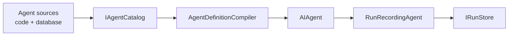

# Tracon.Core

The Tracon runtime: the agent catalog, the definition compiler, the tool
registry, and run recording.

This package runs on its own. Without any further configuration every store is an
in-memory implementation, so a first agent works with no database, no HTTP layer, and
no UI — add those when you need them.

```bash
dotnet add package Tracon.Core --prerelease
```

```csharp
builder.AddTracon()          // reads the "Tracon" configuration section
       .AddTool(GetOrderStatus)
       .UseOpenAI(apiKey);       // Tracon.OpenAI
```

Everything is registered with `TryAdd`. Register your own implementation of a seam
**before** this call and yours wins — Tracon never overwrites a consumer's
registration. Add `.RequireCustomBinding<T>()` for a seam the deployment must not run
without: the host does not start while Tracon's built-in default is what resolves.

Security-sensitive settings come up permissive for the same "no surprises" reason.
Add `.RequireProductionProfile()` when that is the wrong default: it changes no
setting, and refuses to start while tenant separation, session ownership, at-rest
protection, content inspection, rate limiting or retention is still on its permissive
default and the risk has not been accepted by name.

## What it does

An **agent definition** is data: a name, a model binding, a system prompt, and the
names of the tools, skills, and callable agents it may use. The compiler turns that
data into a Microsoft Agent Framework `AIAgent`.



`IAgentCatalog.ResolveAsync` is the entry point. What it hands back is already
wrapped in the run recording decorator, so **every** run is written to `IRunStore`
whether it came from the HTTP API, the UI, or your own code. There is no path that
runs an agent without recording it.

## MAF types are not wrapped

`AIAgent`, `AgentSession`, `ChatMessage`, and `AIFunction` are used directly and
appear in the public API as themselves. Tracon is a control plane over the
Microsoft Agent Framework, not an abstraction layer on top of it — anything you know
how to do with MAF keeps working, and MAF's own extension points stay reachable.

## Tools are defined in code only

```csharp
[Description("Returns the status of an order.")]
static string GetOrderStatus([Description("Order number")] string orderId)
    => orders.Find(orderId).Status;
```

`AddTool` registers a method; the parameter schema is generated from its signature.
An agent created from the UI or the HTTP API can *select* from these tools, but tool
**code** can never be written through them. That is a security boundary, and it is
not configurable.

> A tool receives an **empty** service provider from MAF, so it cannot resolve a
> dependency at call time. Take dependencies at registration instead — register a
> factory, or close over the instance you need. Instance-method tools registered by
> scanning a type have the same problem.

## Definitions are validated before they are stored

Compiling a definition checks that its model, tools, skills, and callable agents all
exist and that the call graph has no cycles. The same check runs on the save path, so
a definition that could not run is rejected at write time rather than at the first
run.

## Optional image generation

An image provider package can register the code-defined `generate_image` tool. The
feature is disabled until `TraconImageOptions.Enabled` is true and the selected
provider and image model are set. The tool returns attachment ids, not image bytes,
and records image or token usage in the normal tool invocation row.

```csharp
builder.AddTracon()
       .UseOpenAI(apiKey)
       .UseOpenAIImages(options =>
       {
           options.Enabled = true;
           options.Model = "gpt-image-1";
       });
```

`UseOpenAIImages`, `UseAzureOpenAIImages`, and `UseGoogleImages` use keyed
generators. Select one with `TraconImageOptions.Provider`; an unkeyed consumer
`IImageGenerator` remains the fallback for a custom provider. Configure image pricing
under `Tracon:Pricing:Images`; a missing price always records a `null` cost.

## In-memory by default, durable when configured

| Registered | Runs survive a restart | Good for |
|---|---|---|
| nothing | no | tests, a first look, single-process tools |
| `UsePostgreSql` / `UseSqlServer` / `UseSqlite` | yes | anything that has to be looked at later |

The seams are the same either way (`Tracon.Abstractions`), so moving from one to
the other is a registration change, not a code change.

## What is not in here

The HTTP API (`Tracon.AspNetCore`), the management UI (`Tracon.UI`), model
providers (`Tracon.OpenAI`, `.Anthropic`, `.Google`, `.Azure`), workflows
(`Tracon.Workflows`), and MCP (`Tracon.Mcp`) are separate packages. Install
`Tracon` to get the common set in one reference.

## Compatibility

Targets `net8.0`, `net9.0`, and `net10.0`. The package is trimming- and
AOT-compatible.

Two overloads are the exception and say so in their signature: `AddTool(Delegate)`
and `AddToolsFrom<T>()` build a tool from method metadata and therefore carry
`[RequiresUnreferencedCode]` and `[RequiresDynamicCode]`. The warning is passed to
you rather than suppressed. The recommended path is `AddGeneratedTools()`, which a
source generator fills in at compile time with no reflection at all; passing an
`AIFunction` you built yourself to `AddTool(AIFunction)` is equally annotation-free.

## Links

- Full documentation: <https://tracon.dev>
- API reference: <https://tracon.dev/api/>

License: PolyForm Small Business 1.0.0 - free below 100 people and 1,000,000 USD
(2019, inflation adjusted) revenue; a commercial licence applies above that. Terms
ship in the package as LICENSE.md. Details: <https://tracon.dev/reference/licensing/>
